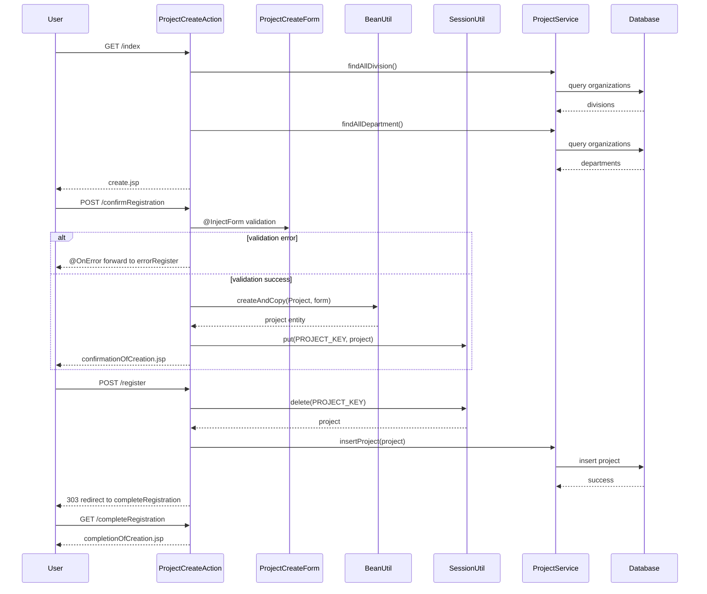

# Code Analysis: ProjectCreateAction

**Generated**: 2026-03-05 21:33:08
**Target**: プロジェクト登録処理
**Modules**: proman-web
**Analysis Duration**: 約2分48秒

---

## Overview

ProjectCreateActionは、プロジェクト登録機能を実装するWebアクションクラスです。ユーザーからのプロジェクト登録要求を受け付け、入力値検証、確認画面表示、データベースへの登録を行います。

主要な責務:
- 登録画面の初期表示（事業部・部門プルダウン設定）
- 入力値のバリデーション（@InjectForm, @OnError）
- セッションを用いた画面間データ受け渡し
- ProjectServiceを介したデータベース登録
- 二重サブミット防止（@OnDoubleSubmission）

---

## Architecture

### Dependency Graph

```mermaid
classDiagram
    class ProjectCreateAction
    class ProjectCreateForm {
        <<Form>>
    }
    class ProjectService {
        <<Service>>
    }
    class Project {
        <<Entity>>
    }
    class Organization {
        <<Entity>>
    }
    class BeanUtil {
        <<Nablarch>>
    }
    class SessionUtil {
        <<Nablarch>>
    }
    class ExecutionContext {
        <<Nablarch>>
    }
    class InjectForm {
        <<Nablarch>>
    }
    class OnError {
        <<Nablarch>>
    }

    ProjectCreateAction ..> ProjectCreateForm : validates
    ProjectCreateAction ..> ProjectService : delegates to
    ProjectCreateAction ..> BeanUtil : converts with
    ProjectCreateAction ..> SessionUtil : stores data
    ProjectCreateAction ..> ExecutionContext : uses
    ProjectService ..> Project : persists
    ProjectService ..> Organization : queries
    ProjectCreateForm ..|> Serializable : implements
```



**Note**: This diagram uses Mermaid `classDiagram` syntax to show class names and their relationships. Use `--|>` for inheritance (extends/implements) and `..>` for dependencies (uses/creates).

### Component Summary

| Component | Role | Type | Dependencies |
|-----------|------|------|--------------|
| ProjectCreateAction | プロジェクト登録アクション | Action | ProjectCreateForm, ProjectService, BeanUtil, SessionUtil |
| ProjectCreateForm | プロジェクト登録フォーム | Form | Jakarta Validation, Domain定義 |
| ProjectService | プロジェクト業務ロジック | Service | DaoContext (UniversalDao) |
| Project | プロジェクトエンティティ | Entity | なし |
| Organization | 組織エンティティ | Entity | なし |

---

## Flow

### Processing Flow

プロジェクト登録処理は以下の5つのフローで構成されます:

1. **初期画面表示 (index)**: 事業部・部門プルダウンをDBから取得し、登録画面を表示
2. **入力確認 (confirmRegistration)**: フォーム値を検証し、Projectエンティティに変換してセッションに格納後、確認画面を表示
3. **登録実行 (register)**: セッションからProjectを取得し、ProjectService経由でDB登録、完了画面へリダイレクト
4. **完了表示 (completeRegistration)**: 登録完了画面を表示
5. **入力画面に戻る (backToEnterRegistration)**: セッションから値を復元し、FormにBeanUtil変換して入力画面へ戻る

各フローは画面遷移とデータの受け渡しを明確に分離し、セッションを介してデータを保持します。

### Sequence Diagram



---

## Components

### ProjectCreateAction

**File**: [ProjectCreateAction.java](../../.lw/nab-official/v6/nablarch-system-development-guide/Sample_Project/Source_Code/proman-project/proman-web/src/main/java/com/nablarch/example/proman/web/project/ProjectCreateAction.java)

**Role**: プロジェクト登録の画面制御とビジネスロジック呼び出し

**Key Methods**:
- `index(HttpRequest, ExecutionContext)`: 登録初期画面表示 (L33-39)
- `confirmRegistration(HttpRequest, ExecutionContext)`: 登録確認画面表示、フォーム検証とBeanUtil変換 (L48-63)
- `register(HttpRequest, ExecutionContext)`: DB登録実行 (L72-78)
- `completeRegistration(HttpRequest, ExecutionContext)`: 完了画面表示 (L87-89)
- `backToEnterRegistration(HttpRequest, ExecutionContext)`: 入力画面に戻る (L98-118)
- `setOrganizationAndDivisionToRequestScope(ExecutionContext)`: 事業部・部門プルダウンデータ設定 (L125-136)

**Dependencies**: ProjectCreateForm (validation), ProjectService (DB操作), BeanUtil (form-entity変換), SessionUtil (画面間データ受け渡し)

**Nablarch Components**:
- @InjectForm (L48): フォーム自動バインド
- @OnError (L49): バリデーションエラー時の画面遷移
- @OnDoubleSubmission (L72): 二重サブミット防止
- BeanUtil (L52, L101): Form↔Entity相互変換
- SessionUtil (L59, L74, L100, L132): セッションスコープ操作

### ProjectCreateForm

**File**: [ProjectCreateForm.java](../../.lw/nab-official/v6/nablarch-system-development-guide/Sample_Project/Source_Code/proman-project/proman-web/src/main/java/com/nablarch/example/proman/web/project/ProjectCreateForm.java)

**Role**: プロジェクト登録入力値の検証とデータ保持

**Key Features**:
- Jakarta Validation: @Required, @Domain アノテーションによる単項目検証 (L25-103)
- 相関バリデーション: @AssertTrue による開始日/終了日の妥当性検証 (L328-331)
- Serializable実装: セッション格納を可能にする (L15)

**Properties**: projectName, projectType, projectClass, projectStartDate, projectEndDate, divisionId, organizationId, pmKanjiName, plKanjiName, note, salesAmount

**Dependencies**: DateRelationUtil (日付妥当性チェック)

### ProjectService

**File**: [ProjectService.java](../../.lw/nab-official/v6/nablarch-system-development-guide/Sample_Project/Source_Code/proman-project/proman-web/src/main/java/com/nablarch/example/proman/web/project/ProjectService.java)

**Role**: プロジェクト関連のデータベース操作

**Key Methods**:
- `insertProject(Project)`: プロジェクト登録 (L80-82)
- `updateProject(Project)`: プロジェクト更新 (L89-91)
- `findAllDivision()`: 全事業部取得 (L50-52)
- `findAllDepartment()`: 全部門取得 (L59-61)
- `findOrganizationById(Integer)`: 組織ID検索 (L70-73)

**Dependencies**: DaoContext (UniversalDao), Organization, Project エンティティ

**Design**: サービス層でUniversalDaoを保持し、CRUD操作を提供。テスタビリティのためコンストラクタインジェクション対応 (L32-43)

---

## Nablarch Framework Usage

### BeanUtil

**クラス**: `nablarch.core.beans.BeanUtil`

**説明**: JavaBeans間の相互変換を行うユーティリティ。プロパティ名が一致するフィールドを自動コピーする。

**使用方法**:
```java
// Form → Entity
Project project = BeanUtil.createAndCopy(Project.class, form);

// Entity → Form
ProjectCreateForm form = BeanUtil.createAndCopy(ProjectCreateForm.class, project);
```

**重要ポイント**:
- ✅ **プロパティ名一致**: 変換元と変換先のプロパティ名（getter/setterの名前）を一致させる
- ⚠️ **型変換**: 基本型と文字列の相互変換は自動実行されるが、Date等の複雑な型は手動変換が必要
- 💡 **ボイラープレート削減**: 手動でプロパティをコピーするコードを書かずに済む
- 🎯 **Form-Entity変換**: WebアクションでのForm→Entity変換に最適

**このコードでの使い方**:
- `confirmRegistration()` (L52): ProjectCreateForm → Project に変換してセッションに格納
- `backToEnterRegistration()` (L101): セッションのProject → ProjectCreateForm に変換して入力画面に戻る
- DateUtil.formatDate() (L103-106) で日付型を文字列に明示変換

**詳細**: [データバインド](../../.claude/skills/nabledge-6/docs/component/libraries/libraries-data_bind.md)

### @InjectForm

**クラス**: `nablarch.common.web.interceptor.InjectForm`

**説明**: HTTPリクエストパラメータを自動的にFormオブジェクトにバインドし、バリデーションを実行するインターセプタ

**使用方法**:
```java
@InjectForm(form = ProjectCreateForm.class, prefix = "form")
@OnError(type = ApplicationException.class, path = "forward:///app/project/errorRegister")
public HttpResponse confirmRegistration(HttpRequest request, ExecutionContext context) {
    ProjectCreateForm form = context.getRequestScopedVar("form");
    // formは検証済みで使用可能
}
```

**重要ポイント**:
- ✅ **自動バインド**: HTTPパラメータを指定したFormクラスに自動変換してリクエストスコープに設定
- ✅ **自動検証**: Jakarta Validationアノテーション（@Required, @Domain等）を自動実行
- ⚠️ **@OnError必須**: バリデーションエラー時の遷移先を@OnErrorで必ず指定すること
- 💡 **prefix属性**: リクエストスコープに設定する変数名を指定（デフォルトは"form"）
- 🎯 **エラーメッセージ**: バリデーションエラーメッセージは自動的にリクエストスコープに設定される

**このコードでの使い方**:
- `confirmRegistration()` (L48): ProjectCreateFormに自動バインド、prefix="form"でリクエストスコープに設定
- `context.getRequestScopedVar("form")` (L51) でバインド済みFormを取得
- バリデーションエラー時は`errorRegister`にforwardして入力画面を再表示

**詳細**: [Universal DAO](../../.claude/skills/nabledge-6/docs/component/libraries/libraries-universal_dao.md) (関連機能としてバリデーション情報を含む)

### @OnError

**クラス**: `nablarch.fw.web.interceptor.OnError`

**説明**: 指定した例外が発生した際の画面遷移先を宣言的に指定するインターセプタ

**使用方法**:
```java
@OnError(type = ApplicationException.class, path = "forward:///app/project/errorRegister")
public HttpResponse confirmRegistration(HttpRequest request, ExecutionContext context) {
    // バリデーションエラー時は自動的にerrorRegisterに遷移
}
```

**重要ポイント**:
- ✅ **例外ハンドリング**: try-catchを書かずに例外発生時の画面遷移を制御
- ⚠️ **type属性**: 捕捉する例外クラスを指定（ApplicationExceptionはバリデーションエラー）
- ⚠️ **path属性**: 遷移先を内部フォーマット（`forward://`, `redirect://`）で指定
- 💡 **エラー情報保持**: 例外情報とバリデーションエラーメッセージは自動的にリクエストスコープに保持される
- 🎯 **@InjectFormと併用**: フォームバリデーションエラー時の遷移制御に最適

**このコードでの使い方**:
- `confirmRegistration()` (L49): ApplicationException発生時は`errorRegister`に遷移
- `errorRegister`は登録画面を再表示するアクションメソッドへのフォーワード
- フォーム値とエラーメッセージが自動的に画面に引き継がれる

**詳細**: [Universal DAO](../../.claude/skills/nabledge-6/docs/component/libraries/libraries-universal_dao.md) (楽観ロックエラーでの使用例を含む)

### SessionUtil

**クラス**: `nablarch.common.web.session.SessionUtil`

**説明**: HTTPセッションへのデータ保存・取得を行うユーティリティ

**使用方法**:
```java
// セッションに保存
SessionUtil.put(context, "key", value);

// セッションから取得
Object value = SessionUtil.get(context, "key");

// セッションから削除（取得後に削除）
Object value = SessionUtil.delete(context, "key");
```

**重要ポイント**:
- ✅ **画面間データ受け渡し**: 確認画面→登録画面など、複数画面間でデータを保持
- ⚠️ **Serializable必須**: セッションに格納するオブジェクトはSerializableを実装すること
- ⚠️ **メモリ管理**: 不要になったらdelete()で削除してメモリリークを防ぐ
- 💡 **二重サブミット対策**: 登録時にdelete()することで再実行を防止
- 🎯 **確認画面パターン**: 入力→確認→完了の3画面フローで活用

**このコードでの使い方**:
- `confirmRegistration()` (L59): Projectエンティティをセッションに保存（確認画面で表示用）
- `register()` (L74): セッションから削除と同時に取得（登録実行、再実行防止）
- `backToEnterRegistration()` (L100): セッションから取得して入力画面に戻る
- `setOrganizationAndDivisionToRequestScope()` (L132): 空文字列を一時保存（初期化）

**詳細**: [Universal DAO](../../.claude/skills/nabledge-6/docs/component/libraries/libraries-universal_dao.md)

### UniversalDao (via ProjectService)

**クラス**: `nablarch.common.dao.UniversalDao`

**説明**: Jakarta Persistenceアノテーションを使用した汎用的なDAO（Data Access Object）機能

**使用方法**:
```java
// DaoContextを取得してCRUD操作
DaoContext dao = DaoFactory.create();

// INSERT
dao.insert(project);

// UPDATE
dao.update(project);

// SELECT (ID検索)
Project project = dao.findById(Project.class, projectId);

// SELECT (SQLファイル)
List<Organization> list = dao.findAllBySqlFile(Organization.class, "FIND_ALL_DIVISION");
```

**重要ポイント**:
- ✅ **アノテーション駆動**: Entityクラスに@Entity, @Table, @Idを設定してテーブルマッピング
- ✅ **SQL自動生成**: INSERT/UPDATE/DELETEはアノテーションから自動生成
- ⚠️ **トランザクション**: UniversalDao操作はトランザクション境界内で実行すること
- 💡 **SQLファイル分離**: 複雑な検索はSQLファイルに記述してfindAllBySqlFileで実行
- 🎯 **CRUD操作**: 単純なCRUD操作を簡潔に記述できる

**このコードでの使い方**:
- ProjectServiceがDaoContextをラップして提供
- `insertProject()` (ProjectService L81): dao.insert()でプロジェクト登録
- `findAllDivision()`, `findAllDepartment()` (L51-61): SQLファイルで事業部・部門取得
- トランザクション管理はフレームワークのハンドラが自動実行

**詳細**: [Universal DAO](../../.claude/skills/nabledge-6/docs/component/libraries/libraries-universal_dao.md)

---

## References

### Source Files

- [ProjectCreateAction.java (.lw/nab-official/v6/nablarch-system-development-guide/en/Sample_Project/Source_Code/proman-project/proman-web/src/main/java/com/nablarch/example/proman/web/project)](../../.lw/nab-official/v6/nablarch-system-development-guide/en/Sample_Project/Source_Code/proman-project/proman-web/src/main/java/com/nablarch/example/proman/web/project/ProjectCreateAction.java) - ProjectCreateAction
- [ProjectCreateAction.java (.lw/nab-official/v6/nablarch-system-development-guide/Sample_Project/Source_Code/proman-project/proman-web/src/main/java/com/nablarch/example/proman/web/project)](../../.lw/nab-official/v6/nablarch-system-development-guide/Sample_Project/Source_Code/proman-project/proman-web/src/main/java/com/nablarch/example/proman/web/project/ProjectCreateAction.java) - ProjectCreateAction
- [ProjectCreateForm.java (.lw/nab-official/v6/nablarch-system-development-guide/en/Sample_Project/Source_Code/proman-project/proman-web/src/main/java/com/nablarch/example/proman/web/project)](../../.lw/nab-official/v6/nablarch-system-development-guide/en/Sample_Project/Source_Code/proman-project/proman-web/src/main/java/com/nablarch/example/proman/web/project/ProjectCreateForm.java) - ProjectCreateForm
- [ProjectCreateForm.java (.lw/nab-official/v6/nablarch-system-development-guide/Sample_Project/Source_Code/proman-project/proman-web/src/main/java/com/nablarch/example/proman/web/project)](../../.lw/nab-official/v6/nablarch-system-development-guide/Sample_Project/Source_Code/proman-project/proman-web/src/main/java/com/nablarch/example/proman/web/project/ProjectCreateForm.java) - ProjectCreateForm
- [ProjectService.java (.lw/nab-official/v6/nablarch-system-development-guide/en/Sample_Project/Source_Code/proman-project/proman-web/src/main/java/com/nablarch/example/proman/web/project)](../../.lw/nab-official/v6/nablarch-system-development-guide/en/Sample_Project/Source_Code/proman-project/proman-web/src/main/java/com/nablarch/example/proman/web/project/ProjectService.java) - ProjectService
- [ProjectService.java (.lw/nab-official/v6/nablarch-system-development-guide/Sample_Project/Source_Code/proman-project/proman-web/src/main/java/com/nablarch/example/proman/web/project)](../../.lw/nab-official/v6/nablarch-system-development-guide/Sample_Project/Source_Code/proman-project/proman-web/src/main/java/com/nablarch/example/proman/web/project/ProjectService.java) - ProjectService

### Knowledge Base (Nabledge-6)

- [Libraries Data_bind](../../.claude/skills/nabledge-6/docs/component/libraries/libraries-data_bind.md)
- [Libraries Universal_dao](../../.claude/skills/nabledge-6/docs/component/libraries/libraries-universal_dao.md)

### Official Documentation


- [BasicDaoContextFactory](https://nablarch.github.io/docs/LATEST/javadoc/nablarch/common/dao/BasicDaoContextFactory.html)
- [BeanUtil](https://nablarch.github.io/docs/LATEST/javadoc/nablarch/core/beans/BeanUtil.html)
- [ConnectionFactory](https://nablarch.github.io/docs/LATEST/javadoc/nablarch/core/db/connection/ConnectionFactory.html)
- [CsvDataBindConfig](https://nablarch.github.io/docs/LATEST/javadoc/nablarch/common/databind/csv/CsvDataBindConfig.html)
- [CsvFormat](https://nablarch.github.io/docs/LATEST/javadoc/nablarch/common/databind/csv/CsvFormat.html)
- [Csv](https://nablarch.github.io/docs/LATEST/javadoc/nablarch/common/databind/csv/Csv.html)
- [Data Bind](https://nablarch.github.io/docs/LATEST/doc/application_framework/application_framework/libraries/data_io/data_bind.html)
- [DataBindConfig](https://nablarch.github.io/docs/LATEST/javadoc/nablarch/common/databind/DataBindConfig.html)
- [DatabaseMetaDataExtractor](https://nablarch.github.io/docs/LATEST/javadoc/nablarch/common/dao/DatabaseMetaDataExtractor.html)
- [Date](https://nablarch.github.io/docs/LATEST/javadoc/java/sql/Date.html)
- [DeferredEntityList](https://nablarch.github.io/docs/LATEST/javadoc/nablarch/common/dao/DeferredEntityList.html)
- [Dialect](https://nablarch.github.io/docs/LATEST/javadoc/nablarch/core/db/dialect/Dialect.html)
- [EntityList](https://nablarch.github.io/docs/LATEST/javadoc/nablarch/common/dao/EntityList.html)
- [Field](https://nablarch.github.io/docs/LATEST/javadoc/nablarch/common/databind/fixedlength/Field.html)
- [FileResponse](https://nablarch.github.io/docs/LATEST/javadoc/nablarch/common/web/download/FileResponse.html)
- [FixedLengthDataBindConfigBuilder](https://nablarch.github.io/docs/LATEST/javadoc/nablarch/common/databind/fixedlength/FixedLengthDataBindConfigBuilder.html)
- [FixedLengthDataBindConfig](https://nablarch.github.io/docs/LATEST/javadoc/nablarch/common/databind/fixedlength/FixedLengthDataBindConfig.html)
- [FixedLength](https://nablarch.github.io/docs/LATEST/javadoc/nablarch/common/databind/fixedlength/FixedLength.html)
- [GenerationType](https://nablarch.github.io/docs/LATEST/javadoc/jakarta/persistence/GenerationType.html)
- [H2Dialect](https://nablarch.github.io/docs/LATEST/javadoc/nablarch/core/db/dialect/H2Dialect.html)
- [Integer](https://nablarch.github.io/docs/LATEST/javadoc/java/lang/Integer.html)
- [LineNumber](https://nablarch.github.io/docs/LATEST/javadoc/nablarch/common/databind/LineNumber.html)
- [Long](https://nablarch.github.io/docs/LATEST/javadoc/java/lang/Long.html)
- [MultiLayoutConfig.RecordIdentifier](https://nablarch.github.io/docs/LATEST/javadoc/nablarch/common/databind/fixedlength/MultiLayoutConfig.RecordIdentifier.html)
- [MultiLayout](https://nablarch.github.io/docs/LATEST/javadoc/nablarch/common/databind/fixedlength/MultiLayout.html)
- [ObjectMapperFactory](https://nablarch.github.io/docs/LATEST/javadoc/nablarch/common/databind/ObjectMapperFactory.html)
- [ObjectMapper](https://nablarch.github.io/docs/LATEST/javadoc/nablarch/common/databind/ObjectMapper.html)
- [OnError](https://nablarch.github.io/docs/LATEST/javadoc/nablarch/fw/web/interceptor/OnError.html)
- [OptimisticLockException](https://nablarch.github.io/docs/LATEST/javadoc/jakarta/persistence/OptimisticLockException.html)
- [Package-summary](https://nablarch.github.io/docs/LATEST/javadoc/nablarch/common/databind/fixedlength/converter/package-summary.html)
- [Pagination](https://nablarch.github.io/docs/LATEST/javadoc/nablarch/common/dao/Pagination.html)
- [PartInfo](https://nablarch.github.io/docs/LATEST/javadoc/nablarch/fw/web/upload/PartInfo.html)
- [SimpleDbTransactionManager](https://nablarch.github.io/docs/LATEST/javadoc/nablarch/core/db/transaction/SimpleDbTransactionManager.html)
- [TransactionFactory](https://nablarch.github.io/docs/LATEST/javadoc/nablarch/core/transaction/TransactionFactory.html)
- [Universal Dao](https://nablarch.github.io/docs/LATEST/doc/application_framework/application_framework/libraries/database/universal_dao.html)
- [UniversalDao.Transaction](https://nablarch.github.io/docs/LATEST/javadoc/nablarch/common/dao/UniversalDao.Transaction.html)
- [UniversalDao](https://nablarch.github.io/docs/LATEST/javadoc/nablarch/common/dao/UniversalDao.html)

---

**Note**: This documentation was generated by the code-analysis workflow of the nabledge-6 skill.
