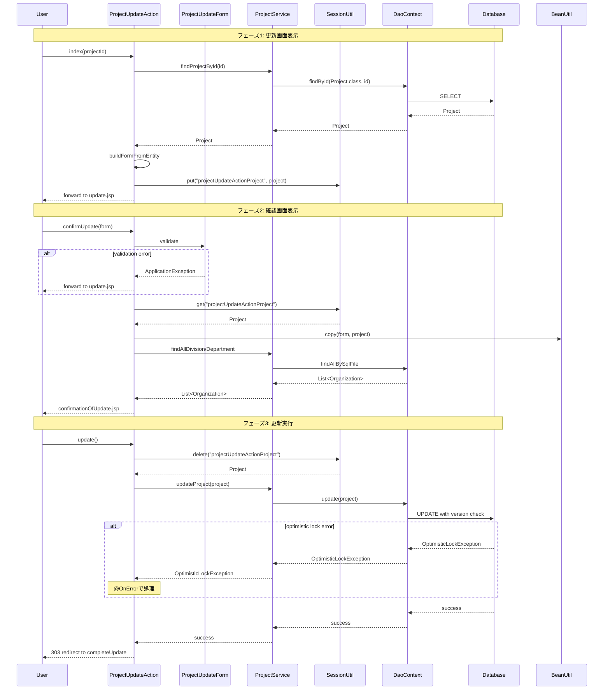

# Code Analysis: ProjectUpdateAction

**Generated**: 2026-03-05 21:33:36
**Target**: プロジェクト更新機能
**Modules**: proman-web
**Analysis Duration**: 約3分13秒

---

## Overview

ProjectUpdateActionは、プロジェクト情報の更新処理を実現するWebアクションクラスです。プロジェクト詳細画面から更新画面への遷移、入力内容の確認画面表示、そして実際の更新処理までの一連のフローを管理します。セッションを使ってプロジェクトエンティティを保持し、楽観的ロックを使用してデータの整合性を確保しています。

主な処理フロー:
1. `index()`: プロジェクト詳細からプロジェクトIDを受け取り、更新画面を表示
2. `confirmUpdate()`: 入力内容をバリデーションし、確認画面を表示
3. `update()`: セッションから取得したプロジェクト情報をDBに更新

---

## Architecture

### Dependency Graph

```mermaid
classDiagram
    class ProjectUpdateAction {
        <<Action>>
    }
    class ProjectUpdateForm {
        <<Form>>
    }
    class ProjectService {
        <<Service>>
    }
    class Project {
        <<Entity>>
    }
    class Organization {
        <<Entity>>
    }
    class DaoContext {
        <<Nablarch>>
    }
    class SessionUtil {
        <<Nablarch>>
    }
    class BeanUtil {
        <<Nablarch>>
    }
    class ExecutionContext {
        <<Nablarch>>
    }

    ProjectUpdateAction ..> ProjectUpdateForm : validates
    ProjectUpdateAction ..> ProjectService : uses
    ProjectUpdateAction ..> SessionUtil : manages session
    ProjectUpdateAction ..> BeanUtil : maps beans
    ProjectUpdateAction ..> ExecutionContext : accesses context
    ProjectService ..> DaoContext : queries
    ProjectService ..> Project : persists
    ProjectService ..> Organization : queries
    ProjectUpdateForm ..|> Serializable : implements
```



**Note**: This diagram uses Mermaid `classDiagram` syntax to show class names and their relationships. Use `--|>` for inheritance (extends/implements) and `..>` for dependencies (uses/creates).

### Component Summary

| Component | Role | Type | Dependencies |
|-----------|------|------|--------------|
| ProjectUpdateAction | プロジェクト更新処理 | Action | ProjectUpdateForm, ProjectService, SessionUtil, BeanUtil, ExecutionContext |
| ProjectUpdateForm | プロジェクト更新フォーム | Form | なし |
| ProjectService | プロジェクトデータアクセス | Service | DaoContext, Project, Organization |
| Project | プロジェクトエンティティ | Entity | なし |
| Organization | 組織エンティティ | Entity | なし |

---

## Flow

### Processing Flow

プロジェクト更新は3つのフェーズで実行されます:

**フェーズ1: 更新画面表示 (index)**
1. プロジェクト詳細画面からプロジェクトIDを受信
2. ProjectServiceを使用してプロジェクト情報を取得 (`findProjectById`)
3. ProjectをProjectUpdateFormに変換 (日付フォーマット変換、組織情報の追加)
4. Projectエンティティをセッションに保存 (キー: "projectUpdateActionProject")
5. 更新画面にフォワード

**フェーズ2: 確認画面表示 (confirmUpdate)**
1. @InjectFormでProjectUpdateFormをリクエストスコープから取得
2. バリデーション実行 (失敗時は@OnErrorで更新画面に戻る)
3. セッションからProjectエンティティを取得
4. BeanUtil.copyでフォームの値をエンティティにコピー
5. プルダウン用の組織情報を取得してリクエストスコープに設定
6. 確認画面を表示

**フェーズ3: 更新実行 (update)**
1. @OnDoubleSubmissionで二重送信を防止
2. セッションからProjectエンティティを削除 (同時に取得)
3. ProjectServiceを使用してDB更新 (`updateProject` → `DaoContext.update`)
4. 楽観的ロック (バージョンカラム) で排他制御
5. 303リダイレクトで完了画面へ遷移

### Sequence Diagram



---

## Components

### ProjectUpdateAction

**役割**: プロジェクト更新のメインアクションクラス。画面遷移と処理フローを制御。

**ファイル**: [ProjectUpdateAction.java](../../.lw/nab-official/v6/nablarch-system-development-guide/Sample_Project/Source_Code/proman-project/proman-web/src/main/java/com/nablarch/example/proman/web/project/ProjectUpdateAction.java)

**主要メソッド**:
- `index()` [:35-43]: 更新画面表示。プロジェクトIDからプロジェクト情報を取得し、セッションに保存
- `confirmUpdate()` [:52-62]: 確認画面表示。フォームをバリデーションし、エンティティにコピー
- `update()` [:72-77]: 更新実行。セッションからエンティティを削除し、DB更新
- `buildFormFromEntity()` [:111-125]: プロジェクトエンティティをフォームに変換。日付フォーマット変換と組織情報の追加

**依存関係**:
- ProjectUpdateForm: 更新内容の入力/バリデーション
- ProjectService: データアクセス (DB操作を委譲)
- SessionUtil: プロジェクトエンティティの一時保存
- BeanUtil: フォーム→エンティティのプロパティコピー
- ExecutionContext: リクエスト/セッションスコープへのアクセス

**重要な実装ポイント**:
- セッションキー `"projectUpdateActionProject"` でプロジェクトエンティティを管理
- `@InjectForm` でフォームを自動インジェクション・バリデーション
- `@OnError` でバリデーションエラー時の遷移先を指定
- `@OnDoubleSubmission` で二重送信を防止
- 303リダイレクトで更新後のブラウザ再読込対策 (PRGパターン)

### ProjectUpdateForm

**役割**: プロジェクト更新画面の入力フォーム。Bean Validation アノテーションで入力規則を定義。

**ファイル**: [ProjectUpdateForm.java](../../.lw/nab-official/v6/nablarch-system-development-guide/Sample_Project/Source_Code/proman-project/proman-web/src/main/java/com/nablarch/example/proman/web/project/ProjectUpdateForm.java)

**主要フィールド**:
- `projectName` [:24-27]: プロジェクト名 (@Required, @Domain)
- `projectStartDate`, `projectEndDate` [:44-55]: プロジェクト期間 (@Required, @Domain)
- `organizationId`, `divisionId` [:58-69]: 組織ID (@Required, @Domain)
- `pmKanjiName`, `plKanjiName` [:80-92]: 責任者名 (@Required, @Domain)

**バリデーション**:
- `@Required`: 必須入力
- `@Domain`: ドメインバリデーション (ProManDomainManagerで定義)
- `@AssertTrue isValidProjectPeriod()` [:328-331]: 日付の前後関係チェック (開始日 ≤ 終了日)

**依存関係**: なし (純粋なデータクラス)

### ProjectService

**役割**: プロジェクトデータアクセスのファサード。DaoContextを使用したDB操作を提供。

**ファイル**: [ProjectService.java](../../.lw/nab-official/v6/nablarch-system-development-guide/Sample_Project/Source_Code/proman-project/proman-web/src/main/java/com/nablarch/example/proman/web/project/ProjectService.java)

**主要メソッド**:
- `findProjectById()` [:124-126]: プロジェクトIDで検索。`DaoContext.findById`を使用
- `updateProject()` [:89-91]: プロジェクト更新。`DaoContext.update`を使用 (楽観的ロック有効)
- `findOrganizationById()` [:70-73]: 組織IDで検索
- `findAllDivision()` [:50-52]: 全事業部を取得
- `findAllDepartment()` [:59-61]: 全部門を取得

**依存関係**:
- DaoContext: Nablarchの共通DAO (DaoFactoryで生成)
- Project, Organization: エンティティクラス

---

## Nablarch Framework Usage

### @InjectForm

**クラス**: `nablarch.common.web.interceptor.InjectForm`

**説明**: HTTPリクエストパラメータを自動的にフォームオブジェクトにバインドし、バリデーションを実行するインターセプター

**使用方法**:
```java
@InjectForm(form = ProjectUpdateForm.class, prefix = "form")
@OnError(type = ApplicationException.class, path = "forward:///app/project/moveUpdate")
public HttpResponse confirmUpdate(HttpRequest request, ExecutionContext context) {
    ProjectUpdateForm form = context.getRequestScopedVar("form");
    // フォームは既にバリデーション済み
}
```

**重要ポイント**:
- ✅ **自動バインド**: リクエストパラメータがフォームのプロパティに自動マッピング
- ✅ **自動バリデーション**: Bean Validation アノテーションに基づいて検証
- ⚠️ **prefix指定**: 複数フォームを使う場合は`prefix`でパラメータ名のプレフィックスを指定
- 💡 **リクエストスコープ**: バインドされたフォームは`context.getRequestScopedVar("form")`で取得

**このコードでの使い方**:
- `index()`: ProjectUpdateInitialFormをインジェクション (プロジェクトIDのみ受信)
- `confirmUpdate()`: ProjectUpdateFormをインジェクション (更新内容を受信・検証)

**詳細**: [データバインド](../../.claude/skills/nabledge-6/docs/component/libraries/libraries-data_bind.md)

### @OnError

**クラス**: `nablarch.fw.web.interceptor.OnError`

**説明**: 指定した例外が発生した際の遷移先を宣言的に定義するインターセプター

**使用方法**:
```java
@OnError(type = ApplicationException.class, path = "forward:///app/project/moveUpdate")
public HttpResponse confirmUpdate(HttpRequest request, ExecutionContext context) {
    // バリデーションエラー時は自動的にmoveUpdateにフォワード
}
```

**重要ポイント**:
- ✅ **宣言的エラーハンドリング**: エラー画面遷移をアノテーションで指定
- ⚠️ **例外タイプ指定**: `type`で捕捉する例外クラスを指定
- 💡 **フォワード推奨**: エラー画面はforward指定が一般的 (リクエストスコープを維持)
- 🎯 **バリデーションエラー**: ApplicationExceptionは通常、バリデーションエラーで発生

**このコードでの使い方**:
- `confirmUpdate()`: バリデーションエラー時に更新画面に戻る (入力内容を保持)

**詳細**: [エラーハンドリング](../../.claude/skills/nabledge-6/docs/component/libraries/libraries-universal_dao.md)

### @OnDoubleSubmission

**クラス**: `nablarch.common.web.token.OnDoubleSubmission`

**説明**: トークンベースの二重送信防止機能を提供するインターセプター

**使用方法**:
```java
@OnDoubleSubmission
public HttpResponse update(HttpRequest request, ExecutionContext context) {
    // ブラウザの戻るボタンや二重クリックによる重複更新を防止
}
```

**重要ポイント**:
- ✅ **トークン検証**: 画面表示時に生成したトークンと送信トークンを照合
- ⚠️ **二重送信検出**: トークン不一致時はエラー画面に遷移
- 💡 **更新処理に必須**: insert/update/delete など副作用のある処理に使用
- 🎯 **PRGパターン**: 更新後は303リダイレクトで完了画面へ遷移

**このコードでの使い方**:
- `update()`: プロジェクト更新処理の二重実行を防止

**詳細**: [トークンベース二重送信防止](../../.claude/skills/nabledge-6/docs/component/libraries/libraries-universal_dao.md)

### DaoContext (UniversalDao)

**クラス**: `nablarch.common.dao.DaoContext`

**説明**: Jakarta Persistence アノテーションベースのシンプルなDAO。SQLを書かずにCRUD操作を実行。

**使用方法**:
```java
// 検索
Project project = universalDao.findById(Project.class, projectId);

// 更新 (楽観的ロック有効)
universalDao.update(project);
```

**重要ポイント**:
- ✅ **楽観的ロック**: `@Version`アノテーション付きエンティティは自動的に楽観ロック
- ⚠️ **バージョン不一致**: 更新時にバージョンが一致しない場合は`OptimisticLockException`
- 💡 **SQL自動生成**: アノテーションからUPDATE文を実行時に自動構築
- 🎯 **主キー更新**: `findById`で取得したエンティティを変更して`update`

**このコードでの使い方**:
- `findProjectById()`: プロジェクトIDでエンティティを取得
- `updateProject()`: プロジェクトエンティティを更新 (楽観ロック有効)

**詳細**: [Libraries Universal_dao](../../.claude/skills/nabledge-6/docs/component/libraries/libraries-universal_dao.md)

### SessionUtil

**クラス**: `nablarch.common.web.session.SessionUtil`

**説明**: セッションストアへのアクセスを簡潔化するユーティリティクラス

**使用方法**:
```java
// セッションに保存
SessionUtil.put(context, "projectUpdateActionProject", project);

// セッションから取得
Project project = SessionUtil.get(context, "projectUpdateActionProject");

// セッションから削除 (同時に取得)
Project project = SessionUtil.delete(context, "projectUpdateActionProject");
```

**重要ポイント**:
- ✅ **型安全**: ジェネリクスで型を指定
- ⚠️ **キー名管理**: セッションキーは定数で管理 (例: `PROJECT_KEY`)
- 💡 **削除と取得**: `delete()`は削除と同時に値を返す (二重実行防止に有効)
- 🎯 **画面間データ保持**: フォーム→確認→更新のフローで使用

**このコードでの使い方**:
- `index()`: プロジェクトエンティティをセッションに保存
- `confirmUpdate()`: セッションからプロジェクトエンティティを取得
- `update()`: セッションからプロジェクトエンティティを削除 (同時に取得)

**詳細**: [セッション管理](../../.claude/skills/nabledge-6/docs/component/libraries/libraries-universal_dao.md)

### BeanUtil

**クラス**: `nablarch.core.beans.BeanUtil`

**説明**: JavaBeansのプロパティコピーや型変換を行うユーティリティクラス

**使用方法**:
```java
// フォーム → エンティティのプロパティコピー
BeanUtil.copy(form, project);

// エンティティ → フォームの変換と生成
ProjectUpdateForm form = BeanUtil.createAndCopy(ProjectUpdateForm.class, project);
```

**重要ポイント**:
- ✅ **プロパティ名マッチング**: 同名プロパティを自動的にコピー
- ⚠️ **型変換**: String ↔ 数値、日付などの基本的な型変換を実行
- 💡 **null処理**: nullプロパティはコピーしない (既存値を保持)
- 🎯 **画面↔DB変換**: フォームとエンティティの相互変換に使用

**このコードでの使い方**:
- `buildFormFromEntity()`: ProjectエンティティからProjectUpdateFormを生成
- `confirmUpdate()`: ProjectUpdateFormからProjectエンティティにプロパティをコピー

**詳細**: [Bean Validation](../../.claude/skills/nabledge-6/docs/component/libraries/libraries-universal_dao.md)

---

## References

### Source Files

- [ProjectUpdateAction.java (.lw/nab-official/v6/nablarch-system-development-guide/en/Sample_Project/Source_Code/proman-project/proman-web/src/main/java/com/nablarch/example/proman/web/project)](../../.lw/nab-official/v6/nablarch-system-development-guide/en/Sample_Project/Source_Code/proman-project/proman-web/src/main/java/com/nablarch/example/proman/web/project/ProjectUpdateAction.java) - ProjectUpdateAction
- [ProjectUpdateAction.java (.lw/nab-official/v6/nablarch-system-development-guide/Sample_Project/Source_Code/proman-project/proman-web/src/main/java/com/nablarch/example/proman/web/project)](../../.lw/nab-official/v6/nablarch-system-development-guide/Sample_Project/Source_Code/proman-project/proman-web/src/main/java/com/nablarch/example/proman/web/project/ProjectUpdateAction.java) - ProjectUpdateAction
- [ProjectUpdateForm.java (.lw/nab-official/v6/nablarch-system-development-guide/en/Sample_Project/Source_Code/proman-project/proman-web/src/main/java/com/nablarch/example/proman/web/project)](../../.lw/nab-official/v6/nablarch-system-development-guide/en/Sample_Project/Source_Code/proman-project/proman-web/src/main/java/com/nablarch/example/proman/web/project/ProjectUpdateForm.java) - ProjectUpdateForm
- [ProjectUpdateForm.java (.lw/nab-official/v6/nablarch-system-development-guide/Sample_Project/Source_Code/proman-project/proman-web/src/main/java/com/nablarch/example/proman/web/project)](../../.lw/nab-official/v6/nablarch-system-development-guide/Sample_Project/Source_Code/proman-project/proman-web/src/main/java/com/nablarch/example/proman/web/project/ProjectUpdateForm.java) - ProjectUpdateForm
- [ProjectService.java (.lw/nab-official/v6/nablarch-system-development-guide/en/Sample_Project/Source_Code/proman-project/proman-web/src/main/java/com/nablarch/example/proman/web/project)](../../.lw/nab-official/v6/nablarch-system-development-guide/en/Sample_Project/Source_Code/proman-project/proman-web/src/main/java/com/nablarch/example/proman/web/project/ProjectService.java) - ProjectService
- [ProjectService.java (.lw/nab-official/v6/nablarch-system-development-guide/Sample_Project/Source_Code/proman-project/proman-web/src/main/java/com/nablarch/example/proman/web/project)](../../.lw/nab-official/v6/nablarch-system-development-guide/Sample_Project/Source_Code/proman-project/proman-web/src/main/java/com/nablarch/example/proman/web/project/ProjectService.java) - ProjectService

### Knowledge Base (Nabledge-6)

- [Libraries Universal_dao](../../.claude/skills/nabledge-6/docs/component/libraries/libraries-universal_dao.md)

### Official Documentation


- [BasicDaoContextFactory](https://nablarch.github.io/docs/LATEST/javadoc/nablarch/common/dao/BasicDaoContextFactory.html)
- [ConnectionFactory](https://nablarch.github.io/docs/LATEST/javadoc/nablarch/core/db/connection/ConnectionFactory.html)
- [DatabaseMetaDataExtractor](https://nablarch.github.io/docs/LATEST/javadoc/nablarch/common/dao/DatabaseMetaDataExtractor.html)
- [Date](https://nablarch.github.io/docs/LATEST/javadoc/java/sql/Date.html)
- [DeferredEntityList](https://nablarch.github.io/docs/LATEST/javadoc/nablarch/common/dao/DeferredEntityList.html)
- [Dialect](https://nablarch.github.io/docs/LATEST/javadoc/nablarch/core/db/dialect/Dialect.html)
- [EntityList](https://nablarch.github.io/docs/LATEST/javadoc/nablarch/common/dao/EntityList.html)
- [GenerationType](https://nablarch.github.io/docs/LATEST/javadoc/jakarta/persistence/GenerationType.html)
- [H2Dialect](https://nablarch.github.io/docs/LATEST/javadoc/nablarch/core/db/dialect/H2Dialect.html)
- [Integer](https://nablarch.github.io/docs/LATEST/javadoc/java/lang/Integer.html)
- [Long](https://nablarch.github.io/docs/LATEST/javadoc/java/lang/Long.html)
- [OnError](https://nablarch.github.io/docs/LATEST/javadoc/nablarch/fw/web/interceptor/OnError.html)
- [OptimisticLockException](https://nablarch.github.io/docs/LATEST/javadoc/jakarta/persistence/OptimisticLockException.html)
- [Pagination](https://nablarch.github.io/docs/LATEST/javadoc/nablarch/common/dao/Pagination.html)
- [SimpleDbTransactionManager](https://nablarch.github.io/docs/LATEST/javadoc/nablarch/core/db/transaction/SimpleDbTransactionManager.html)
- [TransactionFactory](https://nablarch.github.io/docs/LATEST/javadoc/nablarch/core/transaction/TransactionFactory.html)
- [Universal Dao](https://nablarch.github.io/docs/LATEST/doc/application_framework/application_framework/libraries/database/universal_dao.html)
- [UniversalDao.Transaction](https://nablarch.github.io/docs/LATEST/javadoc/nablarch/common/dao/UniversalDao.Transaction.html)
- [UniversalDao](https://nablarch.github.io/docs/LATEST/javadoc/nablarch/common/dao/UniversalDao.html)

---

**Note**: This documentation was generated by the code-analysis workflow of the nabledge-6 skill.
