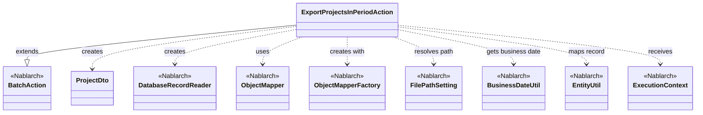
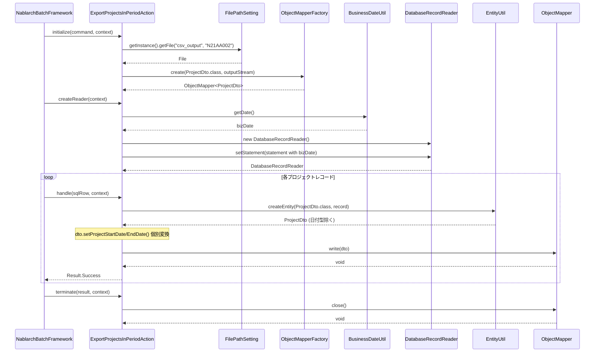

# Code Analysis: ExportProjectsInPeriodAction

**Generated**: 2026-03-06 11:21:36
**Target**: 期間内プロジェクト一覧出力バッチアクション
**Modules**: proman-batch
**Analysis Duration**: 約2分35秒

---

## Overview

`ExportProjectsInPeriodAction`は、データベースから期間内プロジェクトを検索し、CSV形式で出力する都度起動バッチアクションクラスである。`BatchAction<SqlRow>`を継承し、Nablarchバッチフレームワークの標準ライフサイクル（initialize → createReader → handle → terminate）に従って実装されている。

主な処理構成:
- **initialize**: `FilePathSetting`でCSV出力先ファイルを解決し、`ObjectMapper`を生成してリソースを確保
- **createReader**: `DatabaseRecordReader`と`BusinessDateUtil`を使用して、業務日付を基準に期間内プロジェクトをDBから読み込むリーダーを構築
- **handle**: `EntityUtil`でSqlRowをProjectDtoに変換し、`ObjectMapper`でCSV出力
- **terminate**: `ObjectMapper`をクローズしてリソースを解放

---

## Architecture

### Dependency Graph



**Note**: This diagram uses Mermaid `classDiagram` syntax to show class names and their relationships. Use `--|>` for inheritance (extends/implements) and `..>` for dependencies (uses/creates).

### Component Summary

| Component | Role | Type | Dependencies |
|-----------|------|------|--------------|
| ExportProjectsInPeriodAction | CSV出力バッチアクション（メイン処理クラス） | Action | DatabaseRecordReader, ObjectMapper, FilePathSetting, BusinessDateUtil, EntityUtil |
| ProjectDto | プロジェクト情報CSV出力用DTO | Bean | なし |
| BatchAction | バッチアクション基底クラス | Nablarch Framework | ExecutionContext |
| DatabaseRecordReader | DB読み込みデータリーダー | Nablarch Framework | SqlPStatement |
| ObjectMapper | CSV書き込みマッパー | Nablarch Framework | ProjectDto |
| FilePathSetting | ファイルパス管理 | Nablarch Framework | なし |
| BusinessDateUtil | 業務日付取得ユーティリティ | Nablarch Framework | なし |
| EntityUtil | SqlRow→DTO変換ユーティリティ | Nablarch Framework | なし |

---

## Flow

### Processing Flow

バッチフレームワークが以下の順序でアクションのライフサイクルメソッドを呼び出す：

1. **initialize（初期化フェーズ）**: `FilePathSetting`でCSV出力先（論理名`csv_output`、ファイル名`N21AA002`）を解決し、`ObjectMapperFactory`でProjectDto用の`ObjectMapper`を生成する。

2. **createReader（データリーダー生成フェーズ）**: `DatabaseRecordReader`を生成し、SQL `FIND_PROJECT_IN_PERIOD`に`BusinessDateUtil.getDate()`で取得した業務日付を設定（開始日・終了日として同じ日付を2回セット）してリーダーを返す。

3. **handle（レコード処理フェーズ、レコード毎に繰り返し）**: `EntityUtil.createEntity()`でSqlRowをProjectDtoに変換。日付型の変換が必要な`projectStartDate`・`projectEndDate`は個別setter経由で設定後、`mapper.write(dto)`でCSV出力する。

4. **terminate（終了処理フェーズ）**: `mapper.close()`でOutputStreamをフラッシュ・クローズしリソースを解放する。

### Sequence Diagram



---

## Components

### ExportProjectsInPeriodAction

**ファイル**: [ExportProjectsInPeriodAction.java](../../.lw/nab-official/v6/nablarch-system-development-guide/Sample_Project/Source_Code/proman-project/proman-batch/src/main/java/com/nablarch/example/proman/batch/project/ExportProjectsInPeriodAction.java)

**役割**: DBから期間内プロジェクトを読み込み、CSV形式で出力する都度起動バッチアクション

**キーメソッド**:
- `initialize(CommandLine, ExecutionContext)` (L44-54): FilePathSettingでCSVファイルを解決し、ObjectMapperを生成
- `createReader(ExecutionContext)` (L57-65): DatabaseRecordReaderを構築して業務日付パラメータをセット
- `handle(SqlRow, ExecutionContext)` (L68-75): EntityUtilでDTOに変換し、個別日付変換後にCSV書き込み
- `terminate(Result, ExecutionContext)` (L78-80): mapper.close()でリソース解放

**依存関係**: `BatchAction<SqlRow>`, `DatabaseRecordReader`, `ObjectMapper<ProjectDto>`, `FilePathSetting`, `BusinessDateUtil`, `EntityUtil`

**実装上の注意点**:
- `EntityUtil`は型変換に制限があるため、`java.sql.Date`型の`projectStartDate`/`projectEndDate`は個別setter呼び出しで変換する（L71-72）
- `initialize()`で生成したObjectMapperは`terminate()`で必ず`close()`すること

---

### ProjectDto

**ファイル**: [ProjectDto.java](../../.lw/nab-official/v6/nablarch-system-development-guide/Sample_Project/Source_Code/proman-project/proman-batch/src/main/java/com/nablarch/example/proman/batch/project/ProjectDto.java)

**役割**: プロジェクト情報CSV出力用DTOクラス。`@Csv`と`@CsvFormat`でフォーマットを宣言的に定義

**キーアノテーション**:
- `@Csv(type = Csv.CsvType.CUSTOM, properties = {...}, headers = {...})` (L15-19): CSVカラム順とヘッダーを定義
- `@CsvFormat(fieldSeparator = ',', lineSeparator = "\r\n", ...)` (L20-21): CSVフォーマット設定

**依存関係**: `nablarch.common.databind.csv.Csv`, `nablarch.common.databind.csv.CsvFormat`

---

## Nablarch Framework Usage

### BatchAction

**クラス**: `nablarch.fw.action.BatchAction`

**説明**: Nablarchバッチフレームワークの汎用アクション基底クラス。データベースやファイルからデータを読み込み処理するバッチに使用する。

**使用方法**:
```java
public class MyBatchAction extends BatchAction<SqlRow> {
    @Override
    public DataReader<SqlRow> createReader(ExecutionContext context) {
        // データリーダーを返す
    }
    @Override
    public Result handle(SqlRow record, ExecutionContext context) {
        // レコード処理
        return new Result.Success();
    }
}
```

**重要ポイント**:
- ✅ **createReaderで適切なDataReaderを返す**: フレームワークがcreateReaderの戻り値を使って入力データを1件ずつhandleに渡す
- 💡 **initialize/terminateをオーバーライドして前後処理**: リソースの確保・解放に活用する
- 🎯 **SqlRow型でDBレコードを受け取る**: DBからの入力データをSqlRowとして処理する場合に適している

**このコードでの使い方**:
- `BatchAction<SqlRow>`を継承し、DBから読み込んだプロジェクトレコードをSqlRow型で処理

**詳細**: [Nablarch Batch Architecture](../../.claude/skills/nabledge-6/docs/processing-pattern/nablarch-batch/nablarch-batch-architecture.md)

---

### DatabaseRecordReader

**クラス**: `nablarch.fw.reader.DatabaseRecordReader`

**説明**: SQLを使ってデータベースからレコードを順次読み込むデータリーダー。`createReader()`で生成してフレームワークに渡す。

**使用方法**:
```java
DatabaseRecordReader reader = new DatabaseRecordReader();
SqlPStatement statement = getSqlPStatement("SQL_ID");
statement.setDate(1, date);
reader.setStatement(statement);
return reader;
```

**重要ポイント**:
- ✅ **setSstatement()でSqlPStatementをセット**: パラメータバインド後にリーダーにセットする
- 💡 **フレームワークが自動でclose()を呼ぶ**: リーダーのクローズ処理は不要

**このコードでの使い方**:
- `createReader()`内でDatabaseRecordReaderを生成し、業務日付で絞り込むSQLをセット（L58-64）

**詳細**: [Nablarch Batch Architecture](../../.claude/skills/nabledge-6/docs/processing-pattern/nablarch-batch/nablarch-batch-architecture.md)

---

### ObjectMapper / ObjectMapperFactory

**クラス**: `nablarch.common.databind.ObjectMapper`, `nablarch.common.databind.ObjectMapperFactory`

**説明**: Java Beansクラスに付与したアノテーション（`@Csv`, `@CsvFormat`）を基にCSVなどのデータファイルを書き込む機能を提供する。

**使用方法**:
```java
ObjectMapper<ProjectDto> mapper = ObjectMapperFactory.create(ProjectDto.class, outputStream);
mapper.write(dto);
mapper.close();
```

**重要ポイント**:
- ✅ **必ず`close()`を呼ぶ**: バッファをフラッシュしリソースを解放する（`terminate()`で実施）
- ⚠️ **`initialize()`でObjectMapperを生成する**: バッチの初期化フェーズで1回だけ生成し、`handle()`で繰り返し使用する
- 💡 **アノテーション駆動**: `@Csv`, `@CsvFormat`でフォーマットを宣言的に定義できる

**このコードでの使い方**:
- `initialize()`でProjectDto用のObjectMapperを生成（L50）
- `handle()`で各レコードを`mapper.write(dto)`でCSV出力（L73）
- `terminate()`で`mapper.close()`してリソース解放（L79）

**詳細**: [Libraries Data_bind](../../.claude/skills/nabledge-6/docs/component/libraries/libraries-data_bind.md)

---

### FilePathSetting

**クラス**: `nablarch.core.util.FilePathSetting`

**説明**: 論理名（例: `csv_output`）からファイルの物理パスを解決するユーティリティ。ファイルパスをコンポーネント設定ファイルで一元管理できる。

**使用方法**:
```java
FilePathSetting filePathSetting = FilePathSetting.getInstance();
File output = filePathSetting.getFile("csv_output", "N21AA002");
```

**重要ポイント**:
- ✅ **コンポーネント設定で`filePathSetting`という名前で定義する**: `getInstance()`はSystemRepositoryから取得する
- 💡 **論理名でファイルパスを管理**: 環境ごとの物理パスの差異をコンポーネント設定で吸収できる

**このコードでの使い方**:
- `initialize()`で論理名`csv_output`、ファイル名`N21AA002`を使って出力ファイルを解決（L45-47）

**詳細**: [Libraries File_path_management](../../.claude/skills/nabledge-6/docs/component/libraries/libraries-file_path_management.md)

---

### BusinessDateUtil

**クラス**: `nablarch.core.date.BusinessDateUtil`

**説明**: システムに設定された業務日付を取得するユーティリティクラス。バッチ処理では処理対象日として業務日付を使用することが多い。

**使用方法**:
```java
String bizDateStr = BusinessDateUtil.getDate(); // yyyyMMdd形式の文字列
Date bizDate = new Date(DateUtil.getDate(bizDateStr).getTime());
```

**重要ポイント**:
- ✅ **`BasicBusinessDateProvider`をコンポーネント定義に登録する必要がある**: 未設定だとSystemRepositoryから取得できずにエラー
- 💡 **再実行時に業務日付を上書き可能**: システムプロパティ`BasicBusinessDateProvider.<区分>=yyyyMMdd`で特定区分の日付を上書きできる

**このコードでの使い方**:
- `createReader()`でSQLの期間パラメータとして業務日付を取得し、開始日・終了日の両方にセット（L60-62）

**詳細**: [Libraries Date](../../.claude/skills/nabledge-6/docs/component/libraries/libraries-date.md)

---

## References

### Source Files

- [ExportProjectsInPeriodAction.java (.lw/nab-official/v6/nablarch-system-development-guide/en/Sample_Project/Source_Code/proman-project/proman-batch/src/main/java/com/nablarch/example/proman/batch/project)](../../.lw/nab-official/v6/nablarch-system-development-guide/en/Sample_Project/Source_Code/proman-project/proman-batch/src/main/java/com/nablarch/example/proman/batch/project/ExportProjectsInPeriodAction.java) - ExportProjectsInPeriodAction
- [ExportProjectsInPeriodAction.java (.lw/nab-official/v6/nablarch-system-development-guide/Sample_Project/Source_Code/proman-project/proman-batch/src/main/java/com/nablarch/example/proman/batch/project)](../../.lw/nab-official/v6/nablarch-system-development-guide/Sample_Project/Source_Code/proman-project/proman-batch/src/main/java/com/nablarch/example/proman/batch/project/ExportProjectsInPeriodAction.java) - ExportProjectsInPeriodAction
- [ProjectDto.java (.lw/nab-official/v6/nablarch-system-development-guide/en/Sample_Project/Source_Code/proman-project/proman-batch/src/main/java/com/nablarch/example/proman/batch/project)](../../.lw/nab-official/v6/nablarch-system-development-guide/en/Sample_Project/Source_Code/proman-project/proman-batch/src/main/java/com/nablarch/example/proman/batch/project/ProjectDto.java) - ProjectDto
- [ProjectDto.java (.lw/nab-official/v6/nablarch-system-development-guide/Sample_Project/Source_Code/proman-project/proman-batch/src/main/java/com/nablarch/example/proman/batch/project)](../../.lw/nab-official/v6/nablarch-system-development-guide/Sample_Project/Source_Code/proman-project/proman-batch/src/main/java/com/nablarch/example/proman/batch/project/ProjectDto.java) - ProjectDto

### Knowledge Base (Nabledge-6)

- [Nablarch Batch Architecture](../../.claude/skills/nabledge-6/docs/processing-pattern/nablarch-batch/nablarch-batch-architecture.md)
- [Libraries Data_bind](../../.claude/skills/nabledge-6/docs/component/libraries/libraries-data_bind.md)
- [Libraries File_path_management](../../.claude/skills/nabledge-6/docs/component/libraries/libraries-file_path_management.md)
- [Libraries Date](../../.claude/skills/nabledge-6/docs/component/libraries/libraries-date.md)

### Official Documentation


- [Architecture](https://nablarch.github.io/docs/LATEST/doc/application_framework/application_framework/batch/nablarch_batch/architecture.html)
- [AsyncMessageSendAction](https://nablarch.github.io/docs/LATEST/javadoc/nablarch/fw/messaging/action/AsyncMessageSendAction.html)
- [BasicBusinessDateProvider](https://nablarch.github.io/docs/LATEST/javadoc/nablarch/core/date/BasicBusinessDateProvider.html)
- [BasicSystemTimeProvider](https://nablarch.github.io/docs/LATEST/javadoc/nablarch/core/date/BasicSystemTimeProvider.html)
- [BatchAction](https://nablarch.github.io/docs/LATEST/javadoc/nablarch/fw/action/BatchAction.html)
- [BeanUtil](https://nablarch.github.io/docs/LATEST/javadoc/nablarch/core/beans/BeanUtil.html)
- [BusinessDateProvider](https://nablarch.github.io/docs/LATEST/javadoc/nablarch/core/date/BusinessDateProvider.html)
- [BusinessDateUtil](https://nablarch.github.io/docs/LATEST/javadoc/nablarch/core/date/BusinessDateUtil.html)
- [CsvDataBindConfig](https://nablarch.github.io/docs/LATEST/javadoc/nablarch/common/databind/csv/CsvDataBindConfig.html)
- [CsvFormat](https://nablarch.github.io/docs/LATEST/javadoc/nablarch/common/databind/csv/CsvFormat.html)
- [Csv](https://nablarch.github.io/docs/LATEST/javadoc/nablarch/common/databind/csv/Csv.html)
- [Data Bind](https://nablarch.github.io/docs/LATEST/doc/application_framework/application_framework/libraries/data_io/data_bind.html)
- [DataBindConfig](https://nablarch.github.io/docs/LATEST/javadoc/nablarch/common/databind/DataBindConfig.html)
- [DataReader](https://nablarch.github.io/docs/LATEST/javadoc/nablarch/fw/DataReader.html)
- [DatabaseRecordReader](https://nablarch.github.io/docs/LATEST/javadoc/nablarch/fw/reader/DatabaseRecordReader.html)
- [Date](https://nablarch.github.io/docs/LATEST/doc/application_framework/application_framework/libraries/date.html)
- [DispatchHandler](https://nablarch.github.io/docs/LATEST/javadoc/nablarch/fw/handler/DispatchHandler.html)
- [Field](https://nablarch.github.io/docs/LATEST/javadoc/nablarch/common/databind/fixedlength/Field.html)
- [File Path Management](https://nablarch.github.io/docs/LATEST/doc/application_framework/application_framework/libraries/file_path_management.html)
- [FileBatchAction](https://nablarch.github.io/docs/LATEST/javadoc/nablarch/fw/action/FileBatchAction.html)
- [FileDataReader](https://nablarch.github.io/docs/LATEST/javadoc/nablarch/fw/reader/FileDataReader.html)
- [FilePathSetting](https://nablarch.github.io/docs/LATEST/javadoc/nablarch/core/util/FilePathSetting.html)
- [FileResponse](https://nablarch.github.io/docs/LATEST/javadoc/nablarch/common/web/download/FileResponse.html)
- [FixedLengthDataBindConfigBuilder](https://nablarch.github.io/docs/LATEST/javadoc/nablarch/common/databind/fixedlength/FixedLengthDataBindConfigBuilder.html)
- [FixedLengthDataBindConfig](https://nablarch.github.io/docs/LATEST/javadoc/nablarch/common/databind/fixedlength/FixedLengthDataBindConfig.html)
- [FixedLength](https://nablarch.github.io/docs/LATEST/javadoc/nablarch/common/databind/fixedlength/FixedLength.html)
- [LineNumber](https://nablarch.github.io/docs/LATEST/javadoc/nablarch/common/databind/LineNumber.html)
- [MultiLayoutConfig.RecordIdentifier](https://nablarch.github.io/docs/LATEST/javadoc/nablarch/common/databind/fixedlength/MultiLayoutConfig.RecordIdentifier.html)
- [MultiLayout](https://nablarch.github.io/docs/LATEST/javadoc/nablarch/common/databind/fixedlength/MultiLayout.html)
- [NoInputDataBatchAction](https://nablarch.github.io/docs/LATEST/javadoc/nablarch/fw/action/NoInputDataBatchAction.html)
- [ObjectMapperFactory](https://nablarch.github.io/docs/LATEST/javadoc/nablarch/common/databind/ObjectMapperFactory.html)
- [ObjectMapper](https://nablarch.github.io/docs/LATEST/javadoc/nablarch/common/databind/ObjectMapper.html)
- [Package-summary](https://nablarch.github.io/docs/LATEST/javadoc/nablarch/common/databind/fixedlength/converter/package-summary.html)
- [PartInfo](https://nablarch.github.io/docs/LATEST/javadoc/nablarch/fw/web/upload/PartInfo.html)
- [ProcessStopHandler.ProcessStop](https://nablarch.github.io/docs/LATEST/javadoc/nablarch/fw/handler/ProcessStopHandler.ProcessStop.html)
- [Result](https://nablarch.github.io/docs/LATEST/javadoc/nablarch/fw/Result.html)
- [ResumeDataReader](https://nablarch.github.io/docs/LATEST/javadoc/nablarch/fw/reader/ResumeDataReader.html)
- [StatusCodeConvertHandler](https://nablarch.github.io/docs/LATEST/javadoc/nablarch/fw/handler/StatusCodeConvertHandler.html)
- [SystemTimeProvider](https://nablarch.github.io/docs/LATEST/javadoc/nablarch/core/date/SystemTimeProvider.html)
- [SystemTimeUtil](https://nablarch.github.io/docs/LATEST/javadoc/nablarch/core/date/SystemTimeUtil.html)
- [ValidatableFileDataReader](https://nablarch.github.io/docs/LATEST/javadoc/nablarch/fw/reader/ValidatableFileDataReader.html)

---

**Note**: This documentation was generated by the code-analysis workflow of the nabledge-6 skill.
