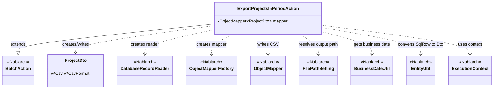
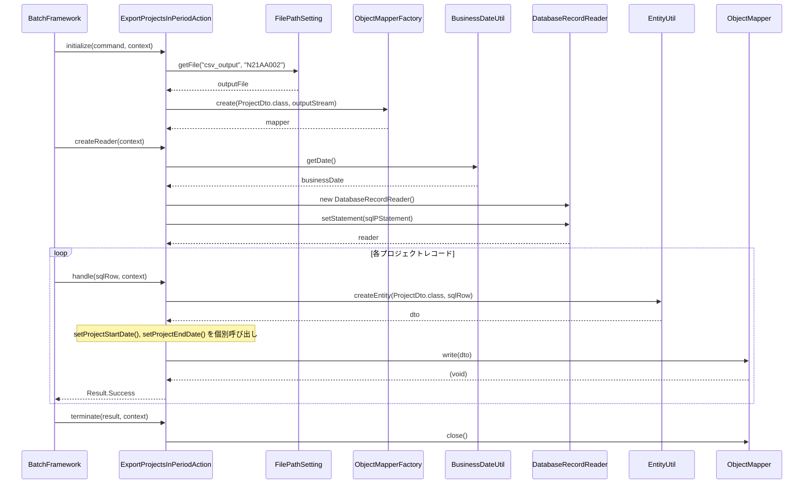

# Code Analysis: ExportProjectsInPeriodAction

**Generated**: 2026-03-06 11:43:14
**Target**: 期間内プロジェクト一覧出力バッチアクション
**Modules**: proman-batch
**Analysis Duration**: 約2分44秒

---

## Overview

`ExportProjectsInPeriodAction` は、期間内プロジェクト一覧をCSVファイルに出力する都度起動バッチアクションクラス。`BatchAction<SqlRow>` を継承し、`initialize()` → `createReader()` → `handle()` → `terminate()` のライフサイクルメソッドを実装している。

`DatabaseRecordReader` でSQLクエリ `FIND_PROJECT_IN_PERIOD` を実行してプロジェクトデータを取得し、`ObjectMapper` を使用してCSV形式で出力する。`BusinessDateUtil` で取得した業務日付を検索条件に使用し、`FilePathSetting` でCSV出力先を管理する。

---

## Architecture

### Dependency Graph



**Note**: This diagram uses Mermaid `classDiagram` syntax to show class names and their relationships. Use `--|>` for inheritance (extends/implements) and `..>` for dependencies (uses/creates).

### Component Summary

| Component | Role | Type | Dependencies |
|-----------|------|------|--------------|
| ExportProjectsInPeriodAction | 期間内プロジェクトCSV出力バッチアクション | Action | DatabaseRecordReader, ObjectMapper, FilePathSetting, BusinessDateUtil, EntityUtil |
| ProjectDto | プロジェクト情報CSV出力DTO | Bean | なし |
| DatabaseRecordReader | DBからSqlRow形式でデータを読み込む | Nablarch | SqlPStatement |
| ObjectMapper | プロジェクトDTOをCSV形式でストリームに書き出す | Nablarch | ProjectDto |
| FilePathSetting | 論理ファイル名から実ファイルパスを解決する | Nablarch | なし |
| BusinessDateUtil | 業務日付を取得する | Nablarch | なし |
| EntityUtil | SqlRowからProjectDtoに変換する | Nablarch | なし |

---

## Flow

### Processing Flow

1. **初期化フェーズ** (`initialize`): `FilePathSetting` で論理ファイル名 `N21AA002` から出力先CSVファイルを解決し、`ObjectMapperFactory` でProjectDto用のCSV出力`ObjectMapper`を生成して保持する。
2. **データ読み込みフェーズ** (`createReader`): `DatabaseRecordReader` を生成し、`FIND_PROJECT_IN_PERIOD` SQLに業務日付を開始日・終了日としてセットして返す。DataReadHandlerがこのreaderを使用して1件ずつデータを取得する。
3. **レコード処理フェーズ** (`handle`): `EntityUtil.createEntity()` で`SqlRow`を`ProjectDto`に変換。型変換できない日付項目は個別にsetterを呼び出す。`mapper.write(dto)` でCSVに書き出し、`Result.Success` を返す。
4. **終了フェーズ** (`terminate`): `mapper.close()` でバッファをフラッシュし、ファイルストリームを閉じる。

### Sequence Diagram



---

## Components

### ExportProjectsInPeriodAction

**ファイル**: [ExportProjectsInPeriodAction.java](../../.lw/nab-official/v6/nablarch-system-development-guide/Sample_Project/Source_Code/proman-project/proman-batch/src/main/java/com/nablarch/example/proman/batch/project/ExportProjectsInPeriodAction.java)

**役割**: 期間内プロジェクト一覧をCSVファイルに出力する都度起動バッチアクション。`BatchAction<SqlRow>` の4つのライフサイクルメソッドを実装する。

**主要メソッド**:
- `initialize(CommandLine, ExecutionContext)` (L44-54): CSV出力先ファイルの解決と`ObjectMapper`の生成。`FilePathSetting`でファイルパスを解決し、`ObjectMapperFactory`でCSV用mapperを生成する。
- `createReader(ExecutionContext)` (L57-65): `DatabaseRecordReader`の生成と`FIND_PROJECT_IN_PERIOD` SQLへのバインド。業務日付を検索条件に設定する。
- `handle(SqlRow, ExecutionContext)` (L68-75): 1レコードのCSV書き出し。`EntityUtil`でDtoに変換後、日付項目を個別設定してCSVに書き出す。
- `terminate(Result, ExecutionContext)` (L78-80): `mapper.close()`によるリソース解放。

**依存**: `DatabaseRecordReader`, `ObjectMapper`, `FilePathSetting`, `BusinessDateUtil`, `EntityUtil`, `ProjectDto`

---

### ProjectDto

**ファイル**: [ProjectDto.java](../../.lw/nab-official/v6/nablarch-system-development-guide/Sample_Project/Source_Code/proman-project/proman-batch/src/main/java/com/nablarch/example/proman/batch/project/ProjectDto.java)

**役割**: CSV出力用プロジェクト情報DTO。`@Csv`と`@CsvFormat`アノテーションでCSVフォーマットを宣言的に定義する。

**主要ポイント**:
- `@Csv(type = Csv.CsvType.CUSTOM, ...)` (L15-19): 出力するプロパティとCSVヘッダ名を定義
- `@CsvFormat(...)` (L20-21): フィールド区切り文字、文字コード、クォートモードを定義
- 日付項目(`projectStartDate`, `projectEndDate`)のsetterはString変換済みの値を受け取る(L138-140, L154-156)

**依存**: なし（純粋なデータオブジェクト）

---

## Nablarch Framework Usage

### BatchAction

**クラス**: `nablarch.fw.action.BatchAction`

**説明**: バッチアプリケーションの汎用テンプレートクラス。4つのライフサイクルメソッドを提供する。

**使用方法**:
```java
public class SampleAction extends BatchAction<SqlRow> {
    @Override
    protected void initialize(CommandLine command, ExecutionContext context) { ... }

    @Override
    public DataReader<SqlRow> createReader(ExecutionContext context) { ... }

    @Override
    public Result handle(SqlRow record, ExecutionContext context) { ... }

    @Override
    protected void terminate(Result result, ExecutionContext context) { ... }
}
```

**重要ポイント**:
- ✅ **ライフサイクルを正しく実装**: `initialize`でリソース生成、`terminate`でリソース解放を対にする
- 💡 **フィールドで状態保持可能**: アクションクラスのフィールドにオブジェクトを保持できる（シングルスレッド実行時）
- ⚠️ **マルチスレッドバッチの場合はスレッドセーフに**: `AtomicInteger`等スレッドセーフなクラスを使用すること

**このコードでの使い方**:
- `mapper`フィールドに`ObjectMapper`を保持し、`initialize`で生成、`terminate`でclose

**詳細**: [Nablarch Batch Architecture](../../.claude/skills/nabledge-6/docs/processing-pattern/nablarch-batch/nablarch-batch-architecture.md)

---

### DatabaseRecordReader

**クラス**: `nablarch.fw.reader.DatabaseRecordReader`

**説明**: データベースからSqlRow形式でレコードを順次読み込むDataReader実装。DataReadHandlerがcreateReaderの戻り値を使用してデータを1件ずつ後続ハンドラに渡す。

**使用方法**:
```java
@Override
public DataReader<SqlRow> createReader(ExecutionContext context) {
    DatabaseRecordReader reader = new DatabaseRecordReader();
    SqlPStatement statement = getSqlPStatement("FIND_PROJECT_IN_PERIOD");
    statement.setDate(1, bizDate);
    reader.setStatement(statement);
    return reader;
}
```

**重要ポイント**:
- ✅ **`createReader`でreturnする**: BatchActionの`createReader`メソッドをオーバーライドしてインスタンスを返す
- 💡 **DataReadHandlerが呼び出す**: FrameworkのDataReadHandlerがreaderを使い1件ずつ`handle`に渡す
- 🎯 **DBからデータを読むバッチに使用**: ファイル読み込みには`FileDataReader`を使用する

**このコードでの使い方**:
- `getSqlPStatement("FIND_PROJECT_IN_PERIOD")`でSQL取得し、業務日付（開始日・終了日）をバインド

**詳細**: [Handlers Data_read_handler](../../.claude/skills/nabledge-6/docs/component/handlers/handlers-data_read_handler.md)

---

### ObjectMapper / ObjectMapperFactory

**クラス**: `nablarch.common.databind.ObjectMapper`, `nablarch.common.databind.ObjectMapperFactory`

**説明**: CSVやTSV、固定長データをJava Beansオブジェクトとして扱う機能。`ObjectMapperFactory.create()`でインスタンスを生成し、`write()`でBean→CSV変換して書き出す。

**使用方法**:
```java
// initialize(): Mapperを生成して保持
FileOutputStream outputStream = new FileOutputStream(output);
this.mapper = ObjectMapperFactory.create(ProjectDto.class, outputStream);

// handle(): 1件書き出し
mapper.write(dto);

// terminate(): リソース解放
mapper.close();
```

**重要ポイント**:
- ✅ **必ず`close()`を呼ぶ**: バッファをフラッシュし、リソースを解放する（`terminate()`で実施）
- 💡 **アノテーション駆動でフォーマット定義**: `@Csv`/`@CsvFormat`で宣言的にCSV仕様を定義できる
- ⚠️ **型が合わない項目は個別設定が必要**: `EntityUtil`で変換できない日付型等は個別にsetterを呼ぶ

**このコードでの使い方**:
- `initialize()`でProjectDto用のmapperを生成してフィールドに保持
- `handle()`で各レコードを`mapper.write(dto)`でCSV出力
- `terminate()`で`mapper.close()`してリソース解放

**詳細**: [Libraries Data_bind](../../.claude/skills/nabledge-6/docs/component/libraries/libraries-data_bind.md)

---

### FilePathSetting

**クラス**: `nablarch.core.util.FilePathSetting`

**説明**: 論理的なファイル名と実際のファイルパスを管理するコンポーネント。コンポーネント設定でベースディレクトリを定義し、論理名でファイルを参照できる。

**使用方法**:
```java
FilePathSetting filePathSetting = FilePathSetting.getInstance();
File output = filePathSetting.getFile("csv_output", "N21AA002");
```

**重要ポイント**:
- 💡 **論理名と物理パスを分離**: 設定ファイルでベースディレクトリを変更するだけで出力先を切り替えられる
- 🎯 **バッチの出力ファイル管理に使用**: ファイル名のハードコードを避けて保守性を高める

**このコードでの使い方**:
- `initialize()`で論理名`csv_output`のベースディレクトリに`N21AA002`ファイルを解決して出力先とする

---

### BusinessDateUtil

**クラス**: `nablarch.core.date.BusinessDateUtil`

**説明**: データベースで管理されている業務日付を取得するユーティリティ。バッチ処理では実行時の業務日付を検索条件に使用することが多い。

**使用方法**:
```java
// 業務日付を取得してSQLにバインド
Date bizDate = new Date(DateUtil.getDate(BusinessDateUtil.getDate()).getTime());
statement.setDate(1, bizDate);
```

**重要ポイント**:
- 💡 **業務日付はDBで管理**: システム日付ではなく業務日付を使うことで、障害時のリラン時に日付を上書き可能
- ⚠️ **型変換が必要**: `BusinessDateUtil.getDate()`はString型(yyyyMMdd)を返すため、`DateUtil.getDate()`でjava.util.Dateに変換する必要がある

**このコードでの使い方**:
- `createReader()`で業務日付を取得し、`FIND_PROJECT_IN_PERIOD` SQLの開始日・終了日両方にバインド

**詳細**: [Libraries Date](../../.claude/skills/nabledge-6/docs/component/libraries/libraries-date.md)

---

### EntityUtil

**クラス**: `nablarch.common.dao.EntityUtil`

**説明**: `SqlRow`（データベース行データ）をJava Beanに変換するユーティリティ。カラム名とプロパティ名のマッピングを自動的に行う。

**使用方法**:
```java
ProjectDto dto = EntityUtil.createEntity(ProjectDto.class, record);
```

**重要ポイント**:
- 💡 **SqlRow→Beanの自動変換**: カラム名とプロパティ名が一致する項目を自動マッピング
- ⚠️ **型変換できない項目は個別設定**: DtoのString型と`SqlRow`の`java.sql.Date`型は自動変換できないため個別設定が必要

**このコードでの使い方**:
- `handle()`でSqlRowをProjectDtoに変換。`PROJECT_START_DATE`と`PROJECT_END_DATE`は型の不一致で自動変換できないため個別setterで設定

---

## References

### Source Files

- [ExportProjectsInPeriodAction.java (.lw/nab-official/v6/nablarch-system-development-guide/en/Sample_Project/Source_Code/proman-project/proman-batch/src/main/java/com/nablarch/example/proman/batch/project)](../../.lw/nab-official/v6/nablarch-system-development-guide/en/Sample_Project/Source_Code/proman-project/proman-batch/src/main/java/com/nablarch/example/proman/batch/project/ExportProjectsInPeriodAction.java) - ExportProjectsInPeriodAction
- [ExportProjectsInPeriodAction.java (.lw/nab-official/v6/nablarch-system-development-guide/Sample_Project/Source_Code/proman-project/proman-batch/src/main/java/com/nablarch/example/proman/batch/project)](../../.lw/nab-official/v6/nablarch-system-development-guide/Sample_Project/Source_Code/proman-project/proman-batch/src/main/java/com/nablarch/example/proman/batch/project/ExportProjectsInPeriodAction.java) - ExportProjectsInPeriodAction
- [ProjectDto.java (.lw/nab-official/v6/nablarch-system-development-guide/en/Sample_Project/Source_Code/proman-project/proman-batch/src/main/java/com/nablarch/example/proman/batch/project)](../../.lw/nab-official/v6/nablarch-system-development-guide/en/Sample_Project/Source_Code/proman-project/proman-batch/src/main/java/com/nablarch/example/proman/batch/project/ProjectDto.java) - ProjectDto
- [ProjectDto.java (.lw/nab-official/v6/nablarch-system-development-guide/Sample_Project/Source_Code/proman-project/proman-batch/src/main/java/com/nablarch/example/proman/batch/project)](../../.lw/nab-official/v6/nablarch-system-development-guide/Sample_Project/Source_Code/proman-project/proman-batch/src/main/java/com/nablarch/example/proman/batch/project/ProjectDto.java) - ProjectDto

### Knowledge Base (Nabledge-6)

- [Nablarch Batch Architecture](../../.claude/skills/nabledge-6/docs/processing-pattern/nablarch-batch/nablarch-batch-architecture.md)
- [Handlers Data_read_handler](../../.claude/skills/nabledge-6/docs/component/handlers/handlers-data_read_handler.md)
- [Libraries Data_bind](../../.claude/skills/nabledge-6/docs/component/libraries/libraries-data_bind.md)
- [Libraries Date](../../.claude/skills/nabledge-6/docs/component/libraries/libraries-date.md)

### Official Documentation


- [Architecture](https://nablarch.github.io/docs/LATEST/doc/application_framework/application_framework/batch/nablarch_batch/architecture.html)
- [AsyncMessageSendAction](https://nablarch.github.io/docs/LATEST/javadoc/nablarch/fw/messaging/action/AsyncMessageSendAction.html)
- [BasicBusinessDateProvider](https://nablarch.github.io/docs/LATEST/javadoc/nablarch/core/date/BasicBusinessDateProvider.html)
- [BasicSystemTimeProvider](https://nablarch.github.io/docs/LATEST/javadoc/nablarch/core/date/BasicSystemTimeProvider.html)
- [BatchAction](https://nablarch.github.io/docs/LATEST/javadoc/nablarch/fw/action/BatchAction.html)
- [BeanUtil](https://nablarch.github.io/docs/LATEST/javadoc/nablarch/core/beans/BeanUtil.html)
- [BusinessDateProvider](https://nablarch.github.io/docs/LATEST/javadoc/nablarch/core/date/BusinessDateProvider.html)
- [BusinessDateUtil](https://nablarch.github.io/docs/LATEST/javadoc/nablarch/core/date/BusinessDateUtil.html)
- [CsvDataBindConfig](https://nablarch.github.io/docs/LATEST/javadoc/nablarch/common/databind/csv/CsvDataBindConfig.html)
- [CsvFormat](https://nablarch.github.io/docs/LATEST/javadoc/nablarch/common/databind/csv/CsvFormat.html)
- [Csv](https://nablarch.github.io/docs/LATEST/javadoc/nablarch/common/databind/csv/Csv.html)
- [Data Bind](https://nablarch.github.io/docs/LATEST/doc/application_framework/application_framework/libraries/data_io/data_bind.html)
- [Data Read Handler](https://nablarch.github.io/docs/LATEST/doc/application_framework/application_framework/handlers/standalone/data_read_handler.html)
- [DataBindConfig](https://nablarch.github.io/docs/LATEST/javadoc/nablarch/common/databind/DataBindConfig.html)
- [DataReadHandler](https://nablarch.github.io/docs/LATEST/javadoc/nablarch/fw/handler/DataReadHandler.html)
- [DataReader.NoMoreRecord](https://nablarch.github.io/docs/LATEST/javadoc/nablarch/fw/DataReader.NoMoreRecord.html)
- [DataReader](https://nablarch.github.io/docs/LATEST/javadoc/nablarch/fw/DataReader.html)
- [DatabaseRecordReader](https://nablarch.github.io/docs/LATEST/javadoc/nablarch/fw/reader/DatabaseRecordReader.html)
- [Date](https://nablarch.github.io/docs/LATEST/doc/application_framework/application_framework/libraries/date.html)
- [DispatchHandler](https://nablarch.github.io/docs/LATEST/javadoc/nablarch/fw/handler/DispatchHandler.html)
- [ExecutionContext](https://nablarch.github.io/docs/LATEST/javadoc/nablarch/fw/ExecutionContext.html)
- [Field](https://nablarch.github.io/docs/LATEST/javadoc/nablarch/common/databind/fixedlength/Field.html)
- [FileBatchAction](https://nablarch.github.io/docs/LATEST/javadoc/nablarch/fw/action/FileBatchAction.html)
- [FileDataReader](https://nablarch.github.io/docs/LATEST/javadoc/nablarch/fw/reader/FileDataReader.html)
- [FileResponse](https://nablarch.github.io/docs/LATEST/javadoc/nablarch/common/web/download/FileResponse.html)
- [FixedLengthDataBindConfigBuilder](https://nablarch.github.io/docs/LATEST/javadoc/nablarch/common/databind/fixedlength/FixedLengthDataBindConfigBuilder.html)
- [FixedLengthDataBindConfig](https://nablarch.github.io/docs/LATEST/javadoc/nablarch/common/databind/fixedlength/FixedLengthDataBindConfig.html)
- [FixedLength](https://nablarch.github.io/docs/LATEST/javadoc/nablarch/common/databind/fixedlength/FixedLength.html)
- [LineNumber](https://nablarch.github.io/docs/LATEST/javadoc/nablarch/common/databind/LineNumber.html)
- [MultiLayoutConfig.RecordIdentifier](https://nablarch.github.io/docs/LATEST/javadoc/nablarch/common/databind/fixedlength/MultiLayoutConfig.RecordIdentifier.html)
- [MultiLayout](https://nablarch.github.io/docs/LATEST/javadoc/nablarch/common/databind/fixedlength/MultiLayout.html)
- [NoInputDataBatchAction](https://nablarch.github.io/docs/LATEST/javadoc/nablarch/fw/action/NoInputDataBatchAction.html)
- [ObjectMapperFactory](https://nablarch.github.io/docs/LATEST/javadoc/nablarch/common/databind/ObjectMapperFactory.html)
- [ObjectMapper](https://nablarch.github.io/docs/LATEST/javadoc/nablarch/common/databind/ObjectMapper.html)
- [Package-summary](https://nablarch.github.io/docs/LATEST/javadoc/nablarch/common/databind/fixedlength/converter/package-summary.html)
- [PartInfo](https://nablarch.github.io/docs/LATEST/javadoc/nablarch/fw/web/upload/PartInfo.html)
- [ProcessStopHandler.ProcessStop](https://nablarch.github.io/docs/LATEST/javadoc/nablarch/fw/handler/ProcessStopHandler.ProcessStop.html)
- [Result](https://nablarch.github.io/docs/LATEST/javadoc/nablarch/fw/Result.html)
- [ResumeDataReader](https://nablarch.github.io/docs/LATEST/javadoc/nablarch/fw/reader/ResumeDataReader.html)
- [StatusCodeConvertHandler](https://nablarch.github.io/docs/LATEST/javadoc/nablarch/fw/handler/StatusCodeConvertHandler.html)
- [SystemTimeProvider](https://nablarch.github.io/docs/LATEST/javadoc/nablarch/core/date/SystemTimeProvider.html)
- [SystemTimeUtil](https://nablarch.github.io/docs/LATEST/javadoc/nablarch/core/date/SystemTimeUtil.html)
- [ValidatableFileDataReader](https://nablarch.github.io/docs/LATEST/javadoc/nablarch/fw/reader/ValidatableFileDataReader.html)

---

**Note**: This documentation was generated by the code-analysis workflow of the nabledge-6 skill.
