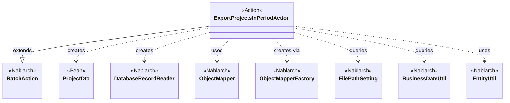
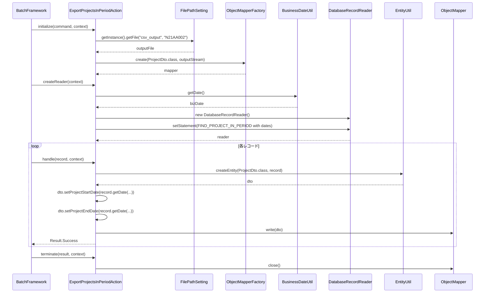

# Code Analysis: ExportProjectsInPeriodAction

**Generated**: 2026-03-06 11:59:25
**Target**: 期間内プロジェクト一覧出力バッチアクション
**Modules**: proman-batch
**Analysis Duration**: 約2分22秒

---

## Overview

`ExportProjectsInPeriodAction`は、業務日付を基準として期間内プロジェクトをデータベースから読み込み、CSV形式でファイルに出力する都度起動バッチアクションクラスである。

NablarchのバッチフレームワークにおけるDB to FILEパターンの典型的な実装であり、以下の4メソッドでバッチライフサイクルを管理する：
- `initialize()`: CSV出力用ObjectMapperの初期化
- `createReader()`: 業務日付範囲でDBクエリを設定したDatabaseRecordReaderの生成
- `handle()`: 1レコードをProjectDtoに変換してCSV書き込み
- `terminate()`: ObjectMapperのクローズとリソース解放

`ProjectDto`はCSVフォーマットを`@Csv`/`@CsvFormat`アノテーションで宣言的に定義したBeanクラスであり、データバインド機能を活用する。

---

## Architecture

### Dependency Graph



**Note**: This diagram uses Mermaid `classDiagram` syntax to show class names and their relationships. Use `--|>` for inheritance (extends/implements) and `..>` for dependencies (uses/creates).

### Component Summary

| Component | Role | Type | Dependencies |
|-----------|------|------|--------------|
| ExportProjectsInPeriodAction | 期間内プロジェクトCSV出力バッチアクション | Action | ProjectDto, DatabaseRecordReader, ObjectMapper, FilePathSetting, BusinessDateUtil, EntityUtil |
| ProjectDto | プロジェクト情報CSV出力用Bean | Bean | なし（アノテーションでCSVフォーマット定義） |

---

## Flow

### Processing Flow

バッチフレームワークが以下の順序でメソッドを呼び出す：

1. **initialize()**: `FilePathSetting`から出力ファイルパスを取得し、`ObjectMapperFactory`でProjectDto用のCSVマッパーを生成する。
2. **createReader()**: `BusinessDateUtil.getDate()`で業務日付を取得し、`getSqlPStatement("FIND_PROJECT_IN_PERIOD")`でSQL文を取得。業務日付をバインド変数として設定した`DatabaseRecordReader`を返す。
3. **handle()**: フレームワークが各DBレコードを渡す。`EntityUtil.createEntity()`でSqlRowをProjectDtoに変換し、日付型項目は個別にsetterを呼ぶ。`mapper.write(dto)`でCSVに1行書き込み、`Result.Success`を返す。
4. **terminate()**: `mapper.close()`でバッファをフラッシュし、ファイルをクローズする。

### Sequence Diagram



---

## Components

### ExportProjectsInPeriodAction

**ファイル**: [ExportProjectsInPeriodAction.java](../../.lw/nab-official/v6/nablarch-system-development-guide/Sample_Project/Source_Code/proman-project/proman-batch/src/main/java/com/nablarch/example/proman/batch/project/ExportProjectsInPeriodAction.java)

**役割**: 期間内プロジェクトをDBから読み込んでCSVファイルに出力する都度起動バッチアクション。`BatchAction<SqlRow>`を継承し、4つのライフサイクルメソッドを実装する。

**主要メソッド**:
- `initialize(CommandLine, ExecutionContext)` (L44-54): FilePathSettingで出力先を特定し、ObjectMapperを初期化する
- `createReader(ExecutionContext)` (L57-65): 業務日付をパラメータにしたDatabaseRecordReaderを生成して返す
- `handle(SqlRow, ExecutionContext)` (L68-75): 1レコードをProjectDtoに変換してCSV書き込み
- `terminate(Result, ExecutionContext)` (L78-80): ObjectMapperをクローズしてリソース解放

**依存関係**: BatchAction(Nablarch), DatabaseRecordReader(Nablarch), ObjectMapper(Nablarch), FilePathSetting(Nablarch), BusinessDateUtil(Nablarch), EntityUtil(Nablarch), ProjectDto(Project)

**実装のポイント**:
- `getSqlPStatement()`はBatchActionが提供するメソッドでSQL文を取得する
- `EntityUtil.createEntity()`は型変換できない項目があるため、日付型は個別setterで設定している（L71-72のコメント参照）

---

### ProjectDto

**ファイル**: [ProjectDto.java](../../.lw/nab-official/v6/nablarch-system-development-guide/Sample_Project/Source_Code/proman-project/proman-batch/src/main/java/com/nablarch/example/proman/batch/project/ProjectDto.java)

**役割**: CSV出力用のプロジェクト情報Beanクラス。`@Csv`と`@CsvFormat`アノテーションでCSVフォーマット（カラム順、ヘッダ、区切り文字、文字コード等）を宣言的に定義する。

**主要な点**:
- `@Csv`アノテーションで13項目のプロパティとヘッダを定義（L15-19）
- `@CsvFormat`でフォーマット詳細（UTF-8、全項目クォート等）を定義（L20-21）
- `projectStartDate`/`projectEndDate`のsetterはDateを受け取り、`DateUtil.formatDate()`でString変換する

**依存関係**: なし（アノテーションのみ）

---

## Nablarch Framework Usage

### BatchAction

**クラス**: `nablarch.fw.action.BatchAction<D>`

**説明**: Nablarchバッチフレームワークの汎用バッチアクションテンプレート。4つのライフサイクルメソッド（initialize/createReader/handle/terminate）を提供する。

**使用方法**:
```java
public class MyBatchAction extends BatchAction<SqlRow> {
    @Override
    protected void initialize(CommandLine command, ExecutionContext context) { }

    @Override
    public DataReader<SqlRow> createReader(ExecutionContext context) {
        return new DatabaseRecordReader();
    }

    @Override
    public Result handle(SqlRow record, ExecutionContext context) {
        return new Result.Success();
    }

    @Override
    protected void terminate(Result result, ExecutionContext context) { }
}
```

**重要ポイント**:
- ✅ **`handle()`でResult.Successを返す**: 正常処理完了を示す
- 💡 **DB to FILEパターン**: DBから読み込んでファイルに書き出す典型的な実装パターン
- 🎯 **都度起動バッチ**: コマンドラインから起動し、処理完了後に終了するバッチタイプ

**このコードでの使い方**:
- `BatchAction<SqlRow>`を継承し、4メソッドをすべてオーバーライド
- `getSqlPStatement()`はBatchActionが提供するメソッドで、SQLIDでSQL文を取得する

**詳細**: [Nablarch Batch Architecture](../../.claude/skills/nabledge-6/docs/processing-pattern/nablarch-batch/nablarch-batch-architecture.md)

---

### DatabaseRecordReader

**クラス**: `nablarch.fw.reader.DatabaseRecordReader`

**説明**: データベースからレコードを読み込む標準データリーダ。`SqlPStatement`をセットすることで、バッチフレームワークが1レコードずつ`handle()`に渡す。

**使用方法**:
```java
DatabaseRecordReader reader = new DatabaseRecordReader();
SqlPStatement statement = getSqlPStatement("SQL_ID");
statement.setDate(1, date);
reader.setStatement(statement);
return reader;
```

**重要ポイント**:
- ✅ **`setStatement()`でSQL文を渡す**: クエリパラメータを設定してからreaderにセットする
- 💡 **フレームワークが反復処理**: バッチフレームワークがreaderからレコードを取得し、`handle()`を繰り返し呼ぶ

**このコードでの使い方**:
- `createReader()`でDatabaseRecordReaderを生成（L58）
- 業務日付2件をバインド変数として設定したSQLをセット（L59-63）

**詳細**: [Nablarch Batch Architecture](../../.claude/skills/nabledge-6/docs/processing-pattern/nablarch-batch/nablarch-batch-architecture.md)

---

### ObjectMapper / ObjectMapperFactory

**クラス**: `nablarch.common.databind.ObjectMapper`, `nablarch.common.databind.ObjectMapperFactory`

**説明**: CSVなどのデータファイルをJava Beansとして扱う機能を提供する。`@Csv`/`@CsvFormat`アノテーションで宣言したBeanクラスを元に、データを書き込む。

**使用方法**:
```java
ObjectMapper<ProjectDto> mapper = ObjectMapperFactory.create(ProjectDto.class, outputStream);
mapper.write(dto);
mapper.close();
```

**重要ポイント**:
- ✅ **必ず`close()`を呼ぶ**: バッファをフラッシュし、リソースを解放する（`terminate()`で実施）
- ⚠️ **型変換の制限**: `EntityUtil`と組み合わせる場合、型変換が必要な項目は個別のsetterで設定が必要（L71-72）
- 💡 **アノテーション駆動**: `@Csv`, `@CsvFormat`でフォーマットを宣言的に定義できる

**このコードでの使い方**:
- `initialize()`でProjectDto用のObjectMapperを生成（L50）
- `handle()`で各レコードを`mapper.write(dto)`でCSV出力（L73）
- `terminate()`で`mapper.close()`してリソース解放（L79）

**詳細**: [Libraries Data_bind](../../.claude/skills/nabledge-6/docs/component/libraries/libraries-data_bind.md)

---

### FilePathSetting

**クラス**: `nablarch.core.util.FilePathSetting`

**説明**: ファイルパスの論理名から実際のファイルパスを解決するユーティリティ。コンポーネント設定ファイルでディレクトリと拡張子を定義し、`getInstance()`でシングルトンを取得する。

**使用方法**:
```java
FilePathSetting filePathSetting = FilePathSetting.getInstance();
File output = filePathSetting.getFile("csv_output", "N21AA002");
```

**重要ポイント**:
- ✅ **コンポーネント名は`filePathSetting`**: コンポーネント設定ファイルでの名前を固定する
- 🎯 **環境依存パスの抽象化**: 論理名でファイルパスを管理し、環境ごとの設定変更を容易にする

**このコードでの使い方**:
- `initialize()`でcsv_outputロジカル名からN21AA002ファイルのパスを取得（L45-47）

**詳細**: [Libraries File_path_management](../../.claude/skills/nabledge-6/docs/component/libraries/libraries-file_path_management.md)

---

### BusinessDateUtil

**クラス**: `nablarch.core.date.BusinessDateUtil`

**説明**: データベースで管理された業務日付を取得するユーティリティ。バッチ処理での日付パラメータ設定によく使用される。

**使用方法**:
```java
String bizDateStr = BusinessDateUtil.getDate();
Date bizDate = new Date(DateUtil.getDate(bizDateStr).getTime());
```

**重要ポイント**:
- 💡 **yyyyMMdd形式の文字列を返す**: `DateUtil.getDate()`でjava.util.Dateに変換してから使用する
- 🎯 **バッチ再実行時の日付指定**: システムプロパティで業務日付を上書きできる（障害時再実行に有用）

**このコードでの使い方**:
- `createReader()`でビジネス日付を取得し、SQLのバインド変数に設定（L60-62）

**詳細**: [Libraries Date](../../.claude/skills/nabledge-6/docs/component/libraries/libraries-date.md)

---

## References

### Source Files

- [ExportProjectsInPeriodAction.java (.lw/nab-official/v6/nablarch-system-development-guide/en/Sample_Project/Source_Code/proman-project/proman-batch/src/main/java/com/nablarch/example/proman/batch/project)](../../.lw/nab-official/v6/nablarch-system-development-guide/en/Sample_Project/Source_Code/proman-project/proman-batch/src/main/java/com/nablarch/example/proman/batch/project/ExportProjectsInPeriodAction.java) - ExportProjectsInPeriodAction
- [ExportProjectsInPeriodAction.java (.lw/nab-official/v6/nablarch-system-development-guide/Sample_Project/Source_Code/proman-project/proman-batch/src/main/java/com/nablarch/example/proman/batch/project)](../../.lw/nab-official/v6/nablarch-system-development-guide/Sample_Project/Source_Code/proman-project/proman-batch/src/main/java/com/nablarch/example/proman/batch/project/ExportProjectsInPeriodAction.java) - ExportProjectsInPeriodAction
- [ProjectDto.java (.lw/nab-official/v6/nablarch-system-development-guide/en/Sample_Project/Source_Code/proman-project/proman-batch/src/main/java/com/nablarch/example/proman/batch/project)](../../.lw/nab-official/v6/nablarch-system-development-guide/en/Sample_Project/Source_Code/proman-project/proman-batch/src/main/java/com/nablarch/example/proman/batch/project/ProjectDto.java) - ProjectDto
- [ProjectDto.java (.lw/nab-official/v6/nablarch-system-development-guide/Sample_Project/Source_Code/proman-project/proman-batch/src/main/java/com/nablarch/example/proman/batch/project)](../../.lw/nab-official/v6/nablarch-system-development-guide/Sample_Project/Source_Code/proman-project/proman-batch/src/main/java/com/nablarch/example/proman/batch/project/ProjectDto.java) - ProjectDto

### Knowledge Base (Nabledge-6)

- [Nablarch Batch Architecture](../../.claude/skills/nabledge-6/docs/processing-pattern/nablarch-batch/nablarch-batch-architecture.md)
- [Libraries Data_bind](../../.claude/skills/nabledge-6/docs/component/libraries/libraries-data_bind.md)
- [Libraries File_path_management](../../.claude/skills/nabledge-6/docs/component/libraries/libraries-file_path_management.md)
- [Libraries Date](../../.claude/skills/nabledge-6/docs/component/libraries/libraries-date.md)

### Official Documentation


- [Architecture](https://nablarch.github.io/docs/LATEST/doc/application_framework/application_framework/batch/nablarch_batch/architecture.html)
- [AsyncMessageSendAction](https://nablarch.github.io/docs/LATEST/javadoc/nablarch/fw/messaging/action/AsyncMessageSendAction.html)
- [BasicBusinessDateProvider](https://nablarch.github.io/docs/LATEST/javadoc/nablarch/core/date/BasicBusinessDateProvider.html)
- [BasicSystemTimeProvider](https://nablarch.github.io/docs/LATEST/javadoc/nablarch/core/date/BasicSystemTimeProvider.html)
- [BatchAction](https://nablarch.github.io/docs/LATEST/javadoc/nablarch/fw/action/BatchAction.html)
- [BeanUtil](https://nablarch.github.io/docs/LATEST/javadoc/nablarch/core/beans/BeanUtil.html)
- [BusinessDateProvider](https://nablarch.github.io/docs/LATEST/javadoc/nablarch/core/date/BusinessDateProvider.html)
- [BusinessDateUtil](https://nablarch.github.io/docs/LATEST/javadoc/nablarch/core/date/BusinessDateUtil.html)
- [CsvDataBindConfig](https://nablarch.github.io/docs/LATEST/javadoc/nablarch/common/databind/csv/CsvDataBindConfig.html)
- [CsvFormat](https://nablarch.github.io/docs/LATEST/javadoc/nablarch/common/databind/csv/CsvFormat.html)
- [Csv](https://nablarch.github.io/docs/LATEST/javadoc/nablarch/common/databind/csv/Csv.html)
- [Data Bind](https://nablarch.github.io/docs/LATEST/doc/application_framework/application_framework/libraries/data_io/data_bind.html)
- [DataBindConfig](https://nablarch.github.io/docs/LATEST/javadoc/nablarch/common/databind/DataBindConfig.html)
- [DataReader](https://nablarch.github.io/docs/LATEST/javadoc/nablarch/fw/DataReader.html)
- [DatabaseRecordReader](https://nablarch.github.io/docs/LATEST/javadoc/nablarch/fw/reader/DatabaseRecordReader.html)
- [Date](https://nablarch.github.io/docs/LATEST/doc/application_framework/application_framework/libraries/date.html)
- [DispatchHandler](https://nablarch.github.io/docs/LATEST/javadoc/nablarch/fw/handler/DispatchHandler.html)
- [Field](https://nablarch.github.io/docs/LATEST/javadoc/nablarch/common/databind/fixedlength/Field.html)
- [File Path Management](https://nablarch.github.io/docs/LATEST/doc/application_framework/application_framework/libraries/file_path_management.html)
- [FileBatchAction](https://nablarch.github.io/docs/LATEST/javadoc/nablarch/fw/action/FileBatchAction.html)
- [FileDataReader](https://nablarch.github.io/docs/LATEST/javadoc/nablarch/fw/reader/FileDataReader.html)
- [FilePathSetting](https://nablarch.github.io/docs/LATEST/javadoc/nablarch/core/util/FilePathSetting.html)
- [FileResponse](https://nablarch.github.io/docs/LATEST/javadoc/nablarch/common/web/download/FileResponse.html)
- [FixedLengthDataBindConfigBuilder](https://nablarch.github.io/docs/LATEST/javadoc/nablarch/common/databind/fixedlength/FixedLengthDataBindConfigBuilder.html)
- [FixedLengthDataBindConfig](https://nablarch.github.io/docs/LATEST/javadoc/nablarch/common/databind/fixedlength/FixedLengthDataBindConfig.html)
- [FixedLength](https://nablarch.github.io/docs/LATEST/javadoc/nablarch/common/databind/fixedlength/FixedLength.html)
- [LineNumber](https://nablarch.github.io/docs/LATEST/javadoc/nablarch/common/databind/LineNumber.html)
- [MultiLayoutConfig.RecordIdentifier](https://nablarch.github.io/docs/LATEST/javadoc/nablarch/common/databind/fixedlength/MultiLayoutConfig.RecordIdentifier.html)
- [MultiLayout](https://nablarch.github.io/docs/LATEST/javadoc/nablarch/common/databind/fixedlength/MultiLayout.html)
- [NoInputDataBatchAction](https://nablarch.github.io/docs/LATEST/javadoc/nablarch/fw/action/NoInputDataBatchAction.html)
- [ObjectMapperFactory](https://nablarch.github.io/docs/LATEST/javadoc/nablarch/common/databind/ObjectMapperFactory.html)
- [ObjectMapper](https://nablarch.github.io/docs/LATEST/javadoc/nablarch/common/databind/ObjectMapper.html)
- [Package-summary](https://nablarch.github.io/docs/LATEST/javadoc/nablarch/common/databind/fixedlength/converter/package-summary.html)
- [PartInfo](https://nablarch.github.io/docs/LATEST/javadoc/nablarch/fw/web/upload/PartInfo.html)
- [ProcessStopHandler.ProcessStop](https://nablarch.github.io/docs/LATEST/javadoc/nablarch/fw/handler/ProcessStopHandler.ProcessStop.html)
- [Result](https://nablarch.github.io/docs/LATEST/javadoc/nablarch/fw/Result.html)
- [ResumeDataReader](https://nablarch.github.io/docs/LATEST/javadoc/nablarch/fw/reader/ResumeDataReader.html)
- [StatusCodeConvertHandler](https://nablarch.github.io/docs/LATEST/javadoc/nablarch/fw/handler/StatusCodeConvertHandler.html)
- [SystemTimeProvider](https://nablarch.github.io/docs/LATEST/javadoc/nablarch/core/date/SystemTimeProvider.html)
- [SystemTimeUtil](https://nablarch.github.io/docs/LATEST/javadoc/nablarch/core/date/SystemTimeUtil.html)
- [ValidatableFileDataReader](https://nablarch.github.io/docs/LATEST/javadoc/nablarch/fw/reader/ValidatableFileDataReader.html)

---

**Note**: This documentation was generated by the code-analysis workflow of the nabledge-6 skill.
