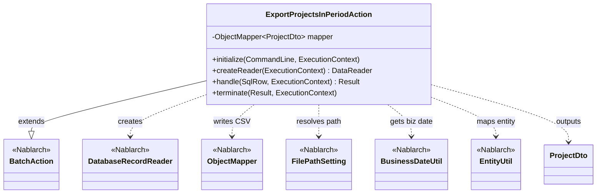
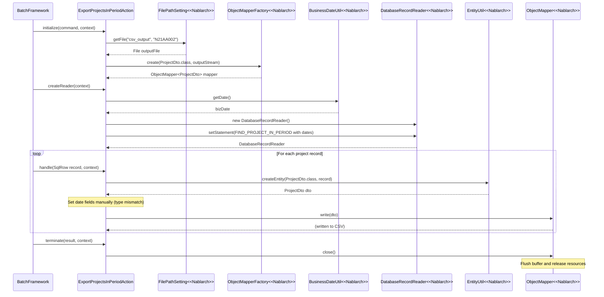

# Code Analysis: ExportProjectsInPeriodAction

**Generated**: 2026-03-06 11:12:38
**Target**: 期間内プロジェクト一覧出力バッチアクション
**Modules**: proman-batch
**Analysis Duration**: 約7分6秒

---

## Overview

`ExportProjectsInPeriodAction` は、指定された業務期間内のプロジェクト一覧をCSVファイルに出力する都度起動バッチアクションクラスである。`BatchAction<SqlRow>` を継承し、`initialize()`でCSVマッパーを初期化、`createReader()`でDBから業務日付条件に合うプロジェクトを取得、`handle()`でレコードをProjectDtoに変換してCSV出力、`terminate()`でリソースを解放するライフサイクルに従っている。

主要なNablarchコンポーネント: `BatchAction`, `DatabaseRecordReader`, `ObjectMapper`, `FilePathSetting`, `BusinessDateUtil`

---

## Architecture

### Dependency Graph



**Note**: This diagram uses Mermaid `classDiagram` syntax to show class names and their relationships. Use `--|>` for inheritance (extends/implements) and `..>` for dependencies (uses/creates).

### Component Summary

| Component | Role | Type | Dependencies |
|-----------|------|------|--------------|
| ExportProjectsInPeriodAction | 期間内プロジェクトCSV出力バッチアクション | Action | DatabaseRecordReader, ObjectMapper, FilePathSetting, BusinessDateUtil, EntityUtil |
| ProjectDto | プロジェクト情報CSV出力用DTO（@Csv/@CsvFormat定義） | Bean | なし |

---

## Flow

### Processing Flow

バッチフレームワークが以下のライフサイクルでアクションを呼び出す:

1. **initialize()** (L44-54): `FilePathSetting`から出力先CSVファイルパスを取得し、`ObjectMapperFactory`でProjectDto用の`ObjectMapper`を生成する
2. **createReader()** (L57-65): `DatabaseRecordReader`を生成し、`FIND_PROJECT_IN_PERIOD` SQLで業務日付（`BusinessDateUtil.getDate()`）を開始・終了日に設定してDBから対象プロジェクトを取得する
3. **handle()** (L68-75): `DataReadHandler`が呼び出す。`EntityUtil.createEntity()`でSqlRowをProjectDtoに変換し、日付型フィールドのみ手動でセット後、`mapper.write(dto)`でCSV出力する
4. **terminate()** (L78-80): `mapper.close()`でCSVバッファをフラッシュしリソースを解放する

### Sequence Diagram



---

## Components

### ExportProjectsInPeriodAction

**ファイル**: [ExportProjectsInPeriodAction.java](../../.lw/nab-official/v6/nablarch-system-development-guide/Sample_Project/Source_Code/proman-project/proman-batch/src/main/java/com/nablarch/example/proman/batch/project/ExportProjectsInPeriodAction.java)

**役割**: 期間内プロジェクト一覧をCSVファイルに出力する都度起動バッチアクション

**キーメソッド**:
- `initialize(CommandLine, ExecutionContext)` (L44-54): 出力ファイルパスを取得しObjectMapperを初期化
- `createReader(ExecutionContext)` (L57-65): 業務日付条件でDBからプロジェクトを取得するDatabaseRecordReaderを生成
- `handle(SqlRow, ExecutionContext)` (L68-75): SQlRowをProjectDtoに変換してCSV書き込み

**依存コンポーネント**: `DatabaseRecordReader`, `ObjectMapper`, `FilePathSetting`, `BusinessDateUtil`, `EntityUtil`

**実装のポイント**:
- `EntityUtil.createEntity()`では型の違いにより日付型フィールドが設定されないため、L71-72で`setProjectStartDate()`/`setProjectEndDate()`を明示的に呼び出している
- `OUTPUT_FILE_NAME = "N21AA002"` は論理ファイル名で、`FilePathSetting`の`csv_output`ディレクトリに結合されてCSVパスになる

### ProjectDto

**ファイル**: [ProjectDto.java](../../.lw/nab-official/v6/nablarch-system-development-guide/Sample_Project/Source_Code/proman-project/proman-batch/src/main/java/com/nablarch/example/proman/batch/project/ProjectDto.java)

**役割**: CSV出力用のプロジェクト情報DTO。`@Csv`と`@CsvFormat`アノテーションでCSVフォーマットを定義している。

**CSVフォーマット定義**:
- `@Csv(type = Csv.CsvType.CUSTOM)`: カスタムフォーマット、13プロパティ、日本語ヘッダ定義
- `@CsvFormat`: カンマ区切り、CRLF改行、ダブルクォート、UTF-8、全項目クォート

**依存コンポーネント**: なし（純粋なDTOクラス）

---

## Nablarch Framework Usage

### BatchAction

**クラス**: `nablarch.fw.action.BatchAction`

**説明**: Nablarchバッチ処理の汎用テンプレートクラス。`initialize()`, `createReader()`, `handle()`, `terminate()` のライフサイクルメソッドをオーバーライドしてバッチ処理を実装する。

**使用方法**:
```java
public class MyBatchAction extends BatchAction<SqlRow> {
    @Override
    protected void initialize(CommandLine command, ExecutionContext context) { ... }

    @Override
    public DataReader<SqlRow> createReader(ExecutionContext context) { ... }

    @Override
    public Result handle(SqlRow record, ExecutionContext context) { ... }

    @Override
    protected void terminate(Result result, ExecutionContext context) { ... }
}
```

**重要ポイント**:
- ✅ **`terminate()`でリソース解放**: ファイルやDBコネクションは必ずterminateで閉じること
- 💡 **DB→FILE パターン**: このクラスはDBからデータを読んでファイル出力する標準的なパターンを示している
- 🎯 **都度起動バッチ**: `BatchAction`は都度起動バッチに使用。常駐バッチには別のアクションクラスを使用する

**このコードでの使い方**:
- `initialize()`でCSV出力用ObjectMapperを準備
- `createReader()`でDBから業務期間内プロジェクトを取得
- `handle()`でレコードを変換・CSV出力
- `terminate()`でObjectMapper.close()を呼び出し

**詳細**: [Nablarch Batch Architecture](../../.claude/skills/nabledge-6/docs/processing-pattern/nablarch-batch/nablarch-batch-architecture.md)

### ObjectMapper / ObjectMapperFactory

**クラス**: `nablarch.common.databind.ObjectMapper`, `nablarch.common.databind.ObjectMapperFactory`

**説明**: CSVやTSV、固定長データをJava Beansとして扱う機能を提供する。`@Csv`アノテーションが付いたBeanクラスを使って、ストリームへの書き込みが可能。

**使用方法**:
```java
// ObjectMapper生成
ObjectMapper<ProjectDto> mapper = ObjectMapperFactory.create(ProjectDto.class, outputStream);

// レコード書き込み
mapper.write(dto);

// リソース解放（必須）
mapper.close();
```

**重要ポイント**:
- ✅ **必ず`close()`を呼ぶ**: バッファをフラッシュしリソースを解放する。`terminate()`での呼び出しが必須
- ⚠️ **型変換の制限**: `EntityUtil.createEntity()`と連携する場合、型の不一致フィールド（日付型等）は手動でセット要
- 💡 **アノテーション駆動**: `ProjectDto`の`@Csv`/`@CsvFormat`アノテーションでフォーマットを宣言的に定義できる

**このコードでの使い方**:
- `initialize()` (L50): `ObjectMapperFactory.create(ProjectDto.class, outputStream)` でmapper生成
- `handle()` (L73): `mapper.write(dto)` でレコードをCSVに出力
- `terminate()` (L79): `mapper.close()` でリソース解放

**詳細**: [Libraries Data_bind](../../.claude/skills/nabledge-6/docs/component/libraries/libraries-data_bind.md)

### FilePathSetting

**クラス**: `nablarch.core.util.FilePathSetting`

**説明**: 論理名に対してディレクトリパスと拡張子を管理するファイルパス管理機能。コンポーネント定義でパスを設定し、論理名で実際のファイルパスを取得する。

**使用方法**:
```java
FilePathSetting filePathSetting = FilePathSetting.getInstance();
File output = filePathSetting.getFile("csv_output", "N21AA002");
// → /var/nablarch/output/N21AA002.csv
```

**重要ポイント**:
- ✅ **コンポーネント名は`filePathSetting`**: コンポーネント定義のIDは必ずこの名前にする
- 💡 **論理名でパス管理**: ハードコードを避け、環境によって変更可能な設定ファイルでパスを管理できる
- ⚠️ **fileスキームを推奨**: classpathスキームはJBoss/WildFlyで使用不可のため、本番ではfileスキームを使用

**このコードでの使い方**:
- `initialize()` (L45-47): `FilePathSetting.getInstance().getFile("csv_output", "N21AA002")` でCSV出力パスを取得

**詳細**: [Libraries File_path_management](../../.claude/skills/nabledge-6/docs/component/libraries/libraries-file_path_management.md)

### BusinessDateUtil

**クラス**: `nablarch.core.date.BusinessDateUtil`

**説明**: データベースで管理された業務日付を取得するユーティリティ。システム日時とは独立して管理されるため、バッチ処理で「本日の業務日付」を正確に取得できる。

**使用方法**:
```java
String bizDateStr = BusinessDateUtil.getDate(); // "20260306" 形式
Date bizDate = new Date(DateUtil.getDate(BusinessDateUtil.getDate()).getTime());
```

**重要ポイント**:
- 💡 **業務日付とシステム日時の分離**: バッチ再実行時に過去日付を業務日付として使用できる
- 🎯 **DBから業務日付を取得**: システムプロパティで上書き可能なため、テスト・再実行に対応

**このコードでの使い方**:
- `createReader()` (L60): `BusinessDateUtil.getDate()` で業務日付を取得し、SQLのパラメータとして設定

### DatabaseRecordReader

**クラス**: `nablarch.fw.reader.DatabaseRecordReader`

**説明**: `DataReadHandler`が使用するデータリーダー。`BatchAction.createReader()`でオーバーライドして返すことで、DBからレコードを1件ずつ読み込む。

**使用方法**:
```java
DatabaseRecordReader reader = new DatabaseRecordReader();
SqlPStatement statement = getSqlPStatement("FIND_PROJECT_IN_PERIOD");
statement.setDate(1, bizDate);
reader.setStatement(statement);
return reader;
```

**重要ポイント**:
- ✅ **`createReader()`でオーバーライドして返す**: `BatchAction`のテンプレートメソッドパターン
- 💡 **ストリーム処理**: メモリに全レコードを保持せず1件ずつ処理するため大量データに対応

**このコードでの使い方**:
- `createReader()` (L58-64): `DatabaseRecordReader`に`FIND_PROJECT_IN_PERIOD` SQLとパラメータをセットして返す

---

## References

### Source Files

- [ExportProjectsInPeriodAction.java (.lw/nab-official/v6/nablarch-system-development-guide/en/Sample_Project/Source_Code/proman-project/proman-batch/src/main/java/com/nablarch/example/proman/batch/project)](../../.lw/nab-official/v6/nablarch-system-development-guide/en/Sample_Project/Source_Code/proman-project/proman-batch/src/main/java/com/nablarch/example/proman/batch/project/ExportProjectsInPeriodAction.java) - ExportProjectsInPeriodAction
- [ExportProjectsInPeriodAction.java (.lw/nab-official/v6/nablarch-system-development-guide/Sample_Project/Source_Code/proman-project/proman-batch/src/main/java/com/nablarch/example/proman/batch/project)](../../.lw/nab-official/v6/nablarch-system-development-guide/Sample_Project/Source_Code/proman-project/proman-batch/src/main/java/com/nablarch/example/proman/batch/project/ExportProjectsInPeriodAction.java) - ExportProjectsInPeriodAction
- [ProjectDto.java (.lw/nab-official/v6/nablarch-system-development-guide/en/Sample_Project/Source_Code/proman-project/proman-batch/src/main/java/com/nablarch/example/proman/batch/project)](../../.lw/nab-official/v6/nablarch-system-development-guide/en/Sample_Project/Source_Code/proman-project/proman-batch/src/main/java/com/nablarch/example/proman/batch/project/ProjectDto.java) - ProjectDto
- [ProjectDto.java (.lw/nab-official/v6/nablarch-system-development-guide/Sample_Project/Source_Code/proman-project/proman-batch/src/main/java/com/nablarch/example/proman/batch/project)](../../.lw/nab-official/v6/nablarch-system-development-guide/Sample_Project/Source_Code/proman-project/proman-batch/src/main/java/com/nablarch/example/proman/batch/project/ProjectDto.java) - ProjectDto

### Knowledge Base (Nabledge-6)

- [Nablarch Batch Architecture](../../.claude/skills/nabledge-6/docs/processing-pattern/nablarch-batch/nablarch-batch-architecture.md)
- [Libraries Data_bind](../../.claude/skills/nabledge-6/docs/component/libraries/libraries-data_bind.md)
- [Libraries File_path_management](../../.claude/skills/nabledge-6/docs/component/libraries/libraries-file_path_management.md)

### Official Documentation


- [Architecture](https://nablarch.github.io/docs/LATEST/doc/application_framework/application_framework/batch/nablarch_batch/architecture.html)
- [AsyncMessageSendAction](https://nablarch.github.io/docs/LATEST/javadoc/nablarch/fw/messaging/action/AsyncMessageSendAction.html)
- [BatchAction](https://nablarch.github.io/docs/LATEST/javadoc/nablarch/fw/action/BatchAction.html)
- [BeanUtil](https://nablarch.github.io/docs/LATEST/javadoc/nablarch/core/beans/BeanUtil.html)
- [CsvDataBindConfig](https://nablarch.github.io/docs/LATEST/javadoc/nablarch/common/databind/csv/CsvDataBindConfig.html)
- [CsvFormat](https://nablarch.github.io/docs/LATEST/javadoc/nablarch/common/databind/csv/CsvFormat.html)
- [Csv](https://nablarch.github.io/docs/LATEST/javadoc/nablarch/common/databind/csv/Csv.html)
- [Data Bind](https://nablarch.github.io/docs/LATEST/doc/application_framework/application_framework/libraries/data_io/data_bind.html)
- [DataBindConfig](https://nablarch.github.io/docs/LATEST/javadoc/nablarch/common/databind/DataBindConfig.html)
- [DataReader](https://nablarch.github.io/docs/LATEST/javadoc/nablarch/fw/DataReader.html)
- [DatabaseRecordReader](https://nablarch.github.io/docs/LATEST/javadoc/nablarch/fw/reader/DatabaseRecordReader.html)
- [DispatchHandler](https://nablarch.github.io/docs/LATEST/javadoc/nablarch/fw/handler/DispatchHandler.html)
- [Field](https://nablarch.github.io/docs/LATEST/javadoc/nablarch/common/databind/fixedlength/Field.html)
- [File Path Management](https://nablarch.github.io/docs/LATEST/doc/application_framework/application_framework/libraries/file_path_management.html)
- [FileBatchAction](https://nablarch.github.io/docs/LATEST/javadoc/nablarch/fw/action/FileBatchAction.html)
- [FileDataReader](https://nablarch.github.io/docs/LATEST/javadoc/nablarch/fw/reader/FileDataReader.html)
- [FilePathSetting](https://nablarch.github.io/docs/LATEST/javadoc/nablarch/core/util/FilePathSetting.html)
- [FileResponse](https://nablarch.github.io/docs/LATEST/javadoc/nablarch/common/web/download/FileResponse.html)
- [FixedLengthDataBindConfigBuilder](https://nablarch.github.io/docs/LATEST/javadoc/nablarch/common/databind/fixedlength/FixedLengthDataBindConfigBuilder.html)
- [FixedLengthDataBindConfig](https://nablarch.github.io/docs/LATEST/javadoc/nablarch/common/databind/fixedlength/FixedLengthDataBindConfig.html)
- [FixedLength](https://nablarch.github.io/docs/LATEST/javadoc/nablarch/common/databind/fixedlength/FixedLength.html)
- [LineNumber](https://nablarch.github.io/docs/LATEST/javadoc/nablarch/common/databind/LineNumber.html)
- [MultiLayoutConfig.RecordIdentifier](https://nablarch.github.io/docs/LATEST/javadoc/nablarch/common/databind/fixedlength/MultiLayoutConfig.RecordIdentifier.html)
- [MultiLayout](https://nablarch.github.io/docs/LATEST/javadoc/nablarch/common/databind/fixedlength/MultiLayout.html)
- [NoInputDataBatchAction](https://nablarch.github.io/docs/LATEST/javadoc/nablarch/fw/action/NoInputDataBatchAction.html)
- [ObjectMapperFactory](https://nablarch.github.io/docs/LATEST/javadoc/nablarch/common/databind/ObjectMapperFactory.html)
- [ObjectMapper](https://nablarch.github.io/docs/LATEST/javadoc/nablarch/common/databind/ObjectMapper.html)
- [Package-summary](https://nablarch.github.io/docs/LATEST/javadoc/nablarch/common/databind/fixedlength/converter/package-summary.html)
- [PartInfo](https://nablarch.github.io/docs/LATEST/javadoc/nablarch/fw/web/upload/PartInfo.html)
- [ProcessStopHandler.ProcessStop](https://nablarch.github.io/docs/LATEST/javadoc/nablarch/fw/handler/ProcessStopHandler.ProcessStop.html)
- [Result](https://nablarch.github.io/docs/LATEST/javadoc/nablarch/fw/Result.html)
- [ResumeDataReader](https://nablarch.github.io/docs/LATEST/javadoc/nablarch/fw/reader/ResumeDataReader.html)
- [StatusCodeConvertHandler](https://nablarch.github.io/docs/LATEST/javadoc/nablarch/fw/handler/StatusCodeConvertHandler.html)
- [ValidatableFileDataReader](https://nablarch.github.io/docs/LATEST/javadoc/nablarch/fw/reader/ValidatableFileDataReader.html)

---

**Note**: This documentation was generated by the code-analysis workflow of the nabledge-6 skill.
