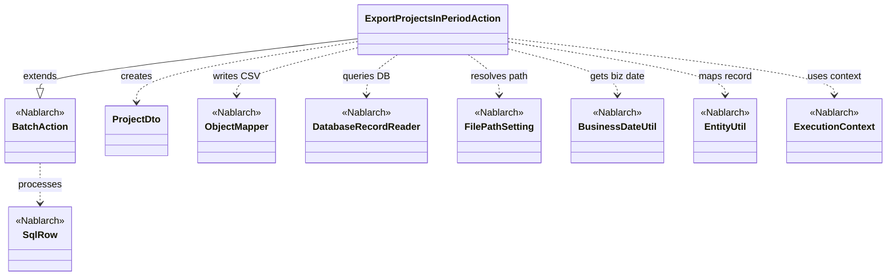
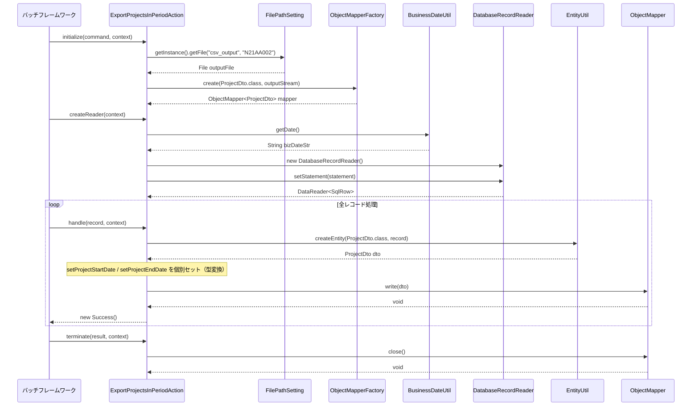

# Code Analysis: ExportProjectsInPeriodAction

**Generated**: 2026-03-06 11:37:29
**Target**: 期間内プロジェクト一覧出力バッチアクション
**Modules**: proman-batch
**Analysis Duration**: 約2分45秒

---

## Overview

`ExportProjectsInPeriodAction` は、業務日付（当日）を期間として含む在籍中のプロジェクトをデータベースから読み込み、CSVファイルに出力する都度起動バッチアクションクラスです。

`BatchAction<SqlRow>` を継承し、`initialize` / `createReader` / `handle` / `terminate` の4つのライフサイクルメソッドを実装しています。データベースから `DatabaseRecordReader` でレコードを1件ずつ読み込み、`ObjectMapper` を使用してCSV形式で出力します。`BusinessDateUtil` から業務日付を取得し、検索条件として使用します。

---

## Architecture

### Dependency Graph



**Note**: This diagram uses Mermaid `classDiagram` syntax to show class names and their relationships. Use `--|>` for inheritance (extends/implements) and `..>` for dependencies (uses/creates).

### Component Summary

| Component | Role | Type | Dependencies |
|-----------|------|------|--------------|
| ExportProjectsInPeriodAction | 期間内プロジェクトCSV出力バッチアクション | Action | DatabaseRecordReader, ObjectMapper, FilePathSetting, BusinessDateUtil, EntityUtil |
| ProjectDto | プロジェクト情報CSV出力用DTO | Bean | なし |
| BatchAction | バッチアクション基底クラス | Nablarch Framework | ExecutionContext, DataReader |
| DatabaseRecordReader | DBレコード逐次読み込みリーダー | Nablarch Framework | SqlPStatement |
| ObjectMapper | CSVデータバインドマッパー | Nablarch Framework | ProjectDto |
| FilePathSetting | ファイルパス管理ユーティリティ | Nablarch Framework | なし |
| BusinessDateUtil | 業務日付取得ユーティリティ | Nablarch Framework | なし |
| EntityUtil | SqlRowからBeanへのマッピングユーティリティ | Nablarch Framework | なし |

---

## Flow

### Processing Flow

バッチ起動時、`initialize()` が最初に1回呼ばれます。ここで `FilePathSetting` からCSV出力先ファイルパスを解決し、`ObjectMapperFactory.create()` でProjectDto用のCSVマッパーを生成します。

続いて `createReader()` が呼ばれ、`DatabaseRecordReader` を構築します。`BusinessDateUtil.getDate()` で業務日付を取得し、SQLの日付パラメータとしてセットします。SQL ID `FIND_PROJECT_IN_PERIOD` を使用して、業務日付を開始日〜終了日にまたがるプロジェクトを検索します。

DataReadHandlerがデータを1件ずつ読み込み、`handle()` を繰り返し呼び出します。`handle()` では `EntityUtil.createEntity()` でSqlRowをProjectDtoにマッピングし、日付型の変換が必要な `projectStartDate` / `projectEndDate` は明示的にsetterを呼び出します。最後に `mapper.write(dto)` でCSVに書き込みます。

全レコード処理後、`terminate()` が1回呼ばれ、`mapper.close()` でバッファをフラッシュしてリソースを解放します。

### Sequence Diagram



---

## Components

### ExportProjectsInPeriodAction

**ファイル**: [ExportProjectsInPeriodAction.java](../../.lw/nab-official/v6/nablarch-system-development-guide/Sample_Project/Source_Code/proman-project/proman-batch/src/main/java/com/nablarch/example/proman/batch/project/ExportProjectsInPeriodAction.java)

**役割**: 期間内プロジェクトをDBから読み込み、CSVファイルに出力する都度起動バッチアクション。

**キーメソッド**:

- `initialize(CommandLine, ExecutionContext)` [L44-54]: `FilePathSetting` でCSV出力先を解決し、`ObjectMapperFactory` でマッパーを初期化する。例外時は `IllegalStateException` にラップしてスロー。
- `createReader(ExecutionContext)` [L57-65]: `DatabaseRecordReader` を生成し、業務日付を条件にSQL `FIND_PROJECT_IN_PERIOD` をセットして返す。
- `handle(SqlRow, ExecutionContext)` [L68-75]: `EntityUtil` でSqlRowをProjectDtoに変換し、日付型フィールドを個別セット後、`mapper.write()` でCSV出力。
- `terminate(Result, ExecutionContext)` [L78-80]: `mapper.close()` でリソースを解放する。

**依存関係**: DatabaseRecordReader, ObjectMapper, FilePathSetting, BusinessDateUtil, EntityUtil, ProjectDto

### ProjectDto

**ファイル**: [ProjectDto.java](../../.lw/nab-official/v6/nablarch-system-development-guide/Sample_Project/Source_Code/proman-project/proman-batch/src/main/java/com/nablarch/example/proman/batch/project/ProjectDto.java)

**役割**: プロジェクト情報をCSVに出力するためのDTOクラス。`@Csv` / `@CsvFormat` アノテーションでCSVフォーマットを宣言的に定義する。

**キーポイント**:
- `@Csv(type = Csv.CsvType.CUSTOM, ...)` でプロパティ名と日本語ヘッダを指定。
- `@CsvFormat` でUTF-8、CRLF、ダブルクォートで全フィールドを囲む設定。
- `projectStartDate` / `projectEndDate` のsetterは `java.util.Date` 型を受け取り `DateUtil.formatDate()` で文字列変換する（`EntityUtil` 非対応のため）。

---

## Nablarch Framework Usage

### BatchAction

**クラス**: `nablarch.fw.action.BatchAction`

**説明**: 汎用バッチアクションの基底テンプレート。`initialize` / `createReader` / `handle` / `terminate` の4つのライフサイクルメソッドを提供する。

**使用方法**:
```java
public class SampleAction extends BatchAction<SqlRow> {
    @Override
    protected void initialize(CommandLine command, ExecutionContext context) { ... }

    @Override
    public DataReader<SqlRow> createReader(ExecutionContext context) { ... }

    @Override
    public Result handle(SqlRow record, ExecutionContext context) { ... }

    @Override
    protected void terminate(Result result, ExecutionContext context) { ... }
}
```

**重要ポイント**:
- ✅ **`terminate()`でリソース解放**: `initialize()`で開いたリソース（ObjectMapper等）は必ず`terminate()`でクローズする
- 💡 **状態保持はフィールドで**: マルチスレッドバッチではスレッドセーフに注意（シングルスレッドの都度起動では通常のフィールドでよい）
- 🎯 **都度起動バッチに最適**: `BatchAction` は都度起動・常駐バッチ共通で使用可能

**このコードでの使い方**:
- `mapper` フィールドを `initialize()` で初期化し、`terminate()` でクローズ
- `createReader()` で `DatabaseRecordReader` を返す

**詳細**: [Nablarch Batch Architecture](../../.claude/skills/nabledge-6/docs/processing-pattern/nablarch-batch/nablarch-batch-architecture.md)

---

### DatabaseRecordReader

**クラス**: `nablarch.fw.reader.DatabaseRecordReader`

**説明**: SQLStatementを使用してDBレコードを1件ずつ逐次読み込む標準データリーダ。

**使用方法**:
```java
DatabaseRecordReader reader = new DatabaseRecordReader();
SqlPStatement statement = getSqlPStatement("FIND_PROJECT_IN_PERIOD");
statement.setDate(1, bizDate);
reader.setStatement(statement);
return reader;
```

**重要ポイント**:
- ✅ **`BatchAction.getSqlPStatement()`を使う**: SQL IDで参照し、パラメータをセットしてからリーダに渡す
- 💡 **1件ずつ処理**: `DataReadHandler` が1件読み取るたびに `handle()` を呼び出す
- ⚠️ **データ終端**: 全件処理後は `NoMoreRecord` を返し、`handle()` は呼ばれなくなる

**このコードでの使い方**:
- `createReader()` でインスタンス生成し、業務日付パラメータをセットして返す

**詳細**: [Handlers Data_read_handler](../../.claude/skills/nabledge-6/docs/component/handlers/handlers-data_read_handler.md)

---

### ObjectMapper

**クラス**: `nablarch.common.databind.ObjectMapper`

**説明**: CSVやTSV、固定長データをJava Beansとして扱う機能を提供する。`ObjectMapperFactory.create()` で生成し、アノテーションに基づいてデータを書き込む。

**使用方法**:
```java
ObjectMapper<ProjectDto> mapper = ObjectMapperFactory.create(ProjectDto.class, outputStream);
mapper.write(dto);
mapper.close();
```

**重要ポイント**:
- ✅ **必ず`close()`を呼ぶ**: バッファをフラッシュしリソースを解放する（`terminate()`で実施）
- 💡 **アノテーション駆動**: `@Csv` / `@CsvFormat` でフォーマットを宣言的に定義できる
- ⚠️ **型変換の制限**: DTOのプロパティ型がDB型と異なる場合、個別setterで変換が必要（`projectStartDate`等）

**このコードでの使い方**:
- `initialize()` で `ProjectDto` 用マッパーを生成
- `handle()` で各レコードを `mapper.write(dto)` で出力
- `terminate()` で `mapper.close()` してリソース解放

**詳細**: [Libraries Data_bind](../../.claude/skills/nabledge-6/docs/component/libraries/libraries-data_bind.md)

---

### FilePathSetting

**クラス**: `nablarch.core.util.FilePathSetting`

**説明**: コンポーネント設定で定義したベースディレクトリとファイル名からFileオブジェクトを解決するユーティリティ。

**使用方法**:
```java
FilePathSetting filePathSetting = FilePathSetting.getInstance();
File output = filePathSetting.getFile("csv_output", OUTPUT_FILE_NAME);
```

**重要ポイント**:
- 💡 **設定外部化**: ファイルパスをコード内にハードコードせず、コンポーネント設定で管理できる
- 🎯 **環境差異を吸収**: 開発・本番環境でパスを切り替える際に有効

**このコードでの使い方**:
- `initialize()` で `"csv_output"` ベースディレクトリ配下の `"N21AA002"` ファイルを解決

---

### BusinessDateUtil

**クラス**: `nablarch.core.date.BusinessDateUtil`

**説明**: システムリポジトリに登録された業務日付プロバイダから業務日付を取得するユーティリティ。

**使用方法**:
```java
String bizDateStr = BusinessDateUtil.getDate();
Date bizDate = new Date(DateUtil.getDate(bizDateStr).getTime());
```

**重要ポイント**:
- ✅ **`DateUtil.getDate()`と組み合わせ**: `BusinessDateUtil.getDate()` はString (yyyyMMdd)を返すため、`DateUtil.getDate()` でjava.util.Dateに変換する
- 🎯 **障害リランに対応**: システムプロパティで業務日付を上書き可能（バッチ再実行時に過去日付を指定できる）

**このコードでの使い方**:
- `createReader()` で業務日付を取得し、`SqlPStatement` の日付パラメータとして設定

**詳細**: [Libraries Date](../../.claude/skills/nabledge-6/docs/component/libraries/libraries-date.md)

---

## References

### Source Files

- [ExportProjectsInPeriodAction.java (.lw/nab-official/v6/nablarch-system-development-guide/en/Sample_Project/Source_Code/proman-project/proman-batch/src/main/java/com/nablarch/example/proman/batch/project)](../../.lw/nab-official/v6/nablarch-system-development-guide/en/Sample_Project/Source_Code/proman-project/proman-batch/src/main/java/com/nablarch/example/proman/batch/project/ExportProjectsInPeriodAction.java) - ExportProjectsInPeriodAction
- [ExportProjectsInPeriodAction.java (.lw/nab-official/v6/nablarch-system-development-guide/Sample_Project/Source_Code/proman-project/proman-batch/src/main/java/com/nablarch/example/proman/batch/project)](../../.lw/nab-official/v6/nablarch-system-development-guide/Sample_Project/Source_Code/proman-project/proman-batch/src/main/java/com/nablarch/example/proman/batch/project/ExportProjectsInPeriodAction.java) - ExportProjectsInPeriodAction
- [ProjectDto.java (.lw/nab-official/v6/nablarch-system-development-guide/en/Sample_Project/Source_Code/proman-project/proman-batch/src/main/java/com/nablarch/example/proman/batch/project)](../../.lw/nab-official/v6/nablarch-system-development-guide/en/Sample_Project/Source_Code/proman-project/proman-batch/src/main/java/com/nablarch/example/proman/batch/project/ProjectDto.java) - ProjectDto
- [ProjectDto.java (.lw/nab-official/v6/nablarch-system-development-guide/Sample_Project/Source_Code/proman-project/proman-batch/src/main/java/com/nablarch/example/proman/batch/project)](../../.lw/nab-official/v6/nablarch-system-development-guide/Sample_Project/Source_Code/proman-project/proman-batch/src/main/java/com/nablarch/example/proman/batch/project/ProjectDto.java) - ProjectDto

### Knowledge Base (Nabledge-6)

- [Nablarch Batch Nablarch_batch_pessimistic_lock](../../.claude/skills/nabledge-6/docs/processing-pattern/nablarch-batch/nablarch-batch-nablarch_batch_pessimistic_lock.md)
- [Nablarch Batch Architecture](../../.claude/skills/nabledge-6/docs/processing-pattern/nablarch-batch/nablarch-batch-architecture.md)
- [Handlers Data_read_handler](../../.claude/skills/nabledge-6/docs/component/handlers/handlers-data_read_handler.md)
- [Libraries Date](../../.claude/skills/nabledge-6/docs/component/libraries/libraries-date.md)
- [Libraries Data_bind](../../.claude/skills/nabledge-6/docs/component/libraries/libraries-data_bind.md)

### Official Documentation


- [Architecture](https://nablarch.github.io/docs/LATEST/doc/application_framework/application_framework/batch/nablarch_batch/architecture.html)
- [AsyncMessageSendAction](https://nablarch.github.io/docs/LATEST/javadoc/nablarch/fw/messaging/action/AsyncMessageSendAction.html)
- [BasicBusinessDateProvider](https://nablarch.github.io/docs/LATEST/javadoc/nablarch/core/date/BasicBusinessDateProvider.html)
- [BasicSystemTimeProvider](https://nablarch.github.io/docs/LATEST/javadoc/nablarch/core/date/BasicSystemTimeProvider.html)
- [BatchAction](https://nablarch.github.io/docs/LATEST/javadoc/nablarch/fw/action/BatchAction.html)
- [BeanUtil](https://nablarch.github.io/docs/LATEST/javadoc/nablarch/core/beans/BeanUtil.html)
- [BusinessDateProvider](https://nablarch.github.io/docs/LATEST/javadoc/nablarch/core/date/BusinessDateProvider.html)
- [BusinessDateUtil](https://nablarch.github.io/docs/LATEST/javadoc/nablarch/core/date/BusinessDateUtil.html)
- [CsvDataBindConfig](https://nablarch.github.io/docs/LATEST/javadoc/nablarch/common/databind/csv/CsvDataBindConfig.html)
- [CsvFormat](https://nablarch.github.io/docs/LATEST/javadoc/nablarch/common/databind/csv/CsvFormat.html)
- [Csv](https://nablarch.github.io/docs/LATEST/javadoc/nablarch/common/databind/csv/Csv.html)
- [Data Bind](https://nablarch.github.io/docs/LATEST/doc/application_framework/application_framework/libraries/data_io/data_bind.html)
- [Data Read Handler](https://nablarch.github.io/docs/LATEST/doc/application_framework/application_framework/handlers/standalone/data_read_handler.html)
- [DataBindConfig](https://nablarch.github.io/docs/LATEST/javadoc/nablarch/common/databind/DataBindConfig.html)
- [DataReadHandler](https://nablarch.github.io/docs/LATEST/javadoc/nablarch/fw/handler/DataReadHandler.html)
- [DataReader.NoMoreRecord](https://nablarch.github.io/docs/LATEST/javadoc/nablarch/fw/DataReader.NoMoreRecord.html)
- [DataReader](https://nablarch.github.io/docs/LATEST/javadoc/nablarch/fw/DataReader.html)
- [DatabaseRecordReader](https://nablarch.github.io/docs/LATEST/javadoc/nablarch/fw/reader/DatabaseRecordReader.html)
- [Date](https://nablarch.github.io/docs/LATEST/doc/application_framework/application_framework/libraries/date.html)
- [DispatchHandler](https://nablarch.github.io/docs/LATEST/javadoc/nablarch/fw/handler/DispatchHandler.html)
- [ExecutionContext](https://nablarch.github.io/docs/LATEST/javadoc/nablarch/fw/ExecutionContext.html)
- [Field](https://nablarch.github.io/docs/LATEST/javadoc/nablarch/common/databind/fixedlength/Field.html)
- [FileBatchAction](https://nablarch.github.io/docs/LATEST/javadoc/nablarch/fw/action/FileBatchAction.html)
- [FileDataReader](https://nablarch.github.io/docs/LATEST/javadoc/nablarch/fw/reader/FileDataReader.html)
- [FileResponse](https://nablarch.github.io/docs/LATEST/javadoc/nablarch/common/web/download/FileResponse.html)
- [FixedLengthDataBindConfigBuilder](https://nablarch.github.io/docs/LATEST/javadoc/nablarch/common/databind/fixedlength/FixedLengthDataBindConfigBuilder.html)
- [FixedLengthDataBindConfig](https://nablarch.github.io/docs/LATEST/javadoc/nablarch/common/databind/fixedlength/FixedLengthDataBindConfig.html)
- [FixedLength](https://nablarch.github.io/docs/LATEST/javadoc/nablarch/common/databind/fixedlength/FixedLength.html)
- [LineNumber](https://nablarch.github.io/docs/LATEST/javadoc/nablarch/common/databind/LineNumber.html)
- [MultiLayoutConfig.RecordIdentifier](https://nablarch.github.io/docs/LATEST/javadoc/nablarch/common/databind/fixedlength/MultiLayoutConfig.RecordIdentifier.html)
- [MultiLayout](https://nablarch.github.io/docs/LATEST/javadoc/nablarch/common/databind/fixedlength/MultiLayout.html)
- [Nablarch Batch Pessimistic Lock](https://nablarch.github.io/docs/LATEST/doc/application_framework/application_framework/batch/nablarch_batch/feature_details/nablarch_batch_pessimistic_lock.html)
- [NoInputDataBatchAction](https://nablarch.github.io/docs/LATEST/javadoc/nablarch/fw/action/NoInputDataBatchAction.html)
- [ObjectMapperFactory](https://nablarch.github.io/docs/LATEST/javadoc/nablarch/common/databind/ObjectMapperFactory.html)
- [ObjectMapper](https://nablarch.github.io/docs/LATEST/javadoc/nablarch/common/databind/ObjectMapper.html)
- [Package-summary](https://nablarch.github.io/docs/LATEST/javadoc/nablarch/common/databind/fixedlength/converter/package-summary.html)
- [PartInfo](https://nablarch.github.io/docs/LATEST/javadoc/nablarch/fw/web/upload/PartInfo.html)
- [ProcessStopHandler.ProcessStop](https://nablarch.github.io/docs/LATEST/javadoc/nablarch/fw/handler/ProcessStopHandler.ProcessStop.html)
- [Result](https://nablarch.github.io/docs/LATEST/javadoc/nablarch/fw/Result.html)
- [ResumeDataReader](https://nablarch.github.io/docs/LATEST/javadoc/nablarch/fw/reader/ResumeDataReader.html)
- [StatusCodeConvertHandler](https://nablarch.github.io/docs/LATEST/javadoc/nablarch/fw/handler/StatusCodeConvertHandler.html)
- [SystemTimeProvider](https://nablarch.github.io/docs/LATEST/javadoc/nablarch/core/date/SystemTimeProvider.html)
- [SystemTimeUtil](https://nablarch.github.io/docs/LATEST/javadoc/nablarch/core/date/SystemTimeUtil.html)
- [ValidatableFileDataReader](https://nablarch.github.io/docs/LATEST/javadoc/nablarch/fw/reader/ValidatableFileDataReader.html)

---

**Note**: This documentation was generated by the code-analysis workflow of the nabledge-6 skill.
