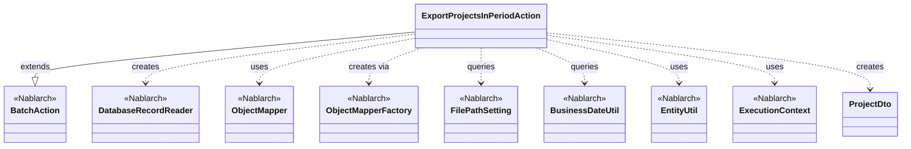
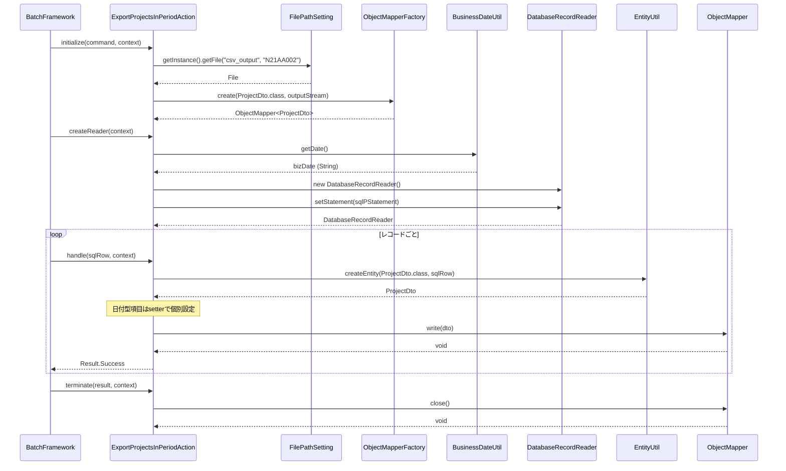

# Code Analysis: ExportProjectsInPeriodAction

**Generated**: 2026-03-06 11:48:16
**Target**: 期間内プロジェクト一覧出力バッチアクション
**Modules**: proman-batch
**Analysis Duration**: 約2分40秒

---

## Overview

`ExportProjectsInPeriodAction`は、指定された業務日付を基準に期間内のプロジェクト一覧をCSVファイルへ出力する都度起動バッチアクションクラスである。`BatchAction<SqlRow>`を継承し、データベースからSQLで対象レコードを取得し、`ObjectMapper`を介してCSVに書き込む。

主要な処理は以下の4メソッドに分担される:
- `initialize()`: FilePathSettingでCSV出力先を取得し、ObjectMapperを初期化する
- `createReader()`: DatabaseRecordReaderでDBからSqlRowを順次読み込む
- `handle()`: 各レコードをProjectDtoに変換してCSVに書き込む
- `terminate()`: ObjectMapperをクローズしてリソースを解放する

---

## Architecture

### Dependency Graph



**Note**: This diagram uses Mermaid `classDiagram` syntax to show class names and their relationships. Use `--|>` for inheritance (extends/implements) and `..>` for dependencies (uses/creates).

### Component Summary

| Component | Role | Type | Dependencies |
|-----------|------|------|--------------|
| ExportProjectsInPeriodAction | CSV出力バッチアクション | Action | DatabaseRecordReader, ObjectMapper, FilePathSetting, BusinessDateUtil, EntityUtil |
| ProjectDto | プロジェクト情報CSV出力用DTO | Bean | なし |
| BatchAction | バッチアクション基底クラス | Nablarch | なし |
| DatabaseRecordReader | DBレコード順次読み込み | Nablarch | なし |
| ObjectMapper | CSV書き込みマッパー | Nablarch | なし |
| FilePathSetting | ファイルパス管理 | Nablarch | なし |
| BusinessDateUtil | 業務日付取得ユーティリティ | Nablarch | なし |
| EntityUtil | SqlRow→DTO変換ユーティリティ | Nablarch | なし |

---

## Flow

### Processing Flow

バッチフレームワークはハンドラチェーンを通じてバッチアクションを実行する。`DataReadHandler`が`createReader()`で返却された`DatabaseRecordReader`からSqlRowを1件ずつ取得し、`handle()`に渡す。

1. **初期化フェーズ** (`initialize()`): `FilePathSetting`からcsv_output論理名で出力先ファイルパスを取得し、`ObjectMapperFactory.create()`でProjectDto用のObjectMapperを生成する
2. **データ読み込みフェーズ** (`createReader()`): `DatabaseRecordReader`にSQLステートメント`FIND_PROJECT_IN_PERIOD`をセットし、`BusinessDateUtil`で取得した業務日付を検索条件として設定する
3. **処理フェーズ** (`handle()`): 取得した`SqlRow`を`EntityUtil.createEntity()`でProjectDtoに変換し、日付型項目を個別にsetterで設定後、`mapper.write(dto)`でCSVに書き込む
4. **終了フェーズ** (`terminate()`): `mapper.close()`を呼び出してバッファをフラッシュし、OutputStreamを閉じる

### Sequence Diagram



---

## Components

### ExportProjectsInPeriodAction

**ファイル**: [ExportProjectsInPeriodAction.java](../../.lw/nab-official/v6/nablarch-system-development-guide/Sample_Project/Source_Code/proman-project/proman-batch/src/main/java/com/nablarch/example/proman/batch/project/ExportProjectsInPeriodAction.java)

**役割**: 期間内プロジェクト一覧をDBから取得し、CSVファイルへ出力する都度起動バッチアクション

**主要メソッド**:
- `initialize(CommandLine, ExecutionContext)` [L44-54]: FilePathSettingでCSV出力先を取得し、ObjectMapperを生成・フィールドに保持する
- `createReader(ExecutionContext)` [L57-65]: DatabaseRecordReaderにSQLと業務日付パラメータをセットして返却する
- `handle(SqlRow, ExecutionContext)` [L68-75]: SqlRowをProjectDtoに変換してCSVに書き込み、Result.Successを返す
- `terminate(Result, ExecutionContext)` [L78-80]: mapper.close()でリソースを解放する

**依存関係**: `BatchAction<SqlRow>`（Nablarch）, `DatabaseRecordReader`（Nablarch）, `ObjectMapper<ProjectDto>`（Nablarch）, `FilePathSetting`（Nablarch）, `BusinessDateUtil`（Nablarch）, `EntityUtil`（Nablarch）, `ProjectDto`（プロジェクト）

**実装ポイント**:
- `EntityUtil.createEntity()`でほとんどのフィールドを自動マッピングするが、日付型(`java.sql.Date`→`String`)は型変換が必要なため、`setProjectStartDate()` / `setProjectEndDate()`を明示的に呼ぶ
- `mapper`はフィールドとして保持し、`initialize()`→`handle()`→`terminate()`のライフサイクルを通して使用する

### ProjectDto

**ファイル**: [ProjectDto.java](../../.lw/nab-official/v6/nablarch-system-development-guide/Sample_Project/Source_Code/proman-project/proman-batch/src/main/java/com/nablarch/example/proman/batch/project/ProjectDto.java)

**役割**: CSVファイルへの出力対象データを保持するDTO。`@Csv`と`@CsvFormat`でフォーマットを宣言的に定義する

**主要フィールド**: projectId, projectName, projectType, projectClass, projectStartDate(String), projectEndDate(String), organizationId, clientId, projectManager, projectLeader, note, sales, versionNo

**実装ポイント**: `@CsvFormat(type = Csv.CsvType.CUSTOM)`により独自フォーマット（区切り文字、文字コード、クォートモード）を指定している

---

## Nablarch Framework Usage

### BatchAction

**クラス**: `nablarch.fw.action.BatchAction`

**説明**: 汎用バッチアクションの基底クラス。`createReader()`・`handle()`・`initialize()`・`terminate()`のライフサイクルメソッドを提供する

**使用方法**:
```java
public class ExportProjectsInPeriodAction extends BatchAction<SqlRow> {
    @Override
    protected void initialize(CommandLine command, ExecutionContext context) { ... }

    @Override
    public DataReader<SqlRow> createReader(ExecutionContext context) { ... }

    @Override
    public Result handle(SqlRow record, ExecutionContext context) { ... }

    @Override
    protected void terminate(Result result, ExecutionContext context) { ... }
}
```

**重要ポイント**:
- 💡 **ライフサイクル管理**: initialize→createReader→handle（繰り返し）→terminateの順で実行される
- ⚠️ **FileBatchActionは使用不可**: `@Csv`アノテーションによるデータバインドを使用する場合は`BatchAction`を直接継承すること（`FileBatchAction`は`data_format`専用）
- ✅ **terminate()でリソース解放**: ObjectMapperなどのI/Oリソースは必ずterminateで閉じること

**このコードでの使い方**:
- `BatchAction<SqlRow>`を継承し、DB to CSV のDB to FILEパターンを実装

**詳細**: [Nablarch Batch Architecture](../../.claude/skills/nabledge-6/docs/processing-pattern/nablarch-batch/nablarch-batch-architecture.md)

---

### DatabaseRecordReader

**クラス**: `nablarch.fw.reader.DatabaseRecordReader`

**説明**: データベースからレコードを順次読み込む`DataReader`実装クラス。`DataReadHandler`が`createReader()`で返却されたReaderを使用して1件ずつ読み込む

**使用方法**:
```java
DatabaseRecordReader reader = new DatabaseRecordReader();
SqlPStatement statement = getSqlPStatement("FIND_PROJECT_IN_PERIOD");
statement.setDate(1, bizDate);
reader.setStatement(statement);
return reader;
```

**重要ポイント**:
- ✅ **getSqlPStatement()でSQL取得**: `BatchAction`の継承メソッドでSQLIDからSQLステートメントを取得する
- 💡 **DataReadHandlerが自動管理**: DataReadHandlerがcreateReader()を呼び出し、レコード終端（`NoMoreRecord`）まで繰り返しhandle()を呼ぶ

**このコードでの使い方**:
- `createReader()`でDatabaseRecordReaderを生成し、業務日付を条件にしたSQL（`FIND_PROJECT_IN_PERIOD`）をセットして返却

**詳細**: [Handlers Data_read_handler](../../.claude/skills/nabledge-6/docs/component/handlers/handlers-data_read_handler.md)

---

### ObjectMapper / ObjectMapperFactory

**クラス**: `nablarch.common.databind.ObjectMapper`, `nablarch.common.databind.ObjectMapperFactory`

**説明**: Java BeansクラスのアノテーションをもとにCSV/固定長ファイルへの書き込みを行う機能

**使用方法**:
```java
// initialize()での生成
FileOutputStream outputStream = new FileOutputStream(output);
this.mapper = ObjectMapperFactory.create(ProjectDto.class, outputStream);

// handle()での書き込み
mapper.write(dto);

// terminate()でのクローズ
mapper.close();
```

**重要ポイント**:
- ✅ **必ずclose()を呼ぶ**: バッファをフラッシュし、OutputStreamを閉じる（terminate()で実施）
- 💡 **アノテーション駆動**: `ProjectDto`の`@Csv`・`@CsvFormat`でフォーマットを宣言的に定義できる
- ⚠️ **型変換の制限**: `EntityUtil`で自動マッピングできない型（`java.sql.Date`→`String`）は個別のsetterで設定が必要

**このコードでの使い方**:
- `initialize()`でProjectDto用のObjectMapperを生成してフィールドに保持
- `handle()`でmapper.write(dto)により各レコードをCSVに書き込む
- `terminate()`でmapper.close()によりリソース解放

**詳細**: [Libraries Data_bind](../../.claude/skills/nabledge-6/docs/component/libraries/libraries-data_bind.md)

---

### FilePathSetting

**クラス**: `nablarch.core.util.FilePathSetting`

**説明**: 論理名でファイルパスを管理するコンポーネント。コンポーネント設定ファイルでベースディレクトリと拡張子を定義し、`getInstance()`で取得できる

**使用方法**:
```java
FilePathSetting filePathSetting = FilePathSetting.getInstance();
File output = filePathSetting.getFile("csv_output", "N21AA002");
```

**重要ポイント**:
- 💡 **論理名でパス管理**: ハードコードを避け、環境ごとのパス差異を吸収できる
- ✅ **コンポーネント名はfilePathSetting**: コンポーネント定義ファイルでの名前は`filePathSetting`と指定すること

**このコードでの使い方**:
- `initialize()`で論理名`csv_output`を使用してCSV出力先ファイル（`N21AA002.csv`）のパスを取得

**詳細**: [Libraries File_path_management](../../.claude/skills/nabledge-6/docs/component/libraries/libraries-file_path_management.md)

---

### BusinessDateUtil

**クラス**: `nablarch.core.date.BusinessDateUtil`

**説明**: データベースで管理された業務日付を取得するユーティリティクラス。バッチ処理で業務日付を基準とした検索条件に使用する

**使用方法**:
```java
Date bizDate = new Date(DateUtil.getDate(BusinessDateUtil.getDate()).getTime());
statement.setDate(1, bizDate);
statement.setDate(2, bizDate);
```

**重要ポイント**:
- 💡 **業務日付はDBで管理**: システム日付ではなく業務上の日付（DBのBUSINESS_DATEテーブル）を使用する
- ⚠️ **型変換が必要**: `BusinessDateUtil.getDate()`はString（yyyyMMdd）を返すため、`DateUtil.getDate()`で`java.util.Date`に変換後、`java.sql.Date`にキャストする

**このコードでの使い方**:
- `createReader()`で業務日付を取得し、プロジェクト期間の検索条件（開始・終了の2パラメータ）として設定

**詳細**: [Libraries Date](../../.claude/skills/nabledge-6/docs/component/libraries/libraries-date.md)

---

## References

### Source Files

- [ExportProjectsInPeriodAction.java (.lw/nab-official/v6/nablarch-system-development-guide/en/Sample_Project/Source_Code/proman-project/proman-batch/src/main/java/com/nablarch/example/proman/batch/project)](../../.lw/nab-official/v6/nablarch-system-development-guide/en/Sample_Project/Source_Code/proman-project/proman-batch/src/main/java/com/nablarch/example/proman/batch/project/ExportProjectsInPeriodAction.java) - ExportProjectsInPeriodAction
- [ExportProjectsInPeriodAction.java (.lw/nab-official/v6/nablarch-system-development-guide/Sample_Project/Source_Code/proman-project/proman-batch/src/main/java/com/nablarch/example/proman/batch/project)](../../.lw/nab-official/v6/nablarch-system-development-guide/Sample_Project/Source_Code/proman-project/proman-batch/src/main/java/com/nablarch/example/proman/batch/project/ExportProjectsInPeriodAction.java) - ExportProjectsInPeriodAction
- [ProjectDto.java (.lw/nab-official/v6/nablarch-system-development-guide/en/Sample_Project/Source_Code/proman-project/proman-batch/src/main/java/com/nablarch/example/proman/batch/project)](../../.lw/nab-official/v6/nablarch-system-development-guide/en/Sample_Project/Source_Code/proman-project/proman-batch/src/main/java/com/nablarch/example/proman/batch/project/ProjectDto.java) - ProjectDto
- [ProjectDto.java (.lw/nab-official/v6/nablarch-system-development-guide/Sample_Project/Source_Code/proman-project/proman-batch/src/main/java/com/nablarch/example/proman/batch/project)](../../.lw/nab-official/v6/nablarch-system-development-guide/Sample_Project/Source_Code/proman-project/proman-batch/src/main/java/com/nablarch/example/proman/batch/project/ProjectDto.java) - ProjectDto

### Knowledge Base (Nabledge-6)

- [Nablarch Batch Architecture](../../.claude/skills/nabledge-6/docs/processing-pattern/nablarch-batch/nablarch-batch-architecture.md)
- [Handlers Data_read_handler](../../.claude/skills/nabledge-6/docs/component/handlers/handlers-data_read_handler.md)
- [Libraries Data_bind](../../.claude/skills/nabledge-6/docs/component/libraries/libraries-data_bind.md)
- [Libraries File_path_management](../../.claude/skills/nabledge-6/docs/component/libraries/libraries-file_path_management.md)
- [Libraries Date](../../.claude/skills/nabledge-6/docs/component/libraries/libraries-date.md)

### Official Documentation


- [Architecture](https://nablarch.github.io/docs/LATEST/doc/application_framework/application_framework/batch/nablarch_batch/architecture.html)
- [AsyncMessageSendAction](https://nablarch.github.io/docs/LATEST/javadoc/nablarch/fw/messaging/action/AsyncMessageSendAction.html)
- [BasicBusinessDateProvider](https://nablarch.github.io/docs/LATEST/javadoc/nablarch/core/date/BasicBusinessDateProvider.html)
- [BasicSystemTimeProvider](https://nablarch.github.io/docs/LATEST/javadoc/nablarch/core/date/BasicSystemTimeProvider.html)
- [BatchAction](https://nablarch.github.io/docs/LATEST/javadoc/nablarch/fw/action/BatchAction.html)
- [BeanUtil](https://nablarch.github.io/docs/LATEST/javadoc/nablarch/core/beans/BeanUtil.html)
- [BusinessDateProvider](https://nablarch.github.io/docs/LATEST/javadoc/nablarch/core/date/BusinessDateProvider.html)
- [BusinessDateUtil](https://nablarch.github.io/docs/LATEST/javadoc/nablarch/core/date/BusinessDateUtil.html)
- [CsvDataBindConfig](https://nablarch.github.io/docs/LATEST/javadoc/nablarch/common/databind/csv/CsvDataBindConfig.html)
- [CsvFormat](https://nablarch.github.io/docs/LATEST/javadoc/nablarch/common/databind/csv/CsvFormat.html)
- [Csv](https://nablarch.github.io/docs/LATEST/javadoc/nablarch/common/databind/csv/Csv.html)
- [Data Bind](https://nablarch.github.io/docs/LATEST/doc/application_framework/application_framework/libraries/data_io/data_bind.html)
- [Data Read Handler](https://nablarch.github.io/docs/LATEST/doc/application_framework/application_framework/handlers/standalone/data_read_handler.html)
- [DataBindConfig](https://nablarch.github.io/docs/LATEST/javadoc/nablarch/common/databind/DataBindConfig.html)
- [DataReadHandler](https://nablarch.github.io/docs/LATEST/javadoc/nablarch/fw/handler/DataReadHandler.html)
- [DataReader.NoMoreRecord](https://nablarch.github.io/docs/LATEST/javadoc/nablarch/fw/DataReader.NoMoreRecord.html)
- [DataReader](https://nablarch.github.io/docs/LATEST/javadoc/nablarch/fw/DataReader.html)
- [DatabaseRecordReader](https://nablarch.github.io/docs/LATEST/javadoc/nablarch/fw/reader/DatabaseRecordReader.html)
- [Date](https://nablarch.github.io/docs/LATEST/doc/application_framework/application_framework/libraries/date.html)
- [DispatchHandler](https://nablarch.github.io/docs/LATEST/javadoc/nablarch/fw/handler/DispatchHandler.html)
- [ExecutionContext](https://nablarch.github.io/docs/LATEST/javadoc/nablarch/fw/ExecutionContext.html)
- [Field](https://nablarch.github.io/docs/LATEST/javadoc/nablarch/common/databind/fixedlength/Field.html)
- [File Path Management](https://nablarch.github.io/docs/LATEST/doc/application_framework/application_framework/libraries/file_path_management.html)
- [FileBatchAction](https://nablarch.github.io/docs/LATEST/javadoc/nablarch/fw/action/FileBatchAction.html)
- [FileDataReader](https://nablarch.github.io/docs/LATEST/javadoc/nablarch/fw/reader/FileDataReader.html)
- [FilePathSetting](https://nablarch.github.io/docs/LATEST/javadoc/nablarch/core/util/FilePathSetting.html)
- [FileResponse](https://nablarch.github.io/docs/LATEST/javadoc/nablarch/common/web/download/FileResponse.html)
- [FixedLengthDataBindConfigBuilder](https://nablarch.github.io/docs/LATEST/javadoc/nablarch/common/databind/fixedlength/FixedLengthDataBindConfigBuilder.html)
- [FixedLengthDataBindConfig](https://nablarch.github.io/docs/LATEST/javadoc/nablarch/common/databind/fixedlength/FixedLengthDataBindConfig.html)
- [FixedLength](https://nablarch.github.io/docs/LATEST/javadoc/nablarch/common/databind/fixedlength/FixedLength.html)
- [LineNumber](https://nablarch.github.io/docs/LATEST/javadoc/nablarch/common/databind/LineNumber.html)
- [MultiLayoutConfig.RecordIdentifier](https://nablarch.github.io/docs/LATEST/javadoc/nablarch/common/databind/fixedlength/MultiLayoutConfig.RecordIdentifier.html)
- [MultiLayout](https://nablarch.github.io/docs/LATEST/javadoc/nablarch/common/databind/fixedlength/MultiLayout.html)
- [NoInputDataBatchAction](https://nablarch.github.io/docs/LATEST/javadoc/nablarch/fw/action/NoInputDataBatchAction.html)
- [ObjectMapperFactory](https://nablarch.github.io/docs/LATEST/javadoc/nablarch/common/databind/ObjectMapperFactory.html)
- [ObjectMapper](https://nablarch.github.io/docs/LATEST/javadoc/nablarch/common/databind/ObjectMapper.html)
- [Package-summary](https://nablarch.github.io/docs/LATEST/javadoc/nablarch/common/databind/fixedlength/converter/package-summary.html)
- [PartInfo](https://nablarch.github.io/docs/LATEST/javadoc/nablarch/fw/web/upload/PartInfo.html)
- [ProcessStopHandler.ProcessStop](https://nablarch.github.io/docs/LATEST/javadoc/nablarch/fw/handler/ProcessStopHandler.ProcessStop.html)
- [Result](https://nablarch.github.io/docs/LATEST/javadoc/nablarch/fw/Result.html)
- [ResumeDataReader](https://nablarch.github.io/docs/LATEST/javadoc/nablarch/fw/reader/ResumeDataReader.html)
- [StatusCodeConvertHandler](https://nablarch.github.io/docs/LATEST/javadoc/nablarch/fw/handler/StatusCodeConvertHandler.html)
- [SystemTimeProvider](https://nablarch.github.io/docs/LATEST/javadoc/nablarch/core/date/SystemTimeProvider.html)
- [SystemTimeUtil](https://nablarch.github.io/docs/LATEST/javadoc/nablarch/core/date/SystemTimeUtil.html)
- [ValidatableFileDataReader](https://nablarch.github.io/docs/LATEST/javadoc/nablarch/fw/reader/ValidatableFileDataReader.html)

---

**Note**: This documentation was generated by the code-analysis workflow of the nabledge-6 skill.
