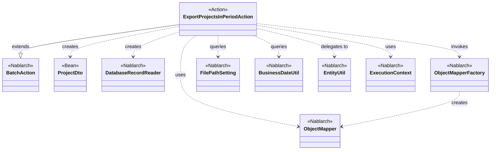
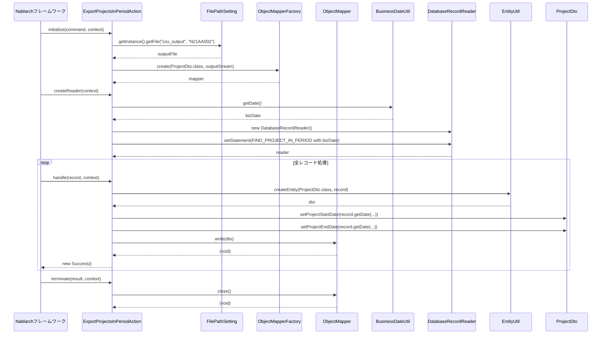

# Code Analysis: ExportProjectsInPeriodAction

**Generated**: 2026-03-06 11:54:02
**Target**: 期間内プロジェクト一覧出力バッチアクション
**Modules**: proman-batch
**Analysis Duration**: 約2分30秒

---

## Overview

`ExportProjectsInPeriodAction` は、Nablarchバッチフレームワークを使用して期間内のプロジェクト情報をCSVファイルに出力する都度起動バッチアクションクラスである。

**主要な責務**:
- `BusinessDateUtil` で業務日付を取得し、その日付に該当する期間内プロジェクトをDBから検索
- `DatabaseRecordReader` を使用してSQLで取得したデータを1件ずつ読み込む
- `ObjectMapper` で各レコードをCSV形式で出力ファイルに書き込む
- ライフサイクルメソッド（`initialize` / `createReader` / `handle` / `terminate`）で処理を管理

**処理パターン**: DB to FILE（データベースからCSVファイルへの出力）

---

## Architecture

### Dependency Graph



**Note**: This diagram uses Mermaid `classDiagram` syntax to show class names and their relationships. Use `--|>` for inheritance (extends/implements) and `..>` for dependencies (uses/creates).

### Component Summary

| Component | Role | Type | Dependencies |
|-----------|------|------|--------------|
| ExportProjectsInPeriodAction | 期間内プロジェクトCSV出力バッチアクション | Action | DatabaseRecordReader, ObjectMapper, FilePathSetting, BusinessDateUtil, EntityUtil |
| ProjectDto | プロジェクト情報CSVマッピングBean | Bean | なし |
| DatabaseRecordReader | DB検索結果を1件ずつ読み込むデータリーダ | Nablarch | SqlPStatement |
| ObjectMapper | Java BeanをCSV形式で出力するマッパー | Nablarch | ProjectDto |
| FilePathSetting | 出力ファイルのパス管理 | Nablarch | なし |
| BusinessDateUtil | 業務日付の取得 | Nablarch | なし |
| EntityUtil | SqlRowからProjectDtoへの変換 | Nablarch | ProjectDto, SqlRow |

---

## Flow

### Processing Flow

バッチフレームワークのライフサイクルに従い4段階で処理が実行される：

1. **initialize**: `FilePathSetting` からCSV出力先ファイルパスを取得し、`ObjectMapperFactory` で `ObjectMapper` を生成する。
2. **createReader**: `BusinessDateUtil` で業務日付を取得し、`FIND_PROJECT_IN_PERIOD` SQLを実行する `DatabaseRecordReader` を生成・返却する。
3. **handle**: `DataReadHandler` から1レコードずつ `SqlRow` が渡される。`EntityUtil.createEntity()` で `ProjectDto` に変換後、日付型フィールドを個別にセットし、`mapper.write(dto)` でCSVに書き込む。
4. **terminate**: `mapper.close()` を呼び出してバッファをフラッシュし、ファイルストリームを解放する。

### Sequence Diagram



---

## Components

### ExportProjectsInPeriodAction

**ファイル**: [ExportProjectsInPeriodAction.java](../../.lw/nab-official/v6/nablarch-system-development-guide/Sample_Project/Source_Code/proman-project/proman-batch/src/main/java/com/nablarch/example/proman/batch/project/ExportProjectsInPeriodAction.java)

**役割**: 期間内プロジェクト一覧をCSVファイルに出力する都度起動バッチアクション。`BatchAction<SqlRow>` を継承し、4つのライフサイクルメソッドを実装する。

**キーメソッド**:
- `initialize(CommandLine, ExecutionContext)` (L44-54): 出力ファイルを開き `ObjectMapper` を生成する初期化処理
- `createReader(ExecutionContext)` (L57-65): 業務日付でフィルタリングするDBレコードリーダーを生成
- `handle(SqlRow, ExecutionContext)` (L68-75): 1レコードをDTOに変換してCSVに書き込む
- `terminate(Result, ExecutionContext)` (L78-80): `mapper.close()` でリソース解放

**依存関係**: `DatabaseRecordReader`, `ObjectMapper`, `FilePathSetting`, `BusinessDateUtil`, `EntityUtil`, `ProjectDto`

**実装ポイント**:
- `EntityUtil.createEntity()` で SqlRow → ProjectDto の自動変換が行われるが、`Date`型フィールド（`projectStartDate`, `projectEndDate`）は型の不一致のため個別に `setDate()` を呼び出す
- `terminate()` で必ず `mapper.close()` を実行することでCSVデータのフラッシュとリソース解放を保証する

---

### ProjectDto

**ファイル**: [ProjectDto.java](../../.lw/nab-official/v6/nablarch-system-development-guide/Sample_Project/Source_Code/proman-project/proman-batch/src/main/java/com/nablarch/example/proman/batch/project/ProjectDto.java)

**役割**: プロジェクト情報をCSVに出力するためのデータ転送オブジェクト。`@Csv` と `@CsvFormat` アノテーションでCSVフォーマットを宣言的に定義する。

**依存関係**: なし（純粋なデータクラス）

**実装ポイント**:
- `@Csv(type = Csv.CsvType.CUSTOM)` でカスタムCSVフォーマットを定義
- `@CsvFormat` でフィールド区切り文字（`,`）、行区切り文字（`\r\n`）、文字コード（UTF-8）を指定
- 日付フィールドは `String` 型で保持し、`setProjectStartDate(Date)` で `yyyy/MM/dd` 形式にフォーマットする

---

## Nablarch Framework Usage

### BatchAction

**クラス**: `nablarch.fw.action.BatchAction`

**説明**: Nablarchバッチ処理の汎用アクションテンプレート。`DataReader` から取得したデータを1件ずつ処理するライフサイクルを提供する。

**使用方法**:
```java
public class MyBatchAction extends BatchAction<SqlRow> {
    @Override
    public DataReader<SqlRow> createReader(ExecutionContext context) {
        return new DatabaseRecordReader();
    }

    @Override
    public Result handle(SqlRow record, ExecutionContext context) {
        // 1レコードの処理
        return new Success();
    }
}
```

**重要ポイント**:
- ✅ **`createReader` でリーダーを返す**: フレームワークの `DataReadHandler` がこのリーダーを使用してデータを読み込む
- ✅ **`terminate` でリソース解放**: `ObjectMapper` など外部リソースはここでクローズする
- 💡 **標準クラスを使い分ける**: ファイル入力なら `FileBatchAction`、DB/メッセージ入力なら `BatchAction` を使用する
- 🎯 **使用場面**: DBからデータを読み込んでファイルに出力する「DB to FILE」パターンに最適

**このコードでの使い方**:
- `ExportProjectsInPeriodAction` が `BatchAction<SqlRow>` を継承
- `initialize` / `createReader` / `handle` / `terminate` の4メソッドを実装

**詳細**: [Nablarch Batch Architecture](../../.claude/skills/nabledge-6/docs/processing-pattern/nablarch-batch/nablarch-batch-architecture.md)

---

### DatabaseRecordReader

**クラス**: `nablarch.fw.reader.DatabaseRecordReader`

**説明**: `DataReadHandler` と連携してDBの検索結果を1件ずつ読み込む標準データリーダー。

**使用方法**:
```java
@Override
public DataReader<SqlRow> createReader(ExecutionContext context) {
    DatabaseRecordReader reader = new DatabaseRecordReader();
    SqlPStatement statement = getSqlPStatement("SQL_ID");
    statement.setString(1, paramValue);
    reader.setStatement(statement);
    return reader;
}
```

**重要ポイント**:
- ✅ **`setStatement` で SQL を設定**: バインドパラメータは設定してから `setStatement` を呼ぶ
- 💡 **フレームワークが自動読み込み**: `DataReadHandler` が `reader.read()` を呼び出すため、アクション側での読み込みコードは不要
- 🎯 **使用場面**: DB検索結果を1件ずつ処理するバッチに適している

**このコードでの使い方**:
- `createReader` で `FIND_PROJECT_IN_PERIOD` SQL を業務日付でバインドし、`DatabaseRecordReader` に設定して返却

**詳細**: [Handlers Data_read_handler](../../.claude/skills/nabledge-6/docs/component/handlers/handlers-data_read_handler.md)

---

### ObjectMapper / ObjectMapperFactory

**クラス**: `nablarch.common.databind.ObjectMapper`, `nablarch.common.databind.ObjectMapperFactory`

**説明**: Java BeanをCSV/TSV/固定長ファイル等に書き込む機能を提供する。フォーマットはBeanのアノテーションで宣言的に定義する。

**使用方法**:
```java
ObjectMapper<ProjectDto> mapper = ObjectMapperFactory.create(ProjectDto.class, outputStream);
mapper.write(dto);
mapper.close();
```

**重要ポイント**:
- ✅ **必ず `close()` を呼ぶ**: バッファをフラッシュしリソースを解放する。`terminate()` 内で実施すること
- ⚠️ **型変換の制限**: `EntityUtil.createEntity()` で変換できない型（`Date` ↔ `String` など）は個別にsetterを呼ぶ必要がある
- 💡 **アノテーション駆動**: `@Csv`, `@CsvFormat` でフォーマットを宣言的に定義できる
- ⚡ **ストリーミング出力**: 全データをメモリに保持しないため大量データでも問題なく処理可能

**このコードでの使い方**:
- `initialize()` で `ObjectMapperFactory.create(ProjectDto.class, outputStream)` でマッパーを生成（L50）
- `handle()` で各レコードを `mapper.write(dto)` で出力（L73）
- `terminate()` で `mapper.close()` してリソース解放（L79）

**詳細**: [Libraries Data_bind](../../.claude/skills/nabledge-6/docs/component/libraries/libraries-data_bind.md)

---

### FilePathSetting

**クラス**: `nablarch.core.util.FilePathSetting`

**説明**: ファイルパスを論理名で管理するユーティリティ。コンポーネント設定でディレクトリと拡張子を定義し、コード内は論理名で参照する。

**使用方法**:
```java
FilePathSetting filePathSetting = FilePathSetting.getInstance();
File output = filePathSetting.getFile("csv_output", "N21AA002");
```

**重要ポイント**:
- ✅ **コンポーネント名は `filePathSetting` に固定**: システムリポジトリからシングルトンとして取得される
- 💡 **論理名でパス管理**: ファイルパスをソースコードにハードコードせず、設定ファイルで一元管理できる
- ⚠️ **classpathスキームは一部サーバ非対応**: JBoss/WildFlyではfileスキームの使用を推奨

**このコードでの使い方**:
- `initialize()` で `"csv_output"` 論理名に対応したディレクトリに `"N21AA002"` (拡張子は設定から付与) のファイルを取得

**詳細**: [Libraries File_path_management](../../.claude/skills/nabledge-6/docs/component/libraries/libraries-file_path_management.md)

---

### BusinessDateUtil

**クラス**: `nablarch.core.date.BusinessDateUtil`

**説明**: データベースで管理する業務日付を取得するユーティリティクラス。区分ごとに複数の業務日付を管理できる。

**使用方法**:
```java
String bizDateStr = BusinessDateUtil.getDate(); // デフォルト区分の業務日付(yyyyMMdd)
Date bizDate = new Date(DateUtil.getDate(bizDateStr).getTime());
```

**重要ポイント**:
- ✅ **コンポーネント定義が必要**: `BasicBusinessDateProvider` をコンポーネント定義ファイルに登録する必要がある
- 💡 **バッチ再実行対応**: システムプロパティで業務日付を上書き可能なため、障害時の再実行に対応できる
- ⚠️ **文字列形式 (yyyyMMdd)**: `BusinessDateUtil.getDate()` の戻り値は文字列。`DateUtil.getDate()` で `java.util.Date` に変換が必要

**このコードでの使い方**:
- `createReader()` で `BusinessDateUtil.getDate()` で業務日付を取得し、SQL パラメータにバインド（L60）

**詳細**: [Libraries Date](../../.claude/skills/nabledge-6/docs/component/libraries/libraries-date.md)

---

## References

### Source Files

- [ExportProjectsInPeriodAction.java (.lw/nab-official/v6/nablarch-system-development-guide/en/Sample_Project/Source_Code/proman-project/proman-batch/src/main/java/com/nablarch/example/proman/batch/project)](../../.lw/nab-official/v6/nablarch-system-development-guide/en/Sample_Project/Source_Code/proman-project/proman-batch/src/main/java/com/nablarch/example/proman/batch/project/ExportProjectsInPeriodAction.java) - ExportProjectsInPeriodAction
- [ExportProjectsInPeriodAction.java (.lw/nab-official/v6/nablarch-system-development-guide/Sample_Project/Source_Code/proman-project/proman-batch/src/main/java/com/nablarch/example/proman/batch/project)](../../.lw/nab-official/v6/nablarch-system-development-guide/Sample_Project/Source_Code/proman-project/proman-batch/src/main/java/com/nablarch/example/proman/batch/project/ExportProjectsInPeriodAction.java) - ExportProjectsInPeriodAction
- [ProjectDto.java (.lw/nab-official/v6/nablarch-system-development-guide/en/Sample_Project/Source_Code/proman-project/proman-batch/src/main/java/com/nablarch/example/proman/batch/project)](../../.lw/nab-official/v6/nablarch-system-development-guide/en/Sample_Project/Source_Code/proman-project/proman-batch/src/main/java/com/nablarch/example/proman/batch/project/ProjectDto.java) - ProjectDto
- [ProjectDto.java (.lw/nab-official/v6/nablarch-system-development-guide/Sample_Project/Source_Code/proman-project/proman-batch/src/main/java/com/nablarch/example/proman/batch/project)](../../.lw/nab-official/v6/nablarch-system-development-guide/Sample_Project/Source_Code/proman-project/proman-batch/src/main/java/com/nablarch/example/proman/batch/project/ProjectDto.java) - ProjectDto

### Knowledge Base (Nabledge-6)

- [Nablarch Batch Architecture](../../.claude/skills/nabledge-6/docs/processing-pattern/nablarch-batch/nablarch-batch-architecture.md)
- [Libraries Data_bind](../../.claude/skills/nabledge-6/docs/component/libraries/libraries-data_bind.md)
- [Libraries Date](../../.claude/skills/nabledge-6/docs/component/libraries/libraries-date.md)
- [Libraries File_path_management](../../.claude/skills/nabledge-6/docs/component/libraries/libraries-file_path_management.md)
- [Handlers Data_read_handler](../../.claude/skills/nabledge-6/docs/component/handlers/handlers-data_read_handler.md)

### Official Documentation


- [Architecture](https://nablarch.github.io/docs/LATEST/doc/application_framework/application_framework/batch/nablarch_batch/architecture.html)
- [AsyncMessageSendAction](https://nablarch.github.io/docs/LATEST/javadoc/nablarch/fw/messaging/action/AsyncMessageSendAction.html)
- [BasicBusinessDateProvider](https://nablarch.github.io/docs/LATEST/javadoc/nablarch/core/date/BasicBusinessDateProvider.html)
- [BasicSystemTimeProvider](https://nablarch.github.io/docs/LATEST/javadoc/nablarch/core/date/BasicSystemTimeProvider.html)
- [BatchAction](https://nablarch.github.io/docs/LATEST/javadoc/nablarch/fw/action/BatchAction.html)
- [BeanUtil](https://nablarch.github.io/docs/LATEST/javadoc/nablarch/core/beans/BeanUtil.html)
- [BusinessDateProvider](https://nablarch.github.io/docs/LATEST/javadoc/nablarch/core/date/BusinessDateProvider.html)
- [BusinessDateUtil](https://nablarch.github.io/docs/LATEST/javadoc/nablarch/core/date/BusinessDateUtil.html)
- [CsvDataBindConfig](https://nablarch.github.io/docs/LATEST/javadoc/nablarch/common/databind/csv/CsvDataBindConfig.html)
- [CsvFormat](https://nablarch.github.io/docs/LATEST/javadoc/nablarch/common/databind/csv/CsvFormat.html)
- [Csv](https://nablarch.github.io/docs/LATEST/javadoc/nablarch/common/databind/csv/Csv.html)
- [Data Bind](https://nablarch.github.io/docs/LATEST/doc/application_framework/application_framework/libraries/data_io/data_bind.html)
- [Data Read Handler](https://nablarch.github.io/docs/LATEST/doc/application_framework/application_framework/handlers/standalone/data_read_handler.html)
- [DataBindConfig](https://nablarch.github.io/docs/LATEST/javadoc/nablarch/common/databind/DataBindConfig.html)
- [DataReadHandler](https://nablarch.github.io/docs/LATEST/javadoc/nablarch/fw/handler/DataReadHandler.html)
- [DataReader.NoMoreRecord](https://nablarch.github.io/docs/LATEST/javadoc/nablarch/fw/DataReader.NoMoreRecord.html)
- [DataReader](https://nablarch.github.io/docs/LATEST/javadoc/nablarch/fw/DataReader.html)
- [DatabaseRecordReader](https://nablarch.github.io/docs/LATEST/javadoc/nablarch/fw/reader/DatabaseRecordReader.html)
- [Date](https://nablarch.github.io/docs/LATEST/doc/application_framework/application_framework/libraries/date.html)
- [DispatchHandler](https://nablarch.github.io/docs/LATEST/javadoc/nablarch/fw/handler/DispatchHandler.html)
- [ExecutionContext](https://nablarch.github.io/docs/LATEST/javadoc/nablarch/fw/ExecutionContext.html)
- [Field](https://nablarch.github.io/docs/LATEST/javadoc/nablarch/common/databind/fixedlength/Field.html)
- [File Path Management](https://nablarch.github.io/docs/LATEST/doc/application_framework/application_framework/libraries/file_path_management.html)
- [FileBatchAction](https://nablarch.github.io/docs/LATEST/javadoc/nablarch/fw/action/FileBatchAction.html)
- [FileDataReader](https://nablarch.github.io/docs/LATEST/javadoc/nablarch/fw/reader/FileDataReader.html)
- [FilePathSetting](https://nablarch.github.io/docs/LATEST/javadoc/nablarch/core/util/FilePathSetting.html)
- [FileResponse](https://nablarch.github.io/docs/LATEST/javadoc/nablarch/common/web/download/FileResponse.html)
- [FixedLengthDataBindConfigBuilder](https://nablarch.github.io/docs/LATEST/javadoc/nablarch/common/databind/fixedlength/FixedLengthDataBindConfigBuilder.html)
- [FixedLengthDataBindConfig](https://nablarch.github.io/docs/LATEST/javadoc/nablarch/common/databind/fixedlength/FixedLengthDataBindConfig.html)
- [FixedLength](https://nablarch.github.io/docs/LATEST/javadoc/nablarch/common/databind/fixedlength/FixedLength.html)
- [LineNumber](https://nablarch.github.io/docs/LATEST/javadoc/nablarch/common/databind/LineNumber.html)
- [MultiLayoutConfig.RecordIdentifier](https://nablarch.github.io/docs/LATEST/javadoc/nablarch/common/databind/fixedlength/MultiLayoutConfig.RecordIdentifier.html)
- [MultiLayout](https://nablarch.github.io/docs/LATEST/javadoc/nablarch/common/databind/fixedlength/MultiLayout.html)
- [NoInputDataBatchAction](https://nablarch.github.io/docs/LATEST/javadoc/nablarch/fw/action/NoInputDataBatchAction.html)
- [ObjectMapperFactory](https://nablarch.github.io/docs/LATEST/javadoc/nablarch/common/databind/ObjectMapperFactory.html)
- [ObjectMapper](https://nablarch.github.io/docs/LATEST/javadoc/nablarch/common/databind/ObjectMapper.html)
- [Package-summary](https://nablarch.github.io/docs/LATEST/javadoc/nablarch/common/databind/fixedlength/converter/package-summary.html)
- [PartInfo](https://nablarch.github.io/docs/LATEST/javadoc/nablarch/fw/web/upload/PartInfo.html)
- [ProcessStopHandler.ProcessStop](https://nablarch.github.io/docs/LATEST/javadoc/nablarch/fw/handler/ProcessStopHandler.ProcessStop.html)
- [Result](https://nablarch.github.io/docs/LATEST/javadoc/nablarch/fw/Result.html)
- [ResumeDataReader](https://nablarch.github.io/docs/LATEST/javadoc/nablarch/fw/reader/ResumeDataReader.html)
- [StatusCodeConvertHandler](https://nablarch.github.io/docs/LATEST/javadoc/nablarch/fw/handler/StatusCodeConvertHandler.html)
- [SystemTimeProvider](https://nablarch.github.io/docs/LATEST/javadoc/nablarch/core/date/SystemTimeProvider.html)
- [SystemTimeUtil](https://nablarch.github.io/docs/LATEST/javadoc/nablarch/core/date/SystemTimeUtil.html)
- [ValidatableFileDataReader](https://nablarch.github.io/docs/LATEST/javadoc/nablarch/fw/reader/ValidatableFileDataReader.html)

---

**Note**: This documentation was generated by the code-analysis workflow of the nabledge-6 skill.
