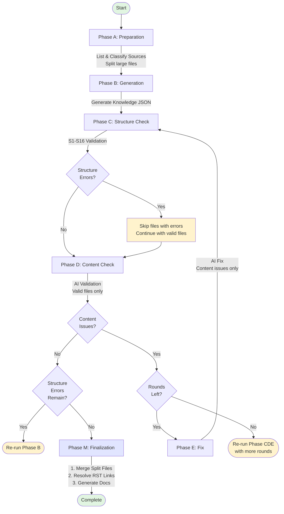

# Knowledge Creator リファクタリング タスクドキュメント

## 目的

knowledge-creator ディレクトリの構造整理とREADME簡素化。

## ベースブランチ

main（最新）

## 変更後のディレクトリ構成

```
tools/knowledge-creator/
├── kc.sh                       # 唯一のルート直下スクリプト
├── requirements.txt
├── pytest.ini
├── README.md
├── prompts/
├── scripts/                    # 旧 steps/ をリネーム + スクリプト集約
│   ├── __init__.py
│   ├── run.py                  # ルートから移動
│   ├── clean.py                # ルートから移動
│   ├── compare_reports.py      # ルートから移動
│   ├── common.py
│   ├── logger.py
│   ├── cleaner.py
│   ├── knowledge_meta.py
│   ├── step1_list_sources.py
│   ├── step2_classify.py
│   ├── phase_b_generate.py
│   ├── phase_c_structure_check.py
│   ├── phase_d_content_check.py
│   ├── phase_e_fix.py
│   ├── phase_f_finalize.py
│   ├── phase_g_resolve_links.py
│   ├── phase_m_finalize.py
│   └── merge.py
└── tests/
    ├── mode/                   # テスト用JSON（旧ルート直下）
    │   ├── largest3.json       # 旧 test-files-largest3.json
    │   ├── smallest3.json      # 旧 test-files-smallest3.json
    │   └── batch.json          # 旧 test-files-comprehensive.json
    ├── fixtures/
    ├── conftest.py
    └── test_*.py
```

削除するファイル:
- `analyze_quality.sh` — どこからも参照なし
- `test-files.json` — `test-files-largest3.json` と内容が完全同一

## 作業手順

---

### Step 1: ファイル移動

```bash
cd tools/knowledge-creator

# 1. steps/ → scripts/ リネーム
git mv steps scripts

# 2. スクリプトを scripts/ に移動
git mv run.py scripts/run.py
git mv clean.py scripts/clean.py
git mv compare_reports.py scripts/compare_reports.py

# 3. 不要ファイルを削除
git rm analyze_quality.sh
git rm test-files.json

# 4. テスト用JSONを tests/mode/ に移動+リネーム
mkdir -p tests/mode
git mv test-files-largest3.json tests/mode/largest3.json
git mv test-files-smallest3.json tests/mode/smallest3.json
git mv test-files-comprehensive.json tests/mode/batch.json
```

---

### Step 2: `kc.sh` のパス修正

`$TOOL_DIR/run.py` → `$TOOL_DIR/scripts/run.py`、`$TOOL_DIR/clean.py` → `$TOOL_DIR/scripts/clean.py` に変更する。

```bash
cd tools/knowledge-creator
sed -i 's|\$PYTHON "$TOOL_DIR/run.py"|\$PYTHON "$TOOL_DIR/scripts/run.py"|g' kc.sh
sed -i 's|\$PYTHON "$TOOL_DIR/clean.py"|\$PYTHON "$TOOL_DIR/scripts/clean.py"|g' kc.sh
```

確認（旧パスが残っていないこと）:
```bash
grep 'TOOL_DIR/run\.py\|TOOL_DIR/clean\.py' kc.sh | grep -v scripts
# 出力が空であること
```

---

### Step 3: `scripts/run.py` の修正

run.py は scripts/ 内に移動したため、パス解決を修正する。

**3-1: sys.path 修正**

Before:
```python
sys.path.insert(0, os.path.join(os.path.dirname(__file__), 'steps'))
```

After:
```python
sys.path.insert(0, os.path.dirname(__file__))
```

**3-2: repo_root 解決の修正**

run.py が1階層深くなったため、親ディレクトリの数を修正する。

Before:
```python
    repo_root = os.path.abspath(os.path.join(os.path.dirname(__file__), '..', '..'))
```

After:
```python
    repo_root = os.path.abspath(os.path.join(os.path.dirname(__file__), '..', '..', '..'))
```

**3-3: `from steps.xxx` → `from xxx` に一括変更**

```bash
cd tools/knowledge-creator
sed -i 's/from steps\./from /g' scripts/run.py
```

確認:
```bash
grep "from steps\." scripts/run.py
# 出力が空であること
```

**3-4: `--test` ヘルプ文修正**

Before:
```python
                        help="Test mode: specify test file (e.g., test-files-largest3.json)")
```

After:
```python
                        help="Test mode: specify test file (e.g., largest3.json)")
```

---

### Step 4: `scripts/clean.py` の修正

**4-1: sys.path 行を削除**

Before:
```python
sys.path.insert(0, os.path.join(os.path.dirname(__file__), 'steps'))
```

この行を削除する。clean.py は scripts/ 内にあり、logger.py と同じディレクトリのため不要。

**4-2: detect_repo_root の修正**

clean.py が1階層深くなったため、親ディレクトリの数を修正する。

Before:
```python
    return os.path.abspath(os.path.join(os.path.dirname(__file__), '..', '..'))
```

After:
```python
    return os.path.abspath(os.path.join(os.path.dirname(__file__), '..', '..', '..'))
```

---

### Step 5: `scripts/compare_reports.py` の修正

compare_reports.py はimport修正不要（json, sys のみ使用）。移動のみで完了。

---

### Step 6: `scripts/` 内モジュールの絶対import修正

scripts/ 内に4箇所 `from steps.xxx` の絶対importがある。相対importに統一する。

**6-1: `scripts/merge.py` L4**

Before:
```python
from steps.common import load_json, write_json
```

After:
```python
from .common import load_json, write_json
```

**6-2: `scripts/phase_m_finalize.py` L27-29**

Before:
```python
        from steps.merge import MergeSplitFiles
        from steps.phase_g_resolve_links import PhaseGResolveLinks
        from steps.phase_f_finalize import PhaseFFinalize
```

After:
```python
        from .merge import MergeSplitFiles
        from .phase_g_resolve_links import PhaseGResolveLinks
        from .phase_f_finalize import PhaseFFinalize
```

---

### Step 7: `scripts/step2_classify.py` のテストファイルパス修正

Before:
```python
    test_file_path = os.path.join(repo_path, "tools/knowledge-creator", test_file_name)
```

After:
```python
    test_file_path = os.path.join(repo_path, "tools/knowledge-creator/tests/mode", test_file_name)
```

---

### Step 8: `pytest.ini` 修正

Before:
```ini
[pytest]
pythonpath = tests
```

After:
```ini
[pytest]
pythonpath = tests scripts
```

---

### Step 9: `tests/conftest.py` 修正

Before:
```python
TOOL_DIR = os.path.dirname(os.path.dirname(os.path.abspath(__file__)))
sys.path.insert(0, TOOL_DIR)
```

After:
```python
TOOL_DIR = os.path.dirname(os.path.dirname(os.path.abspath(__file__)))
sys.path.insert(0, os.path.join(TOOL_DIR, "scripts"))
```

---

### Step 10: テストコードの `from steps.` import 一括修正

全テストファイルで `from steps.xxx` → `from xxx` に変更する。

```bash
cd tools/knowledge-creator
find tests/ -name "*.py" -exec sed -i 's/from steps\./from /g' {} +
```

確認:
```bash
grep -rn "from steps\." tests/
# 出力が空であること
```

対象ファイル（全21ファイル）:
- `test_cleaner.py`, `test_e2e_regen.py`, `test_e2e_split.py`, `test_excel_classification.py`
- `test_index_rst_id.py`, `test_knowledge_meta.py`, `test_merge.py`, `test_no_knowledge_content.py`
- `test_phase_c.py`, `test_phase_g.py`, `test_phase_m.py`, `test_pipeline.py`
- `test_rst_all_inclusive.py`, `test_run_flow.py`, `test_split_criteria.py`
- `test_split_validation.py`, `test_target_filter.py`, `test_test_mode.py`
- `test_unmatched_error.py`, `test_verification_loop.py`

`from run import` は変更不要（pytest.ini の pythonpath に scripts を追加済みのため解決される）。

---

### Step 11: `tests/test_kc_sh.py` の文字列検証修正

kc.sh のパスが変わったため、出力検証の文字列を更新する。

**L48-49:**

Before:
```python
        assert "clean.py" in lines[0] and "--version 6" in lines[0]
        assert "run.py" in lines[1] and "--version 6" in lines[1]
```

After:
```python
        assert "scripts/clean.py" in lines[0] and "--version 6" in lines[0]
        assert "scripts/run.py" in lines[1] and "--version 6" in lines[1]
```

**L60（resume テスト内）:**

Before:
```python
            assert "run.py" in lines[0]
            assert "clean.py" not in lines[0]
```

After:
```python
            assert "scripts/run.py" in lines[0]
            assert "scripts/clean.py" not in lines[0]
```

---

### Step 12: `tests/test_test_mode.py` のファイル名修正

**12-1: ファイル名の一括置換**

```bash
cd tools/knowledge-creator
sed -i 's/test-files-largest3\.json/largest3.json/g' tests/test_test_mode.py
sed -i 's/test-files-comprehensive\.json/batch.json/g' tests/test_test_mode.py
```

**12-2: ハードコードされたパス（2箇所）を修正**

L119 Before:
```python
        test_file_path = f"{real_ctx.repo}/tools/knowledge-creator/test-files-comprehensive.json"
```

L119 After:
```python
        test_file_path = f"{real_ctx.repo}/tools/knowledge-creator/tests/mode/batch.json"
```

L174 Before:
```python
        test_file_path = f"{real_ctx.repo}/tools/knowledge-creator/test-files-largest3.json"
```

L174 After:
```python
        test_file_path = f"{real_ctx.repo}/tools/knowledge-creator/tests/mode/largest3.json"
```

---

### Step 13: テスト実行

```bash
cd tools/knowledge-creator
pytest tests/ -v
```

全テストがパスすることを確認する。

---

### Step 14: README 書き換え

現在のREADMEを以下の内容で全置換する。

````markdown
# Knowledge Creator

Nablarch公式ドキュメント（RST/MD/Excel）をAI用ナレッジファイル（JSON）に変換するマルチフェーズパイプライン。



### フェーズ詳細

| フェーズ | 処理内容 | 種別 | 並列 |
|----------|----------|------|------|
| **A** | ソースファイルの一覧・分類・分割 | Python | No |
| **B** | Claude APIによるナレッジJSON生成 | AI | Yes |
| **C** | JSON構造バリデーション（S1-S16） | Python | No |
| **D** | Claude APIによるコンテンツ検証 | AI | Yes |
| **E** | Phase Dで検出した問題の自動修正 | AI | Yes |
| **M** | 分割ファイル統合 → RSTリンク解決 → インデックス・ドキュメント生成 | Hybrid | No |

Phase C→D→Eは `--max-rounds` 回（デフォルト: 2、最大: 10）まで繰り返す。

## セットアップ

```bash
cd /path/to/nabledge-dev
./setup.sh
source ~/.bashrc
```

## 運用コマンド

### kc.sh

| 用途 | コマンド |
|------|---------|
| 全件生成 | `./kc.sh gen 6` |
| 中断再開 | `./kc.sh gen 6 --resume` |
| ソース変更追随 | `./kc.sh regen 6` |
| 特定ファイル再生成 | `./kc.sh regen 6 --target FILE_ID` |
| 品質改善 | `./kc.sh fix 6` |
| 特定ファイル修正 | `./kc.sh fix 6 --target FILE_ID` |

FILE_ID はナレッジファイルの拡張子なしファイル名（例: `handlers-data_read_handler`）。`.claude/skills/nabledge-6/knowledge/` 配下で確認できる。

### オプション

| オプション | 説明 | デフォルト |
|-----------|------|-----------|
| `--version` | バージョン（6, 5, all） | **必須** |
| `--resume` | 中断再開（genのみ） | - |
| `--target FILE_ID` | 対象ファイル指定（複数可） | 全件 |
| `--yes` | 確認プロンプトスキップ | `False` |
| `--dry-run` | ドライラン | `False` |
| `--max-rounds N` | CDEループ回数 | `2` |
| `--concurrency N` | 並列数 | `4` |
| `--test FILE` | テストファイル指定 | `None` |

### テストモードファイル

`tests/mode/` 配下。`--test` オプションにファイル名を指定する。

| ファイル | 内容 |
|---------|------|
| `largest3.json` | 最大3ファイル（分割後22エントリー）— 高速検証向け |
| `smallest3.json` | 最小3ファイル — 最速検証向け |
| `batch.json` | main branch準拠の37ファイル（分割後51エントリー） |

## 開発ガイド

### テスト種類

- **Unit Tests**: Phase C構造バリデーション、分割ロジック等
- **Integration Tests**: Phase C/D/E/M統合、マージ、パイプラインフロー
- **E2E Tests**: 分割ファイル・修正サイクルを含むフルパイプライン

### テスト実行

```bash
cd tools/knowledge-creator

# 全テスト
pytest tests/ -v

# テストモード実行
python scripts/run.py --version 6 --test smallest3.json
```
````

---

### Step 15: 最終確認

```bash
cd tools/knowledge-creator

# テスト
pytest tests/ -v

# kc.sh ヘルプ表示
./kc.sh

# 旧パスの残存確認（全て空であること）
grep -rn "from steps\." tests/ scripts/
grep -rn "test-files-" tests/ scripts/ kc.sh
grep -rn '"steps/' scripts/ kc.sh
```
