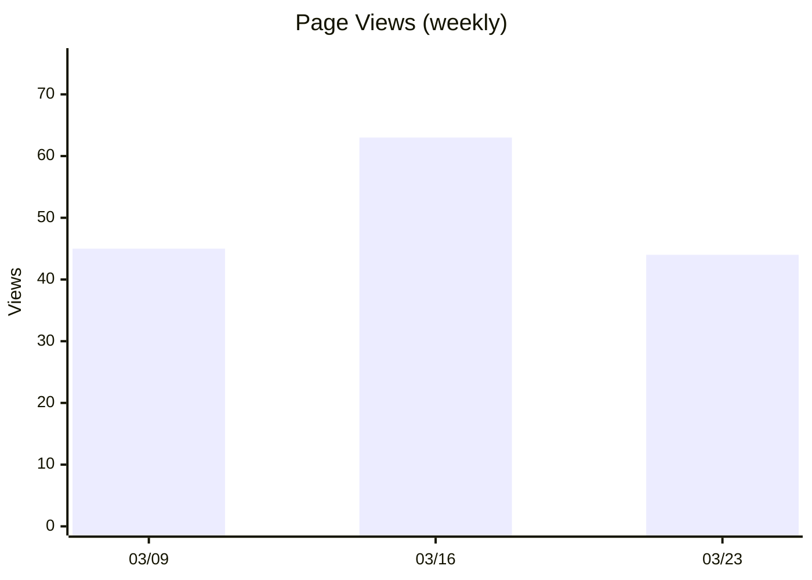
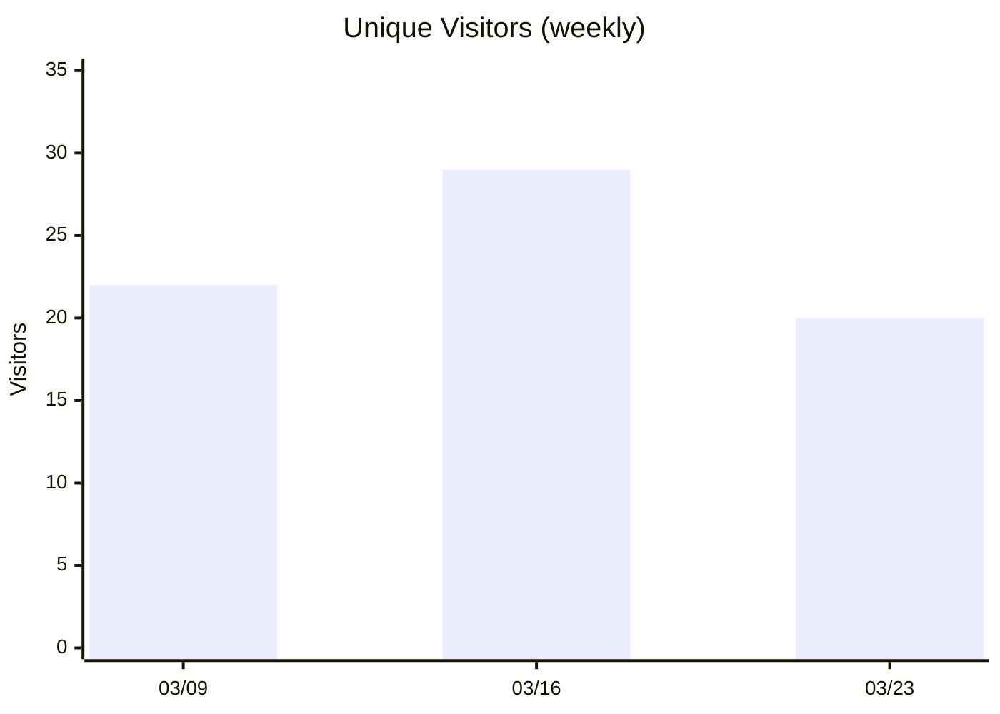
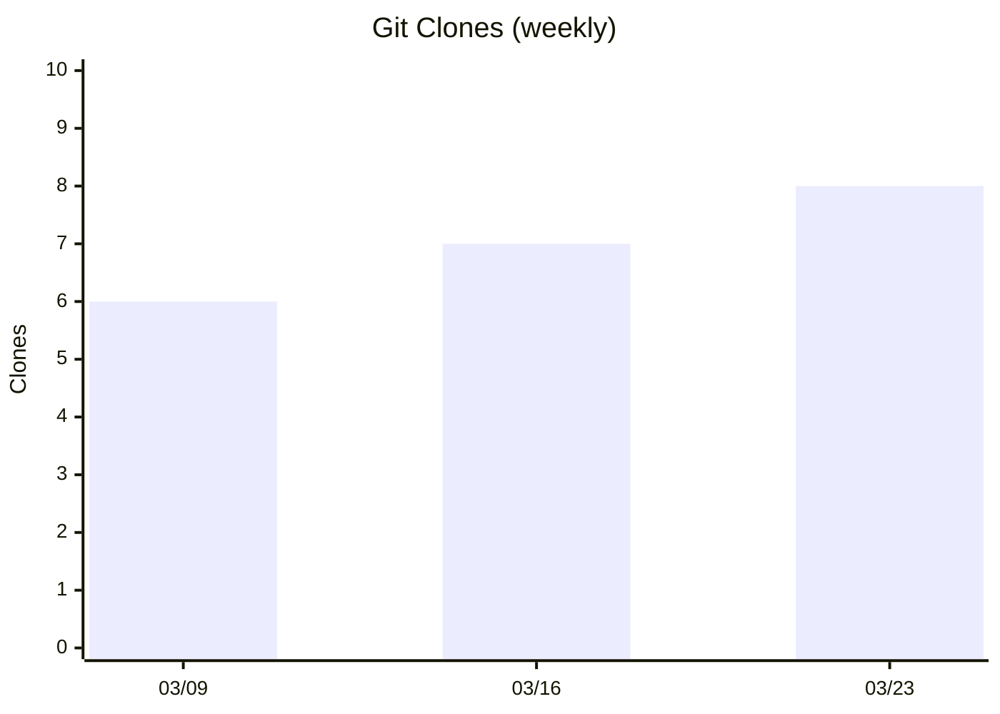

# Notes

## 2026-03-24

### Preview: Nabledge Adoption セクション出力イメージ

サンプルデータで生成した `docs/metrics.md` の Adoption セクション。
実際のデータで workflow を手動実行すると以下の形式で出力される。

---

## Nabledge Adoption (nablarch/nabledge)

---

### Decision: 週次集計・表なし・Unique Visitors グラフ追加

- 日次だと粒度が細かすぎてトレンドが見づらい → 他のグラフと同じ週次に統一
- サマリーテーブルは削除（グラフで十分）
- Unique Visitors をグラフ化（Page Views と同じ x-axis で並べて比較しやすい）
- Unique Visitors の週次値は日次の合計（同一人物の重複カウントあり、上限値として参照）
