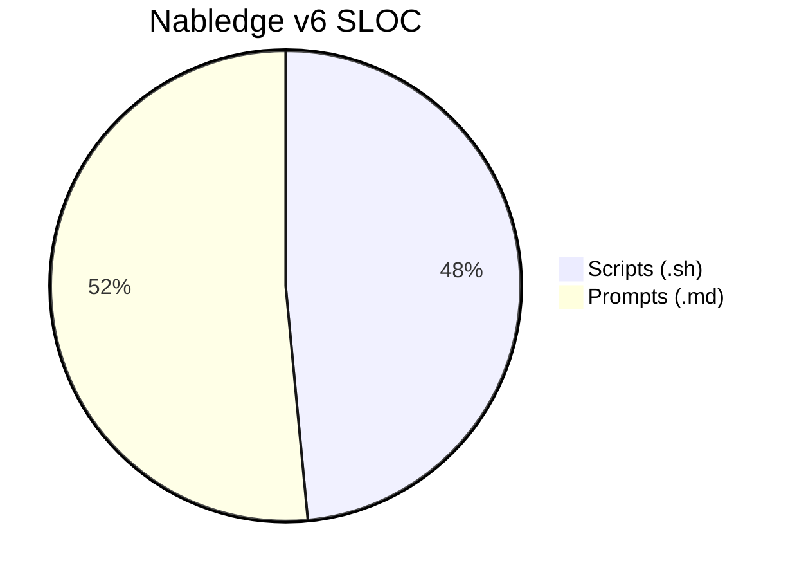
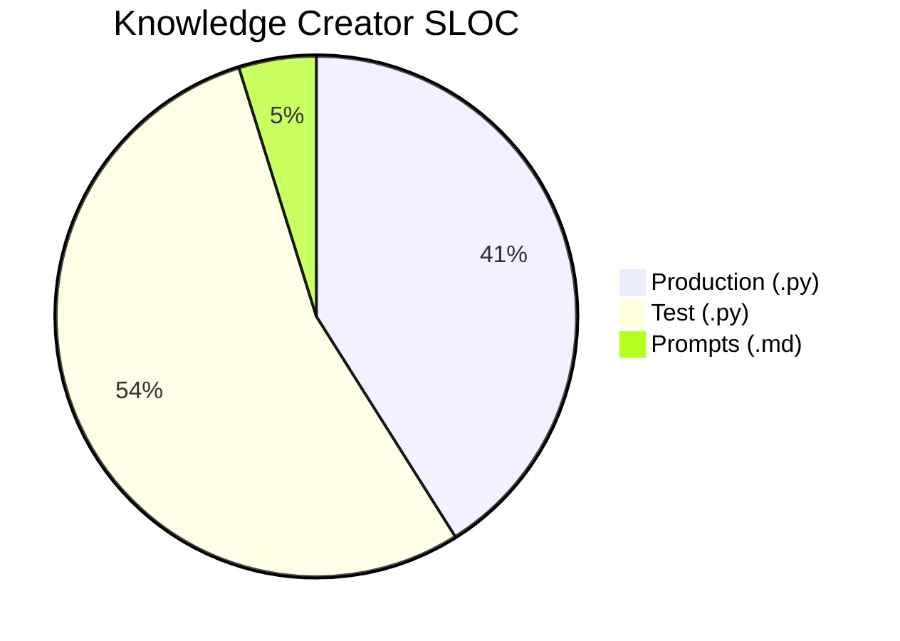
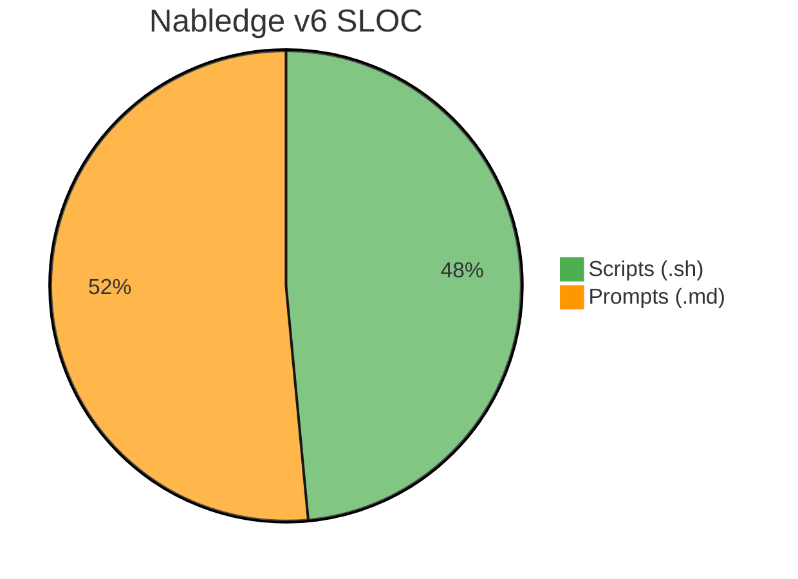
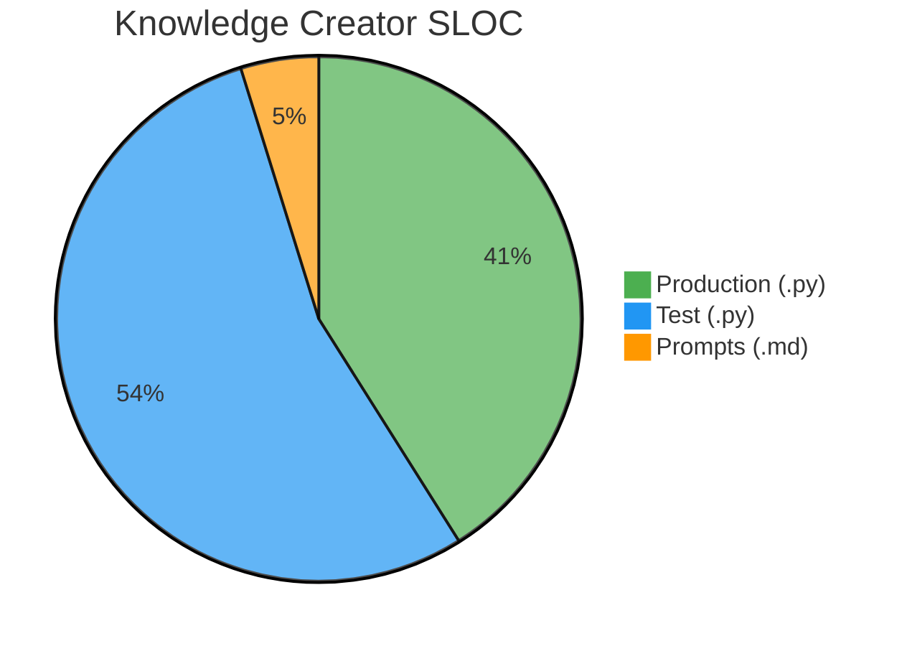

# Mermaid Pie Chart Color Test

Verify that `%%{init}%%` color specification works for pie charts on GitHub.

## Without color specification (default)

## With explicit color specification

`Prompts (.md)` should be the same orange (`#FF9800`) in both charts.

