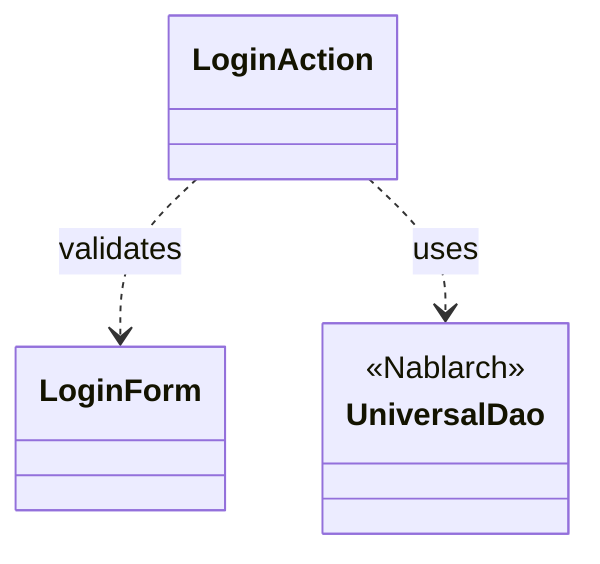
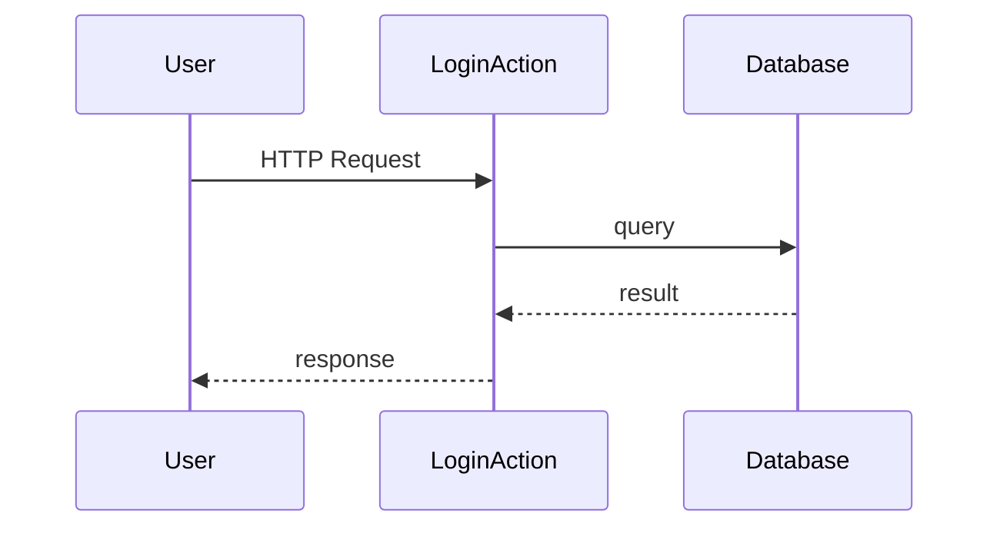

# Code Analysis Workflow

This workflow analyzes existing code, traces dependencies, and generates structured documentation to help understand the codebase.

## Table of Contents

- [Overview](#overview)
- [Process flow](#process-flow)
  - [Step 1: Identify target and analyze dependencies](#step-1-identify-target-and-analyze-dependencies)
  - [Step 2: Search Nablarch knowledge](#step-2-search-nablarch-knowledge)
  - [Step 3: Generate and output documentation](#step-3-generate-and-output-documentation)
- [Output template](#output-template)
- [Error handling](#error-handling)
- [Best practices](#best-practices)
- [Example execution](#example-execution)

## Overview

**Purpose**: Help users understand existing code by:
1. Identifying target code and tracing dependencies
2. Searching relevant Nablarch knowledge
3. Generating comprehensive documentation

**Input**: User's request (target code specification)

**Output**: Structured documentation file (Markdown + Mermaid diagrams)

**Tools**:
- Read, Glob, Grep: Read and search source files
- Bash with jq: Execute keyword-search workflow
- Write: Generate documentation file

**Expected output**: 1 documentation file (~3,000-10,000 tokens) in .nabledge/YYYYMMDD/

## Process flow

### Step 0: Record start time (CRITICAL)

**Tool**: Bash

**Action** - Store start time with unique session ID:
```bash
UNIQUE_ID="$(date '+%s%3N')-$$"
echo "$UNIQUE_ID" > /tmp/nabledge-code-analysis-id
date '+%s' > "/tmp/nabledge-code-analysis-start-$UNIQUE_ID"
echo "Start time recorded: $(date '+%Y-%m-%d %H:%M:%S')"
echo "Session ID: $UNIQUE_ID"
```

**Output example**:
```
Start time recorded: 2026-02-10 14:54:00
Session ID: 1707559440123-12345
```

**IMPORTANT**:
- **Session ID stored in**: `/tmp/nabledge-code-analysis-id` (fixed path for retrieval in Step 3.3)
- **Start time stored in**: `/tmp/nabledge-code-analysis-start-$UNIQUE_ID` (unique file per session)
- **UNIQUE_ID format**: `{millisecond_timestamp}-{process_PID}` ensures uniqueness across parallel executions
- Epoch time (seconds since 1970) stored for accurate duration calculation
- No need to remember values - Step 3.3 will read session ID from fixed file path

**Why this matters**: The `{{analysis_duration}}` placeholder must contain the actual elapsed time, not an estimate. Users will compare it against the "Cooked for X" time shown in their IDE.

---

### Step 1: Identify target and analyze dependencies

**Tools**: AskUserQuestion (if needed), Read, Glob, Grep

**Action**:

1. **Parse user request** to understand target scope:
   - Specific class (e.g., "LoginAction")
   - Specific feature (e.g., "ログイン機能")
   - Package (e.g., "web.action配下")

2. **Ask clarifying questions** if scope is unclear

3. **Find target files** using Glob or Grep

4. **Read target files** and extract dependencies:
   - Imports → External dependencies
   - Field types, method parameters → Direct dependencies
   - Method calls → Behavioral dependencies

5. **Classify dependencies**:
   - Project code (proman-*): Trace further
   - Nablarch framework: Note for knowledge search
   - JDK/Jakarta EE: Note but don't trace
   - Third-party libraries: Note but don't trace

6. **Determine trace depth** (ask user if unclear):
   - Default: Trace project code until reaching framework/entities/utilities
   - Stop at Nablarch framework boundaries
   - Stop at Entity classes (pure data objects)

7. **Build dependency graph** (mental model):
   ```
   LoginAction
   ├─→ LoginForm (Form, validation)
   ├─→ SystemAccountEntity (Entity, data)
   ├─→ UniversalDao (Nablarch, database access)
   └─→ ExecutionContext (Nablarch, request context)
   ```

8. **Categorize components** by role:
   - Action/Controller, Form, Entity, Service/Logic, Utility, Handler, Configuration

9. **Identify Nablarch components** for knowledge search:
   - UniversalDao, ValidationUtil, ExecutionContext, Handler chain, etc.

10. **Extract key concepts** for knowledge search:
    - Technical terms: DAO, トランザクション, ハンドラ
    - Operations: 検索, 登録, 更新, バリデーション
    - Patterns: CRUD, pagination, error handling

**Output**: Target files list, dependency graph, component list with Nablarch components identified

### Step 2: Search Nablarch knowledge

**Tools**: Read (index.toon), Bash with jq (keyword-search workflow)

**Action**: Batch process knowledge searches for all Nablarch components to reduce tool calls.

**Batch processing approach**:

1. **Identify all Nablarch components** from Step 1 analysis:
   - Example: ["UniversalDao", "ExecutionContext", "ValidationUtil", "DbAccessException"]

2. **Combine keywords for batch search**:
   - Merge component names + technical terms from all components
   - Extract L1/L2/L3 keywords for all components at once

   **Bash script example for keyword combination**:
   ```bash
   # Declare arrays for combined keywords
   declare -a l1_all l2_all l3_all

   # UniversalDao component keywords
   l1_all+=("データベース" "database")
   l2_all+=("DAO" "UniversalDao" "O/Rマッパー")
   l3_all+=("CRUD" "検索" "登録" "更新" "ページング")

   # ExecutionContext component keywords
   l1_all+=("リクエスト" "request")
   l2_all+=("ExecutionContext" "コンテキスト")
   l3_all+=("リクエスト処理" "データ取得")

   # ValidationUtil component keywords
   l1_all+=("バリデーション" "validation")
   l2_all+=("ValidationUtil" "Bean Validation")
   l3_all+=("検証" "エラー" "例外処理")

   # Remove duplicates and prepare for keyword-search workflow
   l1_keywords=($(printf '%s\n' "${l1_all[@]}" | sort -u))
   l2_keywords=($(printf '%s\n' "${l2_all[@]}" | sort -u))
   l3_keywords=($(printf '%s\n' "${l3_all[@]}" | sort -u))
   ```

   **Result** - Combined keywords ready for keyword-search:
     - L1: ["データベース", "database", "バリデーション", "validation", "リクエスト", "request"]
     - L2: ["DAO", "UniversalDao", "O/Rマッパー", "ExecutionContext", "コンテキスト", "ValidationUtil", "Bean Validation"]
     - L3: ["CRUD", "検索", "登録", "更新", "ページング", "リクエスト処理", "データ取得", "検証", "エラー", "例外処理"]

3. **Execute keyword-search workflow once** (see workflows/keyword-search.md):
   - Use combined keywords for all components
   - Batch process file selection (Step 1)
   - Batch extract candidate sections (Step 2)
   - Get 20-30 candidates covering all components

4. **Execute section-judgement workflow once** (see workflows/section-judgement.md):
   - Batch extract all candidate sections (2-3 jq calls instead of 5-10)
   - Judge relevance for each section
   - Keep only High and Partial relevance sections

5. **Group knowledge by component** after receiving results:
   - Parse returned sections and map to original components
   - UniversalDao → [universal-dao.json:overview, universal-dao.json:crud]
   - ValidationUtil → [data-bind.json:validation]

6. **Collect knowledge** for documentation:
   - API usage patterns
   - Configuration requirements
   - Code examples
   - Error handling
   - Best practices

**Tool call reduction**:
- **Before**: Sequential processing per component = ~36 calls
  - Per component: keyword-search (12 calls) + section-judgement (5-10 calls) = ~18 calls
  - For 2-3 components: 36-54 calls total
- **After**: Batch processing for all components = ~15 calls
  - keyword-search batch (3 calls) + section-judgement batch (2-3 calls) + grouping (0 calls) = ~6 calls once
  - Additional overhead for multi-component coordination: ~5-10 calls (dependency grouping and knowledge mapping)
  - Total: ~15 calls

**Efficiency**: Collect High-relevance sections only (5-10 sections per component). Skip components with no relevant knowledge.

**Output**: Relevant knowledge sections with API usage, patterns, and best practices

### Step 3: Generate and output documentation

**Tools**: Read (template files), Write

**Action**:

#### 3.1: Read template and guide

**MUST READ FIRST** (use single cat command for efficiency):
```bash
cat .claude/skills/nabledge-6/assets/code-analysis-template.md \
    .claude/skills/nabledge-6/assets/code-analysis-template-guide.md \
    .claude/skills/nabledge-6/assets/code-analysis-template-examples.md
```

**Extract from templates**:
- All `{{placeholder}}` variables
- Section structure and order (DO NOT deviate)
- Component Summary Table format
- Nablarch Usage structure with important points (✅ ⚠️ 💡 🎯 ⚡)
- Link generation rules (relative paths + line references)

#### 3.2: Build documentation content

**Dependency diagram** (Mermaid classDiagram):


**Key points**:
- Use `classDiagram` syntax (NOT `graph TD`)
- Show class names only (NO methods/fields)
- Show inheritance with `--|>`, dependencies with `..>`
- Mark framework classes with `<<Nablarch>>`

**Component summary table**:
```markdown
| Component | Role | Type | Dependencies |
|-----------|------|------|--------------|
| LoginAction | ログイン処理 | Action | LoginForm, UniversalDao |
```

**Flow description with sequence diagram** (Mermaid sequenceDiagram):


**Key points**:
- Use `->>` for calls, `-->>` for returns
- Use `alt`/`else` for error handling
- Use `loop` for repetition
- Use `Note over` to explain logic

**Component details**:
- Component name and role
- Key methods with line references (`:42-58` format)
- Dependencies
- File path with relative link + line references

**Nablarch usage** (for each component):
- Class name and description
- Code example
- Important points with prefixes: ✅ Must do / ⚠️ Caution / 💡 Benefit / 🎯 When to use / ⚡ Performance
- Usage in this code
- Knowledge base link

**See detailed examples**: assets/code-analysis-template-examples.md

#### 3.3: Apply template and output

1. **Determine output path**: `.nabledge/YYYYMMDD/code-analysis-<target-name>.md`

2. **Fill template placeholders** (time-related placeholders will be filled in Step 6):
   - `{{target_name}}`: Target code name
   - `{{generation_date}}`: "{{DATE_PLACEHOLDER}}"  ← 置き換え用マーカー（そのまま）
   - `{{generation_time}}`: "{{TIME_PLACEHOLDER}}"  ← 置き換え用マーカー（そのまま）
   - `{{analysis_duration}}`: "{{DURATION_PLACEHOLDER}}"  ← 置き換え用マーカー（そのまま）
   - `{{target_description}}`: One-line description
   - `{{modules}}`: Affected modules
   - `{{overview_content}}`: Overview section
   - `{{dependency_graph}}`: Mermaid classDiagram
   - `{{component_summary_table}}`: Component table
   - `{{flow_content}}`: Flow description
   - `{{flow_sequence_diagram}}`: Mermaid sequenceDiagram
   - `{{components_details}}`: Detailed analysis
   - `{{nablarch_usage}}`: Framework usage with important points
   - `{{source_files_links}}`: Source file links
   - `{{knowledge_base_links}}`: Knowledge base links
   - `{{official_docs_links}}`: Official docs links

4. **Verify template compliance**:
   - All template sections present
   - Section order matches template
   - NO section numbers (1., 2., etc.)
   - NO additional sections outside template
   - All placeholders replaced
   - Relative links with line references
   - Knowledge base links included

5. **Write file** using Write tool

6. **Update time-related placeholders** (IMMEDIATE execution after Write):

   Execute single bash script to fill all time-related placeholders:
   ```bash
   # Retrieve session ID from Step 0
   UNIQUE_ID=$(cat /tmp/nabledge-code-analysis-id 2>/dev/null || echo "")

   # Get current time
   end_time=$(date '+%s')
   current_datetime=$(date '+%Y-%m-%d %H:%M:%S')
   generation_date=$(echo "$current_datetime" | cut -d' ' -f1)
   generation_time=$(echo "$current_datetime" | cut -d' ' -f2)

   # Calculate duration with error handling
   START_TIME_FILE="/tmp/nabledge-code-analysis-start-$UNIQUE_ID"
   if [ -z "$UNIQUE_ID" ] || [ ! -f "$START_TIME_FILE" ]; then
     echo "WARNING: Start time file not found. Duration will be set to '不明'."
     duration_text="不明"
   else
     start_time=$(cat "$START_TIME_FILE")
     duration_seconds=$((end_time - start_time))

     # Format as Japanese text
     if [ $duration_seconds -lt 60 ]; then
       duration_text="約${duration_seconds}秒"
     else
       minutes=$((duration_seconds / 60))
       seconds=$((duration_seconds % 60))
       duration_text="約${minutes}分${seconds}秒"
     fi
   fi

   # Replace all placeholders in the output file (three -e expressions execute sequentially)
   sed -i \
     -e "s/{{DATE_PLACEHOLDER}}/$generation_date/g" \
     -e "s/{{TIME_PLACEHOLDER}}/$generation_time/g" \
     -e "s/{{DURATION_PLACEHOLDER}}/$duration_text/g" \
     .nabledge/YYYYMMDD/code-analysis-<target>.md

   # Clean up temp files
   rm -f "$START_TIME_FILE"
   rm -f /tmp/nabledge-code-analysis-id

   # Output for user
   echo "Generated: $generation_date $generation_time"
   echo "Duration: $duration_text"
   ```

   **Replace in command**:
   - `YYYYMMDD`: Actual date directory
   - `<target>`: Actual target name

   **IMPORTANT**:
   - Execute immediately after Step 5 with no other operations between them
   - This script handles: session ID retrieval, generation date/time, duration calculation, and file updates
   - **Error handling**: If start time file is missing, duration is set to "不明" (unknown) with warning message
   - Script continues execution even if duration calculation fails, ensuring placeholders are always replaced

7. **Inform user**: Show output path and actual duration

**Output**: Documentation file at .nabledge/YYYYMMDD/code-analysis-<target-name>.md

## Output template

**Template file**: `.claude/skills/nabledge-6/assets/code-analysis-template.md`
**Template guide**: `.claude/skills/nabledge-6/assets/code-analysis-template-guide.md`
**Template examples**: `.claude/skills/nabledge-6/assets/code-analysis-template-examples.md`

The template provides structured format with sections:
1. Header (date/time, duration, modules)
2. Overview
3. Architecture (class diagram + component table)
4. Flow (description + sequence diagram)
5. Components (detailed analysis)
6. Nablarch Framework Usage (with important points)
7. References (source files, knowledge base, official docs)

## Error handling

**See SKILL.md "Error Handling Policy" section for comprehensive guidelines.**

Key scenarios:
- **Target code not found**: Ask user for clarification, suggest similar files
- **Dependency analysis too complex**: Ask user to narrow scope
- **Output file already exists**: Ask user whether to overwrite
- **No Nablarch knowledge found**: Note in documentation, proceed with code analysis only

## Best practices

**Template compliance (CRITICAL)**:
- Always read template file before generating content
- Never add section numbers to template sections
- Never add sections outside template structure
- If additional info is valuable, integrate into existing sections as subsections
- Verify compliance before outputting file

**Scope management**:
- Start with narrow scope, expand if needed
- Ask user before expanding beyond initial request
- Clearly document scope boundaries

**Dependency tracing**:
- Stop at framework boundaries
- Stop at Entity classes
- Focus on project-specific code

**Knowledge integration**:
- Only use knowledge from knowledge files
- Cite sources clearly (file + section)
- Don't supplement with external knowledge

**Documentation quality**:
- Keep explanations concise
- Use diagrams for complex relationships
- Provide actionable information
- Link to sources for deep dives

## Example execution

**User request**: "LoginActionを理解したい"

**Step 1**: Identify target and analyze
- Target: LoginAction.java
- Dependencies: LoginForm, SystemAccountEntity, UniversalDao, ExecutionContext
- Components: Action (LoginAction), Form (LoginForm), Entity (SystemAccountEntity), Nablarch (UniversalDao, ExecutionContext)

**Step 2**: Search Nablarch knowledge
- UniversalDao → universal-dao.json:overview, crud sections
- Bean Validation → data-bind.json:validation section

**Step 3**: Generate and output
- Read template files
- Build classDiagram and sequenceDiagram
- Create component summary table
- Write component details with line references
- Write Nablarch usage with important points (✅ ⚠️ 💡)
- Apply template with all placeholders
- Output: .nabledge/20260210/code-analysis-login-action.md

**Summary**: 5 components, 2 diagrams, 2 Nablarch knowledge sections, duration ~2分
