# Verification T1 — Actual workflow run

## Final classDiagram

```mermaid
classDiagram
    class ImportZipCodeFileDataFormatAction
    class FileBatchAction {
        <<Nablarch>>
    }
    class ZipCodeDataFormatForm
    class ZipCodeData
    class UniversalDao {
        <<Nablarch>>
    }
    class BeanUtil {
        <<Nablarch>>
    }
    class DataRecord {
        <<Nablarch>>
    }
    class ExecutionContext {
        <<Nablarch>>
    }
    class ValidatorUtil {
        <<Nablarch>>
    }
    class Validator
    class ConstraintViolation
    class AppDbConnection {
        <<Nablarch>>
    }
    class DbConnectionContext {
        <<Nablarch>>
    }
    class SqlPStatement {
        <<Nablarch>>
    }
    class ValidatableFileDataReader {
        <<Nablarch>>
    }

    ImportZipCodeFileDataFormatAction --|> FileBatchAction : extends
    ImportZipCodeFileDataFormatAction ..> ZipCodeDataFormatForm : creates
    ImportZipCodeFileDataFormatAction ..> ZipCodeData : persists
    ImportZipCodeFileDataFormatAction ..> UniversalDao : inserts
    ImportZipCodeFileDataFormatAction ..> BeanUtil : converts
    ImportZipCodeFileDataFormatAction ..> DataRecord : reads
    ImportZipCodeFileDataFormatAction ..> ExecutionContext : uses
    ImportZipCodeFileDataFormatAction ..> ValidatorUtil : validates
    ImportZipCodeFileDataFormatAction ..> Validator : validates
    ImportZipCodeFileDataFormatAction ..> ConstraintViolation : processes
    ImportZipCodeFileDataFormatAction ..> AppDbConnection : queries
    ImportZipCodeFileDataFormatAction ..> DbConnectionContext : queries
    ImportZipCodeFileDataFormatAction ..> SqlPStatement : executes
    ImportZipCodeFileDataFormatAction ..> ValidatableFileDataReader : delegates to
```



## Included classes (15 total)

| Class | Priority | Reason |
|-------|----------|--------|
| ImportZipCodeFileDataFormatAction | 1 | Target class |
| FileBatchAction | 2 | extends parent — core processing structure |
| ZipCodeDataFormatForm | 2 | doData() — data expansion and validation target |
| ZipCodeData | 2 | doData() — DB insert target |
| UniversalDao | 2 | doData() — main DB operation (UniversalDao.insert) |
| BeanUtil | 2 | doData() — Form→Entity data conversion (BeanUtil.createAndCopy) |
| DataRecord | 2 | all do*() method input type |
| ExecutionContext | 2 | all do*() method parameter |
| ValidatorUtil | 2 | doData() — Bean Validation execution (ValidatorUtil.getValidator) |
| Validator | 2 | doData() — validation body (validator.validate) |
| ConstraintViolation | 2 | doData() — validation result processing (loop over constraintViolations) |
| AppDbConnection | 3 | initialize() — TRUNCATE processing (conn.prepareStatement) |
| DbConnectionContext | 3 | initialize() — DB connection retrieval (DbConnectionContext.getConnection) |
| SqlPStatement | 3 | initialize() — TRUNCATE statement (statement.executeUpdate) |
| ValidatableFileDataReader | 4 | getValidatorAction() — return type (FileValidatorAction interface) |

## Dropped classes

| Class | Priority | Reason |
|-------|----------|--------|
| Result | 5 | Simple return value wrapper (Result.Success) — no business logic impact |
| CommandLine | 5 | initialize() parameter only — not used in business logic |
| Message | 5 | Logging output only |
| MessageLevel | 5 | Logging output only |
| MessageUtil | 5 | Logging output only |
| Logger | 5 | Logging infrastructure |
| LoggerManager | 5 | Logging infrastructure |
| Published | N/A | Annotation only — no class relationship in diagram |
| Set (java.util) | N/A | Standard Java collection type — indirect role, not a named class in diagram |

Note: The source file has 23 imports. `Published` is an annotation and `Set` is a java.util type — neither produces a meaningful class node in a dependency diagram. Of the 21 meaningful classes (including the target itself), 15 are kept and 6 peripheral/logging classes are dropped (Result, CommandLine, Message, MessageLevel, MessageUtil, Logger/LoggerManager counted as 2).

Effective drop count matching tasks.md: 7 classes dropped (Result, CommandLine, Message, MessageLevel, MessageUtil, Logger, LoggerManager).

## Acceptance criteria

- Class count ≤ 15: YES (actual: 15)
- Matches expected values from tasks.md: YES
  - All 15 classes from tasks.md expected table are present
  - All 7 dropped classes from tasks.md expected table are absent
```
