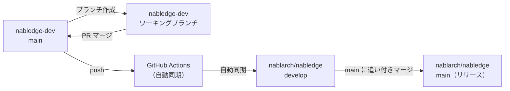

# nabledge-dev

[Nabledge](https://github.com/nablarch/nabledge) の開発リポジトリ

## ドキュメント

- 📊 [開発状況](docs/development-status.md) - 現在の進捗とロードマップ
- 📐 [設計ドキュメント](docs/nabledge-design.md) - アーキテクチャと設計の詳細
- 🎯 [アクティビティマッピング](docs/activity-mapping.md) - Nabledge とのワークフローおよび役割分担
- 📈 [メトリクス](docs/metrics.md) - 週次開発生産性と Nabledge 導入状況（自動更新）

## 前提条件

- WSL2 / Ubuntu
- CA 証明書（企業プロキシ環境の場合）

## セットアップ

### 1. CA 証明書のインストール（プロキシ環境の場合）

```bash
sudo cp /path/to/your/ca.crt /usr/local/share/ca-certificates/ca.crt
sudo update-ca-certificates
```

### 2. 環境セットアップ

```bash
SVN_BASE_URL=<SVN_URL> SVN_USERNAME=<username> SVN_PASSWORD=<password> ./setup.sh
cp .env.example .env
# .env を編集して認証情報を設定する
```

`SVN_BASE_URL` 等には v1.4/v1.3/v1.2 が格納されている SVN リポジトリの URL を指定します。

## 使い方

```bash
source .env
claude
```

## ブランチ戦略

このリポジトリはシングルブランチの開発ワークフローを採用しています。すべての開発作業はプルリクエスト経由で **main** ブランチにマージされ、変更は [nablarch/nabledge:develop](https://github.com/nablarch/nabledge/tree/develop) に自動同期されます。

### 開発フロー



### 開発バージョンのテスト

`nablarch/nabledge:develop` の最新開発バージョンをテストするには、`tools/tests/test-setup.sh` を実行します。

```bash
# 全バージョン
bash tools/tests/test-setup.sh

# バージョン指定（v6 / v5 / v1.4 / upgrade）
bash tools/tests/test-setup.sh v6
```

スクリプトは `.tmp/nabledge-test/` に環境を構築し、静的チェックと動的チェックを実行します。実行後、`tools/tests/reports/` にブランチ名と日時を含む Markdown レポートが生成されます。

**静的チェック**（ファイル構成の検証）

- `SKILL.md` が存在すること
- `knowledge/` ディレクトリが存在し、nabledge-dev と同数のファイルがあること
- `docs/` ディレクトリが存在し、nabledge-dev と同数のエントリがあること
- `/n{v}` コマンドファイルが存在すること（CC/GHC 共通）
- `n{v}.prompt.md` が存在すること（GHC のみ）

**動的チェック**（知識検索の動作検証）

CC（`claude -p`）・GHC（`copilot -p`）をヘッドレスモードで実行し、`SKILL.md` が読み込まれたかを検証します。

**FAIL / WARN が出た場合**

ログファイルは `.tmp/nabledge-test/dynamic-check-*.log` に保存されています。

- **FAIL — SKILL.md not read**: セットアップが正しく完了していません。静的チェックのエラーを確認し、`/n{v}` コマンドファイルと `SKILL.md` のパスが正しいか確認してください。
- **FAIL — missing sections**: 回答にセクション（結論／根拠／注意点／参照）が含まれていません。スキルが正常に動作していない可能性があります。ログを確認し、エラーが出力されていないか確認してください。
- **WARN — sections out of order**: 4つのセクションすべてが検出されましたが、順序が期待値と異なります。ログを開き、`final_answer_text` に「結論」→「根拠」→「注意点」→「参照」の順でセクションが含まれているか確認してください。順序の違いのみであればフォーマット差異であり、機能上の問題ではありません。

**前後比較（`main` vs `develop`）**

PR マージ前後の品質を比較するには、両ブランチに対して実行し、生成されたレポートを diff します。

```bash
# main ブランチの状態をテスト
NABLEDGE_BRANCH=main bash tools/tests/test-setup.sh

# develop ブランチの状態をテスト（デフォルト）
NABLEDGE_BRANCH=develop bash tools/tests/test-setup.sh
```

各実行のレポートは `tools/tests/reports/` に蓄積されます（例: `main-20260526-143012.md`、`develop-20260526-151530.md`）。2つのレポートを並べて確認することで、マージによる影響を把握できます。

### リリース手順

バージョンファイルと CHANGELOG の更新はこのリポジトリ（nabledge-dev）で行います。その後、[nablarch/nabledge](https://github.com/nablarch/nabledge) リポジトリでリリース作業を行います。

> nablarch/nabledge:develop での動作確認手順は「[開発バージョンのテスト](#開発バージョンのテスト)」を参照してください。

**nablarch/nabledge リポジトリでの手順：**

1. **差分確認用 PR を作成** - `main` から `develop` へ PR を作成し、変更内容をレビュー
2. **develop に追い付きマージ** - リリース OK になったら `main` を `develop` に追い付かせるようにマージ（PR はコミットが作られるため PR 経由ではなく直接マージ）

詳細なリリースワークフローは `.claude/rules/release.md` を参照してください。

## 開発

### カスタムスラッシュコマンド

このリポジトリには開発ワークフローを効率化するカスタムスラッシュコマンドが用意されています：

#### /hi - フル開発ワークフロー
イシュー起票から PR レビュー依頼まで一通りのワークフローを実行します：
```
/hi 123        # イシュー #123 の作業を開始
/hi 456        # イシュー/PR #456 の作業を再開
/hi            # インタラクティブ選択
```
ブランチの作成・変更の実装・テストの実行・PR の作成まで自動で行います。

#### /fb - レビューフィードバック対応
PR レビューのフィードバックに対応します：
```
/fb 456        # PR #456 のレビューに対応
/fb            # 現在のブランチから自動検出
```
コメントを取得し、修正を実装してコミット後、レビュアーに返信します。

#### /bb - マージとクリーンアップ
PR の承認・マージとブランチの後片付けを行います：
```
/bb 456        # PR #456 をマージしてブランチを削除
/bb            # 現在のブランチから自動検出
```
PR を承認してマージし、HEAD を main に切り替えてブランチを削除します。

### nabledge スキルのテスト

nabledge スキルの性能を改善した場合、`nabledge-test` スキルでベースラインと比較して改善効果を確認します。

## フィードバック

### 公開済みの nabledge スキルについて
[nablarch/nabledge Issues](https://github.com/nablarch/nabledge/issues) にイシューを登録するか、機能リクエストをお送りください。他のユーザーも検索・参照しやすくなります。

### 未リリースの開発作業について
[nablarch/nabledge-dev Issues](https://github.com/nablarch/nabledge-dev/issues) にイシューを登録するか、変更内容について議論してください。
