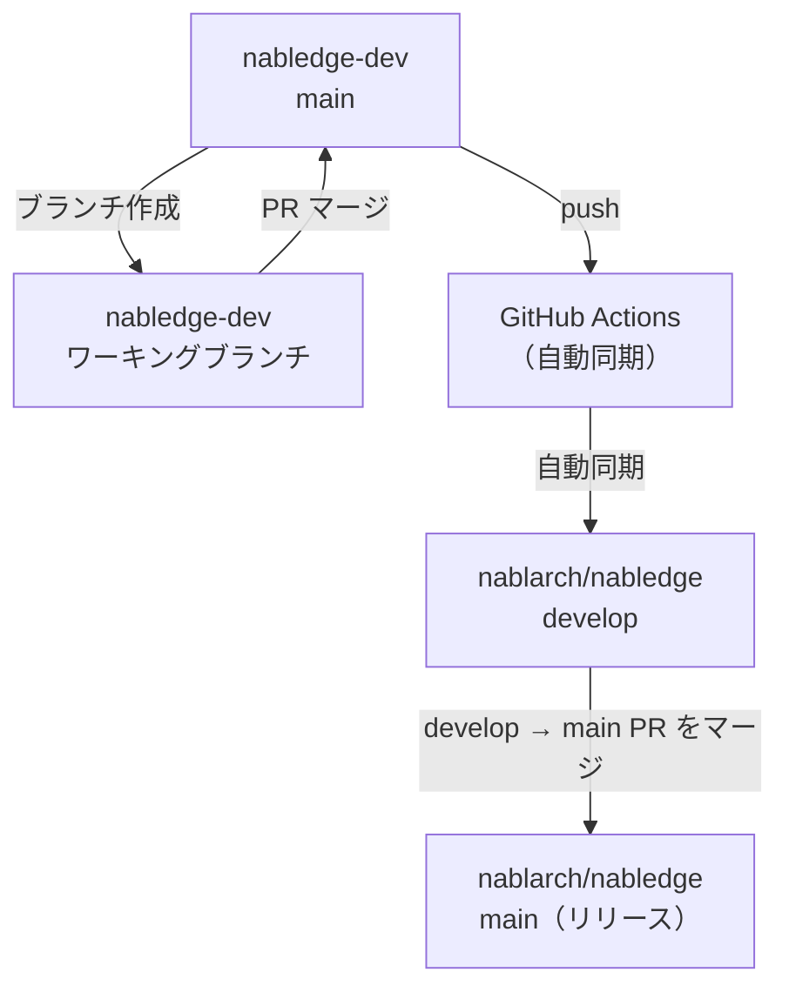

# nabledge-dev

[Nabledge](https://github.com/nablarch/nabledge) ナレッジ開発リポジトリ

## ドキュメント

- 📊 [開発状況](docs/development-status.md) - 現在の進捗とロードマップ
- 📐 [設計ドキュメント](docs/nabledge-design.md) - アーキテクチャと設計の詳細
- 🎯 [アクティビティマッピング](docs/activity-mapping.md) - Nabledge とのワークフローと役割分担
- 🚀 [グランドデザイン](docs/grand-design/grand-design.md) - Nablarch/Nabledge/Nableap 3製品戦略 ⚠️ **ドラフト - 未承認、変更の可能性あり**

## 前提条件

- WSL2 / Ubuntu
- CA 証明書（企業プロキシ環境の場合）

## セットアップ

### 1. CA 証明書のインストール（プロキシ環境の場合）

```bash
sudo cp /path/to/your/ca.crt /usr/local/share/ca-certificates/ca.crt
sudo update-ca-certificates
```

### 2. 環境セットアップ

```bash
./setup.sh
cp .env.example .env
# .env を編集して認証情報を設定する
```

## はじめ方

```bash
source .env
claude
```

## ブランチ戦略

このリポジトリはシングルブランチの開発ワークフローを採用しています：

| ブランチ | 目的 | ワークフロー |
|--------|------|------------|
| **main** | 開発ブランチ | すべての開発作業はプルリクエスト経由でここにマージされます。変更は [nablarch/nabledge:develop](https://github.com/nablarch/nabledge/tree/develop) に自動同期されます |

### 開発フロー



### 開発バージョンのテスト

`nablarch/nabledge:develop` の最新開発バージョンをテストするには：

1. **セットアップスクリプトをダウンロード：**
   ```bash
   curl -sSL https://raw.githubusercontent.com/nablarch/nabledge/develop/setup-6-cc.sh > /tmp/setup-6-cc.sh
   ```

2. **develop ブランチからインストール：**
   ```bash
   NABLEDGE_BRANCH=develop bash /tmp/setup-6-cc.sh
   ```

3. **インストールを確認：**
   ```bash
   claude-code
   # Claude Code セッション内で：
   /nabledge-6
   ```

### リリース手順

リリースは**このリポジトリではなく** **[nablarch/nabledge](https://github.com/nablarch/nabledge)** リポジトリで管理されます。

> nablarch/nabledge:develop での動作確認手順は「[開発バージョンのテスト](#開発バージョンのテスト)」を参照してください。

**nablarch/nabledge リポジトリでの手順：**

1. **リリース準備** - develop ブランチのバージョンファイルと CHANGELOG を更新
2. **リリース PR の作成** - `develop` から `main` ブランチへ PR を作成
3. **マージとタグ付け** - レビュー後、PR をマージしてバージョンタグを作成
4. **リリースの公開** - リリースノートとともに GitHub Release を作成

詳細なリリースワークフローは `.claude/rules/release.md` を参照してください。

## 開発

### カスタムスラッシュコマンド

このリポジトリは開発ワークフローを効率化するカスタムスラッシュコマンドを提供しています：

#### /hi - フル開発ワークフロー
イシュー/PR からレビュー依頼までの完全なワークフローを実行：
```
/hi 123        # イシュー #123 の作業を開始
/hi 456        # イシュー/PR #456 の作業を再開
/hi            # インタラクティブ選択
```
ブランチの作成、変更の実装、テストの実行、PR の作成を行います。

#### /fb - レビューフィードバック対応
PR レビューフィードバックに対応：
```
/fb 456        # PR #456 のレビューに対応
/fb            # 現在のブランチから自動検出
```
コメントを取得し、修正を実装、コミット、レビュアーに返信します。

#### /bb - マージとクリーンアップ
PR の承認・マージとブランチのクリーンアップ：
```
/bb 456        # PR #456 をマージしてブランチを削除
/bb            # 現在のブランチから自動検出
```
PR を承認、マージし、HEAD を main にデタッチしてブランチを削除します。

### nabledge スキルのテスト

`nabledge-test` スキルを使用して nabledge-6 の機能を検証します：

```
# 単一テストシナリオを実行
/nabledge-test 6 handlers-001

# 全テストシナリオを実行
/nabledge-test 6 --all

# 特定カテゴリのテストを実行
/nabledge-test 6 --category handlers
```

テストシナリオは `.claude/skills/nabledge-test/scenarios/nabledge-6/scenarios.json` で定義されています。結果は `.pr/xxxxx/test-<id>-<timestamp>.md` に保存されます。

nabledge-test スキルは skill-creator の評価手順を使用して以下を検証します：
- 正しいワークフロー実行（keyword-search、section-judgement）
- 期待するキーワードがレスポンスに含まれているか
- ナレッジファイルから適切なセクションが特定されているか
- LLM の学習データではなくナレッジファイルのコンテンツが使用されているか

## フィードバック

### 公開済みの nabledge スキルについて
[nablarch/nabledge Issues](https://github.com/nablarch/nabledge/issues) でイシューを報告するか機能リクエストを送ってください。ユーザーが検索・解決策を見つけやすくなります。

### 未リリースの開発作業について
[nablarch/nabledge-dev Issues](https://github.com/nablarch/nabledge-dev/issues) でイシューを報告するか変更について議論してください。
