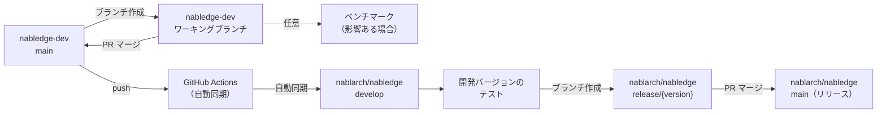

# nabledge-dev

[Nabledge](https://github.com/nablarch/nabledge) の開発リポジトリ

## ドキュメント

- 📊 [開発状況](docs/development-status.md) - 現在の進捗とロードマップ
- 📐 [設計ドキュメント](docs/nabledge-design.md) - アーキテクチャと設計の詳細
- 🎯 [アクティビティマッピング](docs/activity-mapping.md) - Nabledge とのワークフローおよび役割分担
- 📈 [メトリクス](docs/metrics.md) - 週次開発生産性と Nabledge 導入状況（自動更新）

## 前提条件

- WSL2 / Ubuntu
- CA 証明書（企業プロキシ環境の場合）

## セットアップ

### 1. CA 証明書のインストール（プロキシ環境の場合）

```bash
sudo cp /path/to/your/ca.crt /usr/local/share/ca-certificates/ca.crt
sudo update-ca-certificates
```

### 2. 環境セットアップ

```bash
SVN_BASE_URL=<SVN_URL> SVN_USERNAME=<username> SVN_PASSWORD=<password> ./setup.sh
cp .env.example .env
# .env を編集して認証情報を設定する
```

`SVN_BASE_URL` 等には v1.4/v1.3/v1.2 が格納されている SVN リポジトリの URL を指定します。

## 使い方

```bash
source .env
claude
```

## ブランチ戦略

このリポジトリはシングルブランチの開発ワークフローを採用しています。すべての開発作業はプルリクエスト経由で **main** ブランチにマージされ、変更は [nablarch/nabledge:develop](https://github.com/nablarch/nabledge/tree/develop) に自動同期されます。

### 開発フロー


```mermaid
flowchart LR
    MAIN["nabledge-dev<br/>main"]
    WB["nabledge-dev<br/>ワーキングブランチ"]
    BM["ベンチマーク<br/>（影響ある場合）"]
    GHA["GitHub Actions<br/>（自動同期）"]
    DEV["nablarch/nabledge<br/>develop"]
    TEST["開発バージョンの<br/>テスト"]
    RB["nablarch/nabledge<br/>release/{version}"]
    RELEASE["nablarch/nabledge<br/>main（リリース）"]

    MAIN -->|"ブランチ作成"| WB
    WB -.->|"任意"| BM
    WB -->|"PR マージ"| MAIN
    MAIN -->|"push"| GHA
    GHA -->|"自動同期"| DEV
    DEV --> TEST
    TEST -->|"ブランチ作成"| RB
    RB -->|"PR マージ"| RELEASE
```

### 開発バージョンのテスト

詳細は [`tools/tests/README.md`](tools/tests/README.md) を参照してください。

### リリース手順

バージョンファイルと CHANGELOG の更新はこのリポジトリ（nabledge-dev）で行います。その後、[nablarch/nabledge](https://github.com/nablarch/nabledge) リポジトリでリリース作業を行います。

> nablarch/nabledge:develop での動作確認手順は「[開発バージョンのテスト](#開発バージョンのテスト)」を参照してください。

**nablarch/nabledge リポジトリでの手順：**

1. **リリースブランチを作成** - `develop` から `release/{version}` ブランチを作成
2. **差分確認用 PR を作成** - `release/{version}` から `main` へ PR を作成し、変更内容をレビュー
3. **PR をマージ** - リリース OK になったら PR を承認してマージ

**リリース前セットアップ検証：** nablarch/nabledge でのリリース作業を開始する前に、セットアップスクリプトが正常動作することを確認します。

```bash
bash tools/tests/test-setup.sh
```

全バージョン（v6 / v5 / v1.4 / v1.3 / v1.2）のセットアップを検証し、すべて PASS / WARN になることを確認してください。詳細な手順と結果の見方は [`tools/tests/README.md`](tools/tests/README.md) を参照してください。

詳細なリリースワークフローは `.claude/rules/release.md` を参照してください。

## 開発

### カスタムスラッシュコマンド

このリポジトリには開発ワークフローを効率化するカスタムスラッシュコマンドが用意されています：

#### /hi - フル開発ワークフロー
イシュー起票から PR レビュー依頼まで一通りのワークフローを実行します：
```
/hi 123        # イシュー #123 の作業を開始
/hi 456        # イシュー/PR #456 の作業を再開
/hi            # インタラクティブ選択
```
ブランチの作成・変更の実装・テストの実行・PR の作成まで自動で行います。

#### /fb - レビューフィードバック対応
PR レビューのフィードバックに対応します：
```
/fb 456        # PR #456 のレビューに対応
/fb            # 現在のブランチから自動検出
```
コメントを取得し、修正を実装してコミット後、レビュアーに返信します。

#### /bb - マージとクリーンアップ
PR の承認・マージとブランチの後片付けを行います：
```
/bb 456        # PR #456 をマージしてブランチを削除
/bb            # 現在のブランチから自動検出
```
PR を承認してマージし、HEAD を main に切り替えてブランチを削除します。

### nabledge スキルのテスト

nabledge スキルの性能を改善した場合、`nabledge-test` スキルでベースラインと比較して改善効果を確認します。

### スキルの改善・バグ修正

イシューを起票して `/hi <issue_number>` でフル開発ワークフローを開始します。

スキルの改善によってナレッジファイルの再生成が必要な場合は RBKC を実行します（`<v>` は `6`, `5`, `1.4`, `1.3`, `1.2` のいずれか）：

```bash
bash tools/rbkc/rbkc.sh create <v>
bash tools/rbkc/rbkc.sh verify <v>
```

RBKC コード自体を変更した場合は、**5 バージョン全て**に対して実行する必要があります。詳細は `.claude/rules/rbkc.md` を参照してください。

### Nablarch ソース更新

`.lw/nab-official/` に格納された Nablarch 公式ドキュメントを最新化するには `setup.sh` を実行します（Git リポジトリは `git pull`、SVN リポジトリは `svn update` で更新されます）：

```bash
SVN_BASE_URL=<SVN_URL> SVN_USERNAME=<username> SVN_PASSWORD=<password> ./setup.sh
```

ソースを更新したら、RBKC を再実行してナレッジファイルを再生成してください（上記コマンドを参照）。

### ベンチマーク

スキルの回答精度・品質をシナリオベースで定量評価します。改善前後の比較（退行チェック）にも使用します。実行手順は [`tools/benchmark/HOW-TO-RUN.md`](tools/benchmark/HOW-TO-RUN.md) を参照してください。

## フィードバック

### 公開済みの nabledge スキルについて
[nablarch/nabledge Issues](https://github.com/nablarch/nabledge/issues) にイシューを登録するか、機能リクエストをお送りください。他のユーザーも検索・参照しやすくなります。

### 未リリースの開発作業について
[nablarch/nabledge-dev Issues](https://github.com/nablarch/nabledge-dev/issues) にイシューを登録するか、変更内容について議論してください。
