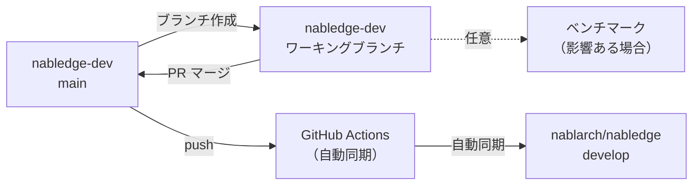
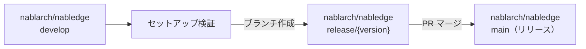

# nabledge-dev

[Nabledge](https://github.com/nablarch/nabledge) スキルの開発リポジトリです。

## ドキュメント

- 📊 [開発状況](docs/development-status.md) - 現在の進捗とロードマップ
- 📐 [設計ドキュメント](docs/nabledge-design.md) - アーキテクチャと設計の詳細
- 🎯 [アクティビティマッピング](docs/activity-mapping.md) - Nabledge とのワークフローおよび役割分担
- 📈 [メトリクス](docs/metrics.md) - 週次開発生産性と Nabledge 導入状況（自動更新）

## 前提条件

- WSL2 / Ubuntu
- CA 証明書（企業プロキシ環境の場合）

## セットアップ

### 1. CA 証明書のインストール（プロキシ環境の場合）

```bash
sudo cp /path/to/your/ca.crt /usr/local/share/ca-certificates/ca.crt
sudo update-ca-certificates
```

### 2. 環境セットアップ

```bash
SVN_BASE_URL=<SVN_URL> SVN_USERNAME=<username> SVN_PASSWORD=<password> ./setup.sh
cp .env.example .env
# .env を編集して認証情報を設定する
```

`SVN_BASE_URL` 等には v1.4/v1.3/v1.2 が格納されている SVN リポジトリの URL を指定します。

## 使い方

```bash
source .env
claude
```

## 開発

### リポジトリ構成

このプロジェクトは 2 つのリポジトリで管理されています。

| リポジトリ | 役割 |
|---|---|
| **nabledge-dev**（このリポジトリ） | スキルの開発・改善を行う作業場 |
| **[nablarch/nabledge](https://github.com/nablarch/nabledge)** | ユーザーへの配布リポジトリ |

nabledge-dev の `main` ブランチへのプッシュをトリガーに、GitHub Actions が nablarch/nabledge の `develop` ブランチへ変更を自動同期します。

### フロー


```mermaid
flowchart LR
    MAIN["nabledge-dev<br/>main"]
    WB["nabledge-dev<br/>ワーキングブランチ"]
    BM["ベンチマーク<br/>（影響ある場合）"]
    GHA["GitHub Actions<br/>（自動同期）"]
    DEV["nablarch/nabledge<br/>develop"]

    MAIN -->|"ブランチ作成"| WB
    WB -.->|"任意"| BM
    WB -->|"PR マージ"| MAIN
    MAIN -->|"push"| GHA
    GHA -->|"自動同期"| DEV
```

### 手順

作業は `/hi <issue_number>` で開始します。ブランチ作成・実装・PR 作成まで一通り実行されます。

| コマンド | 用途 |
|---|---|
| `/hi <number>` | イシューから PR 作成まで一通り実行 |
| `/fb <number>` | レビューフィードバックへの対応 |
| `/bb <number>` | PR のマージとブランチ削除 |

**ナレッジファイルの再生成（RBKC）**

スキルの改善によってナレッジファイルの再生成が必要な場合：

```bash
bash tools/rbkc/rbkc.sh create <v>   # v = 6 / 5 / 1.4 / 1.3 / 1.2
bash tools/rbkc/rbkc.sh verify <v>
```

RBKC コード自体を変更した場合は 5 バージョン全てに対して実行します（詳細: `.claude/rules/rbkc.md`）。

**Nablarch ソース更新**

`.lw/nab-official/` の Nablarch 公式ドキュメントを最新化する場合は `./setup.sh` を再実行し、その後 RBKC を再実行します。

**ベンチマーク**

プロンプト・ワークフロー・ナレッジファイルに影響する変更は、PR 前にベンチマークを実行して改善効果または退行がないことを確認します（詳細: [E2Eベンチマーク実行手順](tools/benchmark/HOW-TO-RUN.md)）。

## リリース

### フロー

nablarch/nabledge の `develop` ブランチに自動同期された変更を、`main` ブランチへリリースします。


```mermaid
flowchart LR
    DEV["nablarch/nabledge<br/>develop"]
    TEST["セットアップ検証"]
    RB["nablarch/nabledge<br/>release/{version}"]
    RELEASE["nablarch/nabledge<br/>main（リリース）"]

    DEV --> TEST
    TEST -->|"ブランチ作成"| RB
    RB -->|"PR マージ"| RELEASE
```

### 手順

まず nabledge-dev でバージョンファイルと CHANGELOG を更新します（詳細: `.claude/rules/release.md`）。その後、nablarch/nabledge リポジトリで以下を実施します：

1. **セットアップ検証** — `bash tools/tests/test-setup.sh` を実行し、全バージョンが PASS / WARN になることを確認（詳細: [test-setup.sh — セットアップテスト手順](tools/tests/README.md)）
2. **リリースブランチを作成** — nablarch/nabledge の `develop` から `release/{version}` ブランチを作成
3. **PR を作成・マージ** — `release/{version}` から `main` へ PR を作成し、承認後マージ

## フィードバック

- 公開済みのスキルについて: [nablarch/nabledge Issues](https://github.com/nablarch/nabledge/issues)
- 開発中の作業について: [nablarch/nabledge-dev Issues](https://github.com/nablarch/nabledge-dev/issues)
