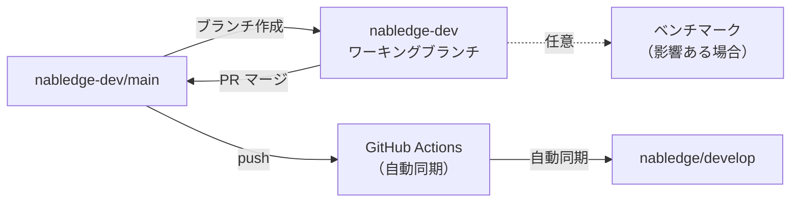
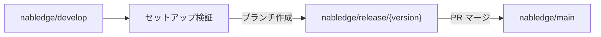

# nabledge-dev

[Nabledge](https://github.com/nablarch/nabledge) スキルの開発リポジトリです。

## ドキュメント

- 📊 [開発状況](docs/development-status.md) - 現在の進捗とロードマップ
- 📐 [設計ドキュメント](docs/nabledge-design.md) - アーキテクチャと設計の詳細
- 🎯 [アクティビティマッピング](docs/activity-mapping.md) - Nabledge とのワークフローおよび役割分担
- 📈 [メトリクス](docs/metrics.md) - 週次開発生産性と Nabledge 導入状況（自動更新）

## 前提条件

- WSL2 / Ubuntu
- CA 証明書（企業プロキシ環境の場合）

## セットアップ

### 1. CA 証明書のインストール（プロキシ環境の場合）

```bash
sudo cp /path/to/your/ca.crt /usr/local/share/ca-certificates/ca.crt
sudo update-ca-certificates
```

### 2. 環境セットアップ

```bash
SVN_BASE_URL=<SVN_URL> SVN_USERNAME=<username> SVN_PASSWORD=<password> ./setup.sh
cp .env.example .env
# .env を編集して認証情報を設定する
```

`SVN_BASE_URL` 等には v1.4/v1.3/v1.2 が格納されている SVN リポジトリの URL を指定します。

## 使い方

```bash
source .env
claude
```

## 開発

### リポジトリ構成

このプロジェクトは 2 つのリポジトリで管理されています。

| リポジトリ | 役割 |
|---|---|
| nabledge-dev（このリポジトリ） | スキルの開発・改善を行う作業場 |
| [nabledge](https://github.com/nablarch/nabledge) | ユーザーへの配布リポジトリ |

nabledge-dev/main へのプッシュをトリガーに、GitHub Actions が nabledge/develop へ変更を自動同期します。

### フロー


```mermaid
flowchart LR
    MAIN["nabledge-dev/main"]
    WB["nabledge-dev<br/>ワーキングブランチ"]
    BM["ベンチマーク<br/>（影響ある場合）"]
    GHA["GitHub Actions<br/>（自動同期）"]
    DEV["nabledge/develop"]

    MAIN -->|"ブランチ作成"| WB
    WB -.->|"任意"| BM
    WB -->|"PR マージ"| MAIN
    MAIN -->|"push"| GHA
    GHA -->|"自動同期"| DEV
```

### 手順

開発作業は Claude Code への指示で進めます。

#### スキル改善・不具合対応

1. 作業内容を Claude Code に伝えてイシューを作成
2. `/hi <number>` でスキル変更・PR 作成まで実行
3. ベンチマークを Claude Code に指示して実行
   - QA ベンチマーク: [E2Eベンチマーク実行手順](tools/benchmark/HOW-TO-RUN.md)
   - コード分析ベンチマーク: [コード分析ベンチマーク実行手順](tools/benchmark/HOW-TO-RUN-CODE-ANALYSIS.md)
   - 問題あり → 2 に戻る
   - 問題なし → 次へ
4. PR をレビュー（ユーザー作業）
5. フィードバックがあれば `/fb <number>` で対応
6. `/bb <number>` で PR をマージ

#### Nablarch ソース更新

1. 作業内容を Claude Code に伝えてイシューを作成
2. `./setup.sh` を再実行して Nablarch ソースを更新（ユーザー作業）
3. `/hi <number>` でナレッジファイルの再生成・PR 作成まで実行
4. PR をレビュー（ユーザー作業）
5. フィードバックがあれば `/fb <number>` で対応
6. `/bb <number>` で PR をマージ

## リリース

### フロー

nabledge/develop に自動同期された変更を、nabledge/main へリリースします。


```mermaid
flowchart LR
    DEV["nabledge/develop"]
    TEST["セットアップ検証"]
    RB["nabledge/release/{version}"]
    RELEASE["nabledge/main"]

    DEV --> TEST
    TEST -->|"ブランチ作成"| RB
    RB -->|"PR マージ"| RELEASE
```

### 手順

1. 作業内容を Claude Code に伝えてイシューを作成
2. `/hi <number>` でバージョンファイル・CHANGELOG 更新・PR 作成まで実行（詳細: `.claude/rules/release.md`）
3. PR をレビュー（ユーザー作業）
4. フィードバックがあれば `/fb <number>` で対応
5. `/bb <number>` で PR をマージ（nabledge/develop に自動同期される）
6. Claude Code にセットアップ検証を指示して実行（詳細: [セットアップテスト手順](tools/tests/README.md)）
7. nabledge/develop から `release/{version}` ブランチを作成（ユーザー作業）
8. nabledge/release/{version} から nabledge/main へ PR を作成・マージ（ユーザー作業、このマージがリリース）
9. リリースタグを追加（ユーザー作業）

## フィードバック

- 公開済みのスキルについて: [nabledge Issues](https://github.com/nablarch/nabledge/issues)
- 開発中の作業について: [nabledge-dev Issues](https://github.com/nablarch/nabledge-dev/issues)
