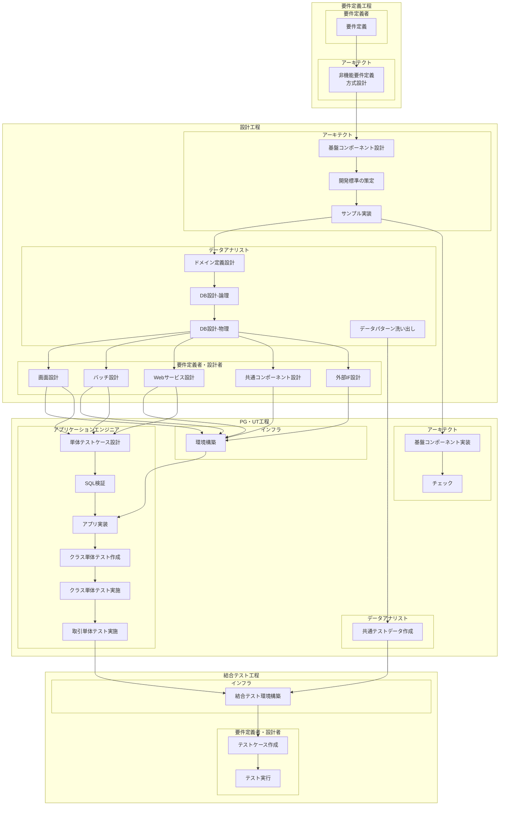

# AsIs: Nablarch開発プロセスフロー

**出典**: [Nablarchを使用した開発の流れ.xlsx](../.lw/nab-official/v6/nablarch-system-development-guide/Sample_Project/設計書/Nablarchを使用した開発の流れ.xlsx)

**作成日**: 2026-02-16
**関連**: [ToBe開発プロセス](./tobe-dev-flow.md)

---

## プロセスフロー図

---

## ロール一覧

| ロール | 主な担当アクティビティ | 主な成果物 |
|--------|------------------------|-----------|
| **要件定義者** | 機能要件定義、業務フロー作成 | 機能要件書、業務フロー図 |
| **アーキテクト** | 非機能要件定義、基盤コンポーネント設計、方式設計、開発標準策定、サンプル実装、環境構築 | 非機能要件書、方式設計書、基盤コンポーネント設計書、コーディング規約、UI標準、単体テスト標準、開発ガイド |
| **データアナリスト** | DB設計（論理・物理）、データパターン洗い出し、共通テストデータ作成 | ER図（概念/論理/物理）、テーブル定義書、ドメイン定義設計書、コード設計書、データパターン表、共通テストデータ |
| **要件定義者／設計者** | 画面設計、バッチ設計、Webサービス設計、共通コンポーネント設計、外部インタフェース設計、結合テストケース作成・実行 | 画面遷移図、画面一覧、システム機能設計書（画面/バッチ/Webサービス）、共通コンポーネント設計書、外部インタフェース設計書 |
| **アプリケーションエンジニア** | アプリ実装、単体テストケース設計、クラス単体テスト作成・実施、取引単体テスト実施 | 業務アクション、業務フォーム、業務画面JSP、SQLファイル、単体テスト仕様書、テストコード、単体テスト結果 |
| **インフラ** | 結合テスト環境構築 | - |

---

## 主要成果物（工程別）

| 工程 | IN（インプット） | OUT（アウトプット） | 形式 |
|------|------------------|---------------------|------|
| **要件定義** | 業務ヒアリング結果 | 機能要件書、非機能要件書、業務フロー図 | Word/Excel |
| **設計** | 機能要件書、非機能要件書 | 方式設計書、基盤コンポーネント設計書、コーディング規約、UI標準、単体テスト標準、開発ガイド、ER図、テーブル定義書、システム機能設計書（画面/バッチ/Webサービス）、共通コンポーネント設計書、外部インタフェース設計書 | Excel/Word |
| **PG・UT** | 方式設計書、システム機能設計書、テーブル定義書 | 業務アクション、業務フォーム、業務画面JSP、SQLファイル、単体テスト仕様書、テストコード、単体テスト結果、共通テストデータ | Java/JSP/SQL/Excel |
| **結合テスト** | システム機能設計書、共通テストデータ | テストケース、テスト結果、バグ報告 | Excel |

---

## 課題

- **手作業中心**で工数がかかる（特にPG・UT工程：実装、単体テスト、レビュー）
- **Excel中心の設計書**でAIが活用しにくい（システム機能設計書、テーブル定義書等）
- アプリケーションエンジニアの**Nablarch習熟に時間**がかかる（オンボーディング2-4週間）
- コード品質が**アプリケーションエンジニアのスキルに依存**
- **設計書とコードの乖離**が発生しやすい（ドキュメントメンテナンス負担）
- **レビュー負荷**が高い（シニア開発者へ集中）
- **取引単体テスト（打鍵テスト）の工数**が大きい

---

**Document Owner**: Nablarch Development Team
**Last Updated**: 2026-02-16
