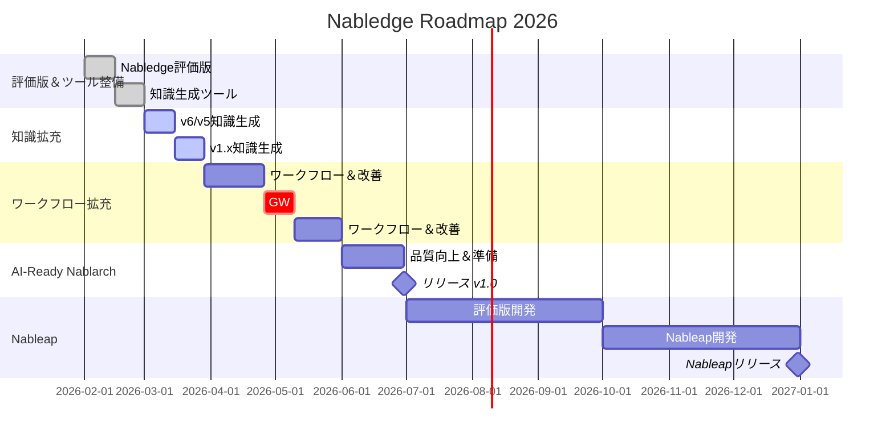

# Nabledge 開発状況

最終更新: 2026-02-24

## トレードオフスライダー

| 項目 | 固定 ← → 調整可能 | 意味 |
|------|:---:|------|
| リリース速度 | ■ □ □ □ □ | 早く出す。新規＞改善 |
| 導入の手軽さ | ■ □ □ □ □ | 導入障壁が高いと使われない |
| 知識のカバー範囲 | ■ □ □ □ □ | v6/v5のバッチ＞REST優先、1.4以前は後回し |
| 検索・回答の精度 | □ □ □ □ ■ | まず広く出して、精度は使われてから磨く |
| ワークフローの充実度 | □ □ □ □ ■ | まず知識検索で価値を証明してから追加 |

※ 知識ファイルは生成AIで生成・検証し人はサンプリングチェックのみ実施、正式リリース前に全量チェックを予定している

## ロードマップ

### フェーズ別開発内容

**評価版＆ツール整備（2月）**: Nabledge基盤構築
- Nabledge評価版開発
- 知識生成ツール開発

**知識拡充（3月）**: Nablarch知識ベース構築
- Nablarch v6/v5の知識生成
- Nablarch v1.4/v1.3/v1.2の知識生成

**ワークフロー拡充（3月末-5月）**: AI開発支援機能強化
- ワークフロー拡充＆Nablarch改善
- GW休暇期間
- 継続的な機能拡充と改善

**AI-Ready Nablarch/Nabledgeリリース（6月）**: 正式リリース
- 品質向上とリリース準備
- 6月30日：AI-Ready Nablarch/Nabledge v1.0リリース

**Nableap（7-12月）**: SoR→Nablarch移行サービス
- 2Q：Nableap評価版開発
- 3Q：Nableap本格開発
- 4Q：Nableapリリース（市場拡大に向けた移行サービス）

## 現在の作業 (今週)

- 知識ファイル生成/検証整備
- バッチの追加
  - スコープ詳細: [nabledge-design.md § 1.5 スコープ](nabledge-design.md#15-スコープ) を参照

## 次の作業 (来週)

- チェック項目の追加
  - 詳細: [nabledge-design.md § 2.2 知識タイプ](nabledge-design.md#22-知識タイプ) を参照
- NTF（Nablarch Testing Framework）の追加

## 今後の作業 (4Q)

- RESTの追加
- 過去バージョン（1.4/1.3/1.2）の追加

## 今後の作業 (4月以降)

- 利用PJからのフィードバック対応
- ワークフローの追加
- PJ実績を積み重ねてから正式リリース（PJ利用状況次第、6月or9月頃）
