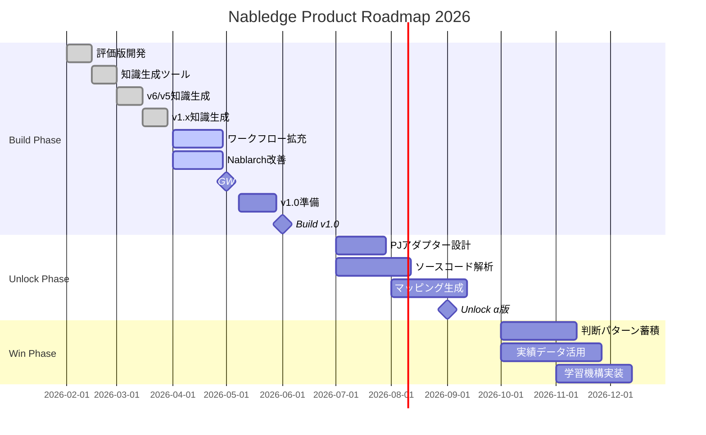

# Nabledge 開発状況

最終更新: 2026-02-24

## トレードオフスライダー

| 項目 | 固定 ← → 調整可能 | 意味 |
|------|:---:|------|
| リリース速度 | ■ □ □ □ □ | 早く出す。新規＞改善 |
| 導入の手軽さ | ■ □ □ □ □ | 導入障壁が高いと使われない |
| 知識のカバー範囲 | ■ □ □ □ □ | v6/v5のバッチ＞REST優先、1.4以前は後回し |
| 検索・回答の精度 | □ □ □ □ ■ | まず広く出して、精度は使われてから磨く |
| ワークフローの充実度 | □ □ □ □ ■ | まず知識検索で価値を証明してから追加 |

※ 知識ファイルは生成AIで生成・検証し人はサンプリングチェックのみ実施、正式リリース前に全量チェックを予定している

## ロードマップ

### フェーズ別開発内容

**Build Phase（2-6月）**: Nablarch開発AI支援の基礎
- Nablarch公式ドキュメント知識ベース（v6/v5/v1.x）
- 基本ワークフロー（知識検索、実装支援、設計サポート）
- v1.0正式リリース

**Unlock Phase（7-9月）**: 既存PJ資産のAI-Ready化
- ソースコード解析エンジン
- 開発ガイド・成果物マッピング自動生成
- PJアダプター（汎用＋PJ固有設定）

**Win Phase（10-12月）**: 組織知識の蓄積と活用
- 判断パターン・実績ノウハウの自動蓄積
- 実績データに基づく見積精度向上
- PJを重ねるほど強くなる学習機構

## 現在の作業 (今週)

- 知識ファイル生成/検証整備
- バッチの追加
  - スコープ詳細: [nabledge-design.md § 1.5 スコープ](nabledge-design.md#15-スコープ) を参照

## 次の作業 (来週)

- チェック項目の追加
  - 詳細: [nabledge-design.md § 2.2 知識タイプ](nabledge-design.md#22-知識タイプ) を参照
- NTF（Nablarch Testing Framework）の追加

## 今後の作業 (4Q)

- RESTの追加
- 過去バージョン（1.4/1.3/1.2）の追加

## 今後の作業 (4月以降)

- 利用PJからのフィードバック対応
- ワークフローの追加
- PJ実績を積み重ねてから正式リリース（PJ利用状況次第、6月or9月頃）
