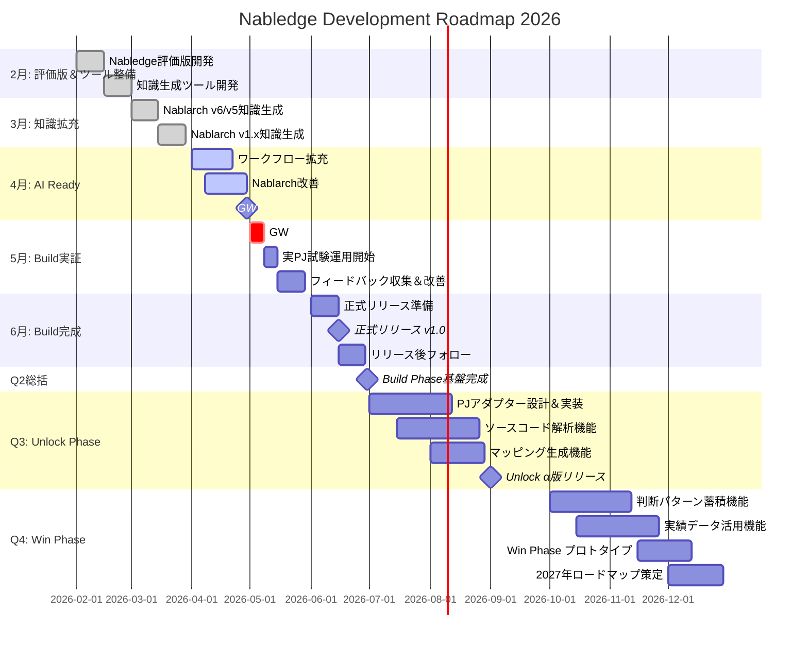

# Nabledge 開発状況

最終更新: 2026-02-24

## トレードオフスライダー

| 項目 | 固定 ← → 調整可能 | 意味 |
|------|:---:|------|
| リリース速度 | ■ □ □ □ □ | 早く出す。新規＞改善 |
| 導入の手軽さ | ■ □ □ □ □ | 導入障壁が高いと使われない |
| 知識のカバー範囲 | ■ □ □ □ □ | v6/v5のバッチ＞REST優先、1.4以前は後回し |
| 検索・回答の精度 | □ □ □ □ ■ | まず広く出して、精度は使われてから磨く |
| ワークフローの充実度 | □ □ □ □ ■ | まず知識検索で価値を証明してから追加 |

※ 知識ファイルは生成AIで生成・検証し人はサンプリングチェックのみ実施、正式リリース前に全量チェックを予定している

## ロードマップ

### フェーズ説明

**Build Phase（2-6月）**: 知識検索とワークフロー実装
- Nablarch公式ドキュメントの知識ベース化
- 基本ワークフロー（検索、実装支援）実装
- 実プロジェクトでの試験運用と正式リリース

**Unlock Phase（7-9月）**: PJ資産のAI-Ready化
- 既存PJのソースコード解析
- 開発ガイド・成果物マッピング生成
- PJアダプター（汎用＋PJ固有）開発

**Win Phase（10-12月）**: 組織資産としての価値最大化
- 判断パターン・実績ノウハウの蓄積機能
- PJを重ねるほど強くなる仕組み
- 見積精度向上、品質標準化の実現

## 現在の作業 (今週)

- 知識ファイル生成/検証整備
- バッチの追加
  - スコープ詳細: [nabledge-design.md § 1.5 スコープ](nabledge-design.md#15-スコープ) を参照

## 次の作業 (来週)

- チェック項目の追加
  - 詳細: [nabledge-design.md § 2.2 知識タイプ](nabledge-design.md#22-知識タイプ) を参照
- NTF（Nablarch Testing Framework）の追加

## 今後の作業 (4Q)

- RESTの追加
- 過去バージョン（1.4/1.3/1.2）の追加

## 今後の作業 (4月以降)

- 利用PJからのフィードバック対応
- ワークフローの追加
- PJ実績を積み重ねてから正式リリース（PJ利用状況次第、6月or9月頃）
