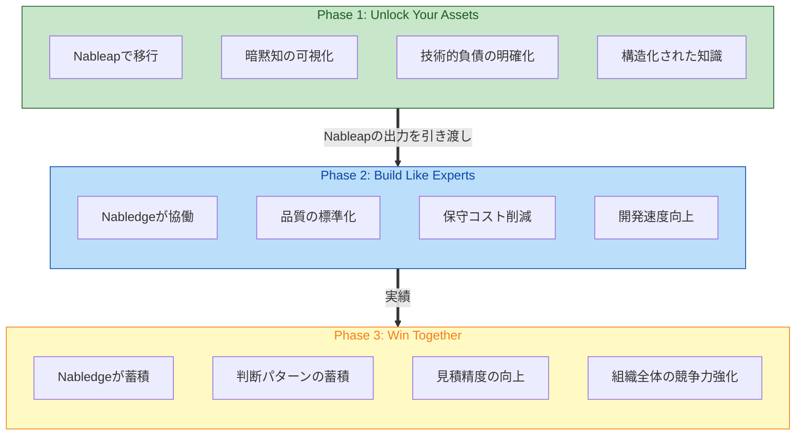
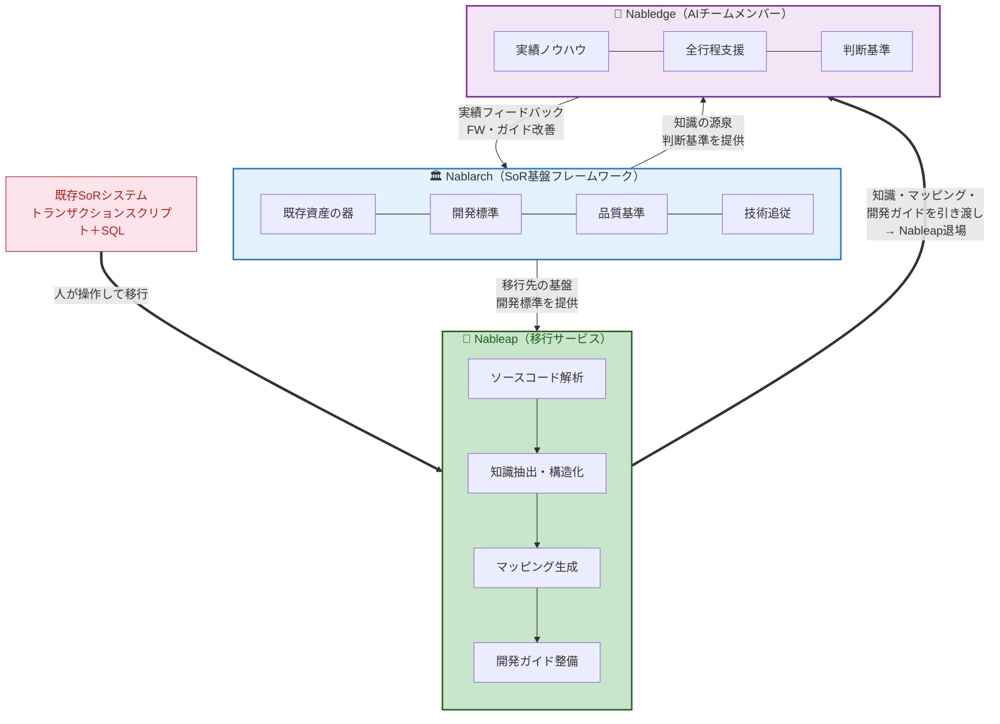

> **⚠️ 重要**: このドキュメントは未承認のドラフトです。内容は変更される可能性が大いにあります。

# Get AI-Ready. We Cover You.

SoR領域の基幹系システムを、事業の足枷から競争力の源泉へ。

## SoR領域の現実

### 調査結果

- 投資の硬直化 —保守・運用にリソースが張り付き、攻めの投資に回せない[^1]
- 技術追従の停滞 —FW・ミドルウェアのバージョンアップやセキュリティ対応が遅れる[^2]
- 市場対応速度の低下 —ビジネス要求に対してシステム改修が追いつかない[^1]
- 人材の悪循環 —レガシー環境で採用・定着が困難[^3] → さらに属人性が高まる
- AI開発ツールの限界 —既存ツールはモダンアーキテクチャ前提。SoR領域には機能しない[^4][^5]

### 仮説

- 属人性 —システム全体を把握できるのはベテランだけ。判断基準が人の頭の中にある
- 暗黙知の散在 —業務ルールがコード・SQL・設計書・テストデータに散らばり、明文化されていない
- 判断基準の不在 —ルールはあっても適用判断がない。レビュー品質がレビューア依存
- 経験の断絶 —PJ終了で知見が散逸。同じ失敗が繰り返される
- 構造の不透明さ —成果物間の依存が追えず、変更影響が見通せない
- レガシー向けAI支援は「モダンへの変換」が目的。「レガシーのまま支援する」ものがない
- SoR領域の基幹系だけが、AI駆動開発の恩恵から取り残されている

## あるべき姿

- 組織が技術的負債を整理し、保守リソースを攻めの投資に回している
- チームがアーキテクトの属人性に依存せず、根拠ある技術判断で開発を進めている
- 基幹系システムが市場変化に迅速に追従できている
- 組織がPJを重ねるほどシステム資産の価値を高め、競争力を蓄積している

## ソリューション：Nableap + Nabledge

### 全体像

2つのプロダクトと3つのフェーズで価値を提供する：

- **Nableap** — 既存システムをNablarch/Nabledge環境に移行するツール。人が操作する
- **Nabledge** — Nableapが整備した環境の上で、開発者と協働するAIチームメンバー

3つのフェーズ：

1. **Unlock Your Assets** — Nableapで資産をAI-Readyに移行する
2. **Build Like Experts** — Nabledgeとエキスパートレベルの開発をチームで実現する
3. **Win Together** — 経験を組織資産に変え、競争力を高め続ける

各フェーズは単独でも価値があり、同時に次のフェーズの土台にもなる。

### Nablarch・Nableap・Nabledgeの関係

**🏛️ Nablarch（SoR基盤フレームワーク）**
- 既存資産の器：トランザクションスクリプト＋SQLのシステムを受け入れる
- 開発標準：設計書フォーマット＋開発ガイドを提供
- 品質基準：規約・テスト標準を内包
- 技術追従：Jakarta EE / Java最新版への対応

**🔧 Nableap（移行サービス）**
- 既存SoRシステムをNablarch/Nabledge環境に移行する
- 人が操作するツール。AIは各ステップの実行を支援するが、全体の進行判断は人が行う
- 移行完了後、生成した知識・マッピング・開発ガイドをNabledgeに引き渡して退場する

**🤖 Nabledge（AIチームメンバー）**
- 実績ノウハウ：Nablarchでの大規模ミッションクリティカル開発・運用の知見
- 全行程支援：要件定義→設計→実装→テスト→保守まで技術面から支援・代行
- 判断基準：ベテランの技術判断を標準化し、チーム全体で共有

**3つの流れ：**

- **移行の流れ：** 既存SoRシステム → Nableapが移行 → Nabledgeに引き渡し → Nabledgeが開発者と協働
- **知識の流れ：** Nablarchが開発標準・品質基準をNableapとNabledgeに提供。NableapはNablarchの基盤の上に移行先を構築する
- **進化の循環：** NabledgeがPJで蓄積した実績をNablarchにフィードバック。NablarchのFW改善がNabledgeの判断力を強化する。使うほど強くなるエコシステム

### Nabledgeの位置づけ

Nabledgeはツールではなく、プロジェクトに参加するAIチームメンバーです。既存のAI開発ツールはモダンアーキテクチャを前提としていますが、NabledgeはSoR領域の基幹系システムに特化しています。Nablarchで実績ある大規模ミッションクリティカルなシステム開発・運用ノウハウに基づいた判断力を持ち、PM、アーキテクト、設計者、開発者と協働しながら実現性検証、設計支援、実装/テスト/レビューなど幅広い工程で頼れる存在です。

リーダーではなく、優秀なメンバーとして動きます。GitHubのissueとPRを接点に、人間が要件を伝えるとIssue提案→承認→計画・実装→テスト・レビュー→承認・マージと進みます。既存の開発プロセスを変える必要はありません。人間は要件定義と承認、事業判断と技術判断という本質的な作業に集中できます。

### Phase 1: Unlock Your Assets — Nableapで資産をAI-Readyに移行する

Nableapを使い、既存システムに眠る暗黙知と業務ルールを、AIが活用できる形に変換します。トランザクションスクリプト＋SQLで構築されたシステムを対象に、Nablarch/Nabledge環境への移行を実行します。

Nableapは人が操作するツールです。移行作業はシステムごとに状況が違うため、NabチームやアーキテクトがNableapを使い、ステップごとに判断しながら進めます。AIは各ステップの実行を支援しますが、全体の進行判断は人が行います。

**企業が得られるもの：**
- 開発ガイド（現行とAI-Ready）
- 構造化された知識（JSON）
- 成果物間のマッピング
- 技術的負債の可視化

**誰にとっての価値：**
- アーキテクト：Nableapで暗黙知を明示化し、AI-Readyへの移行計画を立案できる
- アプリエンジニア：移行後、Nabledgeを通じて構造化された業務ルールへ即座にアクセスできる
- PJマネージャー：Nableapがタスクの依存関係を可視化し、リソース配置を最適化できる
- 経営層・IT投資判断者：Nableapが技術的負債を定量化し、データに基づく投資判断を実現できる

### Phase 2: Build Like Experts — エキスパートレベルの開発をチームで実現する

Nabledgeにより、経験の浅いメンバーもベテランの判断基準で開発できます。Nabledgeが実装・テスト・レビューの品質を標準化し、組織は保守運用コストを削減しながら、戦略的投資に予算をシフトできます。

**企業が得られるもの：**
- 実装・テスト生成・セルフレビューの自動化
- 品質チェックの標準化
- 工数の可視化
- 判断と結果のissue・PRへの記録

**誰にとっての価値：**
- アーキテクト：Nabledgeが日常の技術判断を代行し、根本設計・トレードオフ判断に専念できる
- アプリエンジニア：Nabledgeが実装・テスト生成・セルフレビューを実行し、承認・業務判断・最終責任という価値ある業務に注力できる
- レビューア：Nabledgeが品質基準に照らして事前チェックし、本質的な設計レビューに専念できる
- PJマネージャー：Nabledgeにより新メンバーを即戦力化し、安定した開発体制を維持できる
- 業務部門：Nabledgeが要件の実現工数見積を素早く提供し、迅速な優先度判断を実現できる

組織はIT予算の80%を占める保守運用コストを削減し、戦略的投資に予算をシフトできます。ベテランが抜けても判断基準がNabledgeに残ります。新人が入ってもNabledgeが隣でやって見せます。

### Phase 3: Win Together — 経験を組織資産に変え、競争力を高め続ける

Nabledgeがプロジェクトごとに蓄積した判断パターンと品質ノウハウを、組織全体の資産に変えます。バージョンアップの影響分析、類似案件の見積精度向上、次のプロジェクトは過去の全経験を持つAIとスタートできます。

**企業が得られるもの：**
- 設計判断・品質知見・リスクパターンの蓄積
- バージョンアップの影響分析・テスト生成
- 類似案件の実績データに基づく見積精度向上
- 障害対応ナレッジの蓄積

**誰にとっての価値：**
- アーキテクト：Nabledgeがバージョンアップの影響分析・テスト生成を支援し、「何が壊れるか」を明確にした上で確実な判断を下せる
- アプリエンジニア：Nabledgeが過去PJの判断パターンを保持し、実績に基づく確実な開発を実現できる
- PJマネージャー：Nabledgeが PJ中の知見を自動蓄積し、組織資産として永続的に活用できる
- 経営層・IT投資判断者：Nabledgeが技術的負債の定量データを継続的に提供し、エビデンスに基づく投資判断を実現できる
- 業務部門：Nabledgeが類似案件の実績から見積精度を向上し、要件の実現可能性を迅速に判断できる

Nabledgeは既存AIツールができなかった「レガシーのまま支援する」を実現します。モダナイゼーション不要で、現行システムのままAI駆動開発の恩恵を受けられます。

### 実現の仕組み

#### なぜミッションクリティカルで使えるのか

汎用AIが持っているのはオープンデータから学習した一般知識です。それ以外は推測に頼ります。大規模ミッションクリティカルなシステム開発の実践的なノウハウ（スキルがバラバラなチームでどう品質を揃えるか、オフショアの短期立ち上げで何を標準化するか、どういうレビュー順序が見落としを防ぐか、テストデータをどう作れば本番条件を再現できるか）は、オープンデータにはほぼ存在しません。

汎用AIは一般知識で動作するため、具体的な判断は推測に頼らざるを得ません。一方Nabledgeは、オープンデータに加えてNablarch固有の知識と、現場経験から設計されたワークフローを組み合わせることで、確定的な判断パスで動作します。

知識は「何を知っているか」。ワークフローは「どう判断してどう動くか」。知識はドキュメント化すれば移転できます。実績はデータがあれば蓄積できます。しかしワークフローは「この場面ではこの順番でこう判断する」を現場経験から設計しないと作れません。

**知識 × ワークフロー × 実績の中で、最も真似しにくいのはワークフロー。**

NabチームはNablarch自体の開発・保守、そしてNabledge自身の開発を通じて、この現場経験を持っています。バージョンアップでどこが壊れやすいか、大規模PJでどういう開発ガイドが実際に機能したか、どういうテスト設計が本番障害を防いだか。この経験がワークフローに埋め込まれているから、Nabledgeは推測ではなく確定的なパスで動作します。

#### アーキテクチャ

- インターフェース：AIエージェントプラットフォーム上のスキルとして動作。開発者にとっては普通のAIアシスタントと同じ使い方
- コア：知識とワークフロー。Nablarch固有の判断力が入っている
- 実績：知識とワークフローに注入される。PJを重ねるほどコアが強くなる

開発者から見れば「Nablarchに詳しい優秀なAIアシスタント」です。裏側では知識ファイルとワークフローが構造化され、実績データで精度が向上し続けます。

## 3つのフェーズ：還元を安全にするための積み上げ

3フェーズは「蓄積の順番」ではありません。**本番運用中のシステムに知見を安全に還元するための条件が積み上がる順番**です。

### Unlock Your Assets — Nableapで開発ガイドを整備し、Nabledgeが動ける状態を作る

**Winの還元要件「どこに適用するのか」の土台を作る。**

Unlockの核心は**開発ガイドの整備**です。Nabledgeがチームメンバーとして「このPJではこう作る」を理解するための基準を作ります。現行の開発ガイドとAI-Readyの開発ガイド、この2つを整備します。

**主役はNableap。** NabチームやアーキテクトがNableapを操作し、ステップごとに判断しながら移行を進めます。

**起点はソースコード解析。** 動いているコードは検証済みの事実です。設計書は不完全でテストされていません。LLMはコード解析が得意なので、コードから「今どう作っているか」を逆算する方が確実です。設計書は補助情報・検証対象として扱い、コードから取れない業務的意味は対話ループで人間に確認します。

**Nableapによる移行の流れ：**

1. ソースコード解析 →Nableapが現行システムの構造を把握（動いている事実から）
2. 現行の開発ガイド導出 →Nableapが今のPJが実際にどう作っているかを明示化
3. AI-Readyの開発ガイド作成 →NabチームがNablarch上でどう作るかを知識で変換
4. AI-Readyのマッピング →Nableapが移行後の構造を生成

**対象となる成果物（10種類）：**

| # | 成果物 | 扱う内容 |
|---|--------|---------|
| 1 | 要件定義書 | スコープ、目的、目標値、業務フロー、業務ルール、変更要求仕様 |
| 2 | 設計書（外部設計） | 機能設計、画面設計、バッチ外部仕様、テーブル論理設計、IF定義、メッセージ定義 |
| 3 | 設計書（内部設計） | クラス設計、SQL設計、テーブル物理設計、処理フロー。開発ガイドが充実していればマッピングのみで済む |
| 4 | 開発ガイド | 方式設計＋開発標準＋手順を統合。PJにおける「どう作るか」の唯一の基準。変更はアーキテクト承認 |
| 5 | ソースコード | Java/JSP/SQL、テストコード、XML設定 |
| 6 | テスト仕様書/報告書 | テストケース、テスト結果、性能テスト結果 |
| 7 | テストデータ | 共通テストデータ、テストケース用データ |
| 8 | 不具合票 | 障害票、設計修正指示 |
| 9 | チェックリスト/レビュー結果 | レビューチェックリスト、レビュー指摘事項 |
| 10 | 工数見積 | 見積データ、見積書 |

**成果物の階層構造：** 上位が充実していれば下位は薄くなる。

- 開発ガイド（#4）が方式・標準・手順を規定する
- 設計書（#2, #3）は開発ガイドからの差分・固有部分。開発ガイドが充実していれば内部設計（#3）はマッピングのみ、外部設計（#2）も薄くなる
- ソースコード（#5）、テスト（#6, #7）は設計書＋開発ガイドの実装

**要件定義書と設計書の区分：**

- 要件定義書（#1）—「なぜ」と「何を」。システムの外側。業務部門からの要求が入力、Nabledgeにとっての判断の前提条件が出力
- 設計書・外部設計（#2）—ユーザーから見たシステムの振る舞い。要件定義書が入力、「何を作るか」の仕様が出力
- 設計書・内部設計（#3）—システムの内部構造。外部設計＋開発ガイドが入力、「どう作るか」の指示が出力。開発ガイドが充実しているPJでは、内部設計の大部分は「開発ガイドのどのパターンを使い、固有の項目は何か」を記述するだけ

**Nableapの2つの解析モード：**

Nableapは対象システムの特性に応じて2つの解析モードを持つ。

- **汎用解析** —Nabチームが提供。FWが構造を規定している成果物向け（ソースコード、XML設定、テスト等）。PJが変わっても使い回せる。ソースコード・テーブル定義・マスタテーブルから業務仕様を機械的に抽出する
- **PJ固有解析** —PJごとにアーキテクトが設定。フォーマットがPJ依存の成果物向け（設計書、要件定義書等）。業務仕様がどの成果物に書かれているかはPJ次第なので、アーキテクトがその所在を指定する

**Nableapの出力（3種）：**

- 知識（JSON）—成果物から抽出・検証・確定した情報。Nabledgeの判断基準になる
- マッピング（JSON）—3層のメタ構造
  - ① 知識 ↔ 元成果物（トレーサビリティ：この知識はどこから来たか）
  - ② 成果物間（テーブル単位の依存関係：設計書↔ソースコード↔テーブル↔SQL）。カラム単位の特定はBuild時にNabledgeが動的解析で行う
  - ③ 知識間（規約↔実装パターン、バッチ入出力依存チェーン等）
- 不整合リスト —コードと設計書の矛盾、規約と実態の乖離、暗黙の前提。対話ループのトリガーになる

**対話ループで知識を確定する：**

不整合リストを起点に、Nableapを操作するNabチームやアーキテクトが、設計者・アプリエンジニアに確認を取ります。回答がそのまま知識とマッピングに反映されます。暗黙知の明示化は「作業」ではなく「日常のやり取り」です。

**Nableapの出力をNabledgeに引き渡す：**

移行が完了すると、Nableapが生成した知識・マッピング・開発ガイドはすべてNabledgeに引き渡されます。以降はNabledgeがこれらを基盤として保持・活用し、Build/Winフェーズで継続的に動きます。Nableapはここで退場します。

**人ごとの価値：**
- アーキテクト →Nableapで暗黙知を明示化し、AI-Ready移行計画を立案できる
- アプリエンジニア →移行後、Nabledgeが構造化された業務ルールを保持し、必要な情報へ即座にアクセスできる
- PJマネージャー →Nableapがタスクの依存関係を可視化し、最適なリソース配置を実現できる
- 経営層・IT投資判断者 →Nableapが技術的負債を定量化し、エビデンスに基づく投資判断を実現できる
- 情シス・システム管理者 →Nableapがシステム全体の依存関係を可視化し、戦略的なシステム管理を実現できる

**ポイント：**
- Unlockは業務ロジックの書き直し（モダナイゼーション）ではなく、トランザクションスクリプト＋SQLをそのままNablarch環境に移行する
- Nableapは人が操作するツール。AIは各ステップの実行を支援するが、全体の進行判断は人が行う
- マッピングの②③がBuildの影響分析の基盤、Winの還元先特定の土台になる
- マッピング層2はテーブル単位で保持し、カラム単位の依存特定はBuild時にNabledgeがソースコードを動的解析（Unlockのコスト予測可能性を守りつつ、LLMのコード解析力を活用）

### Build Like Experts — Nabledgeが判断・生成・検証を日常的に回す

**Buildフェーズで、Winの還元要件「変えても大丈夫か」「品質基準を満たすか」「どう確認するか」を日常業務として確立します。**

**人ごとの価値：**
- アーキテクト →Nabledgeが日常の技術判断を代行し、根本設計・トレードオフ判断に専念できる
- アプリエンジニア →Nabledgeが実装・テスト生成・セルフレビューを実行し、承認・業務判断・最終責任という価値ある業務に注力できる
- レビューア →Nabledgeが品質基準に照らして事前チェックし、本質的な設計レビューに専念できる
- PJマネージャー →Nabledgeにより新メンバーを即戦力化し、安定した開発体制を維持できる。工数の可視化で計画精度を向上できる
- 業務部門 →Nabledgeが要件の実現工数見積を素早く提供し、迅速な優先度判断を実現できる

**ポイント：**
- Nablarchが品質保証の判断基準を内包しているから、NabledgeがAIチームメンバーとして機能する
- NabledgeがAI同士でピアレビュー。人間は品質の最終責任者
- ベテランが抜けても判断基準がNabledgeに残る。新人が入ってもNabledgeが隣でやって見せる
- Nabledgeが判断と結果をissue・PRに記録し続ける。これがWinへの蓄積になる

### Win Together — 蓄積された実績で還元の精度が上がり続ける

**Buildで日常的に回している仕組みの適用範囲を広げる。**

Winの本質は新しい仕組みを作ることではなく、Buildで回っているサイクルの再適用です。本番運用中のシステムに知見を安全に還元できるのは、Unlock（構造把握）とBuild（判断・検証能力）が積み上がっているからです。

**還元時にNabledgeが答えられる問い：**
1. どこに適用するのか —Nableapが作ったマッピング（成果物間・知識間の依存関係）をNabledgeが引き継いで特定する
2. 変えても大丈夫か —Buildで使っている影響分析で範囲を提示する
3. 品質基準を満たすか —Buildで使っている品質チェックで検証する
4. どう確認するか —Buildで使っているテスト生成で差分検証する

**2つの軸：**

**① お客様PJ経験の蓄積・還元**
- Nabledgeが設計判断・品質知見・リスクパターンを、Buildの日常業務を通じて蓄積する
- 組織が蓄積された知見を本番システムに還元するとき、Buildと同じプロセス（影響分析→品質チェック→テスト→承認）で安全に適用できる
- 組織は次のPJを過去の全PJ経験を持つAIチームメンバーとスタートできる

**② FWとAIの共進化（自分たち起点 → お客様へ還元）**
- AIが間違えやすいAPI設計の改善
- 実際に機能した品質パターンの体系化
- 開発ガイドの実態に即した洗練
- Nablarchのバージョンアップ・セキュリティ対応を自分たちがAIで迅速に実施
- 見積精度の向上（類似案件の実績データ蓄積）
- 障害対応ナレッジの蓄積

**人ごとの価値：**
- アプリエンジニア →Nabledgeが過去PJの判断パターンを保持し、実績に基づく確実な開発を実現できる
- アーキテクト →Nabledgeがバージョンアップの影響分析・テスト生成を支援し、「何が壊れるか」を明確にした上で確実な判断を下せる
- PJマネージャー →Nabledgeが PJ中の知見を自動蓄積し、組織資産として永続的に活用できる
- 経営層・IT投資判断者 →Nabledgeが技術的負債の定量データを継続的に提供し、「この四半期の追加工数のうち負債由来がどれだけか」を可視化。エビデンスに基づく投資判断を実現できる
- 業務部門 →Nabledgeが類似案件の実績から見積精度を向上し、要件の実現可能性を迅速に判断できる

**構造的競争優位：** FWの設計とAIの知識を同じチームが持ち、互いにフィードバックし合えます。OSSフレームワークでは不可能な構造です。そして最大の優位は、NablarchとNabledge両方の開発を通じて蓄積された現場経験がワークフローに埋め込まれていること。知識は公開すれば真似できますが、ワークフローは経験なしには作れません。

## 登場人物と役割

| 登場人物 | 役割 |
|---|---|
| Nablarch | 規約・品質基準・テスト規約を提供する基盤（知識の源泉） |
| Nableap | 既存システムをNablarch/Nabledge環境に移行するツール。人が操作し、AIが各ステップを支援。汎用解析とPJ固有解析の2モードを持つ |
| Nabledge | AIエージェントプラットフォーム上のスキルとして動くチームメンバー。Nableapの出力を基盤に動作。コアは知識 × ワークフロー × 実績 |
| Nabチーム | 知識ファイルとワークフローを作り、実績を注入する仕組みを回す。Nableapの汎用解析を提供。Nableapを操作して移行を実行 |
| アーキテクト | 根本設計・トレードオフ判断に集中。日常判断はNabledgeが代行。NableapのPJ固有解析を設定。開発ガイドの変更承認 |
| 要件定義者/設計者 | 要求分析、機能設計、テストケース設計。Nabledgeとの対話で設計意図を確定 |
| アプリエンジニア | Nabledgeとの日常的な協働。承認・業務判断・最終責任は人間 |
| データモデラー | データ定義・DB設計。データ設計の意図をNabledgeに伝える |
| データアナリスト | データパターン洗い出し、テストデータ作成 |
| PJマネージャー | 計画・進捗・リソース配分の判断。Nabledgeの開発プロセスへの組み込み判断 |
| 経営層・IT投資判断者 | 投資判断・予算承認。可視化データに基づく意思決定 |
| 業務部門 | 業務要件の提示・受入判断 |
| 情シス・システム管理者 | 運用方針・セキュリティ・ガバナンス |

---

## 今後の展開

パイロットPJで実測し、段階的に展開。仮説段階で過剰な数字は置かない。

**Get AI-Ready. We Cover You.**

[^1]: 経済産業省「DXレポート ~ITシステム『2025年の崖』克服とDXの本格的な展開~」（2018年9月） — IT予算の80%が既存システムの保守・運用に費やされ、戦略的投資は20%のみ。システム改修に2-3倍の時間を要する。URL: https://www.meti.go.jp/shingikai/mono_info_service/digital_transformation/20180907_report.html

[^2]: IPA「企業IT動向調査報告書2024」 — 56.6%の企業が20年以上前のレガシーシステムを使用。21%のシステムはドキュメント不足により更新不可能。URL: https://www.ipa.go.jp/jinzai/skill-standard/plus-it-ui/itsurvey/ps6vr70000008rww-att/000108101.pdf

[^3]: 経済産業省「IT人材需給に関する調査」（2019年） — 2030年までに最大79万人のIT人材不足が予測される。メインフレームエンジニアの60%が50歳以上。URL: https://www.meti.go.jp/policy/it_policy/jinzai/houkokusyo.pdf

[^4]: Chen, M., et al. "Evaluating Large Language Models Trained on Code" OpenAI (2022) — GitHub Copilotの学習データはGitHub上のオープンソースコードに偏重し、モダンな言語・フレームワーク（JavaScript、Python、TypeScript）が中心。レガシーエンタープライズフレームワークは過小評価。URL: https://arxiv.org/abs/2107.03374

[^5]: GitClear "State of AI Code Generation 2024" — AIコード生成ツールはモダンフレームワーク（React、Django）で40-60%の精度だが、レガシーエンタープライズフレームワークでは15-25%に低下。URL: https://www.gitclear.com/state_of_ai_code_generation_2024
