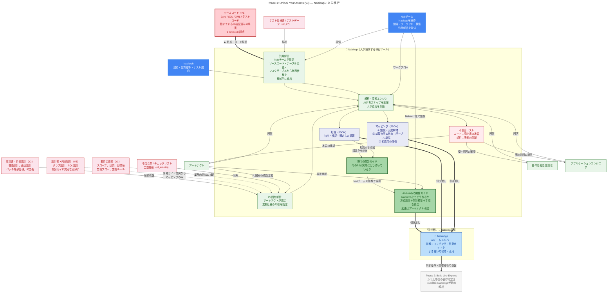

# Phase 1: Unlock Your Assets (v3)

## 概要

このダイアグラムは、Unlockフェーズの全体構造と情報の流れを示しています。Nableapを使い、既存システムに眠る暗黙知と業務ルールを、AIが活用できる形に変換するプロセスを可視化しています。

## ダイアグラムの見方

- **緑系**: Nableap（移行ツール）とその核心成果物（開発ガイド）
- **青系（濃青・明青）**: Nabledge（引き渡し先）とNablarchチーム
- **赤系**: 既存資産（★濃赤=起点となるソースコード）
- **紫系**: Nableapの出力（知識・マッピング）
- **ピンク系**: 不整合リスト（対話ループのトリガー）
- **グレー系**: 次フェーズ（Phase 2: Build）への接続

## 主要な流れ

1. **起点**: ソースコード（#5）をNableapの汎用解析で解析
2. **構造化**: 既存資産をNableapの2モード（汎用解析・PJ固有解析）で構造化
3. **変換**: Nableapが知識・マッピング・不整合リストを生成
4. **対話**: 不整合リストを起点にロール別の対話ループで知識を確定
5. **核心成果**: 現行の開発ガイド導出 → AI-Readyの開発ガイド作成
6. **引き渡し**: 知識・マッピング・開発ガイドをNabledgeに引き渡し。Nableapは退場
7. **次フェーズ**: Nabledgeが引き継いだ資産を基盤にBuildフェーズへ

