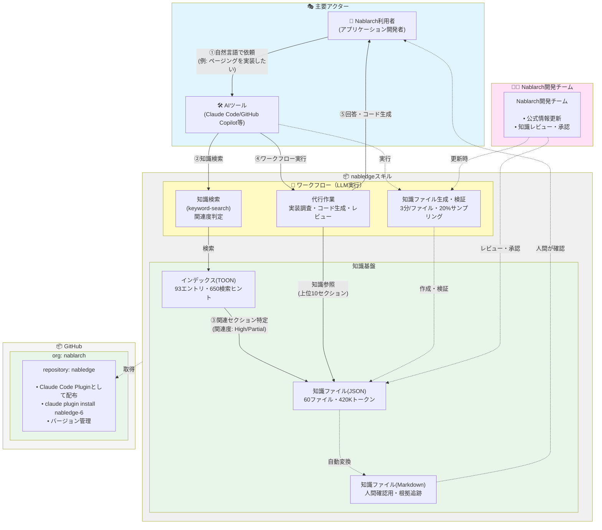

# Nabledge設計書

**更新日**: 2026年2月10日
**ステータス**: Draft

## 1. 概要

### 1.1 Nabledgeとは

NabledgeはNablarchの構造化知識と、それを活用して開発作業を代行するワークフローで構成される、AIエージェント（Claude Code、GitHub Copilot）向けの知識基盤です。

### 1.2 解決する課題

現在、以下の3つの課題があります。

1. **AI単体では代行精度が不十分**

   Nablarch固有の知識がなく、開発作業の代行精度が低い

2. **公式ドキュメントはAI向けではない**

   人間向けに書かれており、AIが効率的に検索・参照できない

3. **開発に時間がかかる**

   新規参画者のオンボーディングや日常開発に多くの時間を要する

### 1.3 目的

AIエージェントにNablarchの構造化知識を提供することで、以下を実現します。

- 実装調査・コード生成・レビュー等の代行精度向上
- 開発工数の削減（目標: 60-70%）
- オンボーディング期間の短縮

### 1.4 想定する代行作業

Nabledgeが対象とする代行作業を優先度別に整理しました。優先度Sの作業は知識基盤の構築に必須、優先度Aはプロジェクトでの要望が多いものです。

| 代行業務 | 優先度 | 優先度理由 | Nabledge代行適性 |
|---------|:------:|-----------|:---------------:|
| 既存コード理解 | S | 知識基盤の構築に必須 | 高 |
| ナレッジQ&A | S | 知識基盤の構築に必須 | 高 |
| 影響分析 | A | プロジェクトでの要望が多い | 中 |
| レビュー | A | プロジェクトでの要望が多い | 高 |
| コード生成・雛形作成 | B | | 中 |
| 実装調査 | B | | 中 |
| テストデータ作成 | B | | 低 |
| 障害調査 | B | | 中 |
| 設計書解読 | B | | 低 |
| ドキュメント生成 | B | | 低 |

**Nabledge代行適性の定義**:
- **高**: Nablarch知識だけで対応可能
- **中**: Nablarch知識に加えてPJ固有知識が必要
- **低**: PJ固有知識が多く必要

### 1.5 スコープ

#### マッピングと知識ファイル化の関係

**マッピングの対象**: Nablarch公式ドキュメント**全体**

- すべての.rst, .md, .xmlファイルをマッピングに含めます
- 対象外のファイルも含め、公式ドキュメント全体を構造化します

**知識ファイル化の対象**: マッピングのうち、以下の範囲を優先的に知識ファイル化します

**スコープ判定**: categories定義（`categories-v*.json`）の`default_in_scope`フラグで管理します

#### 知識ファイル化の対象範囲

##### 処理方式

**対象**:
- Nablarchバッチ（都度起動バッチ）- `batch-nablarch`
- Nablarchバッチ（常駐バッチ/テーブルキュー）- `messaging-db`
- RESTful Webサービス - `rest`

**対象外**:
- JSR352バッチ（Jakarta Batch）- `batch-jsr352`
- HTTP Messaging - `http-messaging`
- MOM（Message Oriented Middleware）- `messaging-mom`
- ウェブアプリケーション（JSP/画面）- `web`

##### コンポーネント

**対象**:
- ハンドラ（バッチ、REST、共通）- `handler`
- ライブラリ（DB、ファイル、バリデーション等）- `library`
- ツール（NTF、gsp-dba-maven-plugin等）- `tool`
- アダプタ（ログ、DB、REST等）- `adaptor`

##### ドキュメント・ガイド

**対象**:
- フレームワーク概要・コンセプト - `about`
- プロジェクトセットアップ・設定 - `setup`, `archetype`, `configuration`
- 開発ガイド（パターン、アンチパターン） - `dev-guide-pattern`, `dev-guide-anti`, `dev-guide-project`, `dev-guide-other`
- チェック項目（セキュリティ、非推奨API等）- `check-published-api`, `check-deprecated`, `check-security`
- マイグレーションガイド - `migration`

**対象バージョン**

- Nablarch 6系、5系、1.4系、1.3系、1.2系

**想定ツール**

- Claude Code、GitHub Copilot

## 2. アーキテクチャ

### 2.1 全体構造

Nabledgeは3つの要素で構成されます。

1. **知識基盤**

   構造化されたNablarch知識（TOON形式インデックス、JSON形式知識ファイル）

2. **ワークフロー**

   知識検索、代行作業、知識生成の3つのワークフロー

3. **配布**

   GitHub経由でClaude Code Pluginとして配布



#### 実行フロー

1. **ユーザー依頼**

   Nablarch利用者が自然言語でAIツールに依頼します（例: 「ページングを実装したい」）

2. **知識検索**

   AIツールがワークフロー（知識検索）を実行し、keyword-searchで検索します

3. **セクション特定**

   関連度の高いセクションを特定します（High/Partial/Noneの3段階）

4. **代行作業実行**

   ワークフロー（代行作業）を実行し、知識ファイルを参照します（上位10セクション ≈ 5,000トークン）

5. **結果返却**

   回答またはコードを生成してユーザーに返します

#### 設計のポイント

- **配布**

  GitHub (nablarch/nabledge) → Claude Code Plugin → インストール

- **検索**

  3段階キーワード抽出 + 2段階検索プロセス（ファイル→セクション）で高精度を実現

- **トークン効率**

  TOON形式で30-60%削減、セクション単位抽出で必要最小限（5,000トークン）に抑制

- **正確性**

  公式ドキュメント照合、人向けMarkdownで根拠追跡

- **保守性**

  JSON→MD自動変換で1箇所メンテナンス、バージョン別スキル分離

### 2.2 知識タイプ

Nabledgeの知識は3つのタイプに分類され、約60個のファイルを作成します。

| # | 知識タイプ | 内容 | カバー範囲 | 作成単位 | 推定件数 |
|---|-----------|------|----------|---------|---------|
| ① | 機能・実装パターン（エラー含む） | どう実装するか、エラー対処 | 9タスク（90%） | ハンドラ、ライブラリ、処理方式、ツール、アダプタ | 約55個 |
| ② | チェック項目 | 何に気をつけるべきか | 3タスク（30%） | セキュリティ、推奨/非推奨、公開API | 3個 |
| ③ | リリースノート | 何が変わった/壊れているか | 2タスク（20%） | バージョン単位 | 複数個 |
| **合計** | | | | | **約60個** |

**設計判断**: ①機能・実装パターンを優先的に構造化すれば9割の作業をカバー可能です。①から着手します。

### 2.3 配布とインストール

#### 配布形式

[Claude Code Plugin](https://code.claude.com/docs/en/plugins)として配布します。

**配布元**: GitHub (`github.com/nablarch/nabledge`)

**配布フロー**:
```
GitHub (nablarch/nabledge)
  ↓ Claude Code Plugin Registry
  ↓ claude plugin install nabledge-6
ユーザー環境 (.claude/skills/nabledge-6/)
```

#### インストール方法

**Claude Code**

```bash
# Plugin Registryからインストール
claude plugin install nabledge-6

# 確認
claude plugin list

# アップデート
claude plugin update nabledge-6
```

**GitHub Copilot**

セットアップスクリプトをダウンロードして実行します。

```bash
# セットアップスクリプトを実行
curl -fsSL https://raw.githubusercontent.com/nablarch/nabledge/main/install.sh | sh
```

セットアップスクリプトは以下を実行します:
- プロジェクトルートに`.claude/skills/nabledge-6/`を配置
- 設定ファイルに自動登録

**設計判断**

Claude Codeの標準配布方式を採用します。GitHubからの自動取得、バージョン管理、更新通知が容易です。

### 2.4 ファイル構成

```
nabledge-6/
├── SKILL.md                    # スキル定義
├── knowledge/                  # 知識
│   ├── index.toon              # 検索インデックス（TOON形式）
│   ├── about/                  # Framework fundamentals
│   ├── setup/                  # Project setup and configuration
│   ├── guides/                 # Development guides
│   ├── migration/              # Migration guides
│   ├── features/               # ① 機能・実装パターン
│   │   ├── handlers/           # ハンドラ単位
│   │   │   ├── batch/          # バッチ専用ハンドラ
│   │   │   ├── common/         # 共通ハンドラ
│   │   │   └── rest/           # REST専用ハンドラ
│   │   ├── libraries/          # ライブラリ単位
│   │   ├── processing/         # 処理方式単位
│   │   ├── tools/              # ツール単位
│   │   └── adapters/           # アダプタ単位
│   ├── checks/                 # ② チェック項目
│   └── releases/               # ③ リリースノート
├── workflows/                  # ワークフロー（代行単位）
├── scripts/                    # スクリプト
├── assets/                     # アセット
└── docs/                       # 人向け閲覧用（JSON→MD自動変換）
```

#### カテゴリタイプとディレクトリの対応

| Category Type | Directory | Description | Example |
|--------------|-----------|-------------|---------|
| processing-pattern | `features/processing/` | Processing patterns (batch, REST, messaging) | `nablarch-batch.json` |
| component (handler) | `features/handlers/{batch,common,rest}/` | Request handlers by processing type | `data-read-handler.json` |
| component (library) | `features/libraries/` | Framework libraries | `universal-dao.json` |
| component (adaptor) | `features/adapters/` | Third-party integration adaptors | `slf4j-adapter.json` |
| component (tool) | `features/tools/` | Testing and development tools | `ntf-overview.json` |
| setup | `setup/` | Project setup, blank projects, configuration | `blank-project.json` |
| guide | `guides/` | Development patterns and anti-patterns | `dev-guide-pattern.json` |
| check | `checks/` | Security, deprecated API, published API checks | `security.json` |
| about | `about/` | Framework overview, policy, concepts | `framework-concept.json` |
| about (migration) | `migration/` | Migration guides between versions | `v5-to-v6.json` |

**命名規則**

英語、kebab-case（例: `db-connection-management-handler.json`）

**設計判断**

バージョン情報はファイル名に含めません（スキル自体がバージョン別のため冗長です）。

### 2.5 検索設計

Nabledgeの検索は、ユーザーの依頼から必要な知識を高精度で特定する仕組みです。3段階のキーワード抽出と、2段階の検索プロセス（ファイル選定→セクション選定）で実現します。

#### 検索の全体フロー

```
ユーザー依頼（例：「ページングを実装したい」）
  ↓
① 3段階キーワード抽出
  ↓
② ファイル選定（index.toonで検索）
  ↓
③ セクション選定（ファイル内indexで検索）
  ↓
④ 関連度判定（High/Partial/None）
  ↓
⑤ 検索結果構造化（pointers）
  ↓
⑥ コンテキスト管理（上位N件抽出）
```

#### ① 3段階キーワード抽出

ユーザーの依頼から、以下の3段階でキーワードを抽出します。

| レベル | 名称 | 説明 | 例 |
|:-----:|------|------|-----|
| Level 1 | Technical domain（技術領域） | データベース, バッチ, ハンドラ, Web, REST, テスト など | データベース, database |
| Level 2 | Technical component（技術要素） | DAO, JDBC, JPA, Bean Validation, JSON, XML など | DAO, UniversalDao, O/Rマッパー |
| Level 3 | Functional（機能） | ページング, 検索, 登録, 更新, 削除, 接続, コミット など | ページング, paging, per, page, limit, offset |

**例**

依頼「ページングを実装したい」→ Level 1「データベース」、Level 2「DAO」、Level 3「ページング」に分解

#### ② ファイル選定（index.toon）

**使用するキーワード**

Level 1（技術領域）+ Level 2（技術要素）

**index.toonの構造**:
```toon
# Nabledge-6 Knowledge Index

files[N,]{path,hints}:
  features/handlers/common/global-error-handler.json, グローバルエラーハンドラ GlobalErrorHandler 未捕捉例外 エラーハンドリング 例外処理
  features/libraries/universal-dao.json, ユニバーサルDAO UniversalDao CRUD 検索 ページング データベース DAO
```

- TOON形式でJSONより30-60%トークン削減
- 93エントリ、約650検索ヒント → 約5-7Kトークン
- 各ファイルのパスと検索ヒント（Level 1 + Level 2）を記載

**マッチング例**

「データベース」「DAO」で `universal-dao.json` が候補に

#### ③ セクション選定（ファイル内index）

**使用するキーワード**

Level 2（技術要素）+ Level 3（機能）

**ファイル内indexの構造**:
```json
{
  "index": [
    { "id": "overview", "hints": ["UniversalDao", "ユニバーサルDAO"] },
    { "id": "paging", "hints": ["ページング", "paging", "per", "page", "limit", "offset"] },
    { "id": "search", "hints": ["検索", "search", "条件指定"] }
  ]
}
```

- 各セクションの検索ヒント（Level 2 + Level 3）を記載
- セクション単位で関連度を判定

**マッチング例**

「ページング」「paging」で `paging` セクションが候補に

#### ④ 関連度判定

候補となったセクションの実際の内容を読み、ユーザーの依頼に対する関連度を判定します。

| レベル | 値 | 判断基準 |
|:------:|:---:|---------|
| **High** | 2 | 依頼に直接回答できる |
| **Partial** | 1 | 依頼に関連し、補足として有用 |
| **None** | 0 | 関連なし（対象外） |

**ファイルの関連度**

そのファイル内のセクション関連度の最大値

**例**: `universal-dao.json`
- `paging` セクション: High (2)
- `search` セクション: Partial (1)
- `overview` セクション: Partial (1)
→ ファイルの関連度 = 2 (最大値)

#### ⑤ 検索結果構造化（pointers）

検索結果をpointers構造で返します。

```json
{
  "files": [
    { "id": "F1", "path": "features/libraries/universal-dao.json", "relevance": 2, "matched_hints": ["データベース", "DAO"] }
  ],
  "sections": [
    { "file_id": "F1", "section": "paging", "relevance": 2, "matched_hints": ["ページング", "paging", "per", "page"] },
    { "file_id": "F1", "section": "search", "relevance": 1, "matched_hints": ["検索"] }
  ]
}
```

**構造の特徴**:
- `sections` を関連度降順でソート → 最重要セクションから読める
- `files` でファイル単位の重要度を把握
- ファイルパスは1回だけ出現、`file_id` で参照（重複排除）
- `matched_hints` で判断根拠を追跡可能

#### ⑥ コンテキスト管理（上位N件抽出）

関連度の高いセクションを抽出します。

| 項目 | 推奨値 | 根拠 |
|------|--------|------|
| sections | 上位10件 | 1セクション平均500トークン × 10 = 約5,000トークン（コンテキストの2.5%） |

**動的調整**:
- High（2点）のセクションが10件未満 → Partial（1点）も含めて最大15件まで拡張
- High（2点）のセクションが20件以上 → 上位15件まで拡張
- コンテキスト使用率が80%超 → セクション数を減らす（最小5件）

**設計判断**:
- セクション単位で抽出することで、ファイル全体（約7,000トークン）ではなく必要最小限（約500トークン）に抑えます
- 全60ファイル（約420,000トークン）をコンテキストウィンドウ（200,000トークン）内で運用可能にします

#### 将来の拡張

現状、keyword-searchだけで十分な検索精度が得られています。将来的に検索精度の向上が必要になった場合は、intent-search（目的→カテゴリ、対象→ファイルで絞り込む方式）の導入を検討します。

### 2.6 知識ファイル設計

知識ファイルはJSON形式で構造化され、AI向けに最適化された情報を格納します。

#### 共通構造

```json
{
  "schema_version": "1.0",
  "id": "ファイル識別子",
  "title": "タイトル（日本語）",
  "official_doc_urls": ["https://nablarch.github.io/docs/..."],
  "index": [
    { "id": "セクションID", "hints": ["検索ヒント1", "検索ヒント2"] }
  ],
  "sections": {
    "overview": {
      "summary": "100-200文字の要約",
      /* セクション固有のプロパティ */
    },
    "セクションID": { /* ... */ }
  }
}
```

**設計判断**

- **JSON形式**

  パース容易、jqでセクション抽出可能、構造化データとして扱いやすいです

- **二層構造（JSON + Markdown）**

  AI向けJSON、人向けMD（自動変換）でメンテナンス1箇所で済みます

- **スキーマバージョニング**

  非互換変更時にメジャーバージョンアップします（1.0 → 2.0）

#### 情報の持ち方の原則

| 原則 | 説明 | 判断基準 |
|------|------|---------|
| **仕様は全部残す** | 必須/オプション、推奨/非推奨も網羅します | 設定項目、デフォルト値、型、制約、動作仕様、理由・背景、注意点、警告をすべて含みます |
| **考え方も全部残す** | 理由・背景・なぜそうするかを残します | 設計思想、推奨パターン、注意事項をすべて含みます |
| **表現は最適化する** | 読み物的記述→端的な記述にします | 導入文、冗長な説明、重複表現、段階的な説明を削除し、箇条書き化します |
| **形式はAI向けに** | 構造化データで検索・参照しやすくします | JSON形式、検索ヒント設計を採用します |

**設計判断**

「この情報がないとAIが誤った判断をする可能性があるか？」で判断します。YESなら残し、NOなら最適化します。

## 3. 実装計画

### 3.1 作成範囲

**情報源**

- Nablarch公式解説書（https://nablarch.github.io/docs/LATEST/doc/）
- システム開発ガイド（https://fintan.jp/page/252/）- パターン集、アンチパターン
- サンプルプロジェクト（GitHub: nablarch/nablarch-example-batch, nablarch-example-rest）

**作成規模**

約60個の知識ファイル

| 作成単位 | 推定件数 | 備考 |
|---------|---------|------|
| 処理方式 | 2個 | Nablarchバッチ、RESTful |
| ライブラリ | 約15個 | DB、ファイルI/O、バリデーション等 |
| ハンドラ | 約20個 | 共通、バッチ専用、REST専用 |
| ツール | 約5個 | NTF、gsp-dba-maven-plugin等 |
| アダプタ | 約13個 | ログ、DB、REST、メール等 |
| チェック項目 | 3個 | セキュリティ、推奨/非推奨、公開API |
| リリースノート | 複数個 | バージョン別 |

### 3.2 フェーズ計画

知識ファイルの作成を4つのフェーズに分けて段階的に進めます。フェーズ1で仮説検証を行い、効果を確認してから次のフェーズへ進みます。

#### フェーズ1: Nabバッチ（FW）- バッチフレームワーク完成（優先度: 最高）

- **期間**: 1～2週間
- **対象**: バッチ専用ハンドラ約10個、バッチで使うライブラリ約5個
- **目的**: なるべく早くAIのメリットを感じてもらうことです

**仮説検証**:
- 代行精度を実測します（実装調査、コード生成、レビュー等）
- 工数削減を実測します（従来工数 vs 代行後工数）
- 目標: 工数削減60%以上
- 効果確認後、フェーズ2以降へ進みます

#### フェーズ2: Nabバッチ（NTF）- テストフレームワーク完成

- **期間**: 1～2週間
- **対象**: NTF関連約1-2個

#### フェーズ3: REST（API）- RESTful Webサービス対応

- **期間**: 1～2週間
- **対象**: RESTful処理方式1個、REST専用ハンドラ約5個、REST関連ライブラリ約3個

#### フェーズ4: 網羅性確保

- **期間**: 1～2週間
- **対象**: アダプタ約12個、共通ハンドラ約5個、チェック項目2個、その他約5個

### 3.3 品質保証

知識ファイルの正確性と品質を担保するため、5段階のプロセスで品質保証を行います。

#### 5段階プロセス

1. **作成**: AIエージェントが知識ファイルを作成します
2. **自動チェック**: スキーマ準拠性、JSON構文チェックを行います
3. **サンプリングレビュー**: 20%のファイルを人間がレビューします
   - ランダムサンプリング: 各カテゴリから均等に選択します
   - 重点サンプリング: ハンドラ、主要ライブラリは必須でレビューします
4. **Nablarch有識者レビュー**: 重要ファイルの正確性検証を行います
5. **フィードバックループ**: 問題点を次回作成時に反映します

#### 品質基準

- 仕様の網羅性（必須/オプション/デフォルト値）
- 制約の網羅性（「重要」「注意」「警告」を全て反映）
- コード例が動作する最小形であること
- 出典（official_doc_urls）を全ての情報に付与すること
- 対象外情報（Jakarta Batch等）を含まないこと
