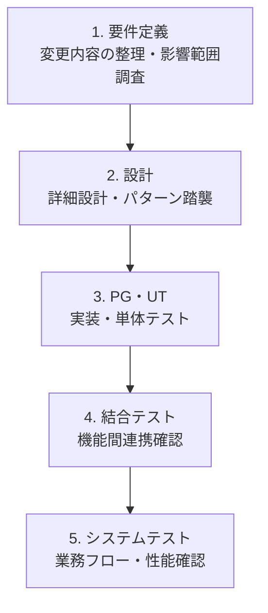

# 保守開発の工程とアクティビティ（AsIs/ToBe共通）

**目的**: 既存資産を活用した保守開発（機能追加・変更）の工程とアクティビティを明確にする

**スコープ**:
- **対象**: 開発作業にフォーカス（調査、設計、実装、テスト、不具合調査、レビュー、見積など）
- **対象外**: マネジメント判断（品質評価、リリース判定）

**理由**: Nabledge は開発作業の支援を主目的としており、最終的なGo/No-Go判断は人間（アーキテクト/PL）が行うため

## 工程一覧

1. 要件定義
2. 設計
3. PG・UT（製造・単体テスト）
4. 結合テスト
5. システムテスト

## ロール定義

| ロール | 主な担当工程 | 担当アクティビティ概要 |
|--------|------------|---------------------|
| **アーキテクト** | 要件定義、設計、PG・UT、結合テスト | 技術検証、基盤設計、開発標準策定、環境構築、アーキテクチャレビュー |
| **要件定義者／設計者** | 要件定義、設計、結合テスト | 要求分析、機能設計（画面・バッチ・Webサービス等）、テストケース設計 |
| **データモデラー** | 設計 | データ定義、DB設計（論理・物理） |
| **データアナリスト** | 設計 | データパターン洗い出し、テストデータ作成 |
| **アプリケーションエンジニア** | PG・UT、結合テスト | アプリ実装、単体テスト作成・実施、障害調査 |

## 工程別アクティビティ

### 1. 要件定義

| アクティビティ | 作業者 | 説明 | 成果物 |
|--------------|--------|------|--------|
| **変更要求分析** | 要件定義者／設計者 | 何を変更するか整理 | 変更要求仕様書 |
| **既存機能の影響範囲調査** | 要件定義者／設計者 アーキテクト | 変更により影響を受ける既存機能・設計書・ソースコードの特定 | 影響範囲調査書 |
| **技術的実現可能性検証** | アーキテクト | 既存パターンで実装可能か、新規実装が必要かの判断 | 技術検証結果 |
| **工数見積** | 要件定義者／設計者 アーキテクト | 変更作業の工数を見積もる（技術的複雑さを含む） | 見積書 |

### 2. 設計

| アクティビティ | 作業者 | 説明 | 成果物 |
|--------------|--------|------|--------|
| **既存設計書の確認** | 要件定義者／設計者 | 類似機能の設計書を参照 | - |
| **機能設計** | 要件定義者／設計者 | 画面・バッチ・Webサービス等の詳細設計 | システム機能設計書 |
| **データ設計** | データモデラー | テーブル・項目の追加・変更設計 | テーブル定義書 |
| **既存パターンの踏襲** | 要件定義者／設計者 | 既存機能の処理パターンに合わせた設計 | - |
| **整合性チェック** | 要件定義者／設計者 | 既存の命名規則・設計パターンとの整合性確認 | - |
| **設計レビュー** | アーキテクト | 設計内容の確認・承認 | レビュー指摘事項 |

### 3. PG・UT

| アクティビティ | 作業者 | 説明 | 成果物 |
|--------------|--------|------|--------|
| **環境構築** | アーキテクト | 開発環境のセットアップ | - |
| **既存コード理解** | アプリケーションエンジニア | 変更対象の既存コードの処理フローを理解 | - |
| **影響範囲分析** | アプリケーションエンジニア | 変更により影響を受ける他の機能・コードを特定 | 影響範囲一覧 |
| **単体テストケース設計** | 要件定義者／設計者 | 変更部分の単体テスト観点を設計 | 単体テスト仕様書 |
| **SQL検証** | 要件定義者／設計者 | SQLの実現性・性能確認 | SQL検証結果 |
| **テストデータ作成** | データアナリスト | 単体テスト用のテストデータ作成 | 共通テストデータ |
| **コード実装** | アプリケーションエンジニア | 設計に基づいて変更コードを実装 | ソースコード |
| **パターン踏襲実装** | アプリケーションエンジニア | 既存コードのパターンに合わせて実装 | - |
| **クラス単体テスト作成** | アプリケーションエンジニア | テストコードを作成 | テストコード |
| **クラス単体テスト実施** | アプリケーションエンジニア | テストを実行し結果を確認 | テスト結果 |
| **取引単体テスト実施** | アプリケーションエンジニア | 取引単位の打鍵テスト実施 | テスト結果 |
| **コードレビュー** | アーキテクト | コード確認・承認 | レビュー指摘事項 |

### 4. 結合テスト

| アクティビティ | 作業者 | 説明 | 成果物 |
|--------------|--------|------|--------|
| **結合テスト環境構築** | アーキテクト | テスト環境のセットアップ、デプロイ | - |
| **結合テストケース作成** | 要件定義者／設計者 | 機能間連携のテストケース作成 | 結合テスト仕様書 |
| **リグレッションテスト観点抽出** | 要件定義者／設計者 | 既存機能への影響を確認するテスト観点を抽出 | リグレッションテストケース |
| **結合テスト実行** | 要件定義者／設計者 | テストを実行 | テスト結果 |
| **不具合調査** | アプリケーションエンジニア 要件定義者／設計者 | テスト失敗時の原因特定（コード不具合、IF不整合、データ連携ミス等） | 障害票、設計修正指示 |

### 5. システムテスト

| アクティビティ | 作業者 | 説明 | 成果物 |
|--------------|--------|------|--------|
| **システムテストケース作成** | 要件定義者／設計者 | 業務フロー全体のテストケース作成 | システムテスト仕様書 |
| **性能テスト** | 要件定義者／設計者 | 処理時間・スループットの確認 | 性能テスト結果 |
| **性能ボトルネック特定** | アーキテクト | 性能問題発生時の原因箇所特定 | 性能改善案 |
| **システムテスト実行** | 要件定義者／設計者 | テストを実行 | テスト結果 |
| **不具合調査** | アプリケーションエンジニア 要件定義者／設計者 | テスト失敗時の原因特定 | 障害票 |

## 工程間の流れ

## 備考

- このアクティビティ定義はAsIs（従来）とToBe（Nabledge活用後）で共通
- ToBeではNabledgeがアクティビティを支援・自動化するが、アクティビティ自体は変わらない
- リーダーの役割（見積・レビュー・品質評価）も明示
