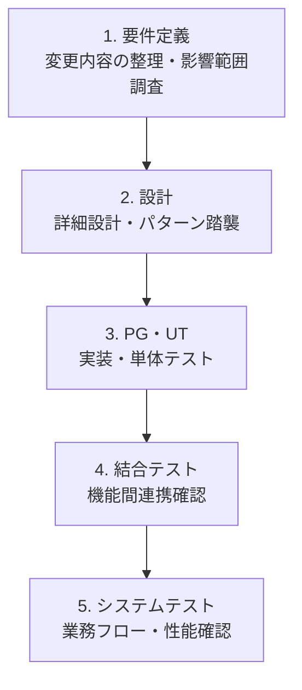

# 保守開発の工程とアクティビティ（AsIs/ToBe共通）

**目的**: 既存資産を活用した保守開発（機能追加・変更）の工程とアクティビティを明確にする

## 工程一覧

1. 要件定義
2. 設計
3. PG・UT（製造・単体テスト）
4. 結合テスト
5. システムテスト

## 工程別アクティビティ

### 1. 要件定義

| アクティビティ | 説明 | 成果物 |
|--------------|------|--------|
| **変更要求分析** | 何を変更するか整理 | 変更要求仕様書 |
| **既存機能の影響範囲調査** | 変更により影響を受ける既存機能・ファイルの特定 | 影響範囲調査書 |
| **技術的実現可能性検証** | 既存パターンで実装可能か、新規実装が必要かの判断 | 技術検証結果 |
| **工数見積** | 変更作業の工数を見積もる | 見積書 |

### 2. 設計

| アクティビティ | 説明 | 成果物 |
|--------------|------|--------|
| **既存設計書の確認** | 類似機能の設計書を参照 | - |
| **変更設計** | 変更箇所の詳細設計 | 設計書（変更部分） |
| **既存パターンの踏襲** | 既存コードのパターンに合わせた設計 | - |
| **整合性チェック** | 既存の命名規則・設計パターンとの整合性確認 | 設計レビュー結果 |
| **設計レビュー** | リーダーによる設計内容の確認 | レビュー指摘事項 |

### 3. PG・UT

| アクティビティ | 説明 | 成果物 |
|--------------|------|--------|
| **既存コード理解** | 変更対象の既存コードの処理フローを理解 | - |
| **影響範囲分析** | 変更により影響を受ける他の機能・コードを特定 | 影響範囲一覧 |
| **コード実装** | 設計に基づいて変更コードを実装 | ソースコード |
| **パターン踏襲実装** | 既存コードのパターンに合わせて実装 | - |
| **単体テストケース設計** | 変更部分の単体テスト観点を設計 | 単体テスト仕様書 |
| **単体テスト実装** | テストコードを作成 | テストコード |
| **単体テスト実行** | テストを実行し結果を確認 | テスト結果 |
| **リファクタリング** | 既存コードの改善余地があれば修正 | - |
| **コードレビュー準備** | セルフチェック（コーディング規約、アンチパターン） | - |
| **コードレビュー** | リーダーによるコード確認 | レビュー指摘事項 |

### 4. 結合テスト

| アクティビティ | 説明 | 成果物 |
|--------------|------|--------|
| **結合テスト環境構築** | テスト環境のセットアップ | - |
| **結合テストケース作成** | 機能間連携のテストケース作成 | 結合テスト仕様書 |
| **リグレッションテスト観点抽出** | 既存機能への影響を確認するテスト観点を抽出 | リグレッションテストケース |
| **結合テスト実行** | テストを実行 | テスト結果 |
| **統合エラー調査** | テスト失敗時の原因特定 | 障害票 |
| **設計ミス検出** | IF不整合、データ連携ミスなどの設計問題を検出 | 設計修正指示 |
| **品質評価** | リーダーによるテスト結果の評価 | 品質評価結果 |

### 5. システムテスト

| アクティビティ | 説明 | 成果物 |
|--------------|------|--------|
| **システムテストケース作成** | 業務フロー全体のテストケース作成 | システムテスト仕様書 |
| **性能テスト** | 処理時間・スループットの確認 | 性能テスト結果 |
| **性能ボトルネック特定** | 性能問題発生時の原因箇所特定 | 性能改善案 |
| **システムテスト実行** | テストを実行 | テスト結果 |
| **障害調査** | テスト失敗時の原因特定 | 障害票 |
| **リリース判定** | リーダーによるリリース可否判断 | リリース判定結果 |

## 工程間の流れ

## 備考

- このアクティビティ定義はAsIs（従来）とToBe（Nabledge活用後）で共通
- ToBeではNabledgeがアクティビティを支援・自動化するが、アクティビティ自体は変わらない
- リーダーの役割（見積・レビュー・品質評価）も明示
