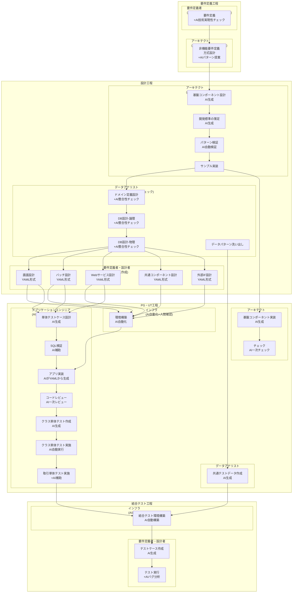

# ToBe: AIエージェント活用Nablarch開発プロセスフロー

**重要**: 設計書は全て**YAML形式**で管理（AI可読化）

**作成日**: 2026-02-16
**関連**: [AsIs開発プロセス](./asis-dev-flow.md)

---

## プロセスフロー図



---

## ロール別協働モデル

| ロール | AsIsとの変化 | 協働モデル | 主な変化点 |
|--------|--------------|-----------|-----------|
| **要件定義者** | 変化小 | **人間主導 + AI技術実現性チェック** | AIがNablarchパターンで実現可能性を早期検証 |
| **アーキテクト** | **変化大** | **AI生成 + 人間承認** | AI が設計ドラフト・標準を生成、人間が承認（実装→レビューへ） |
| **データアナリスト** | 変化中 | **人間主導 + AI整合性チェック** | AIが整合性チェック・データ生成を補助 |
| **要件定義者／設計者** | 変化中 | **人間がYAML作成** | Excel→YAMLへ形式変更、AIがテストケース生成 |
| **アプリケーションエンジニア** | **変化大** | **AI生成 + 人間承認** | AIがYAMLから実装・テストを生成、人間が承認（実装→レビューへ） |
| **インフラ** | **変化大** | **AI自動化 + 人間確認** | 環境構築をAI自動化、人間は確認のみ（構築→監視へ） |

---

## 主要成果物（工程別）

| 工程 | IN（インプット） | OUT（アウトプット） | 形式変化 |
|------|------------------|---------------------|----------|
| **要件定義** | 業務ヒアリング結果 | 機能要件書（**YAML**）、非機能要件書（**YAML**）、業務フロー図、**技術実現性レポート（新規・AI生成）** | Excel → **YAML** |
| **設計** | 機能要件書（YAML）、非機能要件書（YAML） | 方式設計書（**YAML・AI生成**）、基盤コンポーネント設計書（**YAML・AI生成**）、開発標準（**YAML・AI生成**）、**パターン検証レポート（新規・AI生成）**、ER図、テーブル定義書（**YAML**）、システム機能設計書（**YAML**） | Excel → **YAML** |
| **PG・UT** | 方式設計書（YAML）、システム機能設計書（**YAML**）、テーブル定義書（YAML） | 業務アクション（**AI生成**）、業務フォーム（**AI生成**）、業務画面JSP（**AI生成**）、SQLファイル（**AI生成**）、単体テスト仕様書（**AI生成**）、テストコード（**AI生成**）、単体テスト結果、共通テストデータ（**AI生成**）、**コードレビューレポート（新規・AI生成）** | Java/JSP/SQL（手動）→ Java/JSP/SQL（**AI生成**） |
| **結合テスト** | システム機能設計書（YAML）、共通テストデータ | テストケース（**AI生成**）、テスト結果、**バグ分析レポート（新規・AI生成）** | Excel（手動）→ **YAML（AI生成）** |

---

## 新規アクティビティ（AsIsにはない）

- ✅ **技術実現性チェック（AI）** - 要件定義段階でNablarchパターンによる実現可能性を検証
- ✅ **パターン検証・アンチパターン検出（AI）** - 設計段階でNablarchアンチパターンをリスク検出
- ✅ **設計書のYAML化** - 全ての設計書をAI可読なYAML形式で作成・管理
- ✅ **AI生成コードのアプリケーションエンジニアレビュー** - YAMLから生成されたコードを確認・承認
- ✅ **開発標準の整合性自動チェック（AI）** - コーディング規約・UI標準・単体テスト標準間の矛盾検出

---

## 改善ポイント

- ✅ **PG・UT工程で60-70%工数削減**（アプリ実装・単体テスト作成・クラス単体テストの自動化）
- ✅ **設計書のAI可読化**（YAML形式）により実装精度向上
- ✅ **一貫したNablarchパターン適用**（AIによる自動検証・生成）
- ✅ **リアルタイムなNablarchナレッジアクセス**（nabledge知識検索）
- ✅ **設計書とコードの自動同期**（YAMLをソースとした自動生成）
- ✅ **コードレビューボトルネック解消**（AI一次レビュー → シニアエンジニア最終承認）
- ✅ **取引単体テスト（打鍵テスト）の効率化**（AIによる補助）

---

## YAML設計書の例（バッチ設計）

```yaml
batch:
  id: BATCH001
  name: プロジェクト一括登録
  type: file-to-db
  input:
    file: project_import.csv
    format: csv
    encoding: UTF-8
  processing:
    description: CSVファイルからプロジェクトをDBに登録
    validation: required
    transaction: per-record
  output:
    table: PROJECT
    operation: insert-or-update
```

**メリット**:
- YAMLはAIエージェントが正確に解釈可能
- Git管理しやすい（差分確認、バージョン管理）
- 設計書とコードの自動同期が容易
- 構造化データとして検証・変換が可能

---

**Document Owner**: Nablarch Development Team
**Last Updated**: 2026-02-16
