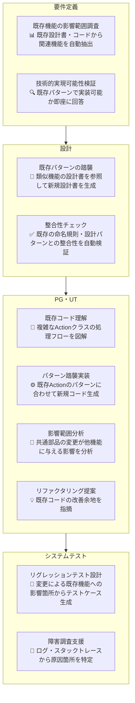

# ToBe Pattern 1: 工程別Nabledge活用シーン

保守開発（既存資産活用）における工程別のNabledge活用例

## ポイント

### 要件定義
- **既存資産の影響範囲が見える化される** - どの機能・ファイルに影響するか即座に把握
- **技術判断が早くなる** - 既存パターンで実現可能か、新規実装が必要かをAIが判断

### 設計
- **既存パターンを自動で踏襲** - 類似機能を参照して設計書ドラフト生成
- **設計の一貫性が保たれる** - 命名規則・パターンの逸脱を自動検出

### PG・UT
- **複雑な既存コードが理解しやすくなる** - 処理フローを図解、依存関係を可視化
- **既存パターンに沿った実装が楽になる** - 手本コードを参照して自動生成
- **影響範囲が見える** - 共通部品変更の影響を事前に把握、手戻り防止

### システムテスト
- **リグレッションテストが効率的になる** - 変更箇所から必要なテストケースを自動抽出
- **障害調査が早くなる** - ログから原因箇所を即座に特定
