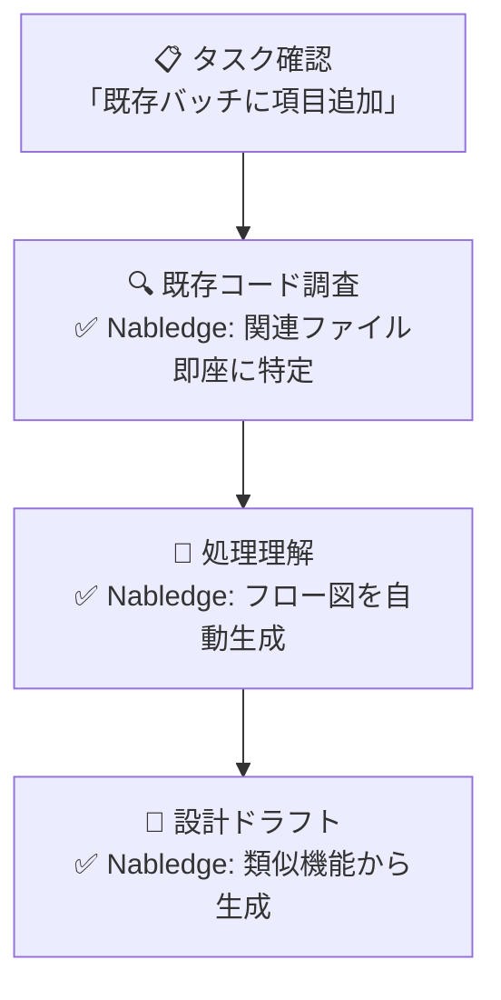
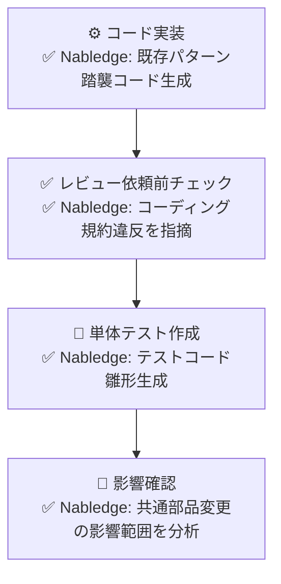

# ToBe Pattern 2: 開発者の1日の作業フロー

保守開発における開発者の典型的な1日をNabledgeがどう支援するか

## 午前：タスク理解・設計

## 午後：実装・テスト

## ポイント

### タスク着手時の調査時間が激減
- **従来**: 既存コードを grep で探索、関連ファイルを手作業で特定（30分～2時間）
- **Nabledge**: 「この機能に関連するファイルは？」で即座に特定（1分）

### 既存コードの理解が容易に
- **従来**: 複雑なActionクラスを読み解くのに時間がかかる（1時間～半日）
- **Nabledge**: 処理フローを図解、依存関係を可視化（5分）

### 既存パターンの踏襲が自動化
- **従来**: 類似機能を探してコピー＆ペースト、手動修正（1時間）
- **Nabledge**: 「この機能と同じパターンで実装して」で自動生成（5分）

### レビュー前のセルフチェックが可能
- **従来**: レビューで指摘されて手戻り
- **Nabledge**: 事前にコーディング規約違反・アンチパターンを検出、修正

### 影響範囲の把握が確実に
- **従来**: 共通部品を変更して予期せぬ影響でバグ発生
- **Nabledge**: 変更前に影響範囲を分析、リスクを可視化
