# ToBe Pattern 3: 具体的なタスクシナリオ

**タスク例**: 既存の「プロジェクト登録バッチ」に新規項目（プロジェクト期間）を追加

```mermaid
flowchart TB
    subgraph scenario["保守開発タスク：既存バッチへの項目追加"]

        subgraph step1["1️⃣ 既存機能の理解（5分）"]
            s1a["💬 Nabledge: 「プロジェクト登録バッチの処理を教えて」"]
            s1b["📊 出力: フロー図、入力ファイル形式、DB更新内容"]
            s1c["📁 出力: 関連ファイル一覧（Action、Form、Entity、SQL）"]
        end

        subgraph step2["2️⃣ 影響範囲の特定（3分）"]
            s2a["💬 Nabledge: 「プロジェクト期間項目を追加したら何に影響する？」"]
            s2b["🎯 出力: 変更が必要なファイル・テーブル一覧"]
            s2c["⚠️ 出力: 影響を受ける他機能（画面、API、他バッチ）"]
        end

        subgraph step3["3️⃣ 実装（15分）"]
            s3a["💬 Nabledge: 「既存パターンで項目追加のコード生成」"]
            s3b["⚙️ 出力: Form、Entity、SQLの修正コード"]
            s3c["👤 人間: コード確認・承認"]
        end

        subgraph step4["4️⃣ テスト準備（10分）"]
            s4a["💬 Nabledge: 「追加項目のテストケース生成」"]
            s4b["🧪 出力: 単体テストコード、テストデータCSV"]
            s4c["📋 出力: リグレッションテスト観点リスト"]
        end

        subgraph step5["5️⃣ レビュー準備（5分）"]
            s5a["💬 Nabledge: 「コードレビュー実施」"]
            s5b["✅ 出力: コーディング規約チェック結果"]
            s5c["💡 出力: 改善提案（リファクタリング余地）"]
        end
    end

    step1 --> step2
    step2 --> step3
    step3 --> step4
    step4 --> step5
```

## 従来との比較

| 作業 | 従来 | Nabledge活用後 |
|------|------|---------------|
| **既存機能理解** | 1-2時間（コード読解、設計書参照） | **5分**（フロー図自動生成） |
| **影響範囲特定** | 30分-1時間（grep、手動調査） | **3分**（影響分析自動実行） |
| **実装** | 1-2時間（コピペ・手動修正） | **15分**（パターン踏襲コード生成 + 確認） |
| **テスト準備** | 1時間（テストコード作成、データ準備） | **10分**（テストコード・データ自動生成） |
| **レビュー準備** | 30分（セルフチェック） | **5分**（自動チェック） |
| **合計** | **4-6.5時間** | **38分** ✨ |

## 実現するベネフィット

### 🚀 開発スピードの向上
- 単純な項目追加タスクが半日から30-40分に短縮
- 繰り返しタスクの効率が劇的に改善

### 🎯 品質の安定
- 既存パターンを確実に踏襲、実装のブレがなくなる
- 影響範囲の見落としによるバグを防止

### 📚 属人化の解消
- 「あの人しか分からない」がなくなる
- 新規参画者でもNabledgeの支援で即戦力化

### 😊 ストレス軽減
- 「どこに何があるか探す」時間がゼロに
- 「これで合ってるかな」の不安が減る
