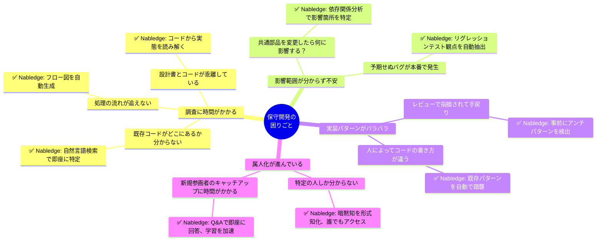

# ToBe Pattern 4: 現場の困りごと × Nabledge ソリューション

保守開発でよく聞く困りごとと、Nabledgeによる解決策

## 困りごと別ソリューション詳細

### 😫 調査に時間がかかる

| 困りごと | 具体例 | Nabledgeソリューション |
|---------|--------|---------------------|
| どこに何があるか分からない | 「顧客検索機能」のコードを探すのに30分 | 「顧客検索機能のコードはどこ？」で即座に特定 |
| 処理の流れが追えない | 複雑なActionクラスの読解に半日 | 処理フロー図を自動生成、依存関係を可視化 |
| 設計書が古い | 設計書と実コードが不一致 | コード実態から逆引きで理解 |

### 😰 影響範囲が分からず不安

| 困りごと | 具体例 | Nabledgeソリューション |
|---------|--------|---------------------|
| 何に影響するか分からない | 共通バリデーションを修正したら10個の機能で不具合 | 事前に影響範囲を分析、変更前にリスク把握 |
| テスト観点が漏れる | 既存機能のリグレッションテスト漏れ | 変更箇所から必要なテストケースを自動抽出 |

### 😵 実装パターンがバラバラ

| 困りごと | 具体例 | Nabledgeソリューション |
|---------|--------|---------------------|
| 人によってコードが違う | 同じ機能なのに実装が5パターン存在 | 既存パターンを自動で踏襲、一貫性を保証 |
| レビューで手戻り | コーディング規約違反で差し戻し | コミット前に自動チェック、規約違反を事前検出 |

### 😢 属人化が進んでいる

| 困りごと | 具体例 | Nabledgeソリューション |
|---------|--------|---------------------|
| ○○さんしか分からない | キーパーソンが休むと開発が止まる | Nablarch知識をNabledgeが保持、誰でも引き出せる |
| 新人が戦力化するまで3ヶ月 | オンボーディングに時間がかかる | Q&Aで即座に回答、試行錯誤の時間を削減 |

## 現場の声（想定）

> 💬 「既存コードを理解するのに丸1日かかっていたのが、Nabledgeのフロー図生成で30分になった」

> 💬 「共通部品を変更する時、影響範囲が分からず怖かった。Nabledgeで事前に影響が見えて安心して変更できる」

> 💬 「コーディング規約を覚えるのが大変だった。Nabledgeが自動チェックしてくれるので、レビューの手戻りが減った」

> 💬 「『あの人に聞かないと分からない』がなくなった。Nabledgeに聞けば即答してくれる」
