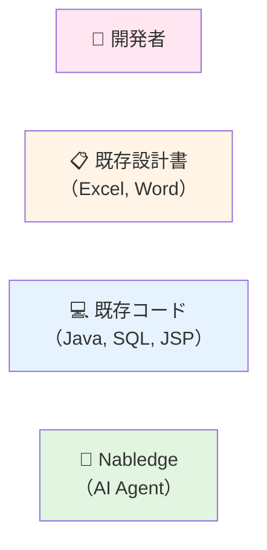
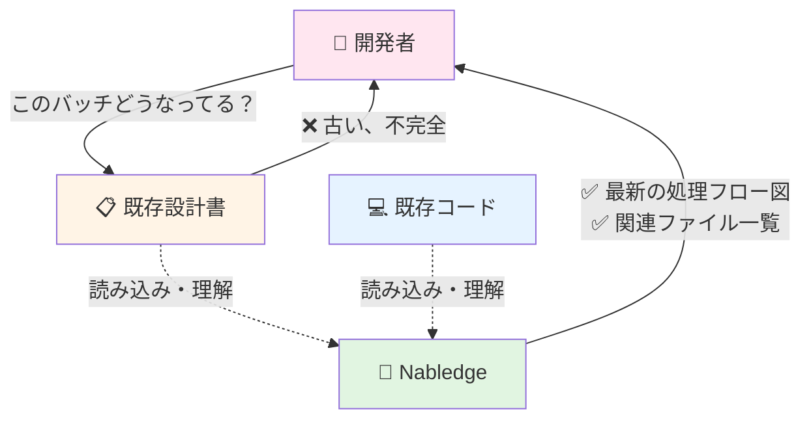
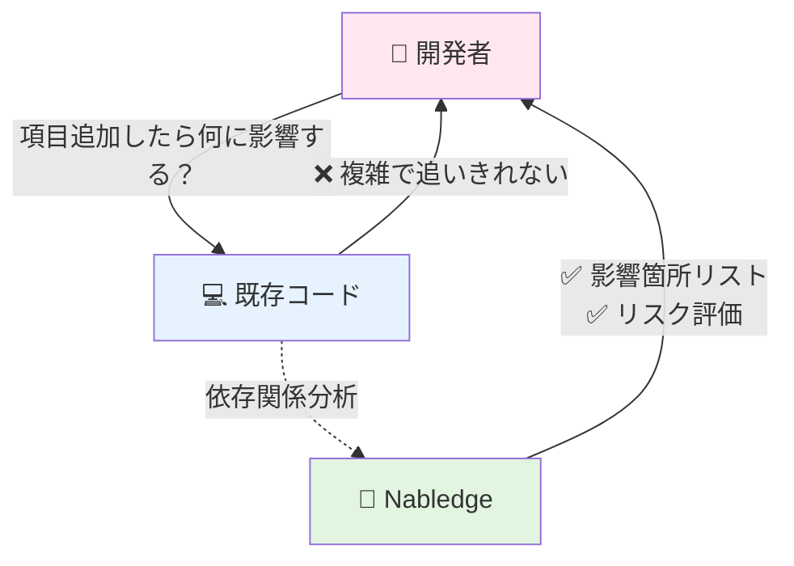
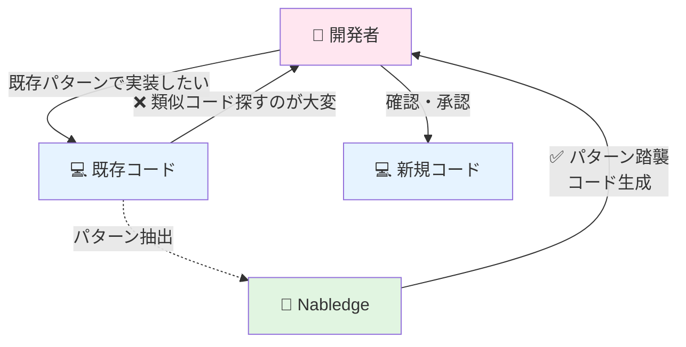
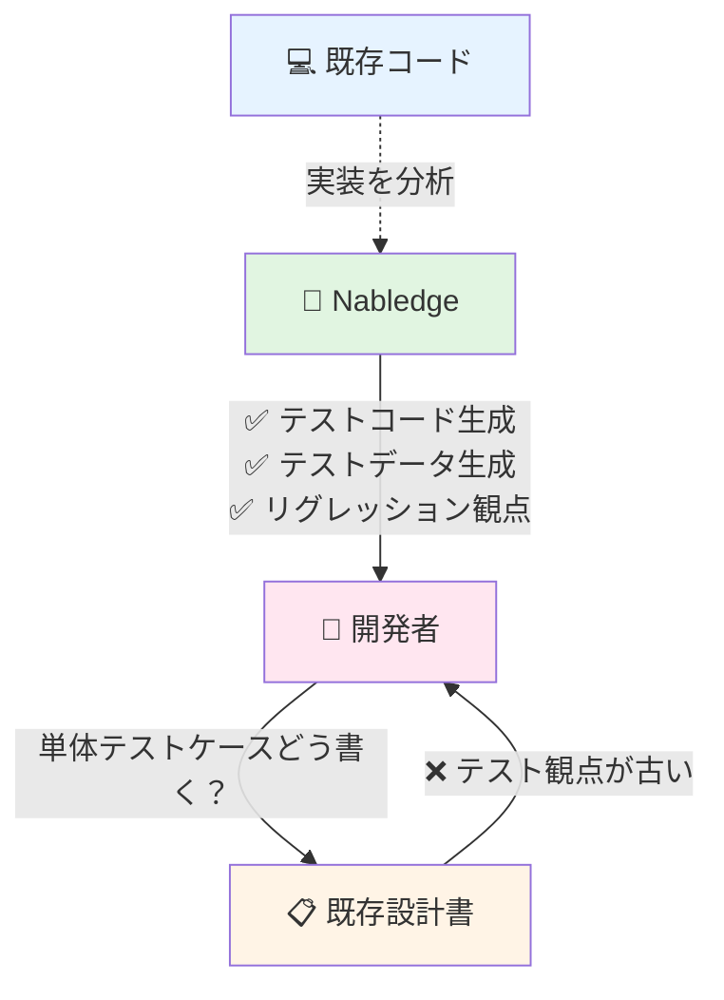
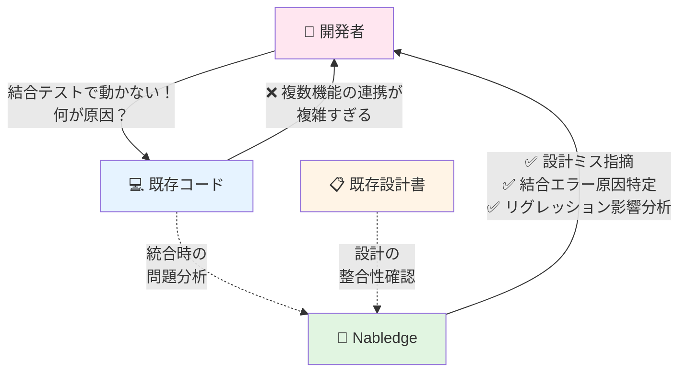

# ToBe Pattern 5: 登場人物の関係図

保守開発における「既存設計書」「既存コード」「Nabledge」の関係性

## 登場人物

## 保守開発シナリオ：既存バッチへの項目追加

### ❶ タスク理解

### ❷ 影響範囲特定

### ❸ 実装

### ❹ PG・UT

### ❺ 結合テスト

## Nabledgeの役割

### 🔗 既存資産の「橋渡し役」
- **既存設計書**: 古い、不完全、実態と乖離
- **既存コード**: 複雑、属人的、理解に時間がかかる
- **Nabledge**: 両者を読み込んで「今の実態」を開発者に伝える

### 🧠 既存資産の「通訳」
- 開発者が「どうなってる？」と聞くと、Nabledgeが既存設計書・コードを解釈して回答
- 図・表・リストなど、分かりやすい形式で提示

### 🛠️ 既存資産を活用した「実装支援」
- 既存コードのパターンを学習・抽出
- 同じパターンで新規実装を生成
- 既存の一貫性を保ちながら開発を加速

## ポイント

### 既存設計書（Excel, Word）の課題
- ❌ メンテナンスされず古い
- ❌ 実装と乖離している
- ❌ 人間が読むのに時間がかかる

**Nabledgeによる解決**:
- ✅ 既存設計書を参考にしつつ、コード実態から「今」を理解
- ✅ 開発者に最新状況を即座に提示

### 既存コード（Java, SQL, JSP）の課題
- ❌ 複雑で理解に時間がかかる
- ❌ 属人的な実装、パターンがバラバラ
- ❌ 影響範囲が追いきれない

**Nabledgeによる解決**:
- ✅ コードを自動解析してフロー図・依存関係を可視化
- ✅ 既存パターンを自動抽出して踏襲実装
- ✅ 影響範囲を事前に分析してリスク可視化

### 結合テストの課題
- ❌ PG・UTは通っても結合テストで動かない
- ❌ 設計ミス（IF不整合、データ連携ミス等）が発覚
- ❌ 複数機能の統合で予期せぬエラー
- ❌ 原因特定に時間がかかる（何が悪いのか分からない）

**Nabledgeによる解決**:
- ✅ 設計段階で設計の整合性チェック（IF、データ定義の不一致を検出）
- ✅ 結合テスト前に統合時のリスクを予測
- ✅ 結合テストエラー発生時、ログ・エラー内容から原因箇所を即座に特定
- ✅ リグレッション影響を事前分析、既存機能への影響を把握

### 開発者のメリット
- 🚀 調査時間が劇的に短縮（数時間 → 数分）
- 🎯 影響範囲の見落としを防止、安心して変更できる
- ⚡ 結合テストの手戻りを削減（設計ミスを事前検出）
- 🐛 結合テストのデバッグ時間を短縮（原因特定が早い）
- 📚 属人的な知識に依存せず、誰でも開発できる
- 😊 「分からない」「不安」が減り、開発に集中できる
