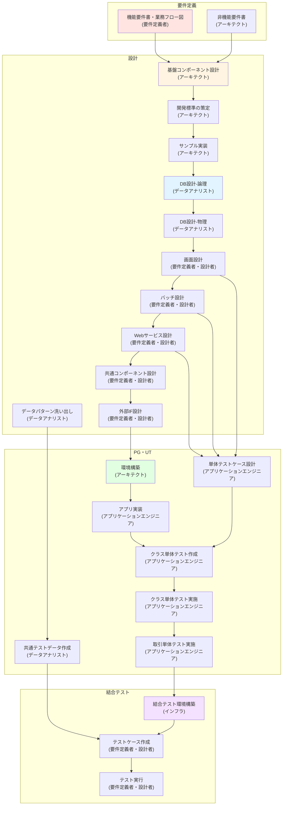
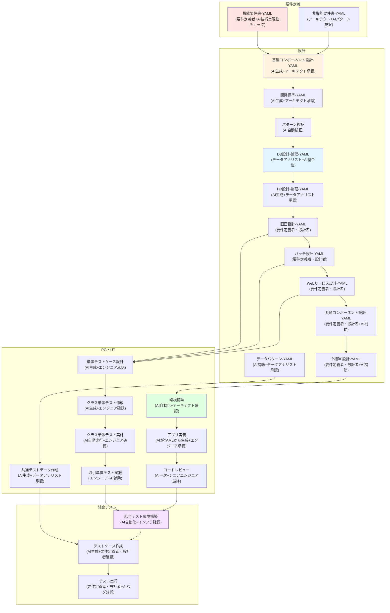

# ToBe Vision: AIエージェントによるNablarch開発プロセス

**作成日**: 2026年2月16日
**ステータス**: Draft（議論・ブラッシュアップ中）
**関連Issue**: #21

---

## 目次

- [AsIsプロセス全体図](#asisプロセス全体図)
- [ToBeプロセス全体図](#tobeプロセス全体図)
- [AsIs ⇔ ToBe マッピング表](#asis--tobe-マッピング表)

---

## AsIsプロセス全体図

**出典**: [Nablarchを使用した開発の流れ.xlsx](../.lw/nab-official/v6/nablarch-system-development-guide/Sample_Project/設計書/Nablarchを使用した開発の流れ.xlsx)



### AsIsの特徴

**主要なロールと担当アクティビティ**（Excel記載の用語に準拠）:

| ロール | 主な担当アクティビティ | 主な成果物 | 工程 |
|--------|------------------------|-----------|------|
| **要件定義者** | 機能要件定義、業務フロー作成 | 機能要件書、業務フロー図 | 要件定義 |
| **アーキテクト** | 非機能要件定義、基盤コンポーネント設計、方式設計、開発標準策定、サンプル実装、環境構築 | 非機能要件書、方式設計書、基盤コンポーネント設計書、コーディング規約、UI標準、単体テスト標準、開発ガイド | 要件定義、設計、PG・UT |
| **データアナリスト** | DB設計（論理・物理）、データパターン洗い出し、共通テストデータ作成 | ER図（概念/論理/物理）、テーブル定義書、ドメイン定義設計書、コード設計書、データパターン表、共通テストデータ | 設計、PG・UT |
| **要件定義者／設計者** | 画面設計、バッチ設計、Webサービス設計、共通コンポーネント設計、外部インタフェース設計、結合テストケース作成・実行 | 画面遷移図、画面一覧、システム機能設計書（画面/バッチ/Webサービス）、共通コンポーネント設計書、外部インタフェース設計書 | 設計、結合テスト |
| **アプリケーションエンジニア** | アプリ実装、単体テストケース設計、クラス単体テスト作成・実施、取引単体テスト実施 | 業務アクション、業務フォーム、業務画面JSP、SQLファイル、単体テスト仕様書、テストコード、単体テスト結果 | PG・UT |
| **データモデラー** | データ定義 | エンティティ | 設計 |
| **(インフラ担当)** | 結合テスト環境構築 | - | 結合テスト |

**主要な成果物（IN/OUT）**:

| 工程 | IN（インプット） | OUT（アウトプット） | 形式 |
|------|------------------|---------------------|------|
| **要件定義** | 業務ヒアリング結果 | 機能要件書、非機能要件書、業務フロー図 | Word/Excel |
| **設計** | 機能要件書、非機能要件書 | 方式設計書、基盤コンポーネント設計書、コーディング規約、UI標準、単体テスト標準、開発ガイド、ER図、テーブル定義書、システム機能設計書（画面/バッチ/Webサービス）、共通コンポーネント設計書、外部インタフェース設計書 | Excel/Word |
| **PG・UT** | 方式設計書、システム機能設計書、テーブル定義書 | 業務アクション、業務フォーム、業務画面JSP、SQLファイル、単体テスト仕様書、テストコード、単体テスト結果、共通テストデータ | Java/JSP/SQL/Excel |
| **結合テスト** | システム機能設計書、共通テストデータ | テストケース、テスト結果、バグ報告 | Excel |

**課題**:
- **手作業中心**で工数がかかる（特にPG・UT工程：実装、単体テスト、レビュー）
- **Excel中心の設計書**でAIが活用しにくい（システム機能設計書、テーブル定義書等）
- アプリケーションエンジニアの**Nablarch習熟に時間**がかかる（オンボーディング2-4週間）
- コード品質が**アプリケーションエンジニアのスキルに依存**
- **設計書とコードの乖離**が発生しやすい（ドキュメントメンテナンス負担）
- **レビュー負荷**が高い（シニア開発者へ集中）
- **取引単体テスト（打鍵テスト）の工数**が大きい

---

## ToBeプロセス全体図

**重要**: 設計書は全て**YAML形式**で管理（AI可読化）



### ToBeの特徴

**主要なロールと担当アクティビティ（人間 + AI協働）**（Excel記載のロールに準拠）:

| ロール | AsIsとの変化 | 主な担当アクティビティ | 協働モデル |
|--------|--------------|------------------------|-----------|
| **要件定義者** | 変化小 | 機能要件定義、業務フロー作成 | **人間主導 + AI技術実現性チェック** |
| **アーキテクト** | **変化大** | 基盤コンポーネント設計承認、開発標準承認、パターン検証、環境構築確認 | **AI生成 → アーキテクト承認**（実装からレビューへ） |
| **データアナリスト** | 変化中 | DB設計主導、データパターン確認、共通テストデータ承認 | **人間主導 + AI整合性チェック・生成補助** |
| **要件定義者／設計者** | 変化中 | 設計書作成（Excel）、結合テストケース確認・実行 | **人間がExcel作成 → AI自動YAML変換 → AIテストケース生成 + 人間確認** |
| **アプリケーションエンジニア** | **変化大** | AI生成コード承認、複雑ロジック実装、単体テスト確認 | **AI生成 → アプリケーションエンジニア承認**（実装からレビューへ） |
| **データモデラー** | 変化小 | データ定義 | **人間主導 + AI補助** |
| **（インフラ担当）** | **変化大** | 環境構築確認のみ | **AI自動化 → 人間確認**（構築から監視へ） |
| **シニアエンジニア** | 変化中 | コードレビュー最終承認 | **AI一次レビュー → シニアエンジニア最終承認** |
| **AIエージェント（新規）** | **新規追加** | コード生成、YAML変換、レビュー、テスト生成、知識検索、自動化、パターン検証 | **人間と協働** |

**協働モデルの種類**:
- **人間主導 + AI補助**: 人間が作業、AIが情報提供・検証（要件定義、DB設計）
- **AI生成 + 人間承認**: AIがドラフト作成、人間が承認・調整（基盤設計、開発標準、実装）
- **AI自動 + 人間確認**: AIが自動実行、人間が結果確認（環境構築、パターン検証、YAML変換）
- **AI一次 + 人間最終**: AIが一次処理、人間が最終判断（コードレビュー）

**主要な成果物（IN/OUT）の変化**:

| 工程 | IN（インプット） | OUT（アウトプット） | 形式変化 |
|------|------------------|---------------------|----------|
| **要件定義** | 業務ヒアリング結果 | 機能要件書（**YAML**）、非機能要件書（**YAML**）、業務フロー図、**技術実現性レポート（新規・AI生成）** | Excel → **YAML** |
| **設計** | 機能要件書（YAML）、非機能要件書（YAML） | 方式設計書（**YAML・AI生成**）、基盤コンポーネント設計書（**YAML・AI生成**）、開発標準（**YAML・AI生成**）、**パターン検証レポート（新規・AI生成）**、ER図、テーブル定義書（**YAML**）、システム機能設計書（**YAML**） | Excel → **YAML** |
| **PG・UT** | 方式設計書（YAML）、システム機能設計書（**YAML**）、テーブル定義書（YAML） | 業務アクション（**AI生成**）、業務フォーム（**AI生成**）、業務画面JSP（**AI生成**）、SQLファイル（**AI生成**）、単体テスト仕様書（**AI生成**）、テストコード（**AI生成**）、単体テスト結果、共通テストデータ（**AI生成**）、**コードレビューレポート（新規・AI生成）** | Java/JSP/SQL（手動）→ Java/JSP/SQL（**AI生成**） |
| **結合テスト** | システム機能設計書（YAML）、共通テストデータ | テストケース（**AI生成**）、テスト結果、**バグ分析レポート（新規・AI生成）** | Excel（手動）→ **YAML（AI生成）** |

**新規アクティビティ（AsIsにはない）**:
- ✅ **技術実現性チェック（AI）** - 要件定義段階でNablarchパターンによる実現可能性を検証
- ✅ **パターン検証・アンチパターン検出（AI）** - 設計段階でNablarchアンチパターンをリスク検出
- ✅ **設計書のYAML化** - 全ての設計書をAI可読なYAML形式で作成・管理
- ✅ **AI生成コードのアプリケーションエンジニアレビュー** - YAMLから生成されたコードを確認・承認
- ✅ **開発標準の整合性自動チェック（AI）** - コーディング規約・UI標準・単体テスト標準間の矛盾検出

**改善ポイント**:
- ✅ **PG・UT工程で60-70%工数削減**（アプリ実装・単体テスト作成・クラス単体テストの自動化）
- ✅ **設計書のAI可読化**（YAML形式）により実装精度向上
- ✅ **一貫したNablarchパターン適用**（AIによる自動検証・生成）
- ✅ **リアルタイムなNablarchナレッジアクセス**（nabledge知識検索）
- ✅ **設計書とコードの自動同期**（YAMLをソースとした自動生成）
- ✅ **コードレビューボトルネック解消**（AI一次レビュー → シニアエンジニア最終承認）
- ✅ **取引単体テスト（打鍵テスト）の効率化**（AIによる補助）

---

## AsIs ⇔ ToBe マッピング表

### 工程別アクター・工数・成果物の変化

| 工程 | AsIs アクター | ToBe アクター | AsIs 工数 | ToBe 工数 | 削減率 |
|------|---------------|---------------|-----------|-----------|--------|
| **要件定義** | 人間（BA, Arch） | 人間主導 + AI補助 | 高 | 中 | **30%削減** |
| **方式設計** | 人間（Arch） | AI生成 + 人間レビュー | 非常に高 | 中 | **40%削減** |
| **設計** | 人間（Tech Lead） | AI生成 + 人間レビュー | 非常に高 | 中 | **50%削減** |
| **PGUT** | 人間（Dev） | AI生成 + 人間レビュー | 非常に高 | 低〜中 | **60-70%削減** |
| **結合テスト** | 人間（Tester） | AI補助 + 人間実行 | 非常に高 | 中 | **40%削減** |

### 主要成果物の形式変化

| 成果物 | AsIs 形式 | ToBe 形式 | 変換方法 |
|--------|-----------|-----------|----------|
| **要件定義書** | Word/Excel | Markdown | 手動移行（初回のみ） |
| **方式設計書** | Excel | **Markdown or YAML** | AI生成（テンプレートから） |
| **設計標準** | Excel | **Markdown or YAML** | AI生成（テンプレートから） |
| **外部設計書** | Excel | **Excel + YAML** | **AI自動相互変換** ⭐ |
| **コーディング規約** | Word | Markdown | AI生成（テンプレートから） |
| **テスト標準** | Excel | **Markdown or YAML** | AI生成（テンプレートから） |
| **ソースコード** | Java（手動） | Java（AI生成+人間レビュー） | nabledge-6経由 |
| **テストコード** | Java/Excel（手動） | Java（AI生成） | nabledge-6経由 |

### ⭐ 重要：設計書のYAML化戦略

**AsIsの課題**:
- 設計書はExcel形式（システム機能設計書：画面・バッチ・Webサービス等）
- AIエージェントがExcelを直接読むのは困難
- 人間が設計書を読んで実装 → ヒューマンエラーのリスク

**ToBeの解決策**:
```
設計者 → YAML設計書作成（AI可読、構造化データ）
         ↓
   AIエージェント → コード生成
         ↓
     人間レビュー → 承認
```

**YAML設計書の例（バッチ設計）**:

```yaml
batch:
  id: BATCH001
  name: プロジェクト一括登録
  type: file-to-db
  input:
    file: project_import.csv
    format: csv
    encoding: UTF-8
  processing:
    description: CSVファイルからプロジェクトをDBに登録
    validation: required
    transaction: per-record
  output:
    table: PROJECT
    operation: insert-or-update
```

**メリット**:
- YAMLはAIエージェントが正確に解釈可能
- Git管理しやすい（差分確認、バージョン管理）
- 設計書とコードの自動同期が容易
- 構造化データとして検証・変換が可能

---

**Document Owner**: Nablarch Development Team
**Last Updated**: 2026-02-16
**Status**: Draft（PR #22でレビュー・議論中）
