# ToBe Vision: AIエージェントによるNablarch開発プロセス

**作成日**: 2026年2月16日
**ステータス**: Draft（議論・ブラッシュアップ中）
**関連Issue**: #21

---

## 目次

- [エグゼクティブサマリー](#エグゼクティブサマリー)
- [AsIsプロセス全体図](#asisプロセス全体図)
- [ToBeプロセス全体図](#tobeプロセス全体図)
- [AsIs ⇔ ToBe マッピング表](#asis--tobe-マッピング表)
- [工程別詳細比較](#工程別詳細比較)
  - [要件定義工程](#1-要件定義工程)
  - [方式設計工程](#2-方式設計工程)
  - [設計工程](#3-設計工程)
  - [PGUT工程](#4-pgut工程)
  - [結合テスト工程](#5-結合テスト工程)
- [導入ロードマップ](#導入ロードマップ)

---

## エグゼクティブサマリー

本文書は、従来型のウォーターフォール開発プロセス（AsIs）を、**nabledgeスキル**と**AIエージェント**を活用した開発プロセス（ToBe）に転換するビジョンを示します。

### 期待効果

- **PGUT工程の工数を60-70%削減**（実装・コードレビュー・テスト作成の自動化）
- **オンボーディング期間を75%短縮**（2-4週間 → 3-5日）
- **コード品質の向上**（Nablarchパターンの一貫適用、アンチパターン検出）
- **開発サイクル全体で50-60%の高速化**

### 変革のポイント

1. **AIエージェントを開発パートナーとして導入**
   - 人間：要件定義、設計判断、複雑なロジック、承認
   - AIエージェント：実装、コードレビュー、テスト作成、調査

2. **Nablarch構造化知識（nabledge）の活用**
   - 60+の知識ファイルでフレームワークパターンを体系化
   - AIエージェントが即座に正確な実装ガイダンスを提供

3. **設計書のAI可読化**
   - AsIs：Excel/Word中心
   - ToBe：**Excel ⇔ YAML相互変換**によりAIエージェントが設計書を理解・活用

4. **ウォーターフォールのガバナンス構造は維持**
   - 工程ゲート、承認プロセスは継続
   - 品質基準は維持または向上

---

## AsIsプロセス全体図

```mermaid
graph TB
    subgraph 要件定義工程
        A1["業務要件定義<br/>(BA: ビジネスアナリスト)"]
        A2["非機能要件定義<br/>(Arch: アーキテクト)"]
        A3["テスト計画<br/>(Test Lead: テストリード)"]
        A4["プロジェクト用開発ガイド作成<br/>(Tech Lead: テックリード)"]
    end

    subgraph 方式設計工程
        B1["アプリ方式設計<br/>(Arch: アーキテクト)"]
        B2["セキュリティ設計<br/>(Security Spec: セキュリティ担当)"]
        B3["Nablarchパターン確認<br/>(Arch + Dev: アーキテクト・開発者)"]
    end

    subgraph 設計工程
        C1["設計標準作成<br/>(Tech Lead: テックリード)"]
        C2["コーディング規約作成<br/>(Tech Lead: テックリード)"]
        C3["テスト標準作成<br/>(Test Lead: テストリード)"]
        C4["UI標準作成<br/>(UI Designer: UIデザイナー)"]
    end

    subgraph PGUT工程
        D1["Nablarchプロジェクト初期構築<br/>(Tech Lead: テックリード)"]
        D2["チーム開発環境構築<br/>(Infra: インフラ担当)"]
        D3["開発環境構築ガイド作成<br/>(Tech Lead: テックリード)"]
        D4["実装<br/>(Dev: 開発者)"]
        D5["コードレビュー<br/>(Senior Dev: シニア開発者)"]
        D6["単体テスト<br/>(Dev: 開発者)"]
    end

    subgraph 結合テスト工程
        E1["結合テスト環境構築<br/>(Infra: インフラ担当)"]
        E2["疎通確認<br/>(Dev: 開発者)"]
        E3["テストケース作成<br/>(Tester: テスター)"]
        E4["テストデータ作成<br/>(Tester + Dev: テスター・開発者)"]
        E5["テスト実行<br/>(Tester: テスター)"]
    end

    A1 --> A2 --> A3 --> A4
    A4 --> B1
    B1 --> B2 --> B3
    B3 --> C1
    C1 --> C2 --> C3 --> C4
    C4 --> D1
    D1 --> D2 --> D3 --> D4
    D4 --> D5 --> D6
    D6 --> E1
    E1 --> E2 --> E3 --> E4 --> E5

    style A1 fill:#ffe4e1
    style B1 fill:#fff4e1
    style C1 fill:#e1f4ff
    style D1 fill:#e1ffe1
    style E1 fill:#f4e1ff
```



### AsIsの特徴

**主要なロールと担当アクティビティ**:

| ロール | 略称 | 主な担当アクティビティ | 工程 |
|--------|------|------------------------|------|
| ビジネスアナリスト | BA | 業務要件定義 | 要件定義 |
| アーキテクト | Arch | 非機能要件定義、方式設計、セキュリティ設計、パターン確認 | 要件定義、方式設計 |
| テストリード | Test Lead | テスト計画、テスト標準作成 | 要件定義、設計 |
| テックリード | Tech Lead | 開発ガイド作成、設計標準作成、コーディング規約作成、プロジェクト初期構築、環境構築ガイド作成 | 要件定義、設計、PGUT |
| UIデザイナー | UI Designer | UI標準作成 | 設計 |
| インフラ担当 | Infra | チーム開発環境構築、結合テスト環境構築 | PGUT、結合テスト |
| 開発者 | Dev | 実装、単体テスト、疎通確認、テストデータ作成 | PGUT、結合テスト |
| シニア開発者 | Senior Dev | コードレビュー | PGUT |
| テスター | Tester | テストケース作成、テストデータ作成、テスト実行 | 結合テスト |
| セキュリティ担当 | Security Spec | セキュリティ設計 | 方式設計 |

**主要な成果物（IN/OUT）**:

| 工程 | IN（インプット） | OUT（アウトプット） | 形式 |
|------|------------------|---------------------|------|
| 要件定義 | 業務ヒアリング結果 | 業務要件書、非機能要件書、テスト計画書、開発ガイド | Word/Excel |
| 方式設計 | 要件定義書、非機能要件書 | 方式設計書、セキュリティ設計書 | Excel |
| 設計 | 方式設計書 | 設計標準、コーディング規約、テスト標準、UI標準 | Excel/Word |
| PGUT | 設計標準、外部設計書（Excel） | ソースコード、単体テスト、テスト結果 | Java/JUnit |
| 結合テスト | ソースコード、外部設計書 | テストケース、テスト結果、バグ報告 | Excel |

**課題**:
- **手作業中心**で工数がかかる（特にPGUT工程：実装、レビュー、テスト）
- **Excel/Word中心**でAIが活用しにくい
- 開発者の**Nablarch習熟に時間**がかかる（オンボーディング2-4週間）
- コード品質が**開発者のスキルに依存**
- **ドキュメントメンテナンス**が負担（設計書とコードの乖離）
- **レビューがボトルネック**（シニア開発者に集中）

---

## ToBeプロセス全体図

```mermaid
graph TB
    subgraph 要件定義工程
        A1["業務要件定義<br/>(BA主導 + AI補助)"]
        A2["非機能要件定義<br/>(Arch主導 + AI補助)"]
        A3["テスト計画<br/>(Test Lead主導 + AI補助)"]
        A4["技術実現性チェック<br/>(AI自動実行)"]
    end

    subgraph 方式設計工程
        B1["方式設計ドラフト生成<br/>(AI生成 + Arch承認)"]
        B2["セキュリティ設計<br/>(AI補助 + Security Spec承認)"]
        B3["パターン検証<br/>(AI自動検証)"]
        B4["アンチパターン検出<br/>(AI自動検出)"]
    end

    subgraph 設計工程
        C1["設計標準生成<br/>(AI生成 + Tech Lead承認)"]
        C2["整合性チェック<br/>(AI自動検証)"]
        C3["Excel⇔YAML変換設定<br/>(AI生成 + Tech Lead承認)"]
    end

    subgraph PGUT工程
        D1["プロジェクト初期化<br/>(AI自動化 + Tech Lead確認)"]
        D2["環境構築<br/>(AI自動化 + Infra確認)"]
        D3["実装<br/>(AI生成 + Dev承認)"]
        D4["コードレビュー<br/>(AI一次 + Senior Dev最終)"]
        D5["単体テスト生成<br/>(AI生成 + Dev確認)"]
        D6["デバッグ<br/>(AI分析 + Dev対応)"]
    end

    subgraph 結合テスト工程
        E1["環境構築<br/>(AI自動化 + Infra確認)"]
        E2["テストケース生成<br/>(AI生成 + Tester確認)"]
        E3["テストデータ生成<br/>(AI生成 + Tester確認)"]
        E4["テスト実行<br/>(Tester実行)"]
        E5["バグ分析<br/>(AI分析 + Dev対応)"]
    end

    A1 --> A2 --> A3 --> A4
    A4 --> B1
    B1 --> B2 --> B3 --> B4
    B4 --> C1 --> C2 --> C3
    C3 --> D1 --> D2 --> D3
    D3 --> D4 --> D5 --> D6
    D6 --> E1 --> E2 --> E3 --> E4 --> E5

    style A1 fill:#ffe4e1
    style B1 fill:#fff4e1
    style C1 fill:#e1f4ff
    style D1 fill:#e1ffe1
    style E1 fill:#f4e1ff
```



### ToBeの特徴

**主要なロールと担当アクティビティ（人間 + AI協働）**:

| ロール | 略称 | AsIsとの変化 | 主な担当アクティビティ | 協働モデル |
|--------|------|--------------|------------------------|-----------|
| ビジネスアナリスト | BA | 変化小 | 業務要件定義 | **人間主導**、AIが技術実現性チェック |
| アーキテクト | Arch | **変化大** | 方式設計承認、パターン選定 | **AI生成→人間承認**、AIがドラフト作成 |
| テストリード | Test Lead | 変化小 | テスト標準承認 | **AI生成→人間承認** |
| テックリード | Tech Lead | **変化大** | 標準承認、環境確認、複雑問題解決 | **AI生成→人間承認**、自動化タスクは確認のみ |
| UIデザイナー | UI Designer | 変化小 | UI標準作成 | AIが整合性チェック |
| インフラ担当 | Infra | **変化大** | 環境構築確認 | **AI自動化→人間確認**、構築作業から監視へ |
| 開発者 | Dev | **変化大** | 設計書作成、AI生成コード承認、複雑ロジック実装 | **AI生成→人間承認**、実装からレビューへ |
| シニア開発者 | Senior Dev | 変化中 | コードレビュー最終承認 | **AI一次レビュー→人間最終承認** |
| テスター | Tester | 変化中 | テスト戦略、探索的テスト、AI生成テスト確認 | **AI生成→人間確認+探索テスト** |
| セキュリティ担当 | Security Spec | 変化小 | セキュリティ設計承認 | AIがチェックリスト自動マッピング |
| **AIエージェント** | **AI** | **新規** | コード生成、レビュー、テスト生成、知識検索、自動化 | **人間と協働** |

**協働モデルの種類**:
- **人間主導 + AI補助**: 人間が作業、AIが情報提供・検証（要件定義）
- **AI生成 + 人間承認**: AIがドラフト作成、人間が承認・調整（方式設計、実装）
- **AI自動 + 人間確認**: AIが自動実行、人間が結果確認（環境構築、検証）
- **AI一次 + 人間最終**: AIが一次処理、人間が最終判断（コードレビュー）

**主要な成果物（IN/OUT）の変化**:

| 工程 | IN（インプット） | OUT（アウトプット） | 形式変化 |
|------|------------------|---------------------|----------|
| 要件定義 | 業務ヒアリング結果 | 業務要件書、非機能要件書、テスト計画書、**技術実現性レポート（新規）** | Word/Excel → **Markdown** |
| 方式設計 | 要件定義書 | 方式設計書、セキュリティ設計書、**パターン検証レポート（新規）** | Excel → **Markdown/YAML** |
| 設計 | 方式設計書 | 設計標準、コーディング規約、テスト標準、**Excel⇔YAML変換定義（新規）** | Excel/Word → **Markdown/YAML** |
| PGUT | 設計標準、**外部設計書（YAML）** | ソースコード（**AI生成**）、単体テスト（**AI生成**）、**レビューレポート（新規）** | Java（手動）→ Java（**AI生成**） |
| 結合テスト | ソースコード、外部設計書（YAML） | テストケース（**AI生成**）、テスト結果、**バグ分析レポート（新規）** | Excel（手動）→ YAML（**AI生成**） |

**新規アクティビティ（AsIsにはない）**:
- ✅ 技術実現性チェック（AI）- 要件段階で実現可能性検証
- ✅ パターン検証・アンチパターン検出（AI）- 設計段階でリスク検出
- ✅ **Excel ⇔ YAML相互変換**（AI）- 設計書のAI可読化
- ✅ AI生成コードの人間レビュー - 実装品質担保
- ✅ 整合性自動チェック（AI）- 標準間の矛盾検出

**改善ポイント**:
- ✅ **工数60-70%削減**（PGUT工程：実装・レビュー・テストの自動化）
- ✅ **設計書のAI可読化**（Excel⇔YAML変換）により実装精度向上
- ✅ **一貫したNablarchパターン適用**（AIによる自動検証）
- ✅ **リアルタイムなナレッジアクセス**（nabledge知識検索）
- ✅ **ドキュメント自動生成・同期**（設計書とコードの乖離防止）
- ✅ **レビューボトルネック解消**（AI一次レビュー）

---

## AsIs ⇔ ToBe マッピング表

### 工程別アクター・工数・成果物の変化

| 工程 | AsIs アクター | ToBe アクター | AsIs 工数 | ToBe 工数 | 削減率 |
|------|---------------|---------------|-----------|-----------|--------|
| **要件定義** | 人間（BA, Arch） | 人間主導 + AI補助 | 高 | 中 | **30%削減** |
| **方式設計** | 人間（Arch） | AI生成 + 人間レビュー | 非常に高 | 中 | **40%削減** |
| **設計** | 人間（Tech Lead） | AI生成 + 人間レビュー | 非常に高 | 中 | **50%削減** |
| **PGUT** | 人間（Dev） | AI生成 + 人間レビュー | 非常に高 | 低〜中 | **60-70%削減** |
| **結合テスト** | 人間（Tester） | AI補助 + 人間実行 | 非常に高 | 中 | **40%削減** |

### 主要成果物の形式変化

| 成果物 | AsIs 形式 | ToBe 形式 | 変換方法 |
|--------|-----------|-----------|----------|
| **要件定義書** | Word/Excel | Markdown | 手動移行（初回のみ） |
| **方式設計書** | Excel | **Markdown or YAML** | AI生成（テンプレートから） |
| **設計標準** | Excel | **Markdown or YAML** | AI生成（テンプレートから） |
| **外部設計書** | Excel | **Excel + YAML** | **AI自動相互変換** ⭐ |
| **コーディング規約** | Word | Markdown | AI生成（テンプレートから） |
| **テスト標準** | Excel | **Markdown or YAML** | AI生成（テンプレートから） |
| **ソースコード** | Java（手動） | Java（AI生成+人間レビュー） | nabledge-6経由 |
| **テストコード** | Java/Excel（手動） | Java（AI生成） | nabledge-6経由 |

### ⭐ 重要：設計書のAI可読化戦略

**AsIsの課題**:
- 設計書はExcel形式（外部設計書、画面設計書、バッチ設計書等）
- AIエージェントがExcelを直接読むのは困難
- 人間が設計書を読んで実装 → ヒューマンエラーのリスク

**ToBeの解決策**:
```
設計者 → Excel設計書作成（人間が読みやすい）
         ↓
     AI変換ツール（双方向）
         ↓
     YAML設計書（AI可読、構造化データ）
         ↓
   AIエージェント → コード生成
         ↓
     人間レビュー → 承認
```

**変換仕様（例：バッチ設計書）**:

Excel形式:
```
| 項目 | 内容 |
| バッチID | BATCH001 |
| バッチ名 | プロジェクト一括登録 |
| 入力ファイル | project_import.csv |
| 処理概要 | CSVファイルからプロジェクトをDBに登録 |
```

↓ AI自動変換 ↓

YAML形式:
```yaml
batch:
  id: BATCH001
  name: プロジェクト一括登録
  type: file-to-db
  input:
    file: project_import.csv
    format: csv
    encoding: UTF-8
  processing:
    description: CSVファイルからプロジェクトをDBに登録
    validation: required
    transaction: per-record
  output:
    table: PROJECT
    operation: insert-or-update
```

**メリット**:
- Excelは人間向けとして継続使用可能
- YAMLはAIエージェントが正確に解釈
- 双方向変換により両方のメリットを享受
- 設計変更時も自動同期

---

## 工程別詳細比較

### 1. 要件定義工程

#### AsIs

| 項目 | 内容 |
|------|------|
| **アクター** | ビジネスアナリスト、アーキテクト |
| **主要アクティビティ** | 業務要件定義、非機能要件定義、テスト計画 |
| **IN** | 業務ヒアリング結果 |
| **OUT** | 要件定義書（Word）、非機能要件書（Excel/IPA テンプレート）、テスト計画書（Excel） |
| **工数** | 高 |
| **課題** | ・文書化に時間がかかる<br/>・要件の曖昧さが残りやすい<br/>・技術的実現可能性の検証が遅い |

#### ToBe

| 項目 | 内容 |
|------|------|
| **アクター** | ビジネスアナリスト、アーキテクト（人間主導）+ AIエージェント（補助） |
| **主要アクティビティ** | 業務要件定義、非機能要件定義、テスト計画、**技術実現性チェック（新規）** |
| **IN** | 業務ヒアリング結果 |
| **OUT** | 要件定義書（**Markdown**）、非機能要件書（**Markdown + Nablarchパターンマッピング**）、テスト計画書（**Markdown**）、**技術実現性レポート（AI生成）** |
| **工数** | 中 |
| **改善点** | ・AIが要件からNablarchパターンを提案<br/>・技術実現性を早期検証<br/>・Markdown形式でバージョン管理しやすい |

**ToBeの新規アクティビティ例**:

```
人間: 「検索結果を50件ずつページングで表示したい」

AIエージェント（nabledge-6使用）:
1. nabledge知識検索: features/libraries/universal-dao.json → paging セクション
2. 回答生成:
   「NablarchのUniversalDaoでページング対応可能です。
   DeferredEntityListを使用し、page numberとmax resultsで制御します。
   実装パターンは以下の通りです...」
3. 要件定義書に技術実現性メモを追加
```

---

### 2. 方式設計工程

#### AsIs

| 項目 | 内容 |
|------|------|
| **アクター** | アーキテクト、セキュリティスペシャリスト |
| **主要アクティビティ** | アプリ方式設計、セキュリティ設計、Nablarchパターン確認 |
| **IN** | 要件定義書、非機能要件書 |
| **OUT** | 方式設計書（Excel）、セキュリティ設計書（Excel） |
| **工数** | 非常に高 |
| **課題** | ・サンプルのカスタマイズに時間がかかる<br/>・アーキテクトのNablarch知識に依存<br/>・パターン/アンチパターンの漏れリスク |

#### ToBe

| 項目 | 内容 |
|------|------|
| **アクター** | アーキテクト（判断・承認）+ AIエージェント（生成・検証） |
| **主要アクティビティ** | **AI方式設計生成**、セキュリティ設計、**パターン自動検証**、**アンチパターン自動検出** |
| **IN** | 要件定義書（Markdown）、非機能要件書（Markdown） |
| **OUT** | 方式設計書（**Markdown**）、セキュリティ設計書（**Markdown + Nablarch対応表**）、**パターン検証レポート（AI生成）**、**アンチパターン検出レポート（AI生成）** |
| **工数** | 中 |
| **改善点** | ・AIが要件から方式設計ドラフトを自動生成<br/>・Nablarchパターンの自動検証<br/>・アンチパターンの早期検出<br/>・IPAセキュリティチェックリストとNablarch機能の自動マッピング |

**ToBeの新規ワークフロー例**:

```
人間: 「File-to-DBバッチの方式設計を作成」

AIエージェント（nabledge-6使用）:
1. nabledge知識検索: features/processing/nablarch-batch.json → file-to-db パターン
2. 必要なハンドラを特定:
   - FileRecordReaderDisposeHandler（ファイル入力）
   - TransactionManagementHandler（トランザクション制御）
   - ValidationHandler（入力検証）
3. ハンドラ構成のドラフトを生成
4. エラーハンドリング戦略を提案
5. 単体テストアプローチを提案
6. 方式設計書ドラフト（Markdown）を生成
   ↓
人間（アーキテクト）: レビュー・承認
```

---

### 3. 設計工程

#### AsIs

| 項目 | 内容 |
|------|------|
| **アクター** | テックリード、UIデザイナー |
| **主要アクティビティ** | 設計標準作成、コーディング規約作成、テスト標準作成、UI標準作成 |
| **IN** | 方式設計書、要件定義書 |
| **OUT** | 設計標準（Excel）、コーディング規約（Word）、テスト標準（Excel）、UI標準（Word/Excel） |
| **工数** | 非常に高 |
| **課題** | ・テンプレートのカスタマイズに膨大な時間<br/>・標準間の整合性確保が困難<br/>・標準の妥当性検証が遅い |

#### AsIs

| 項目 | 内容 |
|------|------|
| **アクター** | テックリード（判断・承認）+ AIエージェント（生成・検証） |
| **主要アクティビティ** | **AI標準生成**、**整合性自動チェック**、**Excel⇔YAML変換設定** |
| **IN** | 方式設計書（Markdown）、プロジェクト要件 |
| **OUT** | 設計標準（**Markdown/YAML**）、コーディング規約（**Markdown**）、テスト標準（**Markdown/YAML**）、**Excel⇔YAML変換定義** |
| **工数** | 中 |
| **改善点** | ・AIがプロジェクト要件から標準ドラフトを自動生成<br/>・標準間の整合性を自動検証<br/>・Nablarchベストプラクティスを自動適用<br/>・**設計書変換ルール定義（Excel→YAML）** |

**ToBeの新規ワークフロー例**:

```
人間: 「バッチ処理の軽量型テスト標準を作成」

AIエージェント（nabledge-6使用）:
1. プロジェクト要件を確認（バッチスコープ: File-to-DB, DB-to-File）
2. nabledge知識検索: バッチテストパターン
3. テスト標準ドラフト生成:
   - バッチアクションの単体テストアプローチ
   - テストデータ準備ガイドライン
   - ファイルI/Oのアサーションパターン
   - DB状態検証方法
4. 軽量型アプローチに調整（NTFの重厚型から簡略化）
5. Excel/Markdownテンプレート生成
   ↓
人間（テックリード）: レビュー・最終調整・承認

＋

人間: 「外部設計書からYAMLへの変換ルールを定義」

AIエージェント:
1. プロジェクトの設計書テンプレート（Excel）を解析
2. YAML構造を提案:
   - バッチ設計書 → batch.yaml
   - REST API設計書 → api.yaml
3. 変換マッピング定義を生成
4. 双方向変換スクリプトを生成
   ↓
人間（テックリード）: 検証・承認
```

---

### 4. PGUT工程

**最も大きな変革が起きる工程**（工数60-70%削減）

#### AsIs

| 項目 | 内容 |
|------|------|
| **アクター** | テックリード（環境構築）、開発者（実装・テスト）、シニア開発者（レビュー） |
| **主要アクティビティ** | Nablarchプロジェクト初期構築、チーム開発環境構築、開発環境構築ガイド作成、実装、コードレビュー、単体テスト |
| **IN** | 設計標準、外部設計書（Excel）、コーディング規約、テスト標準 |
| **OUT** | ソースコード（Java）、単体テスト（JUnit/Excel）、テスト結果 |
| **工数** | 非常に高 |
| **課題** | ・手動実装で時間がかかる<br/>・開発者のスキルによりコード品質がばらつく<br/>・レビューに時間がかかる<br/>・Nablarchパターンの誤用リスク<br/>・Excel設計書の解釈ミス |

#### ToBe

| 項目 | 内容 |
|------|------|
| **アクター** | AIエージェント（実装・一次レビュー・テスト生成）+ 人間（レビュー・承認） |
| **主要アクティビティ** | **プロジェクト自動初期化**、**環境自動構築**、**AIコード生成**、**AI一次レビュー**、**AIテスト生成**、**AI補助デバッグ** |
| **IN** | 設計標準（Markdown/YAML）、外部設計書（**Excel → YAML自動変換**）、コーディング規約（Markdown） |
| **OUT** | ソースコード（**AI生成**+人間レビュー）、単体テスト（**AI生成**）、**コードレビューレポート（AI生成）**、テスト結果 |
| **工数** | 低〜中 |
| **改善点** | ・**設計書（YAML）からAIが直接コード生成**<br/>・Nablarchパターンを自動適用<br/>・AIが一次コードレビュー実施<br/>・AIが単体テスト自動生成<br/>・デバッグ時にAIがnabledge知識から原因特定支援 |

**ToBeの詳細ワークフロー**:

**① プロジェクト初期化・環境構築（自動化）**:
```
AIエージェント:
1. Mavenプロジェクト構造生成
2. 方式設計書（Markdown）からハンドラ構成を読み取り
3. component-definition.xml自動生成
4. データベース設定自動生成
5. Git/CI/CDパイプライン自動構築
   ↓
人間（テックリード）: 設定レビュー・承認
```

**② 実装（AI主導）**:
```
人間: 外部設計書（Excel）を作成
  ↓
AI変換ツール: Excel → YAML自動変換
  ↓
AIエージェント（nabledge-6使用）:
1. YAML設計書を解析
   例: batch.yaml → バッチID=BATCH001, type=file-to-db, input=project_import.csv
2. nabledge知識検索: features/processing/nablarch-batch.json → file-to-db パターン
3. バッチアクションクラスを生成:
   - DataReader実装
   - Formバリデーション
   - UniversalDao使用
   - エラーハンドリング
   - トランザクション境界
4. コード生成完了
   ↓
人間（開発者）: 生成コードレビュー、複雑なビジネスロジック追加
```

**③ コードレビュー（AI一次チェック）**:
```
AIエージェント（nabledge-6使用）:
自動チェック項目:
- Nablarchパターン準拠性
- セキュリティ脆弱性（SQL injection, XSS等）
- パフォーマンスアンチパターン
- 例外ハンドリングの妥当性
- トランザクション管理
- リソースクリーンアップ（ファイルハンドル、接続）
- コーディング規約準拠

レビューレポート生成
   ↓
人間（シニア開発者）: AI指摘事項確認、ビジネスロジック妥当性レビュー、最終承認
```

**④ 単体テスト（AI生成）**:
```
AIエージェント（nabledge-6使用）:
1. 実装コードを解析
2. テストシナリオ特定（正常系、異常系、境界値）
3. nabledge知識検索: テストパターン
4. JUnitテストケース生成:
   - テストデータsetup/teardown
   - アサーション生成
   - モック設定
   ↓
人間（開発者）: テストカバレッジ確認、複雑なビジネスロジックのテスト追加
```

**⑤ デバッグ（AI補助）**:
```
人間: エラー発生「Transaction not active」
  ↓
AIエージェント（nabledge-6使用）:
1. nabledge知識検索: features/handlers/transaction-management-handler.json → common errors
2. 原因特定: トランザクション境界の設定ミス
3. 修正案提示: TransactionManagementHandlerをハンドラキューに追加
4. コード例提示
   ↓
人間（開発者）: 修正実施
```

---

### 5. 結合テスト工程

#### AsIs

| 項目 | 内容 |
|------|------|
| **アクター** | インフラ担当（環境構築）、テスター（テスト作成・実行）、開発者（バグ修正） |
| **主要アクティビティ** | 結合テスト環境構築、疎通確認、テストケース作成、テストデータ作成、テスト実行、バグトリアージ |
| **IN** | ソースコード、外部設計書 |
| **OUT** | テスト結果、バグ報告 |
| **工数** | 非常に高 |
| **課題** | ・環境構築に時間がかかる<br/>・テストケース作成が手作業で膨大<br/>・テストデータ作成が労力大<br/>・リグレッションテストのコストが高い |

#### ToBe

| 項目 | 内容 |
|------|------|
| **アクター** | AIエージェント（環境構築・テスト生成）+ 人間（テスト戦略・実行・トリアージ） |
| **主要アクティビティ** | **環境自動構築**、**AIテストケース生成**、**AIテストデータ生成**、テスト実行、**AIバグ分析** |
| **IN** | ソースコード、外部設計書（YAML） |
| **OUT** | テスト結果、**バグ分析レポート（AI生成）** |
| **工数** | 中 |
| **改善点** | ・環境構築の自動化（Infrastructure as Code + AI）<br/>・要件・設計書からAIがテストケース自動生成<br/>・AIがテストデータ生成（DB制約・ビジネスルール考慮）<br/>・AIがバグ報告からnabledge知識で根本原因分析 |

**ToBeのワークフロー例**:

```
AIエージェント（テストケース生成）:
1. 機能仕様書（Markdown）を確認
2. 外部設計書（YAML）を確認
3. nabledge知識検索: テストパターン
4. テストケース生成:
   - 正常系シナリオ
   - 異常系シナリオ（バリデーションエラー、DB制約違反等）
   - 境界値テスト
   - 期待結果定義
   ↓
人間（テスター）: テストケースレビュー、探索的テスト追加

---

AIエージェント（バグ分析）:
1. バグ報告を受領（例: 「バッチ実行時にNullPointerException」）
2. スタックトレース解析
3. nabledge知識検索: 類似エラーパターン
4. 根本原因推定: 「UniversalDaoのsearchメソッド結果がnullの可能性」
5. 修正案提示: 「null チェック追加、またはOptional使用を推奨」
   ↓
人間（開発者）: 分析結果確認、修正実施
```

---

## 導入ロードマップ

### Phase 0: 準備（現在）

**期間**: 2週間
**目標**: nabledge-6完成、ToBe visionステークホルダー合意

- [x] nabledge-6スキル構造作成
- [x] コアワークフロー実装（知識検索、コード分析）
- [x] 初期知識ファイル作成（ハンドラ、ライブラリ）
- [ ] **ToBe vision文書完成・合意** ← 現在
- [ ] **Excel⇔YAML変換ツールプロトタイプ作成**

### Phase 1: パイロットプロジェクト（実証）

**期間**: 4-6週間
**目標**: 小規模バッチプロジェクトでToBe検証

**スコープ**:
- 小規模Nablarchバッチプロジェクト（File-to-DB, DB-to-File）
- 開発者2-3名 + AIエージェント
- PGUT工程全体をnabledge-6で実施

**アクティビティ**:
1. nabledge-6知識ベース完成（Phase 1: Nablarchバッチ）
2. **Excel⇔YAML変換ツール完成・検証**
3. パイロットチームへAIエージェント使用トレーニング
4. パイロット開発実施:
   - AI補助による方式設計
   - **Excel設計書 → YAML変換 → AIコード生成**
   - AIコードレビュー
   - AI単体テスト生成
5. 効果測定（ベースライン比較）
6. フィードバック・課題抽出

**成功基準**:
- PGUT工程で60%以上の工数削減
- コード品質がベースライン以上
- チームからの肯定的フィードバック
- **Excel⇔YAML変換の精度90%以上**

### Phase 2: 拡大（REST API対応）

**期間**: 4-6週間
**目標**: REST APIプロジェクトへ拡大

**スコープ**:
- nabledge-6知識ベース拡充（Phase 3: REST API）
- REST APIパイロットプロジェクト
- Phase 1フィードバック反映

**アクティビティ**:
1. REST API特化知識ファイル作成
2. REST APIパターン向けワークフロー更新
3. REST APIプロジェクトでパイロット実施
4. 効果測定・検証

### Phase 3: 全面展開

**期間**: 8-12週間
**目標**: 全Nablarchプロジェクトへ展開

**スコープ**:
- nabledge-6知識ベース完全化（Phase 4: 全カバレッジ）
- 組織全体へのトレーニング
- AIエージェントガバナンス確立

**アクティビティ**:
1. 残知識ファイル作成（アダプタ、ツール、チェック項目、リリースノート）
2. トレーニング教材・プログラム開発
3. AIエージェント利用ガイドライン策定
4. 全開発チームへ展開
5. サポート・フィードバック体制確立
6. 採用状況・効果モニタリング

### Phase 4: 継続改善

**期間**: 継続
**目標**: nabledge知識・ワークフロー継続改善

**アクティビティ**:
- 定期的な知識ベース更新（新Nablarchバージョン、パターン）
- 利用状況分析に基づくワークフロー最適化
- AIエージェント機能拡張
- コミュニティフィードバック統合

---

## 次のステップ

### PR上で議論・ブラッシュアップしたい項目

1. **Excel⇔YAML変換仕様**
   - 変換対象の設計書種類（バッチ、REST API、DB、画面等）
   - YAML構造の詳細定義
   - 変換精度の目標値
   - 双方向変換の整合性担保方法

2. **AsIs/ToBeマッピング表の精緻化**
   - 工程ごとの工数削減根拠
   - 成果物形式移行の優先順位
   - 移行期の運用（ExcelとYAML併用期間）

3. **Phase 1パイロットの詳細計画**
   - 対象プロジェクトの選定基準
   - 効果測定の具体的指標
   - リスクとその対策

4. **組織変更管理**
   - 開発者のマインドセット変革
   - トレーニングプログラム内容
   - 抵抗への対処

### レビュー依頼

- 全体構成・粒度は適切か
- AsIs/ToBeの対比は明確か
- 実務上の実現可能性は妥当か
- 追加すべき観点はあるか

---

**Document Owner**: Nablarch Development Team
**Last Updated**: 2026-02-16
**Status**: Draft（PR #22でレビュー・議論中）
