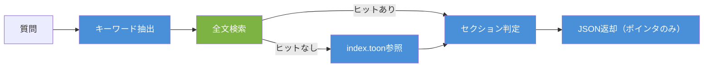
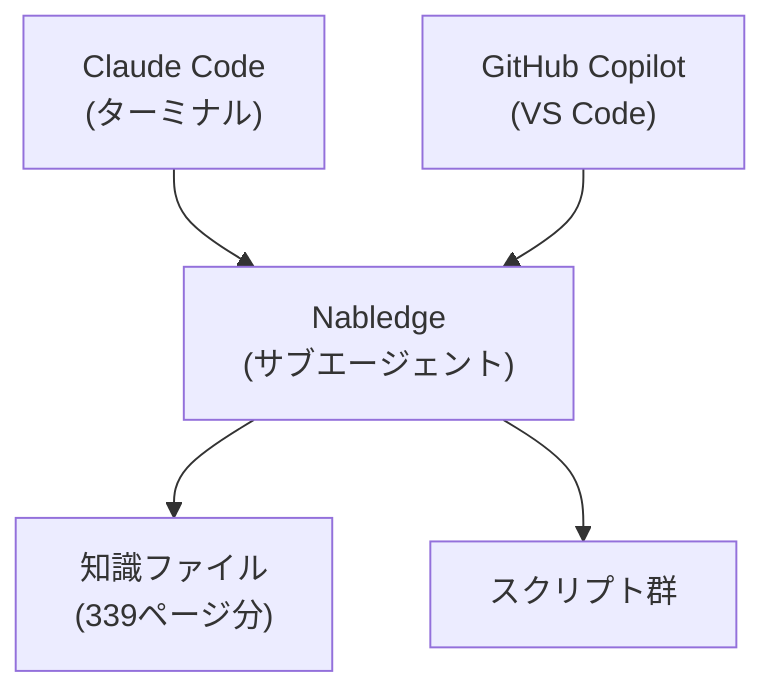

# Nabledge: Get AI-Ready on Nablarch

## LLMが知らないフレームワークで、生成AIをどう活用するか

TIS 生成AIイノベーション室の伊藤です。普段は奮発して購入したMaxプランのClaudeと戯れてます。

最近、Claude CodeやGitHub Copilotを使った開発が当たり前になりつつありますが、一つ困ったことがあります。NablarchのコードをAIに書かせようとすると、存在しないAPIが提案されます。

`UniversalDao.findByCondition` など、もっともらしいけど存在しないメソッドが提案されるのを見て「やっぱりNablarchは学習されてないか」とガッカリします。

Nablarchは金融・決済などミッションクリティカルな基幹系システムで広く使われていますが、OSSコミュニティが限定的なため、LLMの学習データにはほとんど含まれていません。これはNablarchに限った話ではなく、社内フレームワークやプロジェクト固有のアーキテクチャなど、「LLMが知らない知識」はどの現場にもあるはずです。

この記事では、Nablarchの知識をAIエージェントに教える仕組み「Nabledge」を作った経験から、固有知識のAI活用ノウハウを共有します。

## Nabledge = Nablarch + Knowledge

Nabledgeの実体は、Nablarchの知識とワークフローをAIエージェントに提供する[Claude Codeのスキル](https://code.claude.com/docs/ja/skills)です。Claude CodeやGitHub Copilotに対して、Nablarchのドキュメントやベストプラクティスを参照しながら開発支援できる「Nablarchを知っているAIチームメンバー」を作ろうとしています。

現在、[GitHubで公開](https://github.com/nablarch/nabledge)しています。

提供している機能は大きく2つ、知識検索とコード分析です。

知識検索は、Nablarchのドキュメントに基づいて質問に回答する機能です。たとえば「コード値のプルダウン入力を実装するには？」と聞くと、知識ファイルから該当するセクションを探して、コード例や設定例を含めた回答を返します。（[回答例](https://github.com/nablarch/nabledge-dev/blob/main/.claude/skills/nabledge-test/baseline/v6/20260313-202816/qa-001/response.md)）

コード分析は、プロジェクト内のアプリケーションコードをNablarchの観点から分析する機能です。既存プロジェクトの全体像を把握するには、クラス間の依存関係やハンドラキューの構成を読み解く必要がありますが、これを手作業で行うと時間がかかります。コード分析はこれらの情報をMermaid図付きのドキュメントとして出力するので、新しいメンバーがプロジェクトに入ったとき、まずコード分析を走らせてもらうことで素早く全体像を把握できます。（[出力例](https://github.com/nablarch/nabledge-dev/blob/main/.claude/skills/nabledge-test/baseline/v6/20260313-202816/ca-001/code-analysis-ProjectAction.md)）

## 知識ファイルの設計 ― AIが「読める」形に変換する

Nabledgeで一番工夫したのは、知識ファイルの設計です。Nablarchのドキュメント339ページをそのままAIに読ませるのは非効率なので、AIが扱いやすい構造に変換しています。

リポジトリの [`knowledge/` ディレクトリ](https://github.com/nablarch/nabledge/tree/main/plugins/nabledge-6/skills/nabledge-6/knowledge)を見ると、構造がイメージできると思います。

```
knowledge/
├── index.toon           # 全知識ファイルの目次（295エントリ）
├── component/
│   ├── handlers/        # ハンドラの知識
│   └── libraries/       # ライブラリの知識
├── guide/               # 開発ガイド
├── processing-pattern/  # 処理方式の知識
└── ...
```

個々の知識ファイルはJSONで、セクション単位に分かれています。ポイントは `hints` フィールドです。各セクションに対して、関連する検索キーワードを事前に埋め込んでいます。

```json
{
  "id": "libraries-universal_dao",
  "title": "ユニバーサルDAO",
  "index": [
    {"id": "s9", "title": "ページングを行う",
     "hints": ["UniversalDao.per", "UniversalDao.page", "Pagination",
               "EntityList", "ページング", "件数取得SQL"]}
  ]
}
```

全文検索で候補セクションが見つかった後、まずjqスクリプトがhintsのキーワードでセクションを事前に絞り込み、その後AIが本文を読んで「本当にこの質問に関連するセクションか？」を最終判断します。たとえば「ページング」で検索すると、全文検索で複数のセクションがヒットしますが、hintsに `ページング` や `Pagination` が含まれる `s9` は優先的に残り、無関係なセクションはフィルタリングされる仕組みです。スクリプトによる事前絞り込みとAIによる最終判断の2ステップを分けることで、AIのトークン消費を抑えながら精度を確保しています。

全体の目次は `index.toon` というファイルにまとめていて、295エントリの知識ファイルをカテゴリ別に一覧できます。全文検索でヒットしなかった場合、AIがこの目次を読んで関連しそうなファイルを選び出すフォールバック経路も用意しています。

ハルシネーション対策として、知識ファイルに含まれない情報についてAIが推測で答えることを禁止しています。知識がない場合は「この情報は知識ファイルに含まれていません」と正直に返す。この制約が非常に効果的でした。

## 知識検索のパイプライン ― できるだけスクリプト、判断だけAI

知識検索のパイプラインは、下記の流れで動作します。



> 🔵 AI が担当 / 🟢 スクリプトが担当

特にこだわったのは、「AIに任せるところ」と「スクリプトで処理するところ」の切り分けです。

全文検索はシェルスクリプトで実装しています。知識ファイルの全セクションに対してキーワードのOR検索を行い、スコア順に上位15件を返します。`jq` と `find` だけで実現していて、特別なベクトルDBやRAGインフラは必要ありません。

一方、「この質問に対してどんなキーワードで検索すべきか」「検索結果のどのセクションが本当に関連するか」という判断はAIに任せています。

この「できるだけスクリプト、判断だけAI」というバランスが、精度とコストの両立に効いています。ベクトル検索を使うとインフラが必要になりますし、全部AIに任せるとトークンを大量に消費します。既存のUNIXコマンドで済む処理はスクリプトに任せて、人間でも難しい判断だけAIに委ねる。これは固有知識のAI活用を考えるときの基本的な設計方針になると思います。

## GitHub CopilotとClaude Code、両方に対応する

Nabledgeは特定のAIツールに依存しない設計にしています。同じスキル定義をGitHub CopilotとClaude Codeの両方で使えます。



内部的には[サブエージェント](https://code.claude.com/docs/ja/sub-agents)として動作するため、ユーザーからの入口は別々でも、同じNablarchの知識にアクセスできます。チームによって使っているツールは異なるので、この「入口は別々、知識は共通」という設計は重要だと考えています。

## 使い始めるハードルを、とにかく下げる

どんなに良いツールでも、セットアップが面倒なら使われません。

当初はClaude Codeの[プラグイン機能](https://code.claude.com/docs/ja/plugins)で配布する方式を検討していました。ただ、プラグインコマンドでインストールする方式だと、スキルファイルがリポジトリに含まれないため、チームメンバーへの共有が難しいことが分かりました。そこで、セットアップスクリプトでリポジトリ内にスキルを配置する方式にしています。

プロジェクトルートでワンライナーを実行するだけです。

```bash
curl -sSL https://raw.githubusercontent.com/nablarch/nabledge/main/setup-cc.sh | bash -s -- -v 6
```

実行すると `.claude/skills/nabledge-6/` ディレクトリが作成されます。これをGitにコミットすれば、チームメンバーはリポジトリをcloneするだけで、すぐにNabledgeが使えます。追加のインストール作業は不要です。

GitHub Copilotの場合も同様のスクリプトがあります。詳しくは[利用ガイド（GitHub Copilot）](https://github.com/nablarch/nabledge/blob/main/plugins/nabledge-6/GUIDE-GHC.md)をご覧ください。

個人利用であればプラグインとしてのインストールも可能ですが、チーム全体で知識を共有する場合はスクリプト方式がおすすめです。

## まとめ

Nabledgeはまだ評価版で、性能改善もまだまだこれからです。ただ、「LLMが知らないフレームワークでもAIを活用できる」という方向性には手応えを感じています。

皆さんのプロジェクトに固有の知識があれば、同じアプローチが使えます。ドキュメントをAIが扱いやすい単位に分割してhintsのような検索補助メタデータを付与する、全文検索で候補を絞ってからAIに最終判断させる2段階構成にする、知識ファイルに含まれない情報は回答しないルールでハルシネーションを防ぐ。この3つが、Nabledgeの設計で特に効果があったポイントです。

興味がある方は、ぜひ[リポジトリ](https://github.com/nablarch/nabledge)を覗いてみてください。知識ファイルの構造やワークフローの設計は、Nablarch以外のフレームワークにも応用できると思います。

Nablarch開発で実際に使ってみた感想、改善のアイデア、バグ報告、どんなフィードバックでもうれしいです。[Issue](https://github.com/nablarch/nabledge/issues) でお待ちしています。

次回は、この339ページの知識ファイルをどうやって作っているのか — Knowledge Creatorという知識生成パイプラインについて書く予定です。

---

- リポジトリ: https://github.com/nablarch/nabledge
- nabledge-6 利用ガイド（Claude Code）: [GUIDE-CC.md](https://github.com/nablarch/nabledge/blob/main/plugins/nabledge-6/GUIDE-CC.md)
- nabledge-6 利用ガイド（GitHub Copilot）: [GUIDE-GHC.md](https://github.com/nablarch/nabledge/blob/main/plugins/nabledge-6/GUIDE-GHC.md)
