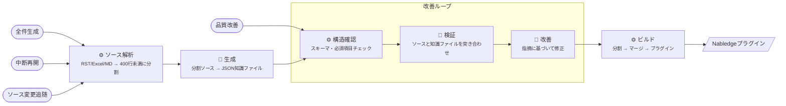
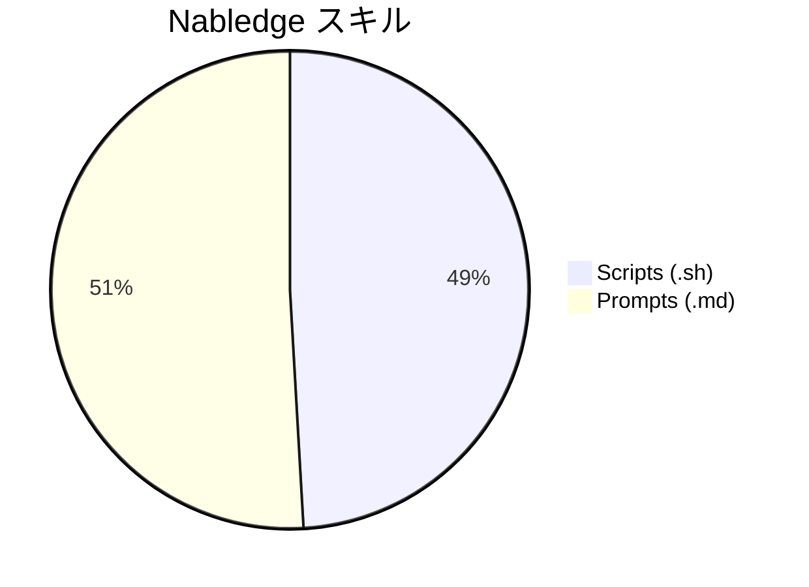
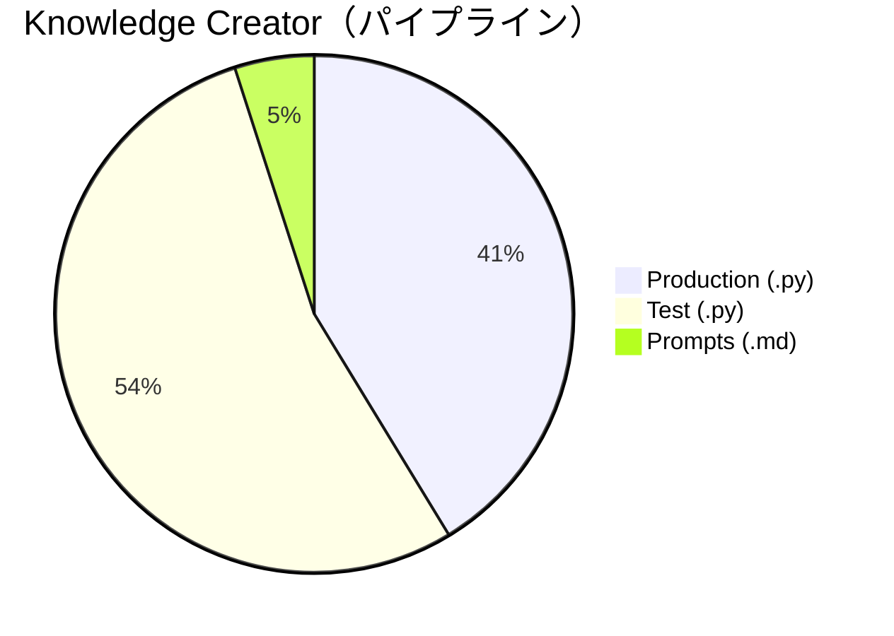
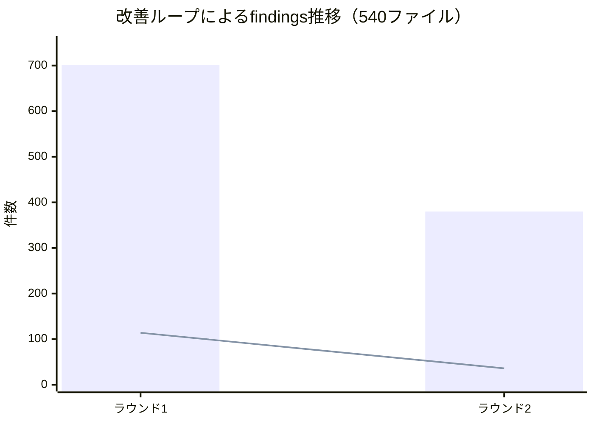

# Knowledge Creator: Put AI in the Loop

## 大量のAI生成に再現性を持たせるには

TIS 生成AIイノベーション室の伊藤です。最近は奮発して購入したM5 MacBook Airと戯れてます。

[前回の記事](<!-- 第1弾のURLを挿入 -->)では、LLMが知らないNablarchの知識をAIエージェントに教える仕組み「Nabledge」について紹介しました。

一つ疑問が残ったと思います。**あの339個の知識ファイル、誰がどうやって作ったの？**

手で作ったわけではありません。Nablarchのドキュメントは解説書とシステム開発ガイドの2系統あり、RST 413ファイル・Excel 5ファイル・Markdown 3ファイルの合計421ソースを、AIが読めるJSON形式に変換する必要があります。この変換を担うのが **Knowledge Creator**（以下KC）です。

この記事では、KCの設計と実装で得たノウハウを共有します。特に「AIに大量の作業を任せるとき、どうやって再現性を確保するか」という課題にフォーカスしています。皆さんのプロジェクトでAIパイプラインを作ろうとしているときの参考になれば幸いです。

## スキルで全部いけると思っていた

[前回の記事](<!-- 第1弾のURLを挿入 -->)で紹介したNabledgeのプロトタイプはClaude Codeの[スキル](https://code.claude.com/docs/ja/skills)として動いていて、少数ファイルの変換はうまくいっていました。LLMの精度はどんどん上がっている、知識ファイルの生成もスキルで全部いけるだろう。そう考えて開発を始めたのが [PR #82](https://github.com/nablarch/nabledge-dev/pull/82) です。

<!-- PR #82のConversation/Commits/Files changedタブのスクリーンショットを挿入 -->

4営業日でConversation 154件。私がレビューでフィードバックを出し、AIが修正し、またフィードバックを出す — この繰り返しで粘りに粘りましたが、数十ファイルに増やした時点で3つの壁にぶつかりました。

1. **全量を処理しきれない** — コンテキストが長くなると、AIは「代表的なファイルだけ処理して残りはスクリプトで」という方針を取りがちになります。
2. **スクリプトに逃げると品質が落ちる** — 一括変換しようとするのですが、ソースの中身を読んで構造化する作業はスクリプトだけではできないので品質が落ちます。
3. **注意力の分散** — コンテキストが肥大化するほど個々の情報への注意が薄まる（"lost in the middle"問題）ため、処理品質が下がっていきます。

これらはLLMの確率的な性質に起因する構造的な問題です。プロンプトを工夫すれば解決する類いのものではありませんでした。そっとPR #82を閉じて、Pythonパイプラインとして作り直すことにしました。Python主体になればAIの力であっという間に作れる感覚があったのも大きいです。

## AI in the Loop ― スクリプトが制御、AIは判断だけ

発想を逆転させました。Pythonがパイプライン全体を制御し、AIには「ソースを読んで構造化する」「生成結果の正確性を判断する」「指摘に基づいて修正する」という、人間でも難しい判断だけを委ねる設計です。"Human in the Loop" のAI版、いわば "AI in the Loop" です。

[前回の記事](<!-- 第1弾のURLを挿入 -->)で「できるだけスクリプト、判断だけAI」と書きましたが、これは知識検索だけでなく、知識ファイルの生成でも同じ原則が効きました。パイプラインは6つのフェーズで構成されていて、⚙️がスクリプト、🤖がAIです。AIを使うのは6つのうち3つだけです。コマンド体系やフェーズの詳細は[README](https://github.com/nablarch/nabledge-dev/blob/main/tools/knowledge-creator/README.md)を参照してください。



特に工夫したのがAIによる知識ファイル生成の設計です。Claude Codeを呼び出すときにファイル操作を全て禁止しています。

```bash
claude -p "..." --disallowedTools "Read" "Edit" "Write" "Glob" "Grep"
```

ソースの内容はプロンプトに含め、AIは指定されたJSONスキーマに合わせてJSONを返すだけ。ファイルへの書き込みはPython側で行います。この設計により、AIの平均ターン数はわずか2〜4回で済みます。[実行ログ](https://github.com/nablarch/nabledge-dev/blob/kc-5-20260313/tools/knowledge-creator/.logs/v5/20260313T084017/phase-b/executions/libraries-tag--s1_20260313-084018.json#L32)を見ると、AIが呼んでいるツールは `StructuredOutput`（Claude Codeが構造化データを返すための専用ツール）だけで、AIの仕事を「読んで構造化する」一点に絞ることで出力が安定します。

これは皆さんのパイプラインを作るときにも応用できる考え方だと思います。AIに何でもさせるのではなく、AIの行動範囲をツール制限で物理的に絞る。「お願い」ではなく「制約」で再現性を確保するわけです。

もう一つのポイントは、ソースファイルの分割です。ソース解析で大きなファイルを400行未満に分割してからAIに渡しています。400行は何度か試して決めた値で、意外と少なく感じるかもしれません。プロンプトに含めることや日本語であるためトークンサイズが大きくなることを考慮すると、これ以上だとセクション分割やヒントキーワードの品質が目に見えて落ちます。自分のドキュメントで試すなら、まず小さい単位から始めて、品質が維持できる上限を探るのがおすすめです。

分割したファイルはそのまま信頼できる唯一の情報源（SSOT）として保持します。最終的なマージ済み知識ファイルやMarkdownはビルドフェーズで生成するビューにすぎません。「AIが扱いやすい分割状態が正」と決めておくことで、改善ループの途中でもいつでもAIに渡せる一貫した状態を保てます。

ちなみに、KCのプロンプトやエージェント向けドキュメントはすべて英語で書いています。LLMの学習データは英語が圧倒的に多いため、日本語より英語の方が指示の理解精度が高い傾向があります。ソースドキュメントが日本語でも、AIへの指示は英語にする。これも再現性に効くポイントです。

スキルではプロンプトが全体の半分を占めていましたが、パイプラインではPython＋テストが95%です。この逆転は、[コード規模](https://github.com/nablarch/nabledge-dev/blob/main/docs/metrics.md#code-size-sloc)にそのまま表れています。





## 一発で完璧にはならない ― 改善ループの設計

AIの出力は確率的なので、一発で完璧な知識ファイルが出ることはまずありません。KCではこの前提に立って、初回生成と改善ループを分離しています。

（再掲：上のフローチャートの改善ループ部分）


検証フェーズではAIがソースと知識ファイルを突き合わせて、**findings（指摘事項）** を出します。ソースにない情報が足されていないか、判断に必要な情報が欠けていないかをチェックし、findingsに基づいてAIが修正した後、再び検証→修正を回します。

実際の数字を紹介します。540ファイルの検証・修正（2ラウンド）では、ラウンド1で701件あったfindingsがラウンド2では380件に減少しました。ソースにない情報の捏造や判断に必要な情報の欠落といったcritical findingsに限ると、114件から36件へ減っています。



棒グラフがfindings合計（-46%）、折れ線がcritical findings（-68%）です。（[実行レポート](https://github.com/nablarch/nabledge-dev/blob/main/tools/knowledge-creator/reports/20260313T084017.md)に詳細があります）

コストも共有します。別の実行（421ファイル、生成＋検証＋修正の全工程）の数字を示します。これらの数値はClaude Codeがトークン消費量とAnthropic APIの公開価格から算出した推定値で、実際の請求額（AWS Bedrock経由の場合など）とは異なる場合があります。

| 工程 | 推定コスト | 実行時間（並列4） |
|------|-----------|---------|
| 初回生成 | 約$244 | 約4時間 |
| 改善ループ（2ラウンド） | 約$456 | 約4.5時間 |
| **合計** | **約$700** | **約8.5時間** |

改善ループの方がコストがかかります。改善ループは検証（verify）と修正（fix）の2フェーズが1セットで、2ラウンド分つまり4回AIが走るため、初回生成の1フェーズより合計コストが高くなります。それでも初回生成は一度だけに抑えたい理由があります。生成をやり直すと、その後の検証・修正もすべてやり直しになるからです。

421ファイルの知識ファイルを生成・検証・修正して推定$700、8.5時間。皆さんはこの数字、高いと感じますか？安いと感じますか？

## まだ残る壁 ― testing-framework

改善しきれていない領域があります。

ラウンド2終了時点のcritical findings 36件のうち、critical omission 27件の59%（16件）がtesting-framework関連に集中しています。「マスタデータ復旧機能」ページは概要・特徴・必要スキーマ・動作イメージの4セクションがまるごと欠落、「目的別API使用方法」ページは16セクション中12セクションが欠落。（詳細は[品質評価レポート](https://github.com/nablarch/nabledge-dev/blob/kc-5-20260313/tools/knowledge-creator/.logs/v5/20260313T084017/quality-evaluation-v5.md)にあります）

ソースファイルを見ると原因が分かります。testing-frameworkのドキュメントは仕様自体が複雑な上に、Excelの複雑な記入ルールをRSTのテーブルや画像で表現しているため、AI以前に人間が読んでも読み解くのが難しい状態です。

ここはKCのパイプラインで頑張るよりも、ソースファイル自体を書き直す方が近道だと考えています。当時の判断でこうなったドキュメント構造を、今のAI活用を前提に見直す。この「ソースを直す勇気を持つ」という判断が、AI活用の構築スピードに大きく影響するように感じています。

## テストとログ ― 確率的な出力と向き合う

AIの出力は確率的です。同じ入力でも毎回結果が微妙に異なるため、テストとログの設計が従来以上に重要になります。

E2Eテストでは、Claude Codeの呼び出しをモック化しています。ポイントは、モック関数がカタログのエントリ情報（ファイルID、セクションID）からルールベースで決定的な値を返す設計です。呼び出し箇所ごとにパッチを当てます。

```python
with patch("phase_b_generate._default_run_claude", mock_fn), \
     patch("phase_d_content_check._default_run_claude", mock_fn), \
     patch("phase_e_fix._default_run_claude", mock_fn):
    kc_gen(ctx)
```

ファイルごとに異なる値を決定的に返すので、マージ結果や`index.toon`のエントリ数といった出力の全側面にアサートを書けます。最初は「パイプラインが最後まで走ること」しか確認していなかったのですが、出力内容の一致やfindingsの命名規則までアサートを追加してから格段に安定しました。（テスト構成の詳細は[README](https://github.com/nablarch/nabledge-dev/blob/main/tools/knowledge-creator/README.md#テスト)を参照してください）

ただ正直に言うと、このテストコードが最初から「網羅的なアサートを持つテスト」になることはありませんでした。AIに「テストを書いて」と指示すると、それっぽいテストコードが素早く出てくるのですが、実際に動かして確認するとアサートが甘く、何が通れば合格なのかが曖昧なコードになっています。コミット履歴を見てもらうと分かるのですが、フィードバック→修正を何度も繰り返してようやく今の形になっています。「アサートを追加してから格段に安定した」という先ほどの話は、その繰り返しで手に入れたものです。AIにテストを書かせるノウハウをお持ちの方、ぜひ教えてください。

ログも全量保存しています。パイプラインの1回の実行に対して一意のIDが振られ、その配下にプロンプト（IN）、構造化出力（OUT）、ストリームJSON、メタデータ（ターン数・コスト・ツール呼び出し）が全て残ります。「生成されなかった？」「指摘が残っている？」といった問題を調査するとき、ログがないと原因を特定できません。AIの実行をブラックボックスにしないログ出力を、最初から準備しておくのがおすすめです。

実際の[実行ログ](https://github.com/nablarch/nabledge-dev/tree/kc-5-20260313/tools/knowledge-creator/.logs/v5/20260313T084017)を残してあるので、パイプラインの動きのイメージを掴みたい方は覗いてみてください。

## まとめ

Knowledge Creatorの開発を通じて学んだことを整理します。

AIの行動範囲は「お願い」ではなく「制約」で絞ることが効きます。ファイル操作を禁止し、構造化出力でJSONだけ返させる。[PR #82](https://github.com/nablarch/nabledge-dev/pull/82)の4営業日154回のやりとりで、AI主導のスケールの限界を学びました。

品質の向上は改善ループに任せ、初回生成のコストを1回に抑える設計が重要です。改善ループでcritical findingsが68%減少した実績があります。コスト削減（モデル選択、並列数の調整など）は今はリリース優先でまだ着手できていない、改善余地のある領域です。

パイプラインの工夫で解決できない壁にぶつかったとき、ソースの品質が原因なら迷わずソースを直す方が近道です。KCの経験から、この判断の速さがAI活用の構築スピードに大きく影響すると感じています。

テストはルールベースのモックで決定的にし、ログはAI実行のすべてを残す。確率的な出力を扱う以上、テストとログへの投資は最初から惜しまない方がいいです。

KCのソースコードと実行レポートは[GitHubで公開](https://github.com/nablarch/nabledge-dev/tree/main/tools/knowledge-creator)しています。AIで大量の知識を構造化するパイプラインを作ろうとしている方の参考になればうれしいです。

次回は、このKCやNabledgeの開発自体で生成AIをどう活用しているかについて書く予定です。

---

- 開発リポジトリ: https://github.com/nablarch/nabledge-dev
- Knowledge Creator README: [README.md](https://github.com/nablarch/nabledge-dev/blob/main/tools/knowledge-creator/README.md)
- コード規模: [metrics.md](https://github.com/nablarch/nabledge-dev/blob/main/docs/metrics.md#code-size-sloc)
- 実行レポート: [reports/](https://github.com/nablarch/nabledge-dev/tree/main/tools/knowledge-creator/reports)
- 実行ログ: [kc-5-20260313ブランチ](https://github.com/nablarch/nabledge-dev/tree/kc-5-20260313/tools/knowledge-creator/.logs/v5/20260313T084017)
- 品質評価レポート: [quality-evaluation-v5.md](https://github.com/nablarch/nabledge-dev/blob/kc-5-20260313/tools/knowledge-creator/.logs/v5/20260313T084017/quality-evaluation-v5.md)
- 設計ドキュメント: [nabledge-design.md](https://github.com/nablarch/nabledge-dev/blob/main/docs/nabledge-design.md)
- 前回の記事: [Nabledge: Get AI-Ready on Nablarch](<!-- 第1弾のURLを挿入 -->)
