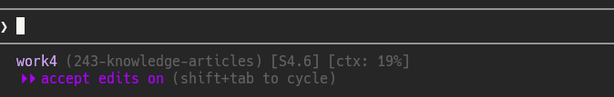
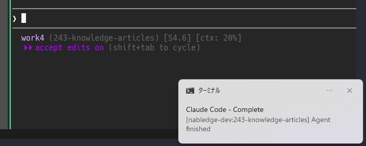
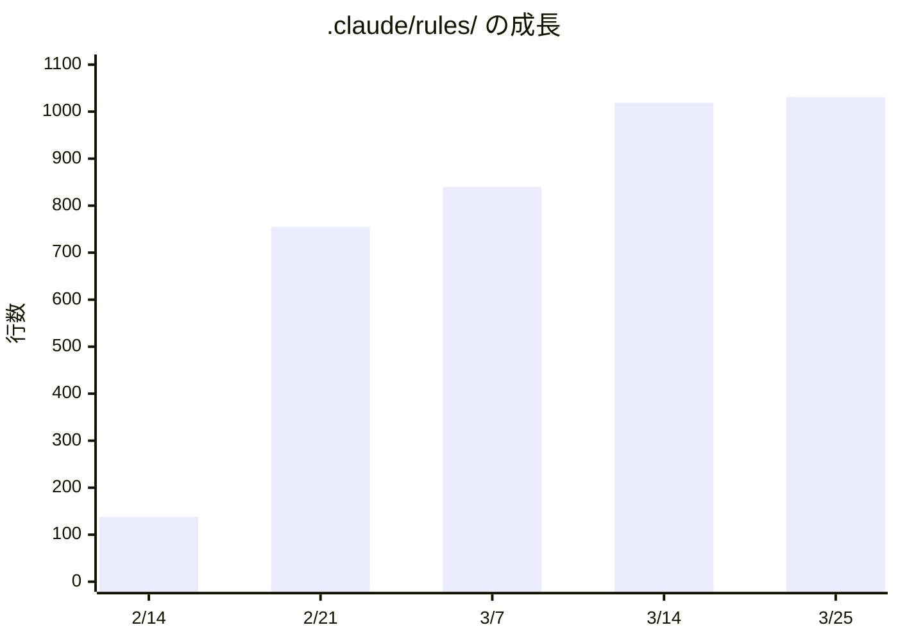
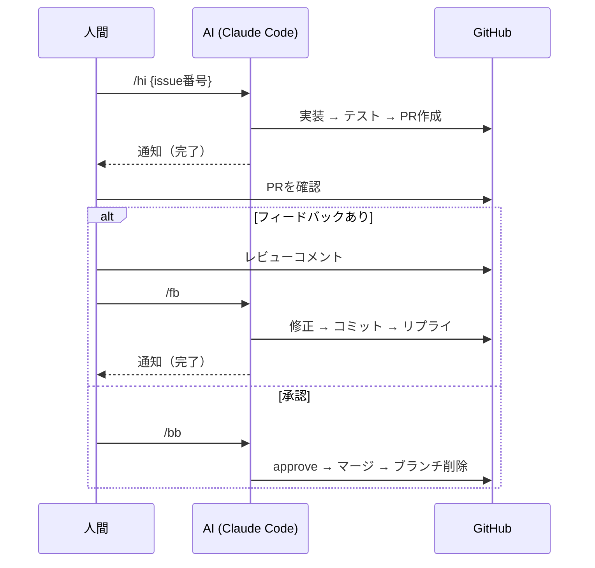
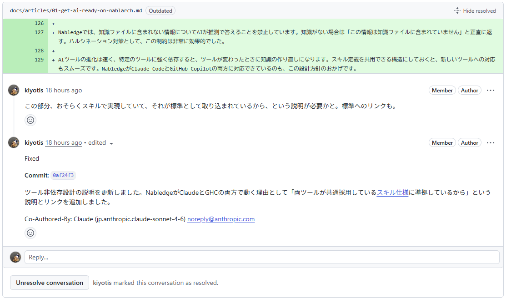
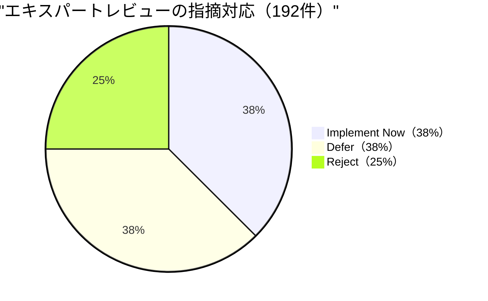
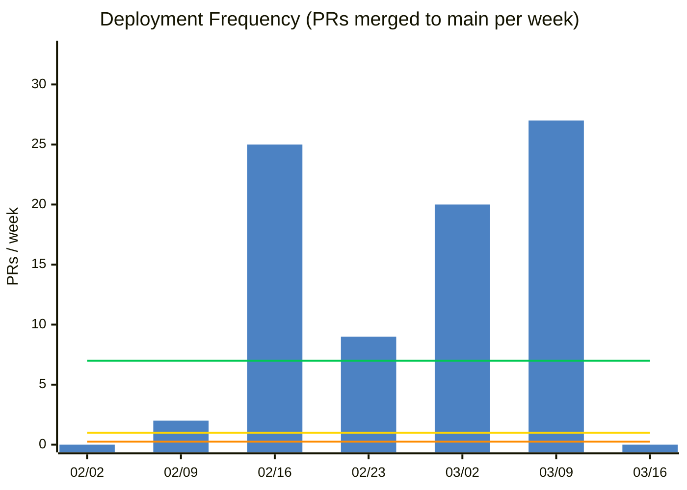

# Nablarch Team: No Babysitting

## AIの子守りから抜け出すには？

TIS 生成AIイノベーション室の伊藤です。今年から奮発して購入した[BLACKPINKのDVD](https://ygex.jp/blackpink/discography/detail.php?id=1017534)にハマってます。

[前回](<!-- 第2弾のURLを挿入 -->)、[前々回](<!-- 第1弾のURLを挿入 -->)と、Nablarchの知識をAIに教える「Nabledge」と、その知識ファイルを生成する「Knowledge Creator」について紹介しました。

今回は、Nabledge開発自体で生成AIをどう活用しているか、特に**Claude Codeを子守りしないで回す**ためのノウハウを共有します。

## 「AIを使う」より「AIにかかりっきり」になっていた

Nabledge開発を始める前、プライベートでClaude Codeを使っていました。便利なのは間違いないのですが、気がつくと**AIの横にずっと張り付いている**自分がいました。

出力を確認して、「それ違う」と軌道修正して、また確認して、「こっちの方針で」と指示し直して。AIを使って生産性を上げているはずが、AIの面倒を見ることが仕事になっている。皆さんにも覚えがないでしょうか。

この経験から、Nabledge開発を始めるときに一つ決めたことがあります。**最初から子守りしない前提で環境を設計する**。

ただし先にお断りしておくと、[開発状況](https://github.com/nablarch/nabledge-dev/blob/main/docs/development-status.md)のTradeoff Sliderで「リリース速度＝固定」と定めた通り、とにかく早く届けることが優先でした。以降で紹介する仕組みは突貫工事で整備したものなので、そのまま再利用するというより、考え方を参考にしていただけると幸いです。

## 最初のコミットで何を入れたか

リポジトリの[最初のPR](https://github.com/nablarch/nabledge-dev/pull/4)で、コードより先に入れたものがあります。

AIと一緒に作業していて感じた不安は3つありました。今AIがどんな状態にあるか分からない、完了を待っていないと次に進めない、目を離した隙に危険な操作をされるかもしれない。この3つを潰さない限り、子守りから抜け出せません。

まず「状態が分からない」に対しては、コンテキスト使用率をターミナルに常時表示する[ステータスライン](https://github.com/nablarch/nabledge-dev/blob/main/.claude/statusline.sh)を入れました。コンテキストが肥大化すると出力品質が下がるのが分かっていたので、超えそうになったら早めに気づけるようにするためです。



次に「完了を待つ必要がある」に対しては、AIの作業完了をデスクトップ通知で知らせる[通知hook](https://github.com/nablarch/nabledge-dev/blob/main/.claude/hooks/notify.sh)を入れました。完了を待って画面を覗きに行く必要がなくなり、別のworktreeで別のIssueに着手できます。



最後に「危険な操作をされるかもしれない」に対しては、権限設定で「やらないでね」ではなく「できない」にしました。[settings.json](https://github.com/nablarch/nabledge-dev/blob/main/.claude/settings.json)に明示的な拒否ルールを書くことで、AIが誤って危険な操作をする可能性を構造的に排除しています。

```json
"deny": [
  "Bash(git reset --hard*)",
  "Bash(git clone http*)",
  "Read(/mnt/*)",
  "Write(/mnt/*)"
]
```

この3つで「目を離せる状態」はできましたが、まだAIに毎回同じ説明をする手間が残ります。そこで判断基準を [`.claude/rules/`](https://github.com/nablarch/nabledge-dev/tree/main/.claude/rules) に文書化しました。Claude Codeが自動で読み込むので、毎回口頭で説明しなくて済みます。「こうして」という指示ではなく「こういう状況でこう判断する」という基準を渡すことで、AIが自律的に動ける範囲が広がります。

コードは1行も書いていないこの段階で、「AIの状態が見える」「終わったら通知が来る」「危険なことはできない」「判断基準が文書化されている」という4つの土台ができています。

## ルールを書くほど、対話は減る

開発が進むにつれて、ルールファイルは増えていきました。



何を書いているかというと、**AIが判断に迷いそうなことすべて**です。たとえば [issues.md](https://github.com/nablarch/nabledge-dev/blob/main/.claude/rules/issues.md) にはIssue起票のフォーマットを定義しています。

```markdown
### Situation
Current state and observable facts. What exists today?

### Pain
Who is affected and what problem do they face?

### Benefit
Who benefits and how? Use "[who] can [what]" format.

### Success Criteria
- [ ] Verifiable outcomes as checkboxes
```

他にもリリースプロセス、作業ノートの書き方、言語ポリシーなど12ファイルがあります。（[ルール一覧](https://github.com/nablarch/nabledge-dev/tree/main/.claude/rules)）

ルールに書いてあることについては、AIに口頭で説明する必要がなくなります。「それ違う」と軌道修正する回数が減る。ルールを書くことは、未来の自分の対話を先払いしているようなものです。

もちろん、ルールだけで全部うまくいくわけではありません。[PR #82](https://github.com/nablarch/nabledge-dev/pull/82)のように、未知の領域ではルールがカバーしきれずに154回のやりとりに膨れることもありました（[前回の記事](<!-- 第2弾のURLを挿入 -->)で詳しく書いています）。ルールは万能ではなく、「既知の判断基準を言語化して渡す」ための道具です。

## `/hi` `/fb` `/bb` — 3コマンドで開発を回す

子守りしない前提で設計すると、人間のアクションは自然と絞られます。Claude Codeの[カスタムスラッシュコマンド](https://code.claude.com/docs/ja/commands)で定義した3つのコマンドで、開発サイクルのほぼ全部を回しています。



`/hi` を打った後は、AIが自律的に動くので人間は待つ必要がありません。Gitのworktree（同一リポジトリを複数ディレクトリで並行作業できる機能）でmainに加えてwork1〜work4の5面を開いて、あるworktreeで `/hi` を打ったら別のworktreeに移って次のIssueに取りかかる。5面あれば、常に複数のIssueを並行して進められます。通知が来たらPRを見てフィードバックか、OKか判断する。

`/fb` が特に楽で、GitHubのPR上でコードの該当箇所にレビューコメントを書いておくだけです。場所を指定できるのでフィードバックが伝わりやすいですし、スレッドで何度でもやりとりできます。AIが修正を終えると、コミットリンク付きで「ここを直しました」とレスが返ってきます。ただし、現状は指摘ごとの個別コミットではなくまとめてコミットされるので、このあたりは改善余地があります。



**人間の主な役割は「何を作るか決める」と「できたものを判断する」こと**です。（[コマンド定義](https://github.com/nablarch/nabledge-dev/tree/main/.claude/commands)）

## レビューの判断ポイントを絞る

品質を担保するのはあくまで人間です。コード差分も見ますし、何をどこまでテストしたかも確認しますし、人間にしかできない動作確認もやります。レビューを省略しているわけではなく、**判断ポイントを絞ってレビュー負荷を下げる工夫**をしています。

まずIssue作成の時点で、AIと対話しながら内容を確認・承認しています。「何を作るか」の判断は人間が握る。ここがずれていると、後工程でいくらレビューしても意味がありません。

PRが来たら確認するのは、IssueのPain/BenefitとSuccess Criteria（そもそも何を解決するPRか）、PR本文のタスクとSuccess Criteriaのチェック状況、コード差分、テスト内容と範囲、そして目的達成に向けた確認漏れがないか。

その上でエキスパートレビューの結果を確認します。`/hi` のワークフローの中に、AIが自分の変更をレビューするステップを組み込んでいて、変更内容に応じてSoftware Engineer、QA Engineerなどのペルソナで指摘を出します。

> **[QA Engineerレビュー](https://github.com/nablarch/nabledge-dev/blob/main/.pr/00193/review-by-qa-engineer.md)（PR #193）:**
> E2Eテストが実際のバグ修正パスを通っていない — `clean.py` はPythonファサードからは呼ばれず `kc.sh` からのみ呼ばれる。`tests/ut/` に `clean_version` を直接呼ぶユニットテストを追加すべき。
> → **Decision: Implement Now**

エキスパートレビューで人間が見るのは、**指摘の内容、対応要否の判断、その判断理由**です。「Implement Nowにした理由は妥当か」「Rejectした指摘は本当に不要か」。AIの判断を判断する、というレイヤーです。

39のPRに対して192件の指摘が出ています。



38%がPR作成前に修正済みなので、人間がレビューする時点での問題が減っています。ちなみにDefer（先送り）が38%と多いのですが、中身を見ると「用語統一」「エラーハンドリングの追加」など、今すぐ直さなくても動くものが大半です。妥当な判断とも言えますし、AIは確率的に安全側に寄った出力をしやすい面もあるかもしれません。

レビュー自体はしっかりやる、ただしAIに先に品質を上げてもらうことで、人間が注力すべきポイントに集中できるようにする。これが子守りしないワークフローでの品質の考え方です。

## メトリクスで結果を見る

ここまで紹介した仕組みで開発を回した結果を、DORAメトリクスで見てみます。



Deployment Frequency（PRマージ数/週）のピークは25〜27で、DORAのElite基準（7/week）の3〜4倍です。ワークフローの型化とAIによる自律実行が速度に効いている手応えがあります。

一方、速度だけでは品質は語れません。課題もあります。Change Failure Rate（バグPR比率）は稼働週で平均20%。速度を優先した突貫工事の裏返しですが、ルール整備で収束するか経過を見ています。収束しないなら、立ち止まって根本改善が必要です。

メトリクスは「いい数字を出すため」ではなく「判断の材料にするため」に取っています。メトリクスの自動収集自体もAIに作ってもらった仕組みで、GitHub Actionsで週次実行しています。（[メトリクス](https://github.com/nablarch/nabledge-dev/blob/main/docs/metrics.md)）

## nabledge-test — AIの回答品質を追いかける

Nabledgeは通常のソフトウェアと違い、AIの回答品質がプロダクトの品質そのものです。コードが壊れていなくても、知識ファイルの変更やワークフローの修正で回答が変わる可能性があります。

nabledge-testは、この問題に対するシナリオベースのリグレッションテストです。

```json
{
  "id": "qa-002",
  "question": "UniversalDaoでページング検索を実装するには？",
  "expectations": ["findAllBySqlFile", "page", "per", "Pagination", "getPagination"]
}
```

質問をNabledgeに投げて、回答に期待するキーワードが含まれるかを検出します。ベースラインモードでは複数回試行の平均と標準偏差も記録するので、改善が安定しているかどうかも分かります。

```
qa-001: 46.7% ±11.5%  → ばらつき大、改善余地あり
ca-003: 100.0% ±0.0%  → 完全に安定
```

ワークフローを改善するたびにベースラインを取り直して、前回との差分を確認できます。シナリオ数はまだ8つで発展途上ですが、「AIプロダクトの品質を数字で追う土台」を最初から入れておくことには意味があると思っています。（[テストの詳細](https://github.com/nablarch/nabledge-dev/blob/main/.claude/skills/nabledge-test/SKILL.md) / [実行レポートの例](https://github.com/nablarch/nabledge-dev/blob/main/.claude/skills/nabledge-test/baseline/v6/20260313-202816/comparison-report.md)）

## まとめ

Claude Codeの子守りから抜け出すポイントは、**コードを書き始める前にAIが自律的に動ける環境を整備すること**です。

ステータスラインでコンテキストを監視し、通知hookで完了を知って目を離せる状態にする。権限設定で危険な操作を物理的に防ぎ、ルールに判断基準を書いて対話の代わりにする。ワークフローをコマンドに落とし込んで人間のアクションを絞り、エキスパートレビューで人間が注力すべきポイントを絞る。この6つが今回のアプローチの核心です。

ただし、正直に言うと、ここまで紹介した仕組みはどれも突貫工事で整備したものです。コンテキスト上限到達時のセッション切り替え自動化はサボったまま、nabledge-testのシナリオは8つしかない、Change Failure Rateは高止まり。「できた」というより「やっと土台ができた」という段階です。考え方は参考にしていただきつつ、皆さんのプロジェクトに合わせてアレンジしてもらえると嬉しいです。

AIと一緒に開発するワークフローには、まだ誰も正解を知らないことがたくさんあります。こういうことに一緒に取り組んでくれる方、ぜひ声をかけてください。リポジトリの[Issue](https://github.com/nablarch/nabledge-dev/issues)でも、直接でも。もっと高みを目指したいです。

興味のある方は[開発リポジトリ](https://github.com/nablarch/nabledge-dev)を覗いてみてください。メトリクス、ルール、カスタムコマンド、テストレポート。リアルな開発の全容がそこにあります。

---

- 開発リポジトリ: https://github.com/nablarch/nabledge-dev
- 開発メトリクス: [metrics.md](https://github.com/nablarch/nabledge-dev/blob/main/docs/metrics.md)
- 開発状況: [development-status.md](https://github.com/nablarch/nabledge-dev/blob/main/docs/development-status.md)
- ルール一覧: [.claude/rules/](https://github.com/nablarch/nabledge-dev/tree/main/.claude/rules)
- カスタムコマンド: [.claude/commands/](https://github.com/nablarch/nabledge-dev/tree/main/.claude/commands)
- nabledge-test: [SKILL.md](https://github.com/nablarch/nabledge-dev/blob/main/.claude/skills/nabledge-test/SKILL.md)
- 前回の記事: [Knowledge Creator: Put AI in the Loop](<!-- 第2弾のURLを挿入 -->)
- 前々回の記事: [Nabledge: Get AI-Ready on Nablarch](<!-- 第1弾のURLを挿入 -->)
