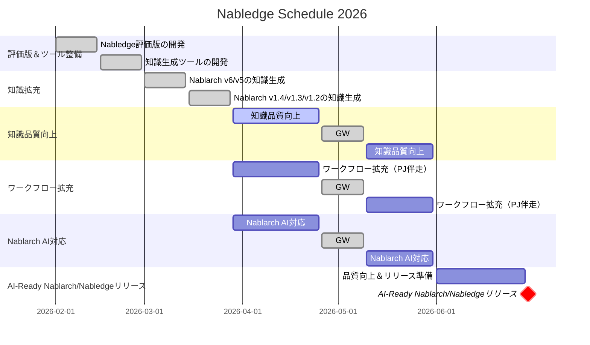

# Nabledge 開発状況

最終更新: 2026-03-31

## Tradeoff Slider

| 項目 | 固定 ← → 調整可能 | 意味 |
|------|:---:|------|
| リリース速度 | ■ □ □ □ □ | 早く出す。新規＞改善 |
| 導入の手軽さ | ■ □ □ □ □ | 導入障壁が高いと使われない |
| 知識のカバー範囲 | ■ □ □ □ □ | ~~v6/v5のバッチ＞REST優先、1.4以前は後回し~~ 全量: v6/v5/v1.4/v1.3/v1.2 |
| 検索・回答の精度 | □ □ □ □ ■ | まず広く出して、精度は使われてから磨く |
| ワークフローの充実度 | □ □ □ □ ■ | まず知識検索で価値を証明してから追加 |

> **注意**: 知識ファイルは生成AIで生成・検証し人はサンプリングチェックのみ実施、正式リリース前に全量チェックを予定しています。

## Schedule

> **注意**: 7月以降は未定です。

- ワークフロー拡充（PJ伴走）
  - 具体的なユースケースはPJに伴走しながら実際のニーズに合わせて開発
- Nablarch AI対応
  - テスティングフレームワークのAI対応（Excel→テキスト形式）
  - Java 25対応

## Outlook

- 全量（v6/v5/v1.4/v1.3/v1.2）の知識生成が完了した
- 知識ファイルの残存問題評価（2ラウンドの検証・修正後）：v6 重大9件、v5 重大36件、v1.4 重大19件、v1.3 重大10件、v1.2 重大14件。v1.x はドキュメント形式の違いにより v6/v5 より多い傾向があり、改善ループの見直しにより質の向上を進める
- ワークフローは具体的なユースケースのヒアリングができていないため、PJ に伴走する形で実際のニーズに合わせて開発する
- 並行して Nablarch の AI 対応（テスティングフレームワークの Excel→テキスト形式化、Java 25 対応）を進める
