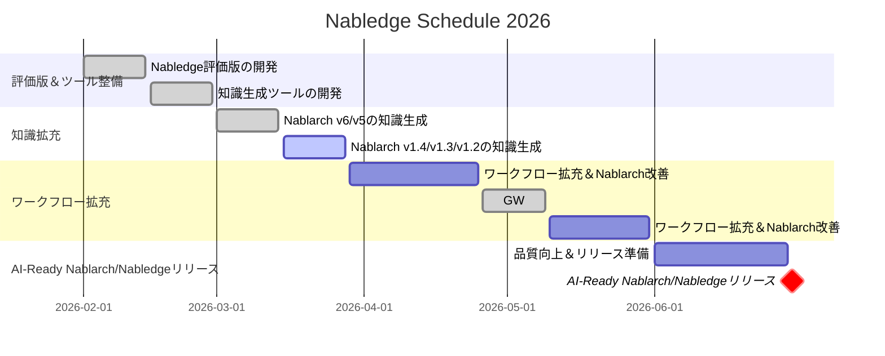

# Nabledge 開発状況

最終更新: 2026-03-24

## Tradeoff Slider

| 項目 | 固定 ← → 調整可能 | 意味 |
|------|:---:|------|
| リリース速度 | ■ □ □ □ □ | 早く出す。新規＞改善 |
| 導入の手軽さ | ■ □ □ □ □ | 導入障壁が高いと使われない |
| 知識のカバー範囲 | ■ □ □ □ □ | ~~v6/v5のバッチ＞REST優先、1.4以前は後回し~~ 全量: v6/v5/v1.4/v1.3/v1.2 |
| 検索・回答の精度 | □ □ □ □ ■ | まず広く出して、精度は使われてから磨く |
| ワークフローの充実度 | □ □ □ □ ■ | まず知識検索で価値を証明してから追加 |

> **注意**: 知識ファイルは生成AIで生成・検証し人はサンプリングチェックのみ実施、正式リリース前に全量チェックを予定しています。

## Schedule

> **注意**: 7月以降は未定です。

- ワークフロー拡充
  - 影響調査
  - レビュー
- Nablarch改善
  - テスティングフレームワークのAI対応（Excel→YAML対応）
  - Java 25対応（無償利用期限が2026年9月）

## Outlook

- 知識生成ツールの再現性向上に想定以上の時間を要したため、Nablarch v6 の知識生成が当初予定より遅延した
- v6 での対応を通じてツールが安定したことで v5 も効率よく進められ、v6/v5 合わせて 3/9 週に完了した
- 過去バージョン（v1.4/v1.3/v1.2）は v6/v5 とドキュメント形式が異なり、知識生成を一度も実施していないためリスクがある
- 順調に進めば 3/23 週に過去バージョンの知識生成も完了する見込み
