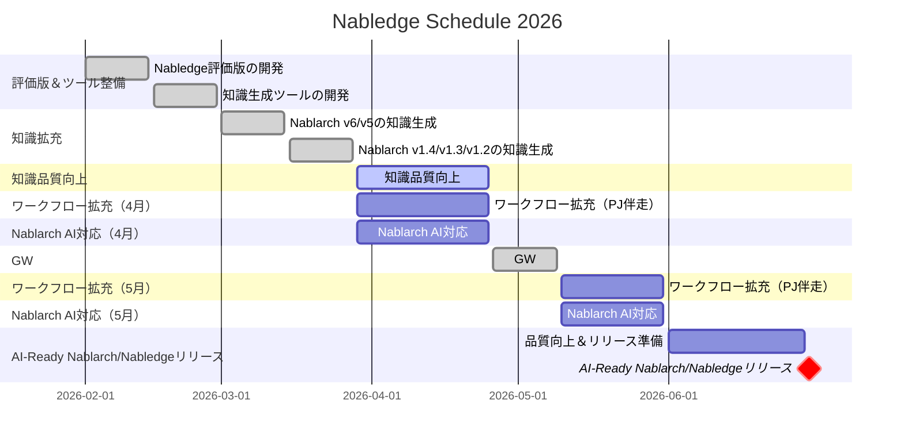

# Nabledge 開発状況

最終更新: 2026-03-31

## Tradeoff Slider

| 項目 | 固定 ← → 調整可能 | 意味 |
|------|:---:|------|
| リリース速度 | ■ □ □ □ □ | 早く出す。新規＞改善 |
| 導入の手軽さ | ■ □ □ □ □ | 導入障壁が高いと使われない |
| 知識のカバー範囲 | ■ □ □ □ □ | ~~v6/v5のバッチ＞REST優先、1.4以前は後回し~~ 全量: v6/v5/v1.4/v1.3/v1.2 |
| 検索・回答の精度 | □ □ □ □ ■ | まず広く出して、精度は使われてから磨く |
| ワークフローの充実度 | □ □ □ □ ■ | まず知識検索で価値を証明してから追加 |

> **注意**: 知識ファイルは生成AIで生成・検証し人はサンプリングチェックのみ実施、正式リリース前に全量チェックを予定しています。

## Schedule

> **注意**: 7月以降は未定です。

- ワークフロー拡充（PJ伴走）
  - 具体的なユースケースはPJに伴走しながら実際のニーズに合わせて開発
- Nablarch AI対応
  - テスティングフレームワークのAI対応（Excel→テキスト形式）
  - Java 25対応

## Outlook

- 全量（v6/v5/v1.4/v1.3/v1.2）の知識生成が完了した
- 知識ファイルの残存問題評価（2ラウンドの検証・修正後）：v6 重大9件、v5 重大36件、v1.4 重大19件、v1.3 重大10件、v1.2 重大14件。v1.x はドキュメント形式の違いにより v6/v5 より多い傾向があり、改善ループの見直しにより質の向上を進める
- ワークフローは具体的なユースケースのヒアリングができていないため、PJ に伴走する形で実際のニーズに合わせて開発する
- 並行して Nablarch の AI 対応（テスティングフレームワークの Excel→テキスト形式化、Java 25 対応）を進める

### 知識ファイル残存問題の詳細（Phase D 最終検証後）

| バージョン | ページ数 | 重大 | 軽微 | 重大/ページ | 軽微/ページ |
|-----------|---------|------|------|------------|------------|
| v6        | 339     | 9    | 275  | 0.03       | 0.81       |
| v5        | 457     | 36   | 344  | 0.08       | 0.75       |
| v1.4      | 456     | 19   | 336  | 0.04       | 0.74       |
| v1.3      | 307     | 10   | 219  | 0.03       | 0.71       |
| v1.2      | 291     | 14   | 248  | 0.05       | 0.85       |

- **重大**: omission（情報の欠落）・fabrication（ソースにない情報の混入）など、回答品質に直接影響するもの
- **軽微**: hints_missing（ヒントキーワード不足）・section_issue（構造上の軽微な問題）など

軽微はページあたり0.7〜0.9件程度で各バージョンほぼ一定です。重大はv5が0.08/pとやや高く、それ以外は0.03〜0.05/pの範囲に収まっています。v5の重大件数が多い主因はtesting-framework関連ページへのomissionで、そのカテゴリで重大の59%を占めています。
