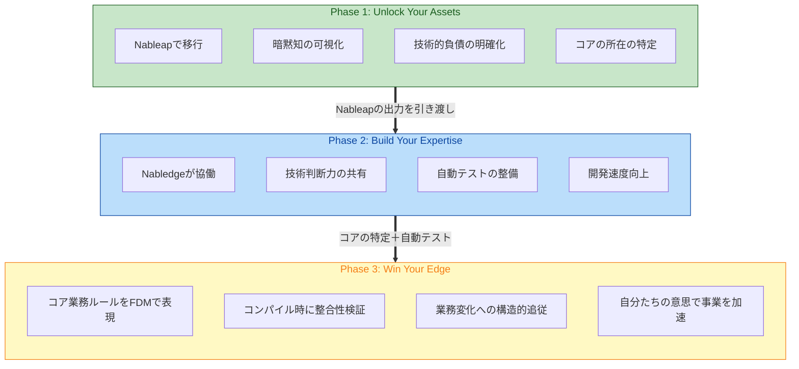
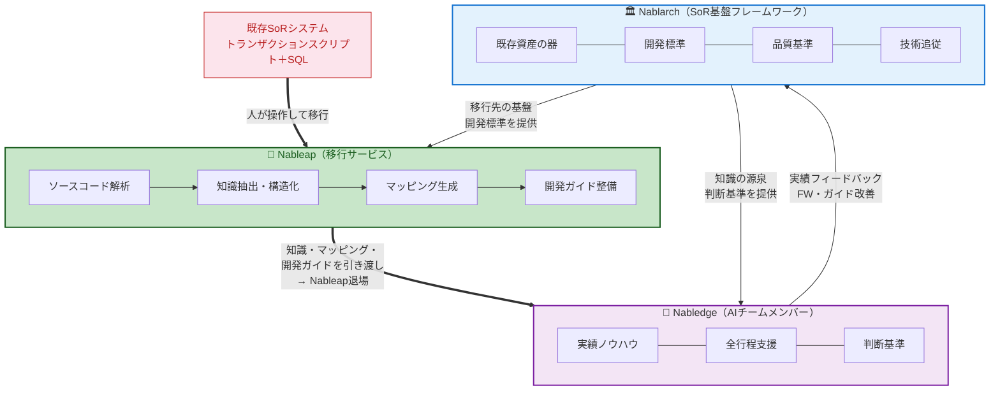

> **⚠️ 重要**: このドキュメントは未承認のドラフトです。内容は変更される可能性が大いにあります。

# Get AI-Ready. We Nudge You.

SoR領域の基幹系システムを、事業の足枷から競争力の源泉へ。

## SoR領域の現実

### 調査結果

- 投資の硬直化 — 保守・運用にリソースが張り付き、攻めの投資に回せない[^1]
- 技術追従の停滞 — FW・ミドルウェアのバージョンアップやセキュリティ対応が遅れる[^2]
- 市場対応速度の低下 — ビジネス要求に対してシステム改修が追いつかない[^1]
- 人材の悪循環 — レガシー環境で採用・定着が困難[^3] → さらに属人性が高まる
- AI開発ツールの限界 — 既存ツールはモダンアーキテクチャ前提。SoR領域には機能しない[^4][^5]

### 仮説

- 属人性 — システム全体を把握できるのはベテランだけ。判断基準が人の頭の中にある
- 暗黙知の散在 — 業務ルールがコード・SQL・設計書・テストデータに散らばり、明文化されていない
- 判断基準の不在 — ルールはあっても適用判断がない。レビュー品質がレビューア依存
- 経験の断絶 — PJ終了で知見が散逸。同じ失敗が繰り返される
- 構造の不透明さ — 成果物間の依存が追えず、変更影響が見通せない
- レガシー向けAI支援は「モダンへの変換」が目的。「レガシーのまま支援する」ものがない
- SoR領域の基幹系だけが、AI駆動開発の恩恵から取り残されている

## あるべき姿

- 技術的負債が整理され、保守リソースを攻めの投資に回せている
- 技術とビジネス、両方のエキスパートの判断力がチームに共有されている
- コアな業務ルールがコードで守られ、業務変化にシステムが即座に追従できている
- 事業成長を自分たちの意思で加速できている

## ソリューション：Nablarch + Nabledge + Nableap

### 全体像

3つのプロダクトと3つのフェーズで価値を提供する。

**3つのプロダクト：**

- **Nablarch** — SoR基盤フレームワーク。既存資産の器、開発標準、品質基準を提供
- **Nabledge** — Nablarch上で開発者と協働するAIチームメンバー
- **Nableap** — 既存システムをNablarch/Nabledge環境に移行するツール。人が操作する

**3つのフェーズ：**

1. **Unlock Your Assets** — Nableapで資産をAI-Readyに移行する
2. **Build Your Expertise** — Nabledgeと共にエキスパートレベルの開発力を築く
3. **Win Your Edge** — コアな業務ルールをコードで守り、競争優位を手に入れる

各フェーズは単独でも価値があり、同時に次のフェーズの土台になる。

### Nablarch・Nabledge・Nableapの関係

### 各プロダクトの位置づけ

**Nablarch** はSoR領域の基幹系システム向けフレームワークです。トランザクションスクリプト＋SQLで構築された既存システムをそのまま受け入れ、Jakarta EE / Java最新版への技術追従を提供します。開発標準と品質基準を内包し、NabledgeとNableapの判断基準の源泉です。FWの設計とAIの知識を同じチームが持つことで、互いにフィードバックし合う共進化を実現します。

**Nabledge** はプロジェクトに参加するAIチームメンバーです。既存のAI開発ツールがモダンアーキテクチャを前提とする中、NabledgeはSoR領域の基幹系システムに特化しています。Nablarchでの大規模ミッションクリティカルなシステム開発・運用ノウハウに基づく判断力を持ち、PM、アーキテクト、設計者、開発者と協働します。リーダーではなく優秀なメンバーとして動きます。GitHubのissueとPRを接点に、人間が要件を伝えるとIssue提案→承認→計画・実装→テスト・レビュー→承認・マージと進みます。

**Nableap** は既存システムをNablarch/Nabledge環境に移行するツールです。人が操作し、AIが各ステップを支援します。NablarchチームやアーキテクトがNableapを使い、ステップごとに判断しながら進めます。ソースコード解析を起点に、開発ガイド、構造化された知識、成果物間のマッピングを生成します。移行完了後、全てをNabledgeに引き渡して退場します。

## 3つのフェーズ：競争優位を手に入れるための積み上げ

3フェーズは蓄積の順番ではありません。**お客様が自分たちの意思で事業を加速できる状態に到達するための条件が積み上がる順番**です。

### Phase 1: Unlock Your Assets — Nableapで資産をAI-Readyに移行する

Nableapを使い、既存システムに眠る暗黙知と業務ルールを、AIが活用できる形に変換します。トランザクションスクリプト＋SQLで構築されたシステムを対象に、Nablarch/Nabledge環境への移行を実行します。

Nableapは人が操作するツールです。移行作業はシステムごとに状況が違うため、NablarchチームやアーキテクトがNableapを使い、ステップごとに判断しながら進めます。

**Unlockの核心は2つあります。**

1つは**開発ガイドの整備**。Nabledgeが「このPJではこう作る」を理解するための基準を作ります。

もう1つは**コアの所在の特定**。ソースコード解析と業務エキスパートとの対話ループを通じて暗黙知を可視化する過程で、「ここが独自の業務判断ルール、ここは定型処理」という区分が浮かび上がります。これがPhase 3の土台になります。

**起点はソースコード解析。** 動いているコードは検証済みの事実です。設計書は不完全でテストされていません。コードから「今どう作っているか」を逆算する方が確実です。コードから取れない業務的意味は対話ループで人間に確認します。

**Nableapによる移行の流れ：**

1. ソースコード解析 → 現行システムの構造を把握（動いている事実から）
2. 現行の開発ガイド導出 → 今のPJが実際にどう作っているかを明示化
3. AI-Readyの開発ガイド作成 → Nablarch上でどう作るかを知識で変換
4. AI-Readyのマッピング → 移行後の構造を生成

**対象となる成果物（10種類）：**

| # | 成果物 | 扱う内容 |
|---|--------|---------|
| 1 | 要件定義書 | スコープ、目的、目標値、業務フロー、業務ルール、変更要求仕様 |
| 2 | 設計書（外部設計） | 機能設計、画面設計、バッチ外部仕様、テーブル論理設計、IF定義、メッセージ定義 |
| 3 | 設計書（内部設計） | クラス設計、SQL設計、テーブル物理設計、処理フロー。開発ガイドが充実していればマッピングのみで済む |
| 4 | 開発ガイド | 方式設計＋開発標準＋手順を統合。PJにおける「どう作るか」の唯一の基準。変更はアーキテクト承認 |
| 5 | ソースコード | Java/JSP/SQL、テストコード、XML設定 |
| 6 | テスト仕様書/報告書 | テストケース、テスト結果、性能テスト結果 |
| 7 | テストデータ | 共通テストデータ、テストケース用データ |
| 8 | 不具合票 | 障害票、設計修正指示 |
| 9 | チェックリスト/レビュー結果 | レビューチェックリスト、レビュー指摘事項 |
| 10 | 工数見積 | 見積データ、見積書 |

**成果物の階層構造：** 上位が充実していれば下位は薄くなる。

- 開発ガイド（#4）が方式・標準・手順を規定する
- 設計書（#2, #3）は開発ガイドからの差分・固有部分。開発ガイドが充実していれば内部設計（#3）はマッピングのみ、外部設計（#2）も薄くなる
- ソースコード（#5）、テスト（#6, #7）は設計書＋開発ガイドの実装

**要件定義書と設計書の区分：**

- 要件定義書（#1）—「なぜ」と「何を」。システムの外側。業務部門からの要求が入力、Nabledgeにとっての判断の前提条件が出力
- 設計書・外部設計（#2）— ユーザーから見たシステムの振る舞い。要件定義書が入力、「何を作るか」の仕様が出力
- 設計書・内部設計（#3）— システムの内部構造。外部設計＋開発ガイドが入力、「どう作るか」の指示が出力。開発ガイドが充実しているPJでは、内部設計の大部分は「開発ガイドのどのパターンを使い、固有の項目は何か」を記述するだけ

**Nableapの2つの解析モード：**

- **汎用解析** — Nablarchチームが提供。FWが構造を規定している成果物向け（ソースコード、XML設定、テスト等）。PJが変わっても使い回せる
- **PJ固有解析** — PJごとにアーキテクトが設定。フォーマットがPJ依存の成果物向け（設計書、要件定義書等）

**Nableapの出力（3種）：**

- 知識（JSON）— 成果物から抽出・検証・確定した情報。Nabledgeの判断基準になる
- マッピング（JSON）— 3層のメタ構造
  - ① 知識 ↔ 元成果物（トレーサビリティ）
  - ② 成果物間（テーブル単位の依存関係）。カラム単位はBuild時にNabledgeが動的解析
  - ③ 知識間（規約↔実装パターン、バッチ入出力依存チェーン等）
- 不整合リスト — コードと設計書の矛盾、規約と実態の乖離、暗黙の前提

**対話ループで知識を確定する：** 不整合リストを起点に、Nablarchチームやアーキテクトが設計者・アプリエンジニアに確認を取り、回答が知識とマッピングに反映されます。

**Nableapの出力をNabledgeに引き渡す：** 移行完了後、Nableapが生成した全てをNabledgeに引き渡し、Nableapは退場します。以降はNabledgeがBuild/Winフェーズで継続的に動きます。

**企業が得られるもの：**
- 開発ガイド（現行とAI-Ready）
- 構造化された知識（JSON）
- 成果物間のマッピング
- 技術的負債の可視化
- コアの所在の特定

**誰にとっての価値：**
- アーキテクト → 暗黙知を明示化し、AI-Ready移行計画を立案できる。コアの所在を特定できる
- アプリエンジニア → 構造化された業務ルールへ即座にアクセスできる
- PJマネージャー → タスクの依存関係が可視化され、リソース配置を最適化できる
- 経営層・IT投資判断者 → 技術的負債が定量化され、データに基づく投資判断ができる
- 情シス・システム管理者 → システム全体の依存関係が可視化され、戦略的な管理ができる

**ポイント：**
- 業務ロジックの書き直し（モダナイゼーション）ではなく、トランザクションスクリプト＋SQLをそのまま移行する
- Nableapは人が操作するツール。全体の進行判断は人が行う
- マッピング②③がBuildの影響分析の基盤、Winのリファクタリング対象特定の土台になる

### Phase 2: Build Your Expertise — Nabledgeと共にエキスパートレベルの開発力を築く

Nabledgeにより、経験の浅いメンバーもベテランの判断基準で開発できます。Nabledgeが実装・テスト・レビューの品質を底上げし、保守運用コストの削減と戦略的投資へのシフトを実現します。

**Buildが確立するのは、Winの前提条件です。** 自動テストの整備と、コアとそれ以外の区分の明確化。この2つがPhase 3のリファクタリングを安全に進めるための土台になります。

**企業が得られるもの：**
- 実装・テスト生成・セルフレビューの自動化
- 品質チェックの底上げ
- 工数の可視化
- 判断と結果のissue・PRへの記録
- 自動テストの整備（Phase 3の安全網）

**誰にとっての価値：**
- アーキテクト → 日常の技術判断をNabledgeが代行し、根本設計・トレードオフ判断に専念できる
- アプリエンジニア → 実装・テスト生成・セルフレビューをNabledgeが実行し、承認・業務判断・最終責任に注力できる
- レビューア → 品質基準に照らした事前チェックにより、本質的な設計レビューに専念できる
- PJマネージャー → 新メンバーを即戦力化し、安定した開発体制を維持できる
- 業務部門 → 要件の実現工数見積が素早く得られ、迅速な優先度判断ができる

IT予算の80%を占める保守運用コストを削減し、戦略的投資に予算をシフトできます。ベテランが抜けても判断基準がNabledgeに残ります。新人が入ってもNabledgeが隣でやって見せます。

**ポイント：**
- Nablarchが品質保証の判断基準を内包しているから、NabledgeがAIチームメンバーとして機能する
- NabledgeがAI同士でピアレビュー。人間は品質の最終責任者
- Nabledgeが判断と結果をissue・PRに記録し続ける。技術エキスパートの判断力がチームに共有される

### Phase 3: Win Your Edge — コアな業務ルールをコードで守り、競争優位を手に入れる

Phase 1・2で技術エキスパートの判断力はNabledgeを通じてチームに共有されました。しかし「事業の足枷から競争力の源泉へ」には、もう一つの柱が必要です。**業務エキスパートの判断力** — お客様のビジネスにとって競争力の源泉となっている業務ルール — をシステムの構造的な力にすることです。

**課題：業務エキスパートの属人性**

技術の属人性はPhase 2で解消に向かいます。しかし業務の属人性は残ります。「この取引は受けていいか」「この例外ケースはどう扱うか」「この顧客にはどの料率を適用するか」。こうした判断ルールが業務エキスパートの頭の中、設計書、コードに散在している限り、業務変化のたびに「誰かに聞かないとわからない」が発生します。

業務は技術より変化が速く、今後ますます加速します。コアな業務ルールが属人的である限り、システムは業務変化に追従できず、事業成長はシステムで止まります。

**アプローチ：関数型ドメインモデリング（FDM）によるリファクタリング**

Phase 3では、お客様のコアな業務ルールに限定して、関数型ドメインモデリング（FDM）を適用します。

FDMは業務ルールをコードの型と純粋関数で表現する手法です。トランザクションスクリプトと同じ「関数」が基本単位なので、既存コードとの相性が良く、大きなパラダイム転換ではありません。Unlock/Buildで自動テストが整備されている前提で、安全にリファクタリングを進められます。

インプットは4つ：業務エキスパートの知識、設計書、プロダクションコード、テストコード。これらを基に、Nabledgeが支援しながらコアな業務判断ロジックをFDMでリファクタリングします。

**FDMがコードで表現するもの：**

- **状態遷移** — 「未承認の注文」と「承認済みの注文」を別の型にする。未承認の注文をいきなり出荷しようとするとコンパイルエラー。不正な遷移をコンパイル時に防止
- **判定・計算ロジック** — 与信判定や割引適用を副作用のない純粋関数として分離。テストしやすく、業務部門と「このケースはどうなるか」をコードを見ながら会話できる
- **制約** — 数量は1以上、通貨の混在禁止など、不正な値をそもそも作れなくする
- **パターン網羅** — 割引の種類やエラーの種類をsealed interfaceで定義。新パターン追加時の対応漏れがコンパイルエラーで検出される

**対象はコアだけ：**

FDMの対象は、お客様のビジネスにとって競争力の源泉となっている業務判断ロジックに限定します。定型的なCRUD、一括集計バッチのSQL、マスタ管理などは対象外です。

何がコアかはお客様ごとに異なります。Phase 1のUnlockで暗黙知を可視化し、業務エキスパートとの対話ループで知識を確定していく過程で、「ここが独自の判断ルール、ここは定型処理」が浮かび上がります。Phase 3は、そうやって特定されたコアに対してFDMを適用します。

**なぜPhase 3でこれが可能になるのか：**

1. Unlockでコアの所在が特定されている
2. Buildで自動テストが整備されている（リファクタリングの安全網）
3. Buildで技術判断力がNabledgeに共有されている（リファクタリングをNabledgeが支援できる）

**FDMとトランザクションスクリプトの相性：**

FDMの基本単位は「関数」です。トランザクションスクリプトも「関数」が基本単位です。FDMへのリファクタリングは、既存のトランザクションスクリプトからコアな業務判断ロジックだけを型付きの純粋関数として抽出する作業です。SQLやDBアクセスはI/Oとしてそのまま残ります。

**お客様にとっての変化：**

- 業務ルール変更時 → コンパイラが影響範囲を特定し、対応漏れをエラーで検出。「誰かに聞かないとわからない」が解消
- 業務エキスパートの退職・異動 → 判断ルールがコードとして残り、型定義を読んで理解できる
- 新しい業務パターンの追加 → 対応すべき箇所がコンパイルエラーで列挙される
- 設計書・テストコードの一部 → コンパイラが代替し、保守すべき成果物が減る

**企業が得られるもの：**
- コアな業務ルールの明示化と、業務エキスパートの属人性からの解放
- 業務ルール変更時の影響範囲のコンパイラによる特定
- 設計書・テストコードの削減
- 業務変化への追従がシステムの構造的な能力になる

**誰にとっての価値：**
- 業務エキスパート → 自身の判断ルールがコードで表現され、「このケースはどうなるか」をシステムと対話しながら確認できる。暗黙知が組織資産になる
- アーキテクト → コアな業務ルールの変更影響がコンパイラで特定でき、確実な判断を下せる
- アプリエンジニア → 型がガードレールになり、業務知識が浅くても安全にコアを修正できる
- PJマネージャー → 業務変更の影響範囲と工数が従来より正確に見積もれる
- 経営層・IT投資判断者 → コアな業務ルールが組織資産としてコードに残り、人の入れ替わりに左右されない競争力の基盤を持てる

## 実現の仕組み

### なぜミッションクリティカルで使えるのか

汎用AIはオープンデータから学習した一般知識で動作し、具体的な判断は推測に頼ります。大規模ミッションクリティカルなシステム開発の実践的なノウハウ（スキルがバラバラなチームでどう品質を揃えるか、オフショアの短期立ち上げで何を標準化するか、どういうレビュー順序が見落としを防ぐか、テストデータをどう作れば本番条件を再現できるか）は、オープンデータにはほぼ存在しません。

Nabledgeは、オープンデータに加えてNablarch固有の知識と、現場経験から設計されたワークフローを組み合わせることで、確定的な判断パスで動作します。

知識は「何を知っているか」。ワークフローは「どう判断してどう動くか」。知識はドキュメント化すれば移転できます。実績はデータがあれば蓄積できます。しかしワークフローは「この場面ではこの順番でこう判断する」を現場経験から設計しないと作れません。

**知識 × ワークフロー × 実績の中で、最も真似しにくいのはワークフロー。**

NablarchチームはNablarch自体の開発・保守、そしてNabledge自身の開発を通じて、この現場経験を持っています。この経験がワークフローに埋め込まれているから、Nabledgeは推測ではなく確定的なパスで動作します。

### アーキテクチャ

- インターフェース：AIエージェントプラットフォーム上のスキルとして動作。開発者にとっては普通のAIアシスタントと同じ使い方
- コア：知識とワークフロー。Nablarch固有の判断力が入っている
- 実績：知識とワークフローに注入される。PJを重ねるほどコアが強くなる

### 構造的競争優位

FWの設計とAIの知識を同じチームが持ち、互いにフィードバックし合えます。OSSフレームワークでは不可能な構造です。最大の優位は、NablarchとNabledge両方の開発を通じて蓄積された現場経験がワークフローに埋め込まれていること。知識は公開すれば真似できますが、ワークフローは経験なしには作れません。

## 登場人物と役割

| 登場人物 | 役割 |
|---|---|
| Nablarch | 規約・品質基準・テスト規約を提供する基盤（知識の源泉） |
| Nableap | 既存システムをNablarch/Nabledge環境に移行するツール。人が操作し、AIが各ステップを支援。汎用解析とPJ固有解析の2モード |
| Nabledge | AIエージェントプラットフォーム上のスキルとして動くチームメンバー。コアは知識 × ワークフロー × 実績 |
| Nablarchチーム | 知識ファイルとワークフローを作り、実績を注入する仕組みを回す。Nableapの汎用解析を提供。移行を実行 |
| アーキテクト | 根本設計・トレードオフ判断に集中。NableapのPJ固有解析を設定。開発ガイドの変更承認。コアの特定 |
| 業務エキスパート | コアな業務ルールの源泉。対話ループで判断ルールを確定。Phase 3でFDMの型定義と対話しながらルールを検証 |
| 要件定義者/設計者 | 要求分析、機能設計、テストケース設計。Nabledgeとの対話で設計意図を確定 |
| アプリエンジニア | Nabledgeとの日常的な協働。承認・業務判断・最終責任は人間 |
| データモデラー | データ定義・DB設計。データ設計の意図をNabledgeに伝える |
| データアナリスト | データパターン洗い出し、テストデータ作成 |
| PJマネージャー | 計画・進捗・リソース配分の判断。Nabledgeの開発プロセスへの組み込み判断 |
| 経営層・IT投資判断者 | 投資判断・予算承認。可視化データに基づく意思決定 |
| 業務部門 | 業務要件の提示・受入判断 |
| 情シス・システム管理者 | 運用方針・セキュリティ・ガバナンス |

---

## 今後の展開

パイロットPJで実測し、段階的に展開。仮説段階で過剰な数字は置かない。

**Get AI-Ready. We Nudge You.**

[^1]: 経済産業省「DXレポート ~ITシステム『2025年の崖』克服とDXの本格的な展開~」（2018年9月） — IT予算の80%が既存システムの保守・運用に費やされ、戦略的投資は20%のみ。システム改修に2-3倍の時間を要する。URL: https://www.meti.go.jp/shingikai/mono_info_service/digital_transformation/20180907_report.html

[^2]: IPA「企業IT動向調査報告書2024」 — 56.6%の企業が20年以上前のレガシーシステムを使用。21%のシステムはドキュメント不足により更新不可能。URL: https://www.ipa.go.jp/jinzai/skill-standard/plus-it-ui/itsurvey/ps6vr70000008rww-att/000108101.pdf

[^3]: 経済産業省「IT人材需給に関する調査」（2019年） — 2030年までに最大79万人のIT人材不足が予測される。メインフレームエンジニアの60%が50歳以上。URL: https://www.meti.go.jp/policy/it_policy/jinzai/houkokusyo.pdf

[^4]: Chen, M., et al. "Evaluating Large Language Models Trained on Code" OpenAI (2022) — GitHub Copilotの学習データはGitHub上のオープンソースコードに偏重し、モダンな言語・フレームワーク（JavaScript、Python、TypeScript）が中心。レガシーエンタープライズフレームワークは過小評価。URL: https://arxiv.org/abs/2107.03374

[^5]: GitClear "State of AI Code Generation 2024" — AIコード生成ツールはモダンフレームワーク（React、Django）で40-60%の精度だが、レガシーエンタープライズフレームワークでは15-25%に低下。URL: https://www.gitclear.com/state_of_ai_code_generation_2024
