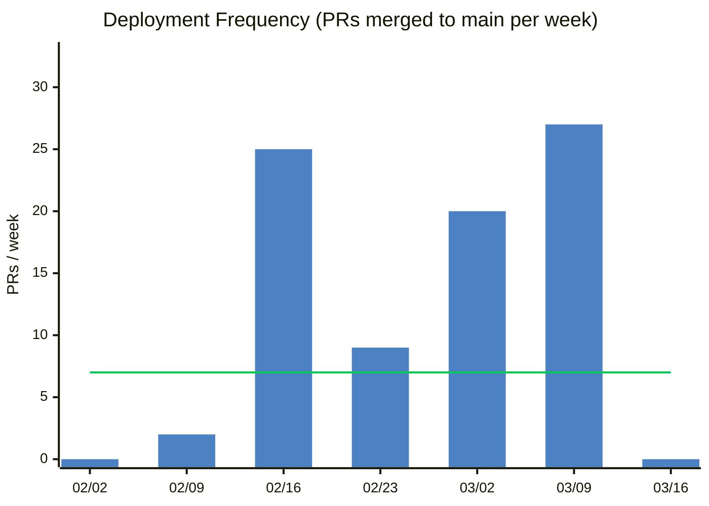
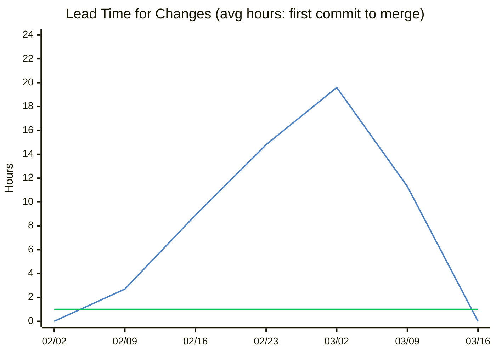
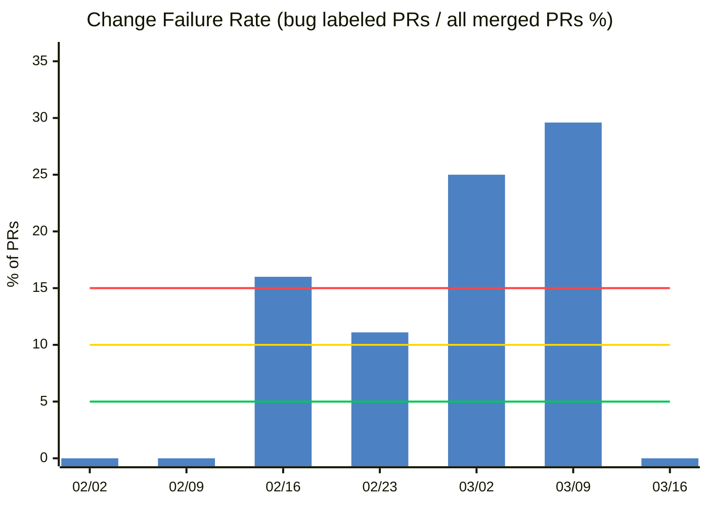
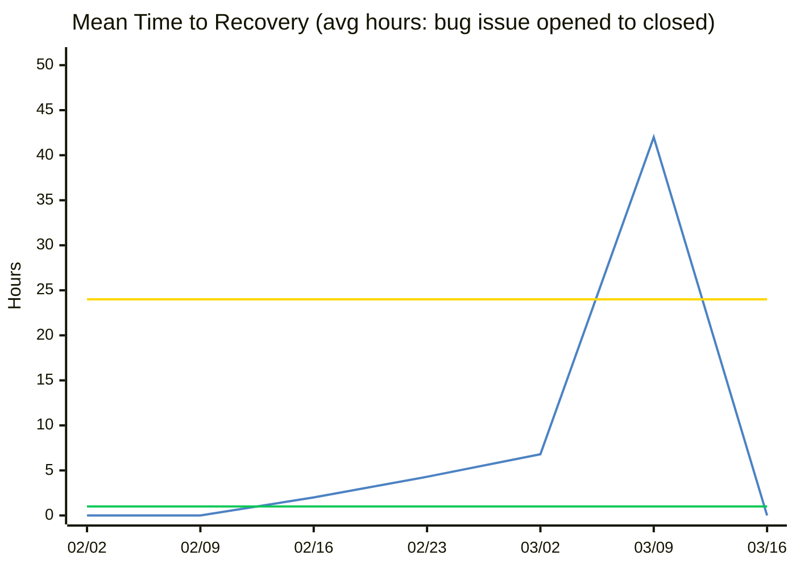
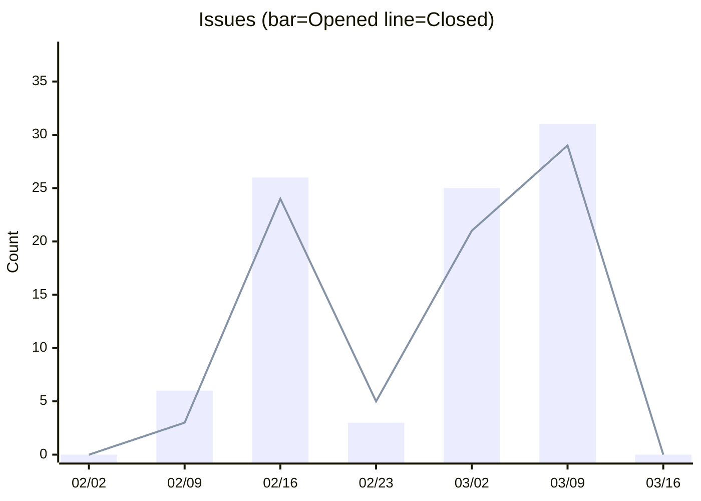
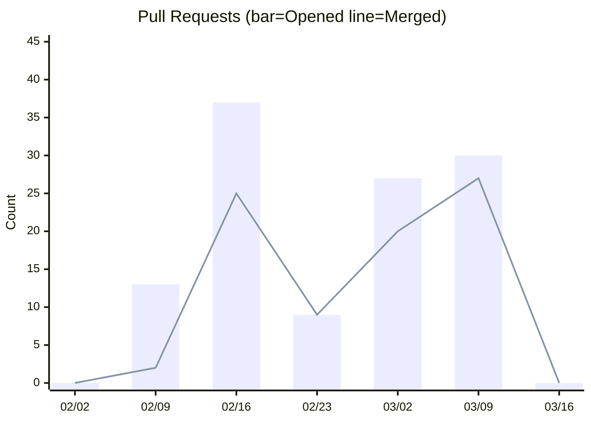
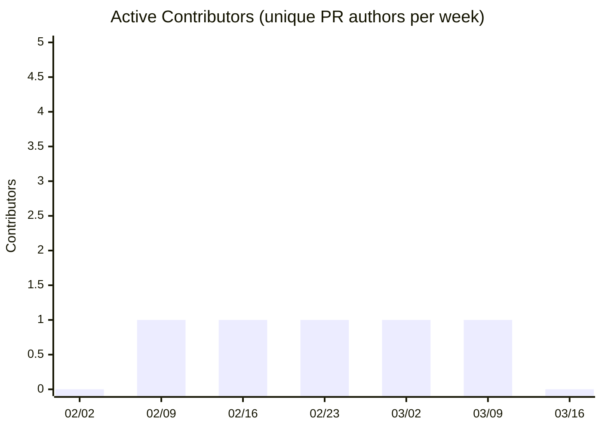
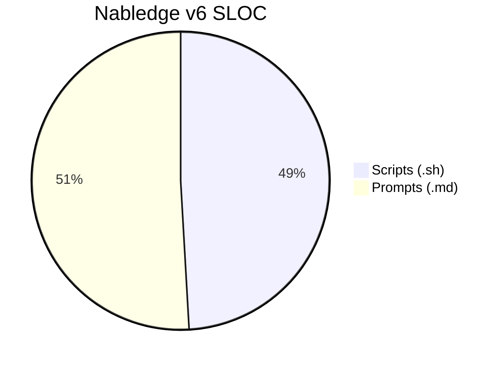
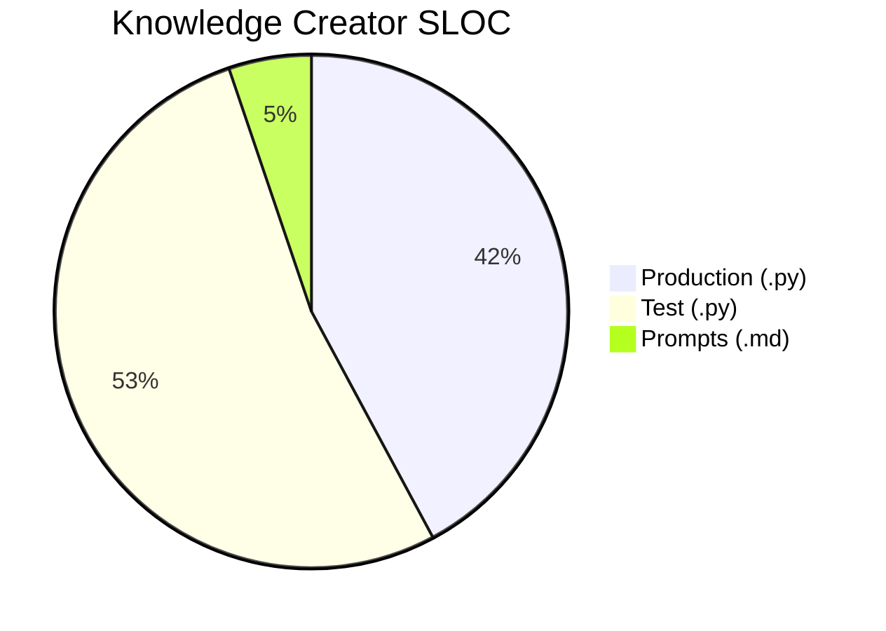
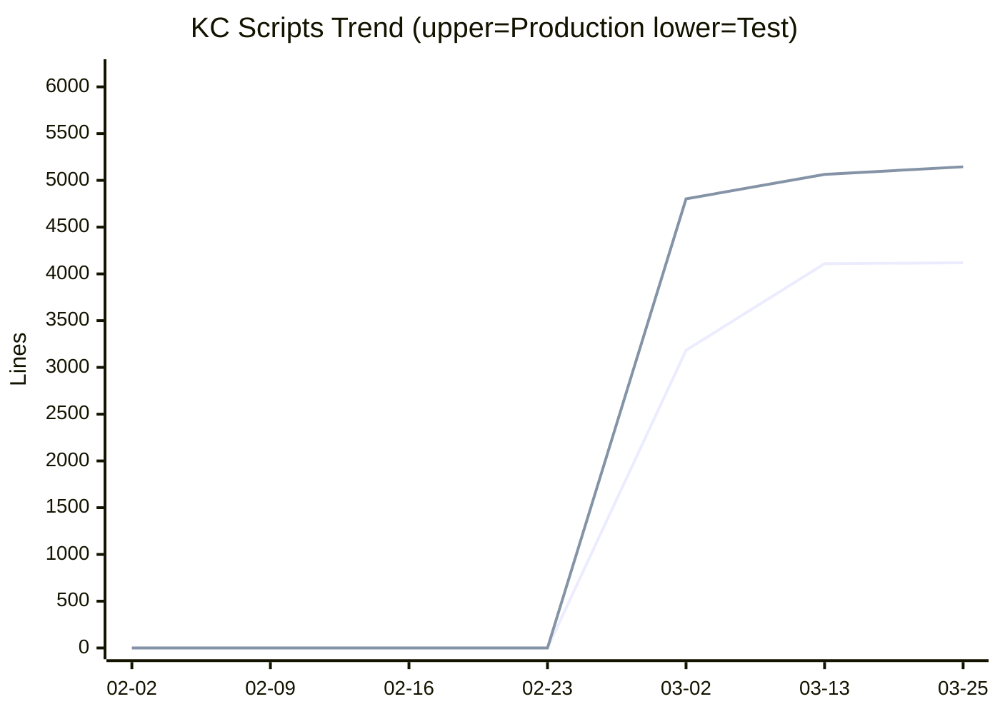

# Nabledge Dev Metrics

> Last updated: 2026-03-25 (auto-generated weekly — [view source](tools/metrics/collect.py))

## DORA Scorecard

| Metric | Latest | Level |
|--------|-------:|:-----:|
| Deployment Frequency | 27 PRs/week | **Elite** |
| Lead Time for Changes | 11.3h | High |
| Change Failure Rate | 30% | Low |
| MTTR | 42.0h | Medium |

Benchmark criteria

**Deployment Frequency**
- Elite: ≥7/week
- High: ≥1/week
- Medium: ≥1/month
- Low: <1/month

**Lead Time for Changes**
- Elite: <1h
- High: <1 week
- Medium: <1 month
- Low: ≥1 month

**Change Failure Rate**
- Elite: ≤5%
- High: ≤10%
- Medium: ≤15%
- Low: >15%

**MTTR**
- Elite: <1h
- High: <1 day
- Medium: <1 week
- Low: ≥1 week

> 🟢 Elite · 🟡 High · 🟠 Medium · 🔴 Low  (threshold lines)

## Activity

> Issues/PRs の開閉ペース・コントリビューター数を週次で追跡します。
> 開いた数と閉じた数のバランスが崩れていると、未解決の積み残しが増えているサインです。

## Code Size (SLOC)

> Scripts: statement lines (blank and comment lines excluded) / Prompts: non-blank lines

## Nabledge Adoption (nablarch/nabledge)

_Skipped: NABLEDGE_TOKEN not available._
