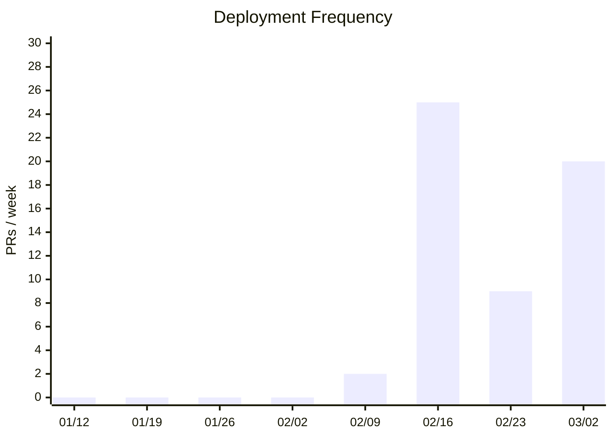
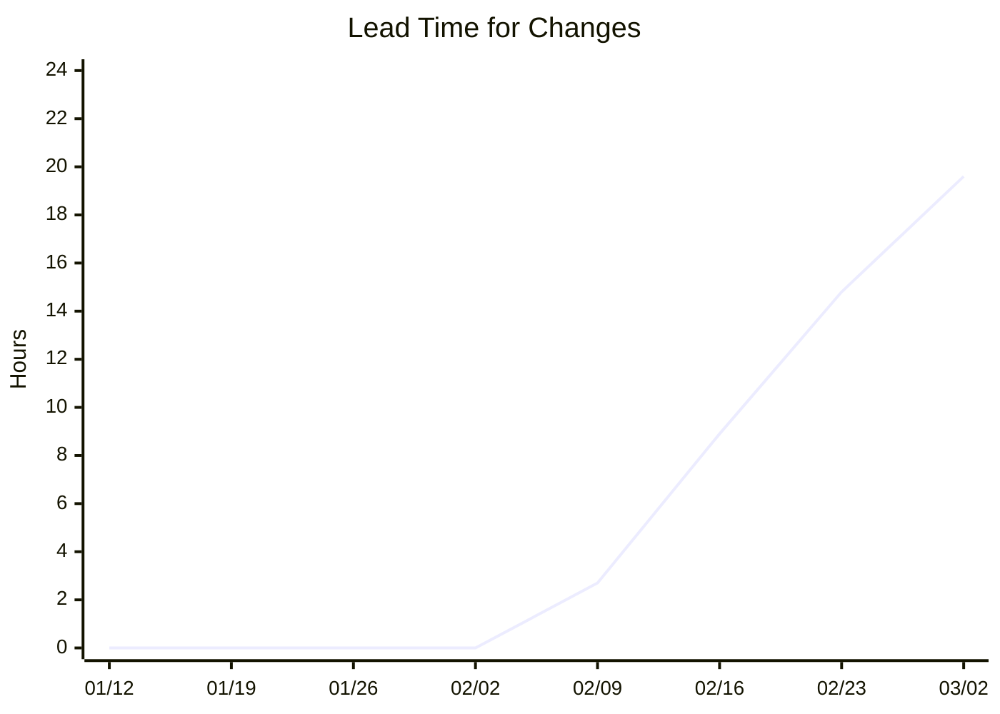
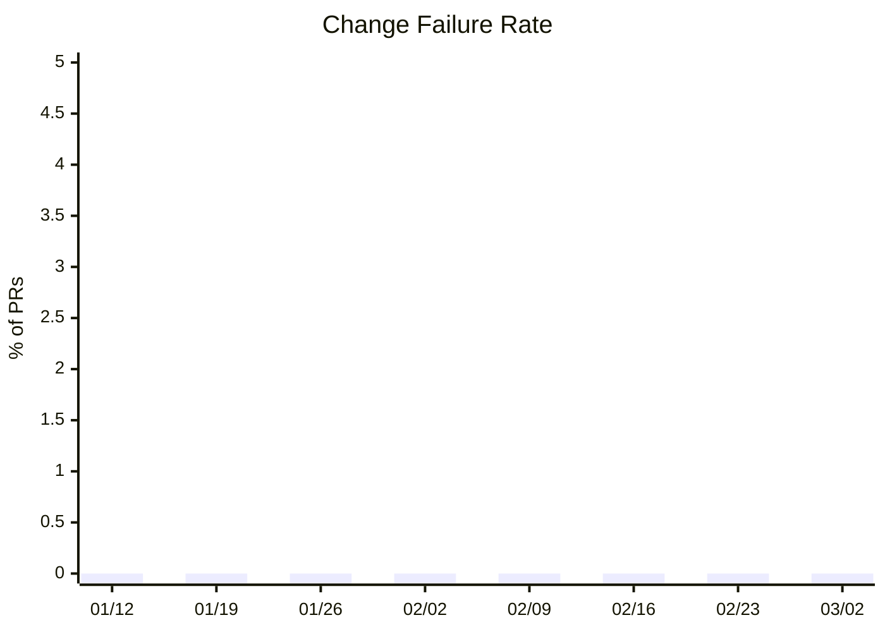
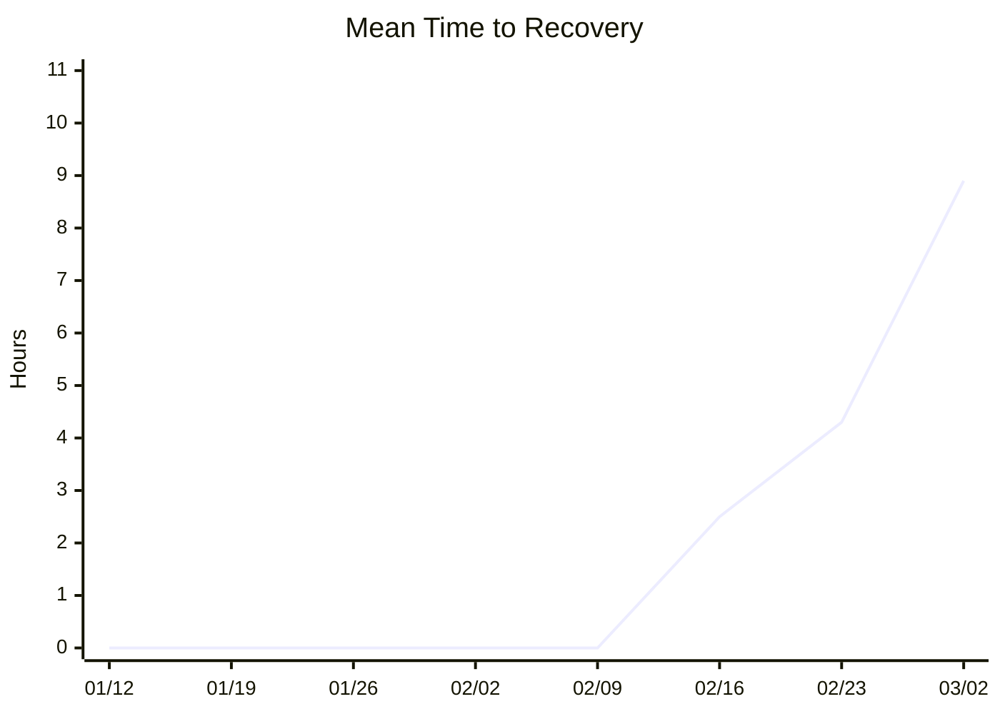

# Nabledge Dev Metrics

> Last updated: 2026-03-13 (auto-generated weekly — [view source](tools/metrics/collect.py))

## Development Productivity

### Deployment Frequency (PRs merged to main / week)

### Lead Time for Changes (avg hours: first commit → merge)

### Change Failure Rate (%)

### Mean Time to Recovery (avg hours)

## Activity

| Week | Issues Opened | Issues Closed | PRs Opened | PRs Merged | Contributors |
|------|:---:|:---:|:---:|:---:|:---:|
| 01/12 | 0 | 0 | 0 | 0 | 0 |
| 01/19 | 0 | 0 | 0 | 0 | 0 |
| 01/26 | 0 | 0 | 0 | 0 | 0 |
| 02/02 | 0 | 0 | 0 | 0 | 0 |
| 02/09 | 6 | 3 | 13 | 2 | 1 |
| 02/16 | 26 | 24 | 37 | 25 | 1 |
| 02/23 | 3 | 5 | 9 | 9 | 1 |
| 03/02 | 25 | 21 | 27 | 20 | 1 |

## Nabledge Adoption (nablarch/nabledge)

_Skipped: NABLEDGE_SYNC_TOKEN not available._
