# Nabledge Dev Metrics

> Last updated: 2026-07-20 (auto-generated weekly — [view source](tools/metrics/collect.py))

## DORA Scorecard

Benchmark criteria

**Deployment Frequency**
- Elite: ≥7/week
- High: ≥1/week
- Medium: ≥1/month
- Low: <1/month

**Lead Time for Changes**
- Elite: <1h
- High: <1 week
- Medium: <1 month
- Low: ≥1 month

**Change Failure Rate**
- Elite: ≤5%
- High: ≤10%
- Medium: ≤15%
- Low: >15%

**MTTR**
- Elite: <1h
- High: <1 day
- Medium: <1 week
- Low: ≥1 week

> 🔵 Actual  ·  🟢 Elite · 🟡 High · 🟠 Medium (threshold lines; beyond 🟠 = Low)

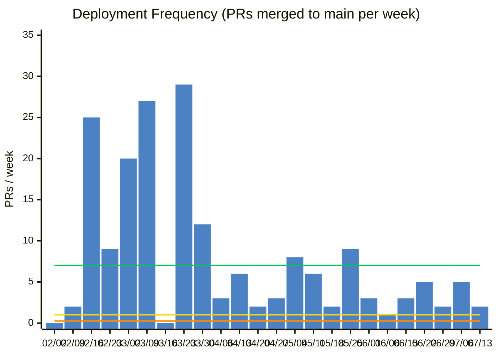

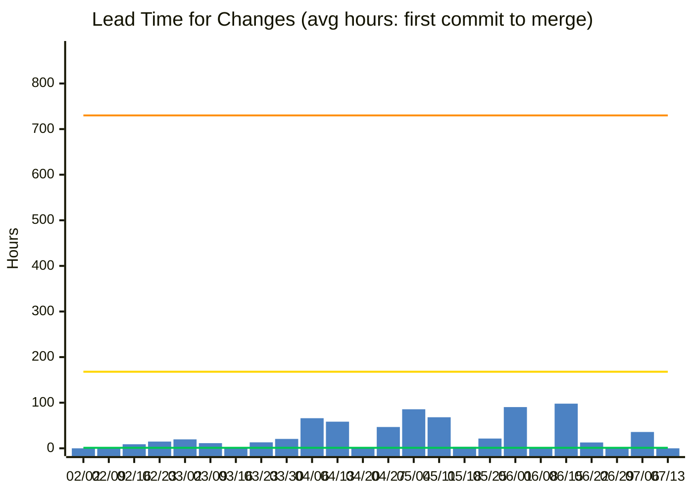

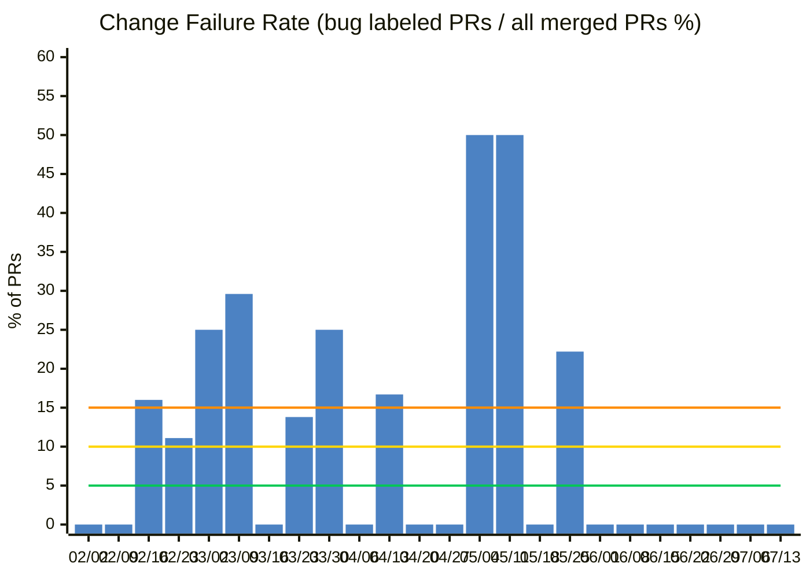

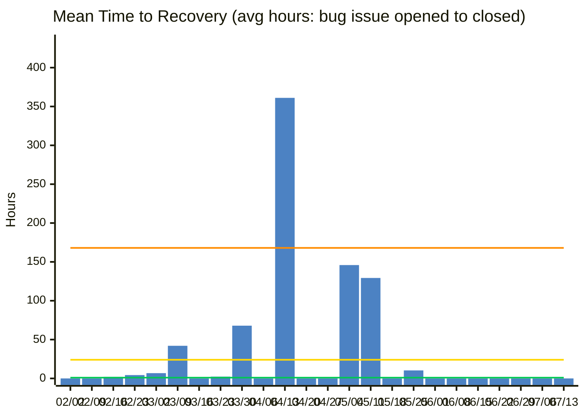

## Activity

> Issues/PRs の開閉ペース・コントリビューター数を週次で追跡します。
> 開いた数と閉じた数のバランスが崩れていると、未解決の積み残しが増えているサインです。

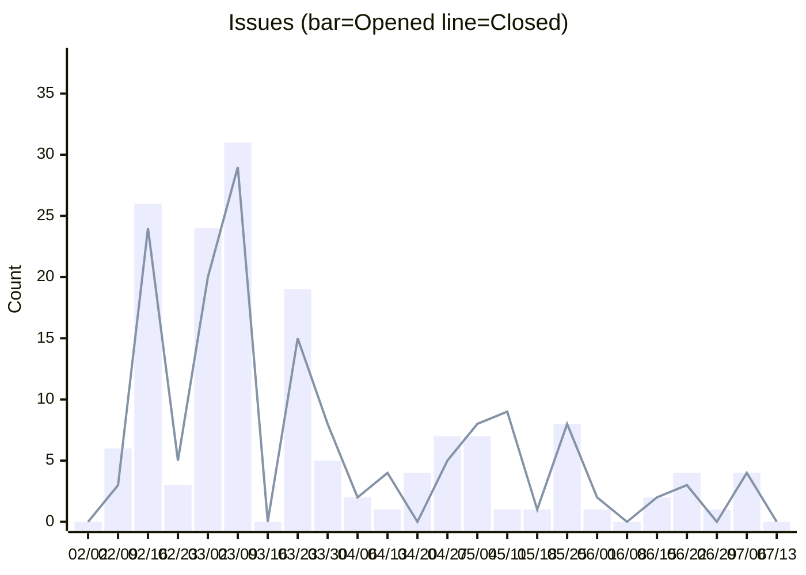

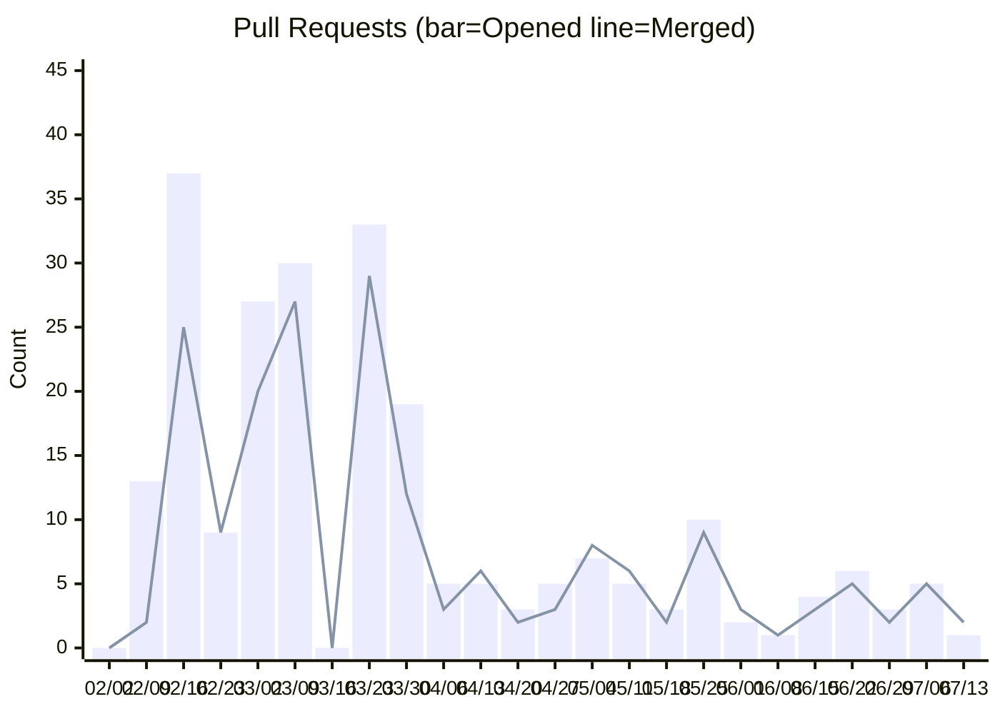

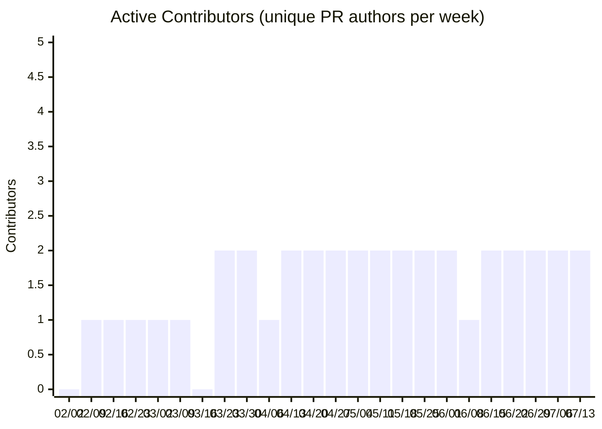

## Code Size (SLOC)

> Scripts: statement lines (blank and comment lines excluded) / Prompts: non-blank lines

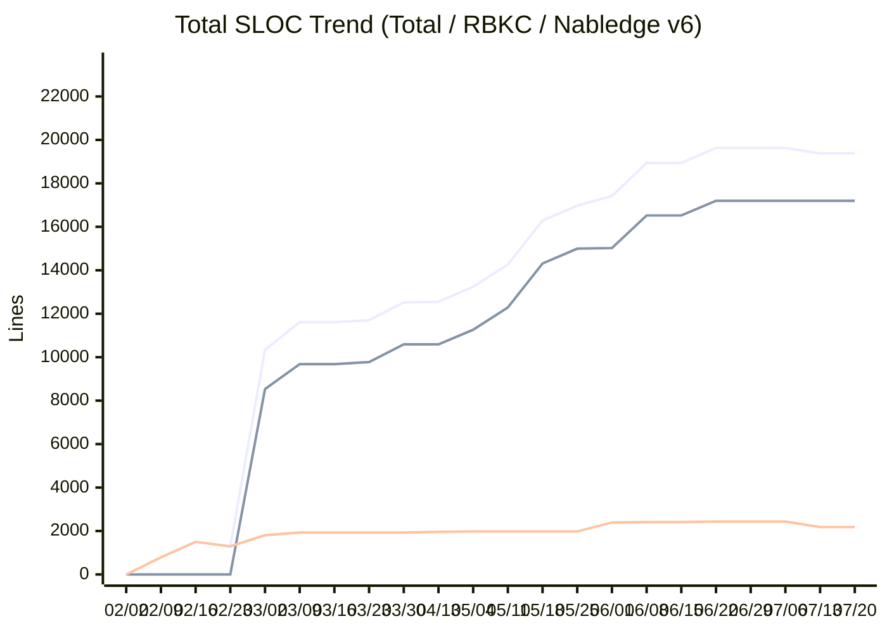
> Lines (top to bottom): Total — RBKC (prod+test) — Nabledge v6

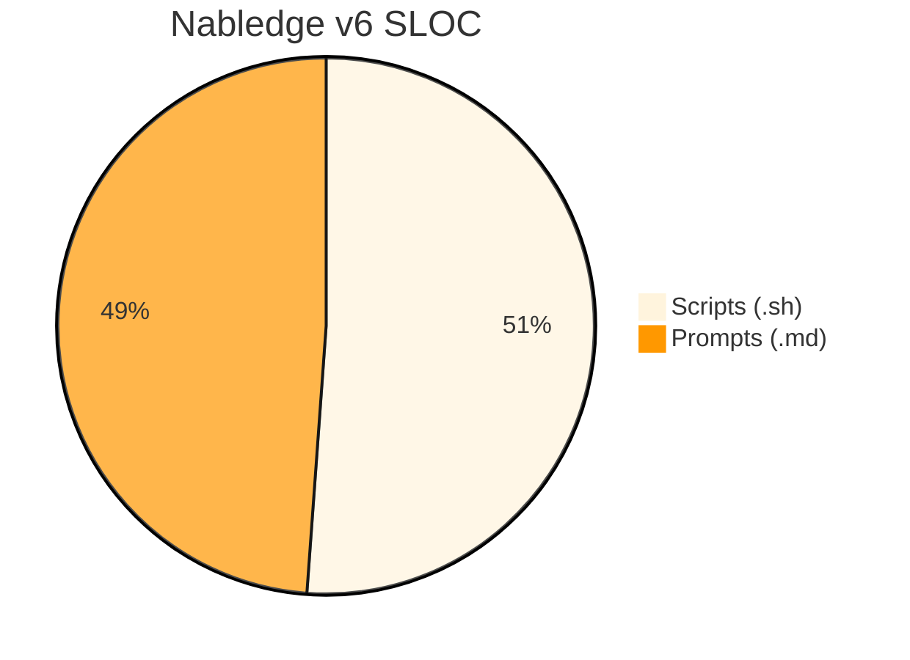

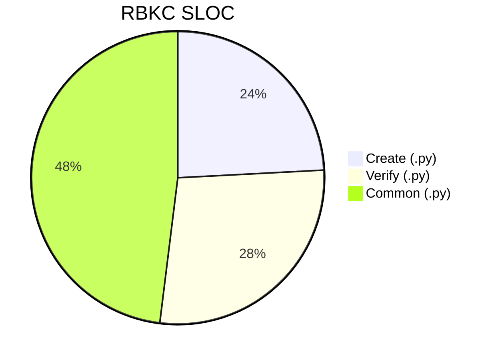

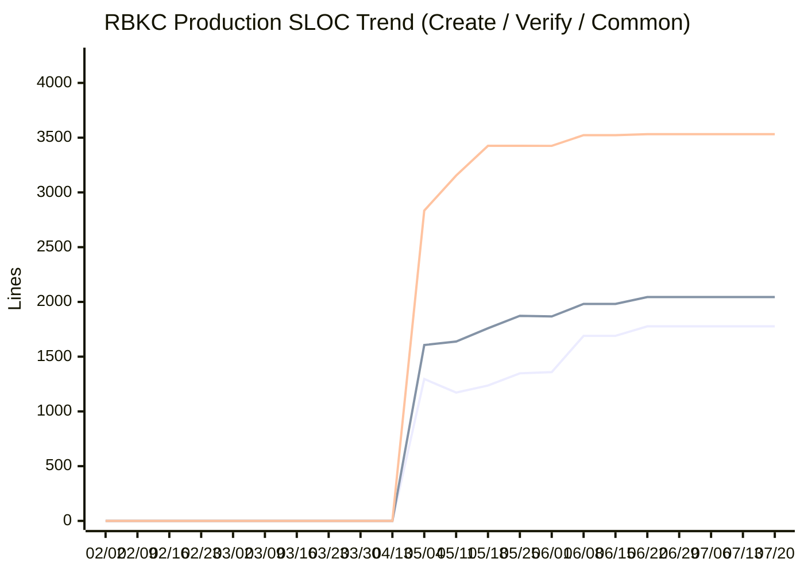
> Lines (top to bottom): Common — Verify — Create

## Nabledge Adoption (nablarch/nabledge)

> Traffic data collection started: week of 03/09

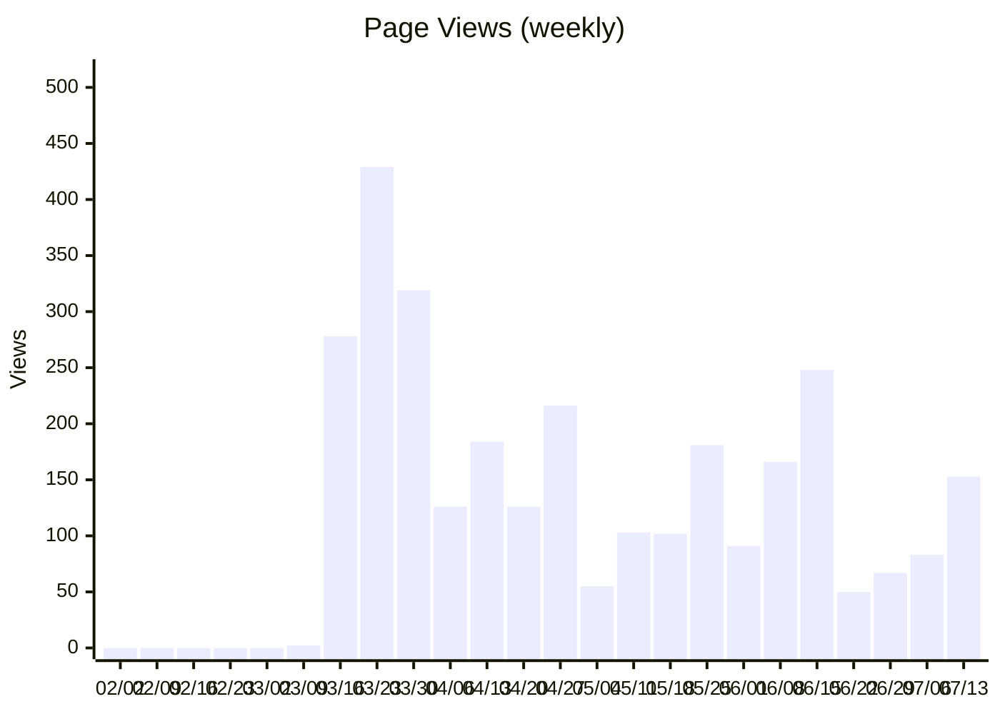

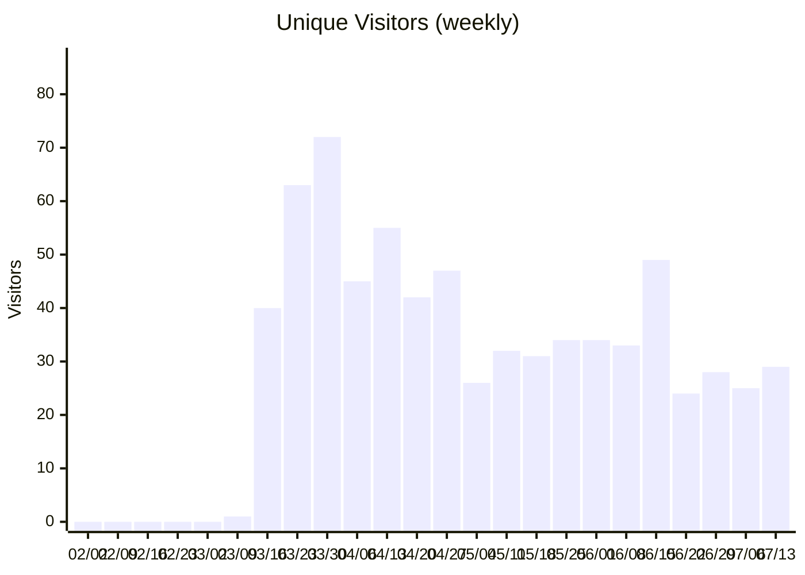

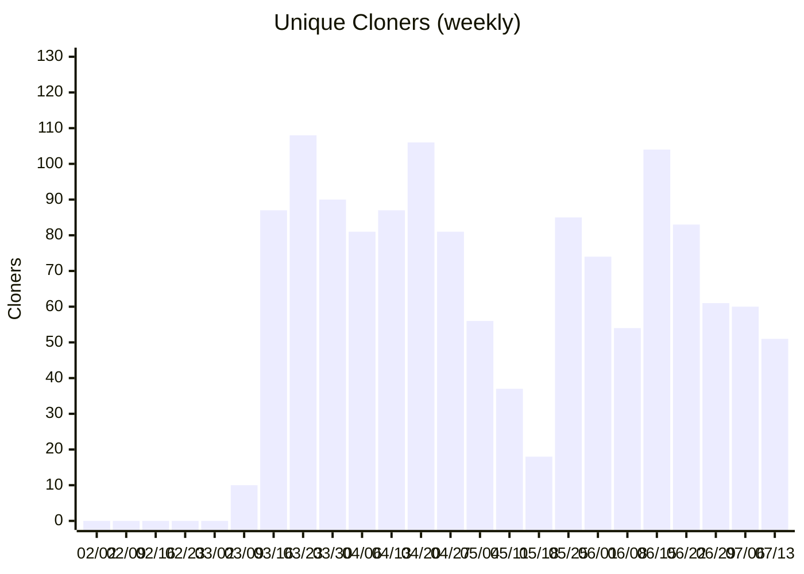
