# Nabledge Dev Metrics

> Last updated: 2026-03-13 (auto-generated weekly — [view source](tools/metrics/collect.py))

## DORA Scorecard

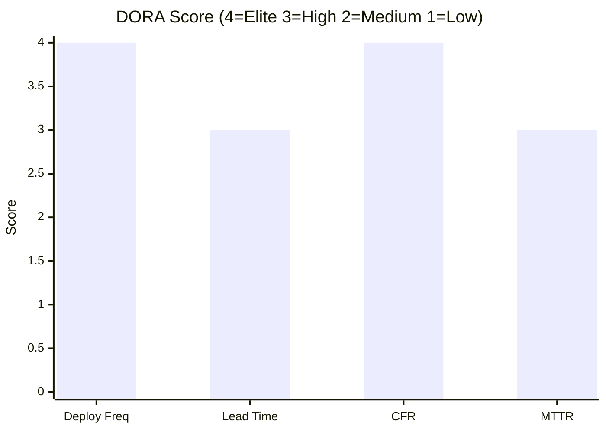

| Metric | Latest | Level | Elite | High | Medium | Low |
|--------|-------:|:-----:|:-----:|:----:|:------:|:---:|
| Deployment Frequency | 20 PRs/week | **Elite** | ≥7/week | ≥1/week | ≥1/month | <1/month |
| Lead Time for Changes | 19.6h | High | <1h | <1 week | <1 month | ≥1 month |
| Change Failure Rate | 0% | **Elite** | ≤5% | ≤10% | ≤15% | >15% |
| MTTR | 8.9h | High | <1h | <1 day | <1 week | ≥1 week |

## Development Productivity

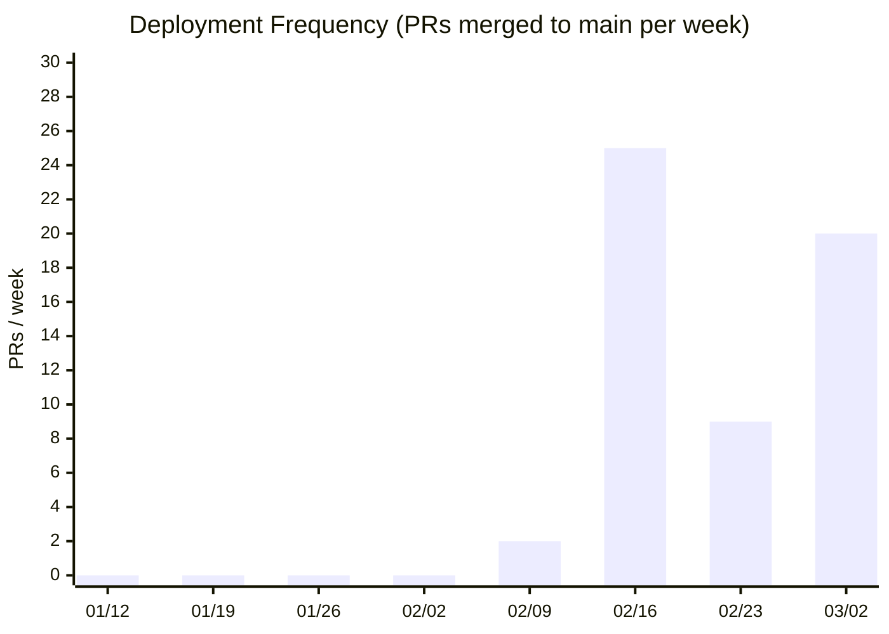

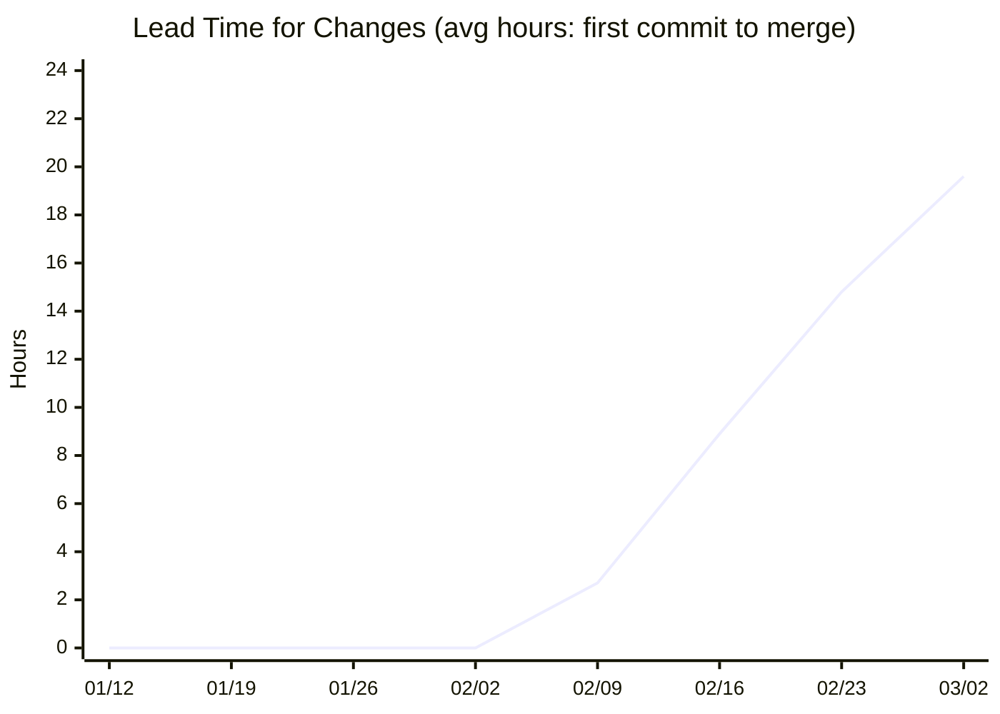

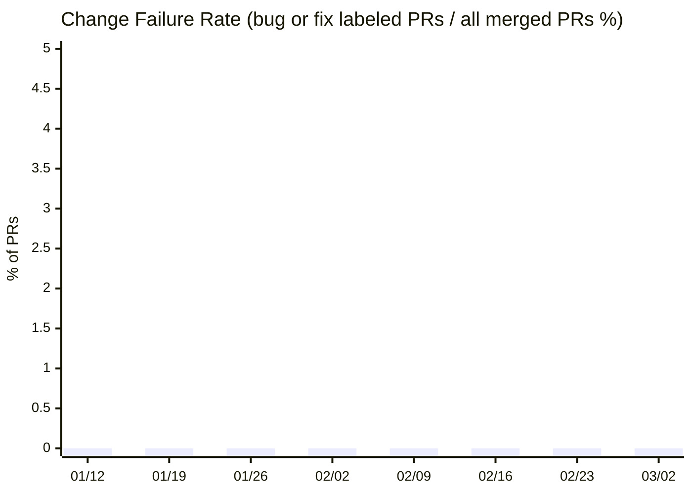

> **Change Failure Rate**: bug/fix ラベル付き PR 数 ÷ mainへマージされた全 PR 数 × 100

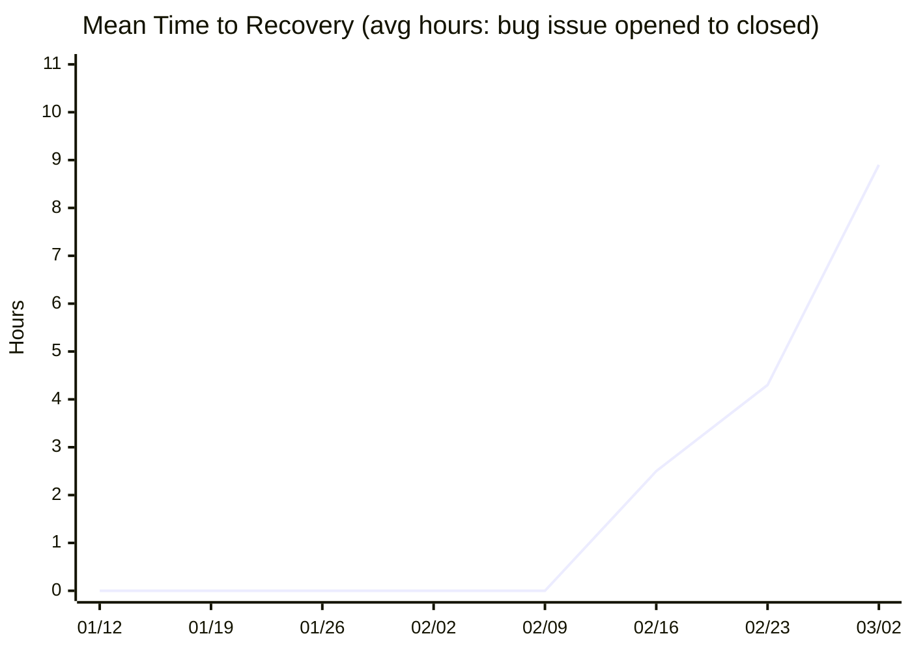

> **Mean Time to Recovery**: bug ラベル付き Issue の closed_at − created_at の平均（時間）

## Activity

> Issues/PRs の開閉ペース・コントリビューター数を週次で追跡します。
> 開いた数と閉じた数のバランスが崩れていると、未解決の積み残しが増えているサインです。

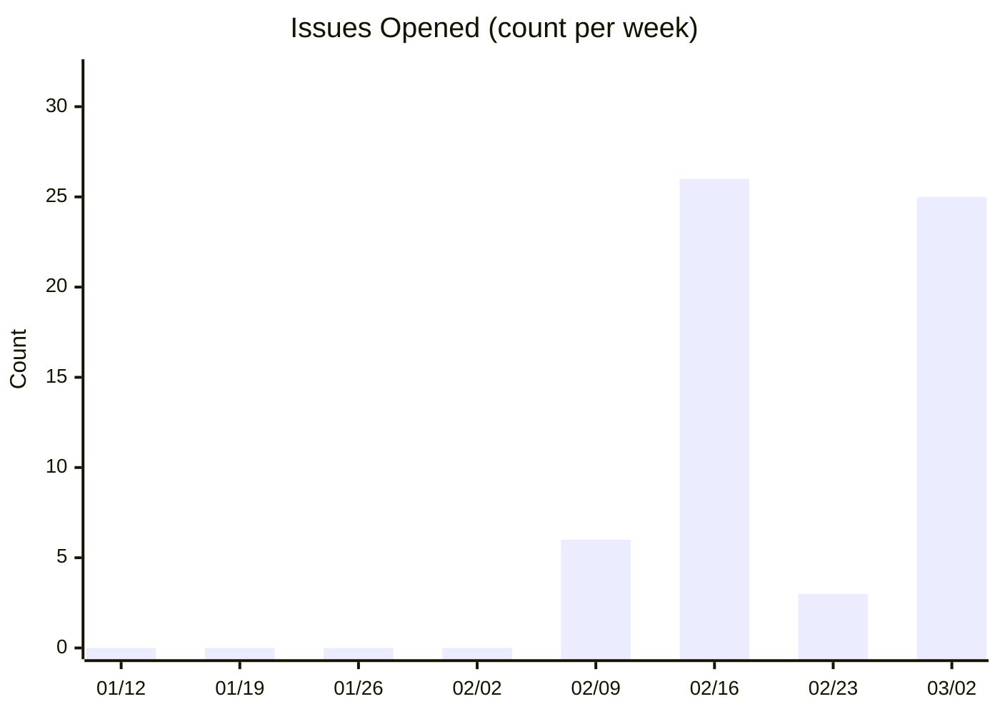

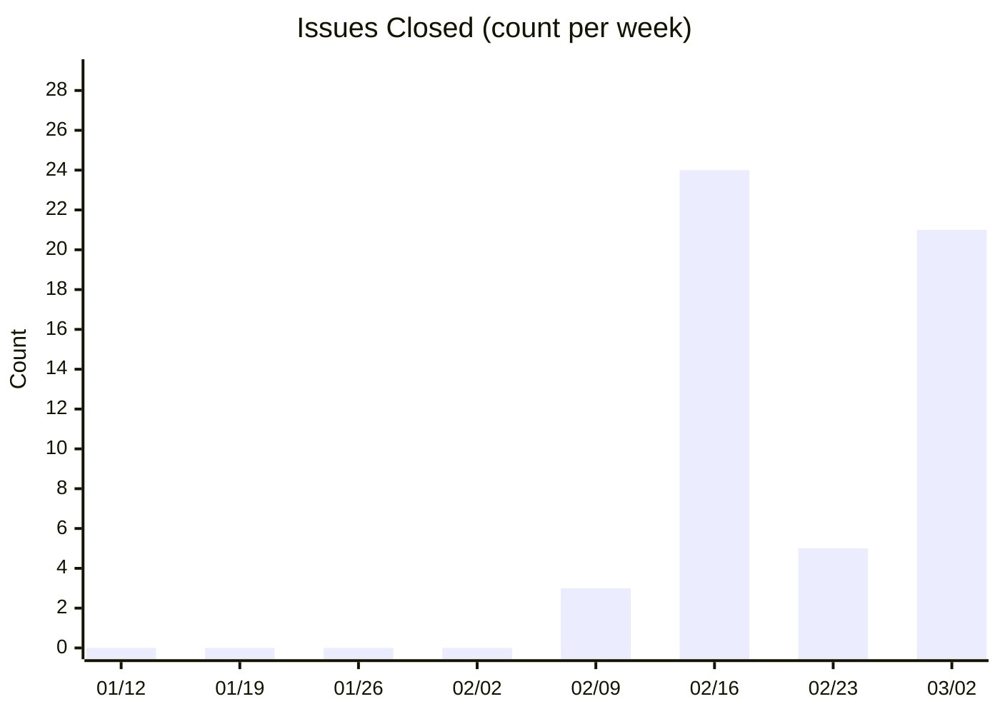

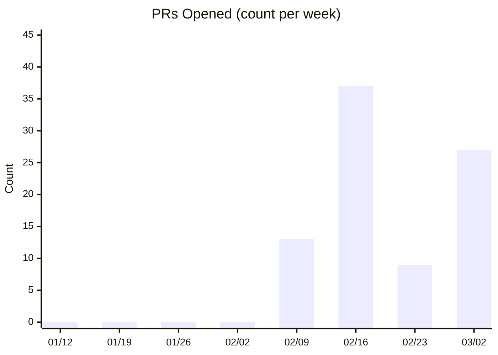

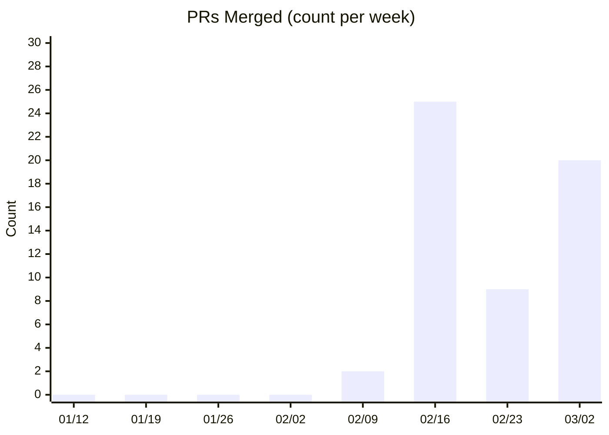

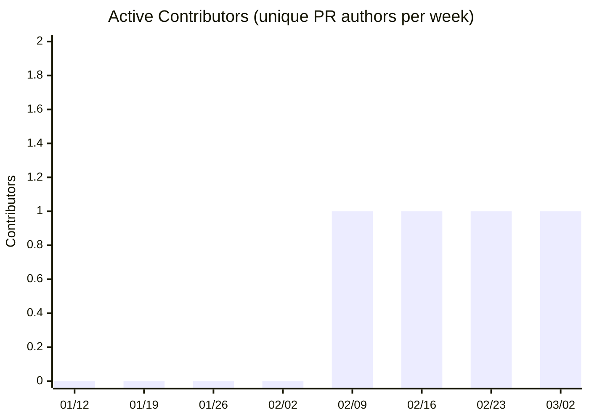

## Code Size (SLOC)

> Scripts: statement lines (blank and comment lines excluded) / Prompts: non-blank lines

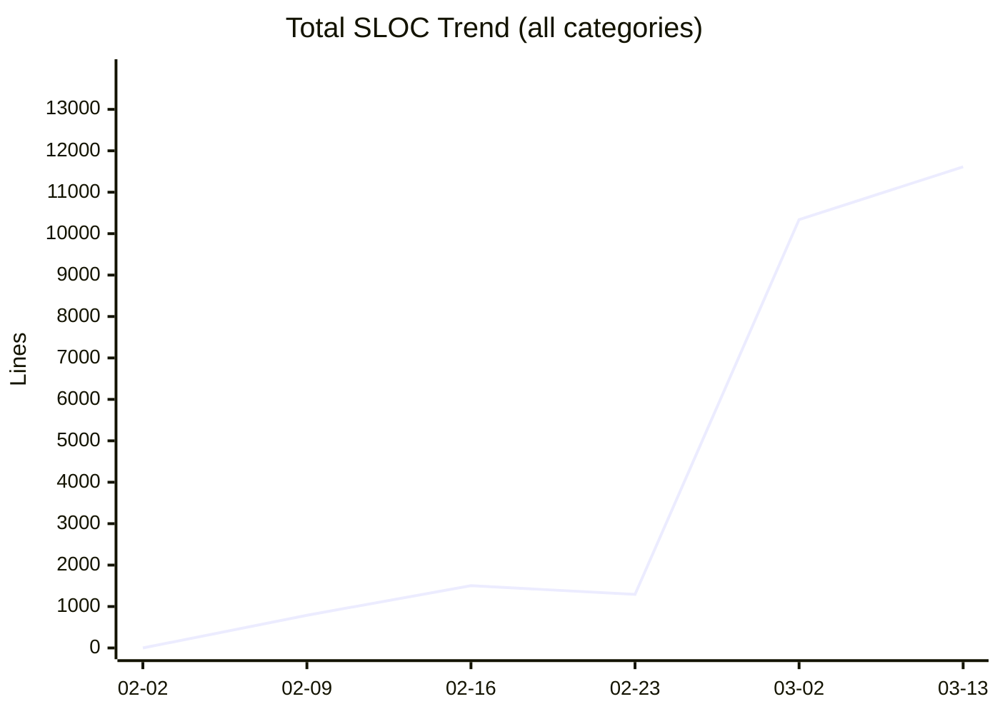

### Nabledge v6

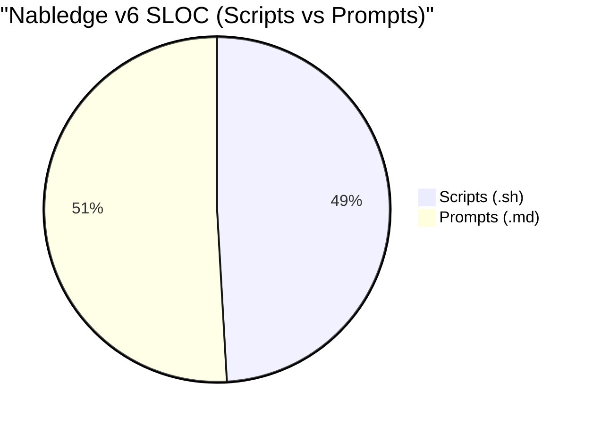

### Knowledge Creator

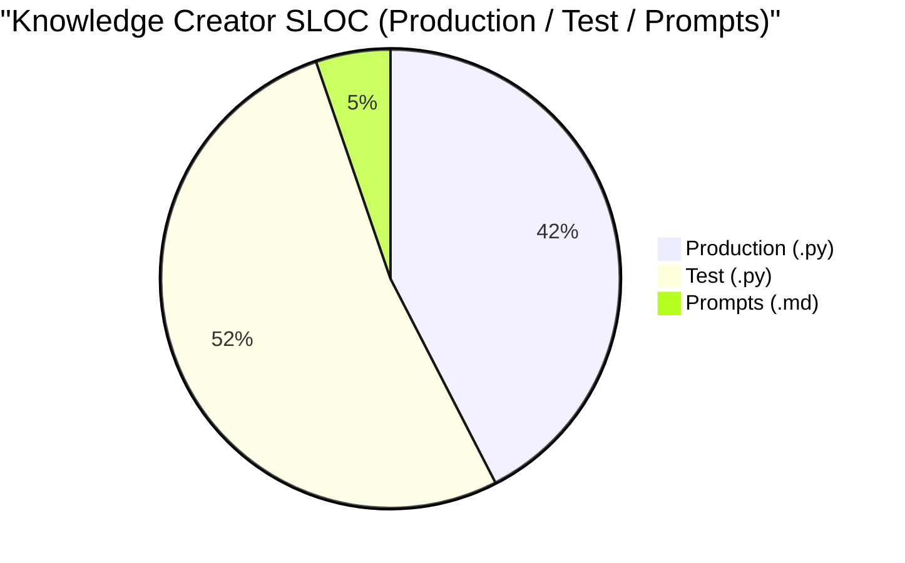

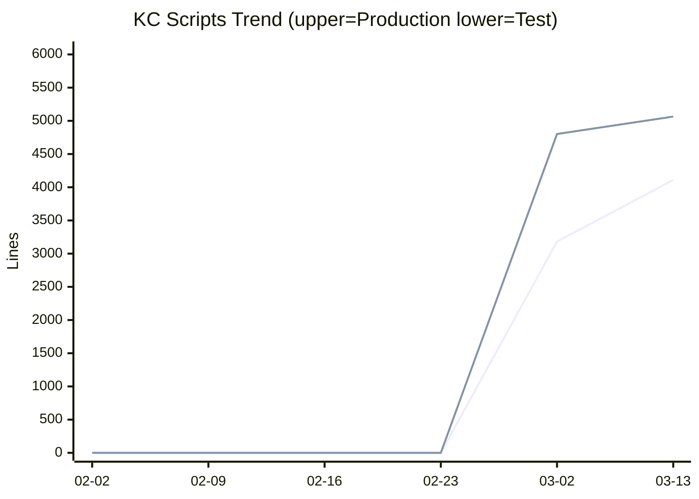

## Nabledge Adoption (nablarch/nabledge)

_Skipped: NABLEDGE_SYNC_TOKEN not available._
