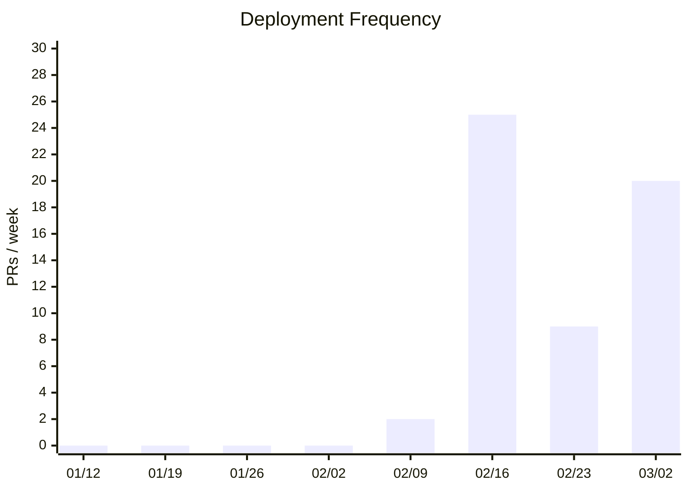
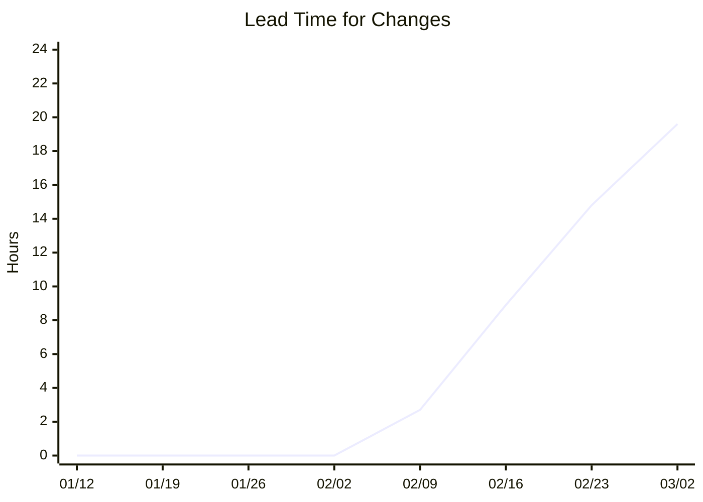
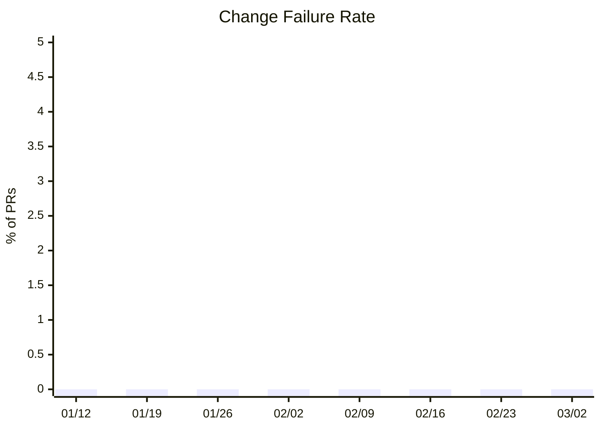
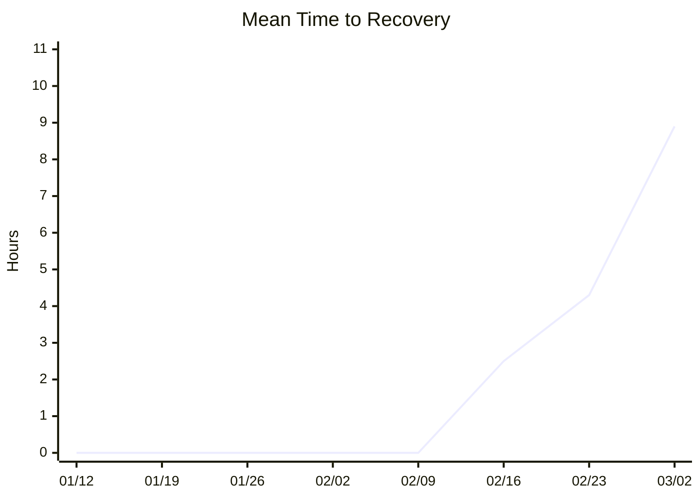
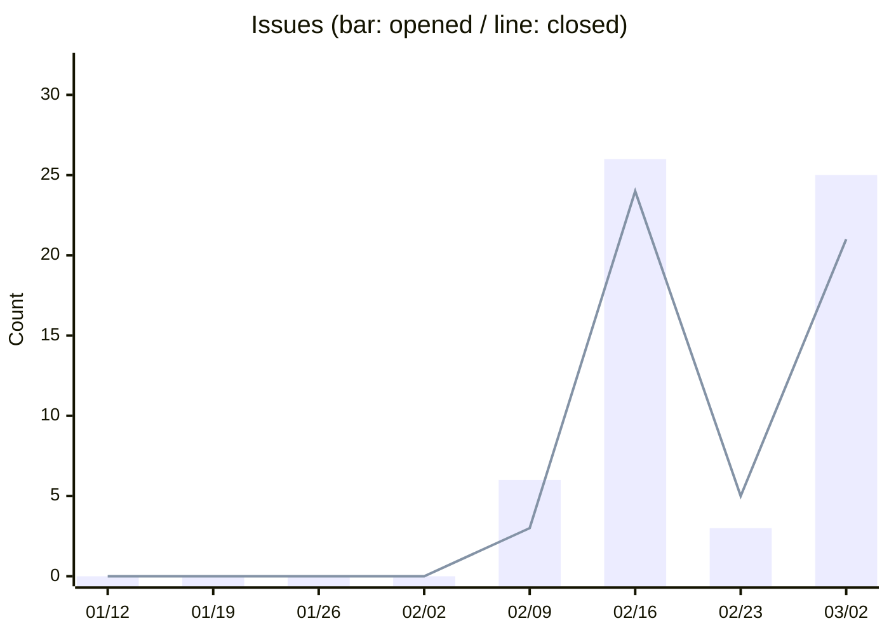
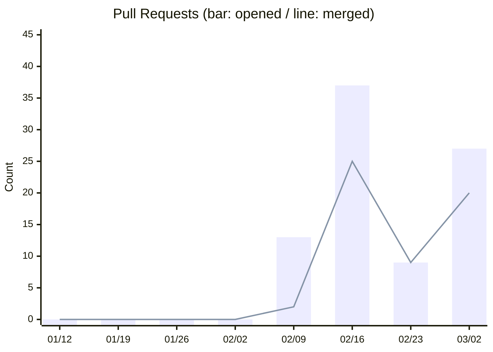
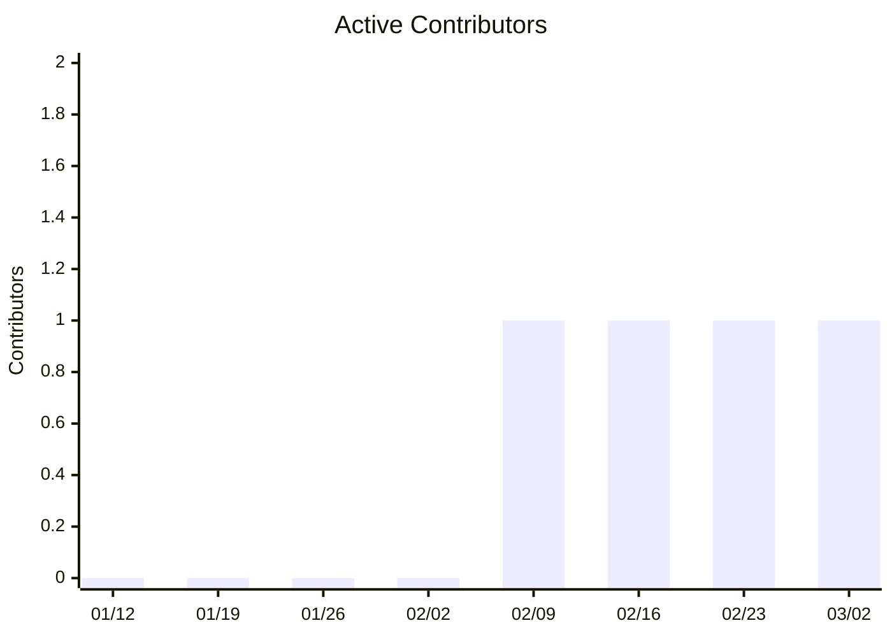
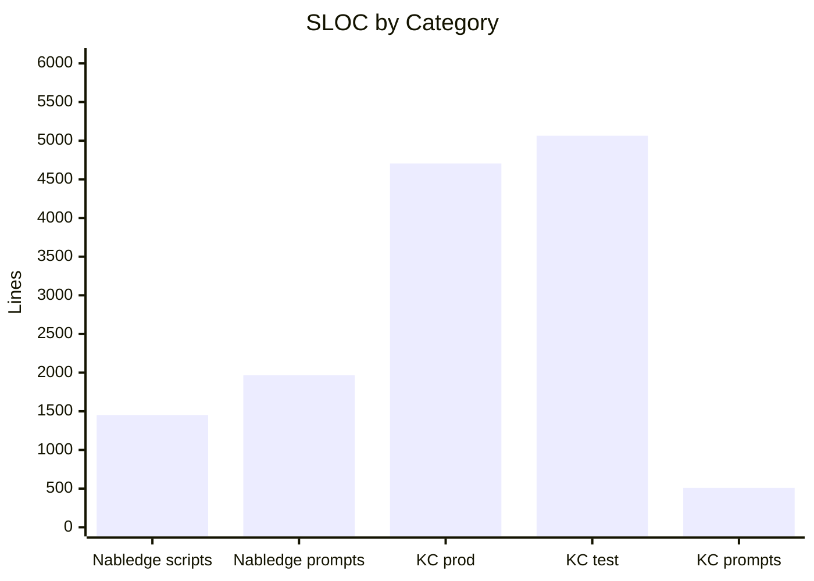

# Nabledge Dev Metrics

> Last updated: 2026-03-13 (auto-generated weekly — [view source](tools/metrics/collect.py))

## DORA Scorecard

| Metric | Latest | Level | Elite | High | Medium | Low |
|--------|-------:|:-----:|:-----:|:----:|:------:|:---:|
| Deployment Frequency | 20 PRs/week | **Elite** | ≥7/week | ≥1/week | ≥1/month | <1/month |
| Lead Time for Changes | 19.6h | High | <1h | <1 week | <1 month | ≥1 month |
| Change Failure Rate | 0% | **Elite** | ≤5% | ≤10% | ≤15% | >15% |
| MTTR | 8.9h | High | <1h | <1 day | <1 week | ≥1 week |

## Development Productivity

### Deployment Frequency (PRs merged to main / week)

### Lead Time for Changes (avg hours: first commit → merge)

### Change Failure Rate (%)

### Mean Time to Recovery (avg hours)

## Activity

### Issues

### Pull Requests

### Active Contributors

| Week | Issues Opened | Issues Closed | PRs Opened | PRs Merged | Contributors |
|------|:---:|:---:|:---:|:---:|:---:|
| 01/12 | 0 | 0 | 0 | 0 | 0 |
| 01/19 | 0 | 0 | 0 | 0 | 0 |
| 01/26 | 0 | 0 | 0 | 0 | 0 |
| 02/02 | 0 | 0 | 0 | 0 | 0 |
| 02/09 | 6 | 3 | 13 | 2 | 1 |
| 02/16 | 26 | 24 | 37 | 25 | 1 |
| 02/23 | 3 | 5 | 9 | 9 | 1 |
| 03/02 | 25 | 21 | 27 | 20 | 1 |

## Code Size (SLOC)

> Scripts: statement lines (blank and comment lines excluded)  
> Prompts: non-blank lines

### Current Breakdown by Category

### Summary

| Category | Lines | Change |
|----------|------:|-------:|
| Nabledge scripts | 1,452 | — |
| Nabledge prompts | 1,966 | — |
| KC scripts (prod) | 4,705 | — |
| KC scripts (test) | 5,064 | — |
| KC prompts | 509 | — |
| **Total** | **13,696** | **—** |

### Nabledge Scripts by Extension

| Extension | Lines | Change |
|-----------|------:|-------:|
| `.sh` | 1,452 | — |

### KC Scripts by Extension

| Extension | Prod | Prod Change | Test | Test Change |
|-----------|-----:|:-----------:|-----:|:-----------:|
| `.py` | 4,705 | — | 5,064 | — |

## Nabledge Adoption (nablarch/nabledge)

_Skipped: NABLEDGE_SYNC_TOKEN not available._
