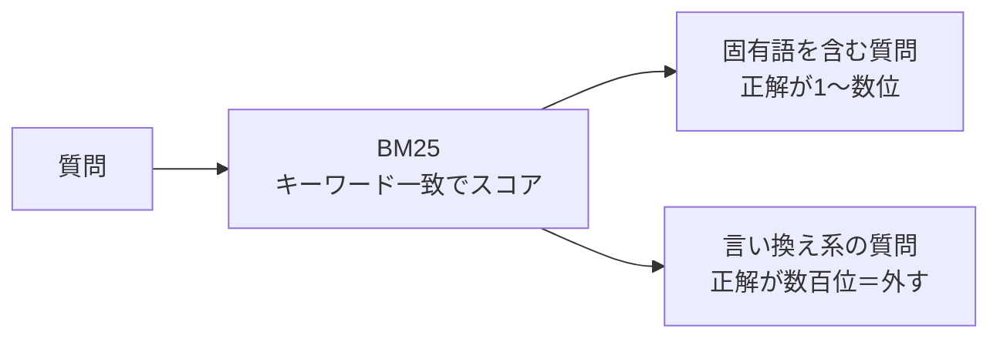
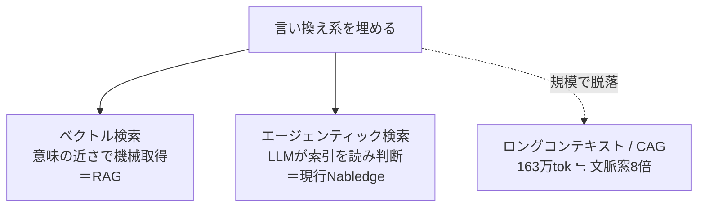
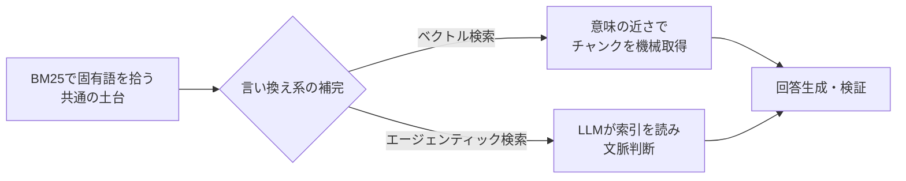
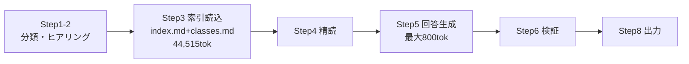
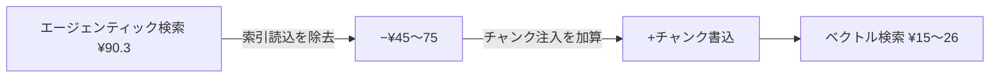

# Nablarch知識基盤のコスト最適化評価 ① アーキテクチャ

---

## 1. 背景

Nablarchは固有語が多く、固有語は全文検索（BM25）でほぼ無料で拾える。これは検索の土台として入れる前提。論点は、BM25が外す「言い換え」系（約32%）の埋め方にある。

言い換え系を埋める手段は2つ。

| 手段 | 実現方法 | 仕組み |
|---|---|---|
| ベクトル検索 | RAG | 意味の近さでチャンクを機械取得しLLMに渡す |
| エージェンティック検索 | 現行Nabledge | LLMが索引を読んで文脈判断する |

以降、この2手段を軸に、コストと精度（誤った知識を1件も出さない＝34シナリオ全パス）から、現行方式を維持するか代替へ移るかを判断する。

---

## 2. 結論

| 軸 | 1回 | 確度 | 全パス |
|---|---|---|---|
| エージェンティック検索（現行Nabledge） | ¥90.3 | 実測 | 達成（実測） |
| ベクトル検索（RAG） | ¥15〜26 | 試算 | 精度に依存（未実測） |

コストはベクトル検索が約3〜6分の1。だが採否はコストでなく、ベクトル検索が言い換え系を全パス水準で拾えるかに帰着する。精度が未実測のため、現時点で方式は確定できない。

---

## 3. 評価基準

Nablarchはミッションクリティカルな金融基盤等で使われ、Nabledgeにも同等品質が求められる。

| 基準 | 内容 |
|---|---|
| 品質 | 誤った知識を1件も出さない。34シナリオ全パスが現状水準 |
| コスト | 利用PJ側の1回・規模別ランニング。Bedrock東京 Sonnet 4.6 |
| 更新性・提供形態 | 知識更新の容易さ、配布の仕組み |

---

## 4. 出発点：固有語はBM25で機械的に拾える

Nablarchの質問の多くは固有語（クラス名・アノテーション・処理方式名）を含む。固有語はキーワード一致で引けるため、全文検索（BM25）が有効。

BM25（Best Match 25）は、キーワードの一致度と希少性で文書をスコアリングする全文検索アルゴリズム。ルールベースでLLMを使わず、決定的・ほぼ無料・高速。

BM25を32シナリオ・k=20で実測【実測】：

| | 結果 |
|---|---|
| pass | 22件（68%） |
| 強い | 固有語・クラス名（UniversalDao, BeanUtil, SystemRepository, CSRF, XSS）→ 正解が1〜数位 |
| 弱い | 質問と本文の語彙がずれる言い換え系（qa-02, qa-05, qa-19等）→ 正解が数百位 |

BM25はほぼ無料で68%を拾う。これは入れる前提。本題は、残り約32%の言い換え系をどう埋めるか。

---

## 5. 本題：言い換え系の埋め方（ベクトル検索 vs エージェンティック検索）

言い換え系を埋める手段は、ベクトル検索とエージェンティック検索。これが方式選定の分岐点。なお、LLMに知識を与える方式にはロングコンテキスト・CAGもあるが、知識規模（v6だけで約163万トークン、文脈窓の約8倍）で脱落する。

両者は土台（BM25で固有語を拾う）を共有し、言い換え系の埋め方だけが異なる。

この差が、コスト差（索引を読むか否か）と精度差（機械検索か文脈判断か）を生む。

---

## 6. コスト

### 6-1. エージェンティック検索（現行Nabledge）：実測（CC実起動・/usage で確認した6件）

質問の種類を変え、CCを実起動して/usageで測定。¥79〜101 にほぼ一定、平均 ¥90.3/回。

| 質問 | キャッシュ読取 | キャッシュ書込 | 出力 | 円@160 | API時間 |
|---|---|---|---|---|---|
| Nablarchバッチ 都度起動 | 411,100 | 101,300 | 3,300 | 88.0 | 53秒 |
| UniversalDao 検索 | 551,700 | 105,400 | 4,200 | 99.0 | 77秒 |
| バリデーション（ヒアリング有） | 458,100 | 90,800 | 3,600 | 85.0 | 61秒 |
| REST 400+JSON | 545,100 | 110,800 | 3,500 | 101.0 | 67秒 |
| DBRecordReader メッセージング | 305,200 | 94,300 | 3,400 | 79.0 | 64秒 |
| GraphQL（範囲外・ヒアリング有） | 330,700 | 106,500 | 4,300 | 90.0 | 77秒 |
| **平均** | **433,650** | **101,517** | **3,717** | **90.3** | **66秒** |

トークン種別ごとのコスト内訳【実測】。読取トークンは多いが単価が入力の0.10倍のため、コスト上は書込が支配的。

| 種別 | トークン | 単価 | 円@160 | 割合 |
|---|---|---|---|---|
| キャッシュ読取 | 433,650 | 入力×0.10 | ¥20.8 | 23% |
| キャッシュ書込 | 101,517 | 入力×1.25 | ¥60.9 | 67% |
| 出力 | 3,717 | $15/100万 | ¥8.9 | 10% |
| **合計** | — | — | **¥90.6** | 100% |

（入力単価 $3／100万トークン、出力 $15／100万トークン。実測と検算一致）

### 6-2. ステップ別の金額【試算：実測値からの構造推定】

ログには1回の合計トークンしか残らず、ステップ単位の内訳は測れない。以下は確定した合計（¥90.6）を、ワークフローの各ステップが読み書きする内容から配分した試算。一意には決まらず、レンジを持つ。

ワークフローは8ステップ。コストの中心は Step3（索引読込）で index.md+classes.md（44,515トークン）を読むこと。

| ステップ | 内容 | 金額（試算） | 主なコスト種別 |
|---|---|---|---|
| Step1-2 分類・ヒアリング | 質問分類、必要時のみ問い返し | ¥3〜4 | 書込 |
| Step3 索引読込 | 索引44,515tokの初回書込＋後続再送 | ¥45〜75 | 書込（初回¥26.7）＋読取（再送） |
| Step4 精読 | 確定セクション読込 | ¥3〜4 | 書込 |
| Step5 回答生成 | 最大800tok生成 | 出力¥8.9に計上 | 出力 |
| Step6 検証 | クレーム抽出・照合 | 文脈再送に含む | 読取 |
| Step8 出力 | final_answer出力（新規生成なし） | Step5と表裏 | — |

注：Step5の回答生成が出力トークン¥8.9を産む。Step8は生成済みの回答を渡すだけで新規コストはない。Step6の検証は独立した出力を持たず、文脈再送（読取）に含まれる。Step3の金額幅(¥45〜75)は、索引の初回書込(¥26.7・確定)に、後続ターンでの再送読取をどこまで帰属させるかで動く。

### 6-3. ベクトル検索（RAG）：CC実行前提の概算【試算】

ベクトル検索をCC上で動かす場合、エージェンティック検索との差は索引読込フェーズ（Step3）を持たないこと。代わりにベクトル検索で得たチャンクを文脈に書き込むコストが乗る。

| 内訳 | 1回 | 根拠 |
|---|---|---|
| 下限 ¥15 | 索引読込フェーズの除去のみ。チャンク注入を最小と仮定 | 90.3 − 索引読込（上限側）≒15 |
| 上限 ¥26 | 検索チャンク（k件×セクション）を文脈に書き込むコストを加算 | チャンク書込分を上乗せ |

幅が出るのは、ステップ金額が試算（6-2）で、除去できる索引読込の額と、新たに乗るチャンク注入の額が、ともにレンジを持つため。確定は実測で行う。[要確認：ベクトル検索コスト実測]

### 6-4. 1名あたり月額（月40回）

利用頻度は現場確認で月40回（1日1〜3回・週10回）。

| | 1回 | 1名月40回 |
|---|---|---|
| エージェンティック検索（現行Nabledge） | ¥90.3 | ¥3,612 |
| ベクトル検索 | ¥15〜26 | ¥600〜1,040 |

### 6-5. 提供形態：両方式とも「配布のみ・常時費なし」

ベクトル検索はローカル起動前提とする。全社共通のベクトル検索サーバー（月$345〜の常駐）を立てず、ベクトル化済みデータを配布し各PJがローカルで検索する。参考実装 nabchan-mcp-server が外部API不要・ローカル完結（`--network none`動作）でこれを実証。開発側の常時運用コストが発生せず、現行Nabledgeと同じ「配布のみ・常時費なし」に乗る。

---

## 7. 精度：言い換え系をベクトル検索が拾えるか

要件は34シナリオ全パス。エージェンティック検索（現行Nabledge）は達成済み【実測】。ベクトル検索は土台のBM25のみ実測（68%）で、言い換え系を埋めるベクトル部分は未実測。

| 検索手段 | 状態 |
|---|---|
| BM25（土台） | 32シナリオ・k=20で68%【実測】。固有語に強く言い換えに弱い |
| ベクトル検索 | 未実測【最大の未確定点】 |
| ハイブリッド（BM25＋ベクトル） | 未実測 |

BM25が外す約32%をベクトル検索が拾えるかが、ベクトル検索が全パスに届くかを決める。エージェンティック検索はヒアリングで処理方式・目的を確定し、LLMが索引を読んで文脈判断するため、語彙ずれを回避して全パスする。

ベクトル検索の構造的リスク（机上）：

| 要因 | 例 | なぜ外しうるか |
|---|---|---|
| 処理方式を区別できない | 「バリデーションの実装方法」 | 全処理方式を等しく上位に引く。Nablarchは処理方式ごとに実装が違う |
| 頻出固有語の文脈判別 | UniversalDao（知識中134回） | 多数セクションに散る固有語を類似度だけでは絞れない |
| 記号系が類似度に乗りにくい | -requestPath | 埋め込みが記号列に意味を持たせにくい |

これらが実測でどう出るかが採否を決める。

---

## 8. 更新性・提供形態

| 観点 | ベクトル検索（ローカル配布） | エージェンティック検索（現行Nabledge） |
|---|---|---|
| 更新手順 | 差分を再埋め込み → データ再配布 | RBKC再実行 → 自動品質チェック → Git push |
| 配布 | ベクトル化済みデータを各PJが取得 | バージョン別プラグインを各PJが取得 |
| 品質保証 | 標準では明示ゲートなし | 知識生成時に自動品質チェック |
| バージョン併存 | データセットを分けて配布 | プラグインで必要分のみ導入 |

品質保証の自動ゲートはエージェンティック検索が優位。配布はともにローカル配布型で大差ない。Nablarchは頻繁に変わらない（v6更新は最新追随・不具合対応が中心）ため、この軸の年間の重みは小さい。

---

## 9. 根拠と次の一歩

| 主張 | 確度 |
|---|---|
| エージェンティック検索コスト¥90.3、トークン種別内訳、34シナリオ全パス、知識163万トークン | 実測 |
| BM25精度 68%（32シナリオ・k=20） | 実測 |
| ステップ別金額、ベクトル検索コスト¥15〜26 | 試算（合計実測値からの構造推定。一意でなくレンジ） |
| ベクトル検索・ハイブリッドの精度 | 未実測 |

コスト差が大きくベクトル検索が安いことは、単価（書込×1.25／読取×0.10）の確定事実に基づく。一方、採否は言い換え系をベクトル検索が全パス水準で拾えるかに依存し、これは未実測。

**次の一歩**：

| # | 作業 | 確定する箇所 |
|---|---|---|
| 1 | ベクトル検索・ハイブリッドの精度実測（32シナリオ） | 7章 |
| 2 | ベクトル検索コストの実測 | 6-3 |
| 3 | エージェンティック検索（現行Nabledge）自身の最適化（文書②） | — |
