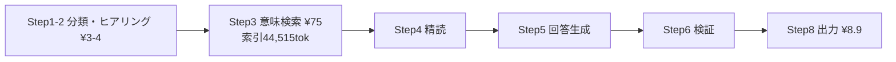
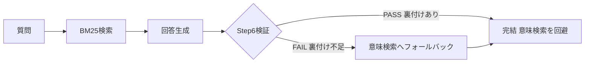
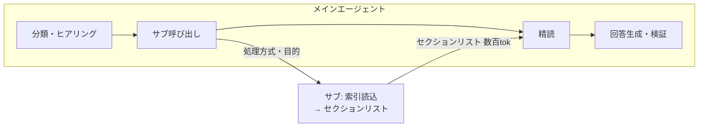
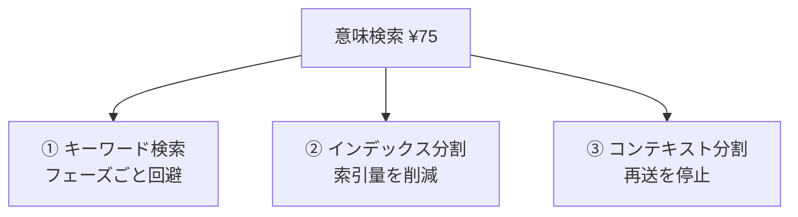

# Nablarch知識基盤のコスト最適化評価 ② 現行方式（エージェンティック検索）のコスト最適化

---

## 1. 背景

文書①で、言い換え系を埋める手段としてベクトル検索（RAG）とエージェンティック検索（現行Nabledge）を比較し、コストはベクトル検索が安いが精度が未確定とした。本文書は、**現行のエージェンティック検索を維持したまま**コストを下げる方法を扱う。

現行のqaワークフローは1回¥90.3（実測）。コストの中心は意味検索フェーズ（約¥75）で、その大半は索引（index.md＋classes.md）の読み込み。これを削る独立した3つの改善案を扱う。

---

## 2. 結論

3案は削る対象が異なり、併用できる。

| 案 | 削る対象 | 効果 | 判定 | 確度 |
|---|---|---|---|---|
| ① キーワード検索（BM25） | 意味検索フェーズ自体（固有語質問で回避） | 完結¥16.2／FB¥93.6 | 既存Step6 | 完結は実測ベース |
| ② インデックス分割 | 索引の読み込み量（purposeで絞る） | 意味検索¥75→¥49〜65 | 既存purpose | 索引サイズは実測 |
| ③ コンテキスト分割（サブエージェント） | 索引のメイン再送 | 全体¥90.3→¥53 | 不要 | 再送係数は仮置き |

①は固有語質問を意味検索から外す。②は意味検索で読む索引を減らす。③は索引をメイン会話から隔離して再送を止める。3案は対象が違うため重ねられるが、②と③は同じ意味検索フェーズに作用するため効果は一部重なる（後述）。

各案の効果は質問の種類（固有語か、purposeが何か）に依存する。全体平均は質問分布次第で、現時点では未確定。

---

## 3. なぜ高いか：意味検索の索引読み込みが主因

コスト内訳（実測・1回平均）。キャッシュ読取トークンは多いが単価が入力の0.10倍のため、コスト上はキャッシュ書込が支配的。

| 種別 | トークン | 単価 | 円@160 | 割合 |
|---|---|---|---|---|
| キャッシュ読取 | 433,650 | 入力×0.10 | ¥20.8 | 23% |
| キャッシュ書込 | 101,517 | 入力×1.25 | ¥60.9 | 67% |
| 出力 | 3,717 | $15/100万 | ¥8.9 | 10% |
| **合計** | — | — | **¥90.6** | 100% |

ステップ別では意味検索フェーズが約¥75（全体の83%）。中心は索引（index.md 33,746 + classes.md 10,769 = 44,515トークン）の読み込み。索引の初回キャッシュ書込だけで¥26.7。

注：Step5の回答生成が出力¥8.9を産む。Step8は生成済み回答を渡すだけで新規コストはない。Step6の検証は独立した出力を持たず文脈再送（キャッシュ読取）に含まれる。

3案はいずれもこの意味検索¥75を削る。①はフェーズごと回避、②は索引量を削減、③は再送を停止。

---

## 4. 改善案①：キーワード検索（BM25）で意味検索を回避

固有語（クラス名・アノテーション・処理方式名）で引ける質問は、BM25（全文検索）で該当セクションに到達でき、意味検索¥75を回避できる。BM25で不足する質問だけ意味検索へフォールバックする。

### 判定は既存のStep6を転用する

「BM25で十分か」の判定に新しい仕組みは要らない。現行qaのStep6（検証）が、回答中のNablarch固有クレーム（API名・クラス名・設定方法・挙動・制約）を検索セクションが裏付けるか照合し、裏付け不足なら FAIL を返す。これを流用し、FAIL時の遷移先を意味検索に変える。Step6は現に意味検索の結果を検証して34シナリオ全パスを支えており、同じ検証がBM25の結果にも効く。

### コスト【試算】

実測：BM25 k=20で32シナリオ中21件が全must命中（BM25で完結）、11件は意味検索へフォールバックが要る。この件数は私が選んだ32シナリオでの実測で、実利用の割合は別。

| 経路 | 内訳 | 1回 |
|---|---|---|
| BM25で完結 | 基本¥13 ＋ BM25実行¥1 ＋ 検証¥2 | ¥16.2 |
| 意味検索へフォールバック | 上記 ＋ 意味検索¥75 | ¥91.2 |

フォールバックすると現状（¥90.3）を上回る。全体が安くなるかはBM25で完結する質問の割合に依存し、未確定。[要確認：実利用での完結比率]

### リスク

| リスク | 内容 | 緩和 |
|---|---|---|
| 検証がFAILを見逃す | BM25が外したのにStep6がPASS → 精度低下 | Step6は意味検索で全パス実績あり。導入後に全パス維持を実測確認 |
| 固有語ありでも外す | impact-01, qa-04, qa-05等 | フォールバックが受ける。固有語でも無条件BM25とはしない |

---

## 5. 改善案②：インデックス分割でpurpose該当分のみ読む

意味検索が読む索引（44,515トークン）は全カテゴリを含む。質問のpurpose（目的）でカテゴリを絞れば、読む索引が減る。

### purposeは既にヒアリングで確定している

qaのStep1-2は、処理方式（8択）と目的（7択）をヒアリングで確定する。この目的（purpose）からカテゴリを選ぶ。新たな判定器も、ページ単位のマッピングも要らない。purposeとカテゴリの軽量な対応表だけで足りる。

| purpose | 読むカテゴリ | index内の割合 |
|---|---|---|
| 実装したい／理解したい | libraries＋handlers＋adapters＋該当処理パターン | 59% |
| テストを書きたい | testing-framework | 16% |
| バージョンアップ | migration＋releases | 9% |
| セキュリティ対応 | security-check | 1% |

残り15%（setup/blank-project、about-nablarch、toolbox等の環境構築・概要）は、上記purposeの質問では読まない。

### 効果【試算：索引サイズは実測、purpose分布は未確定】

索引初回書込¥26.7が、purpose別に縮む。

| purpose | 索引書込 | 意味検索フェーズ |
|---|---|---|
| 実装/理解 | ¥17.7 | ¥63.2 |
| テスト | ¥4.8 | ¥50.3 |
| バージョンアップ | ¥2.7 | ¥48.2 |
| セキュリティ | ¥0.3 | ¥45.9 |

質問の大半を占める「実装/理解」は59%（¥17.7）にとどまり、半減程度。一方テスト・バージョンアップ・セキュリティの質問は大きく絞れる。

### カバー率【実測】

purposeベースのカテゴリ選択で、32シナリオ中の完結数：

| 読む範囲 | 完結 |
|---|---|
| 実装セット（libraries+handlers+adapters）＋javadoc | 24/32 |
| ＋該当処理パターン | 29/32 |

外れる3件は複数purposeにまたがる質問。これらはStep6検証で不足を検知し、追加カテゴリを読む。

---

## 6. 改善案③：コンテキスト分割（サブエージェント）で再送を止める

CCはツール呼び出しのたびに全文脈を再送するため、検索の起点で読んだ索引が回答・検証まで居座り再送され続ける。索引を最初からメインに載せず、サブエージェントで処理して結果リストだけ受け取れば、再送が止まる。

| | 現状 | サブ化後 |
|---|---|---|
| 1回コスト | ¥90.3（実測） | 約¥53（試算） |

サブ化で消えるのは索引のメイン再送。サブ自身が索引を1回読む書込は残る。索引を読んで判断する行為はサブ内で維持されるため精度は犠牲にしない。判定は不要で確実に効く。

### 設計上の制約

| 制約 | 内容 | 回避 |
|---|---|---|
| サブはユーザーに問い返せない | ヒアリングがサブ内でできない | ヒアリングはメインに残し検索だけサブ化 |
| 文脈分断 | メインとサブで判断材料が割れる | ヒアリング結果をサブへ明示的に渡す |
| プラットフォーム差 | サブの仕組みがCCとGHCで異なる | 両対応の実装が要る |

---

## 7. 3案の関係と併用

各案が削る対象：

| 組み合わせ | 効果 | 確度 |
|---|---|---|
| ①単独 | 完結¥16.2／FB¥91.2 | 完結は実測ベース |
| ②単独 | 意味検索¥75→¥49〜65 | 索引サイズ実測 |
| ③単独 | ¥90.3→¥53 | 再送係数は仮置き |
| ②＋③ | 意味検索が索引書込のみに → 全体¥33前後 | 試算（②③の境界が重なる） |
| ①＋②＋③ | 完結¥16.2／FB時は②③適用で¥36前後 | 試算 |

注：②（索引分割）と③（再送停止）は同じ意味検索フェーズに作用するため、効果の一部が重なる。②③併用の¥33は単純合算でなく、重なりを見込んだ試算。意味検索¥75の内訳（索引書込¥26.7＋読取¥48.3）は粗い分解で、併用効果の精密値は実装後の実測で確定する。

①は他2案と独立（フェーズごと回避するため）。完結すれば②③の効果に関係なく¥16.2。

---

## 8. 根拠と次の一歩

| 主張 | 確度 |
|---|---|
| 現状¥90.3、コスト内訳（キャッシュ書込67%が主因）、索引初回書込¥26.7 | 実測 |
| BM25 k=20で32シナリオ中21件完結 | 実測 |
| 索引のpurpose別サイズ（実装/理解59%等）、カバー率24〜29/32 | 実測 |
| ①完結¥16.2、②¥49〜65、③¥53 | 試算（単価は実測値、分布・再送係数は仮置き） |
| ②③併用¥33、全併用FB¥36 | 試算（フェーズ内訳が粗いため確度低） |

サブ化の削減を¥21.3（74%減）とした旧版は、コスト主因をキャッシュ読取と取り違えた誤り。実測内訳ではコスト主因はキャッシュ書込で、サブ化が止めるのは読取側の再送の一部。

**次の一歩**：

| # | 作業 | 確定する箇所 |
|---|---|---|
| 1 | ①BM25導入＋Step6フォールバック。34シナリオ全パス維持を実測確認 | 4章 |
| 2 | ②purpose→カテゴリ対応表を作り、索引分割を実装。カバー率を実測 | 5章 |
| 3 | ③サブ化を実装しCC実ログで実測。②③併用の実コストを確定 | 6・7章 |
| 4 | 実利用ログで質問分布（固有語比率・purpose分布）を測定 | 全体平均 |

---

## 補足：現行 keyword-search の位置づけ

現行の `keyword-search.sh` は、改善案①のBM25とは別物。部分一致・スコアなしで、正確な用語を入力して絞り込む用途【SKILL.md：precise, term-based】。影響調査・レビューでクラス名・メソッド名・設定項目名を入力する前提。

この用途は「全文検索でランク付け」ではなく「指定語で絞り込む」フィルタリングにあたる。実作業として、現行 keyword-search はフィルタリングとして整理し直す。改善案①のBM25導入とは独立した整理。
